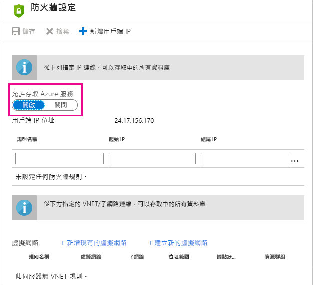

# Power BI 中的 Azure SQL Database 排程重新整理疑難排解

如需重新整理的詳細資訊，請參閱[重新整理 Power BI 中的資料](refresh-data.md)及[設定排程的重新整理](refresh-scheduled-refresh.md)。

當您設定 Azure SQL 資料庫的排程重新整理時，如果在編輯認證時收到錯誤碼 400 的錯誤，請嘗試下列步驟以設定適當的防火牆規則：

1. 登入 [Azure 入口網站](https://portal.azure.com)。

1. 移至您要設定重新整理的 Azure SQL 資料庫。

1. 在 [概觀]  刀鋒視窗頂端，選取 [設定伺服器防火牆]  。

1. 在 [防火牆設定]  刀鋒視窗上，確定 [允許存取 Azure 服務]  已設定為 [開啟]  。

      

有其他問題嗎？ [試試 Power BI 社群](https://community.powerbi.com/)
