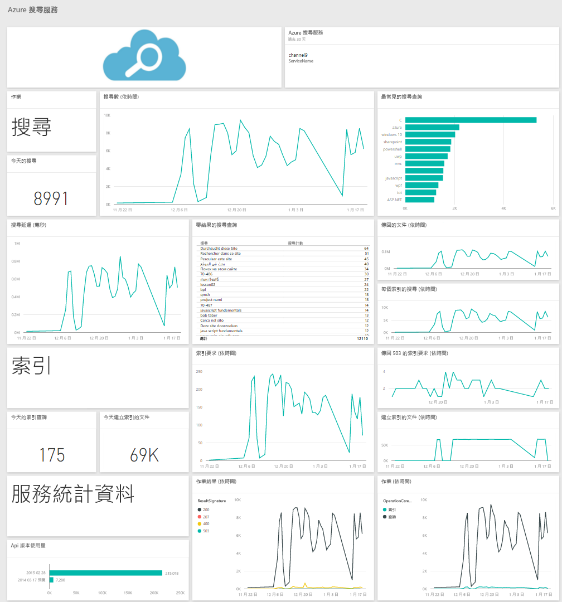

# 使用 Power BI 連接到 Azure 搜尋服務
Azure 搜尋服務流量分析可讓您監視及了解 Azure 搜尋服務的流量。 Power BI 的 Azure 搜尋服務內容套件提供了搜尋資料的詳細深入解析，包括過去 30 天內的搜尋、索引、服務統計資料和延遲。 更多詳細資料請參閱 [Azure 部落格文章](https://azure.microsoft.com/blog/analyzing-your-azure-search-traffic/)。

[!INCLUDE [include-short-name](../includes/service-deprecate-content-packs.md)]

連接到 Power BI 的 [Azure 搜尋服務內容套件](https://app.powerbi.com/getdata/services/azure-search)。

## 如何連接
1. 在導覽窗格的底部，選取 [取得資料]。
   
   ![Power B I Desktop 中 [取得資料] 的螢幕擷取畫面，其中顯示功能窗格中的按鈕。](media/service-connect-to-azure-search/pbi_getdata.png) 
2. 在 [服務]  方塊中，選取 [取得] 。
   
   ![[服務] 對話方塊的螢幕擷取畫面，其中顯示 [取得] 按鈕。](media/service-connect-to-azure-search/pbi_getservices.png) 
3. 選取 [Azure 搜尋服務] \> [取得]。
   
   ![[Azure 服務] 對話方塊的螢幕擷取畫面，其中顯示 [取得] 連結。](media/service-connect-to-azure-search/azuresearch.png)
4. 提供已儲存 Azure 搜尋服務分析的資料表儲存體帳戶名稱。
   
   ![[連接 Azure 搜尋服務] 對話方塊的螢幕擷取畫面，其中顯示 [Azure 儲存體帳戶名稱] 欄位。](media/service-connect-to-azure-search/params.png)
5. 選取 [金鑰]  作為驗證機制，並提供儲存體帳戶金鑰。 按一下 [登入]  開始載入程序。
   
   ![[連接 Azure 搜尋服務] 對話方塊的螢幕擷取畫面，其中顯示 [驗證方法] 欄位中所輸入的金鑰。](media/service-connect-to-azure-search/creds.png)
6. 載入一完成，新的儀表板、報表和模型就會出現在導覽窗格中。 選取儀表板以檢視匯入的資料。
   
    

**接下來呢？**

* 請嘗試在儀表板頂端的[問與答方塊中提問](../consumer/end-user-q-and-a.md)
* [變更儀表板中的圖格](../create-reports/service-dashboard-edit-tile.md)。
* [選取圖格](../consumer/end-user-tiles.md)，開啟基礎報表。
* 雖然資料集排程為每天重新整理，但是您可以變更重新整理排程，或使用 [立即重新整理] 視需要嘗試重新整理

## 系統需求
Azure 搜尋服務內容套件需要帳戶啟用 Azure 搜尋服務流量分析。

## 疑難排解
請確定已提供正確的儲存體帳戶名稱以及完整的存取金鑰。 儲存體帳戶名稱應該對應至使用 Azure 搜尋服務流量分析進行設定的帳戶。

## 後續步驟
[Power BI 是什麼？](../fundamentals/power-bi-overview.md)

[Power BI 服務中的設計工具基本概念](../fundamentals/service-basic-concepts.md)
