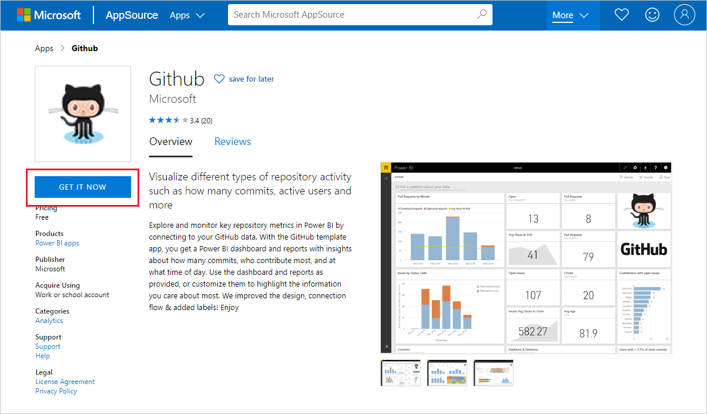
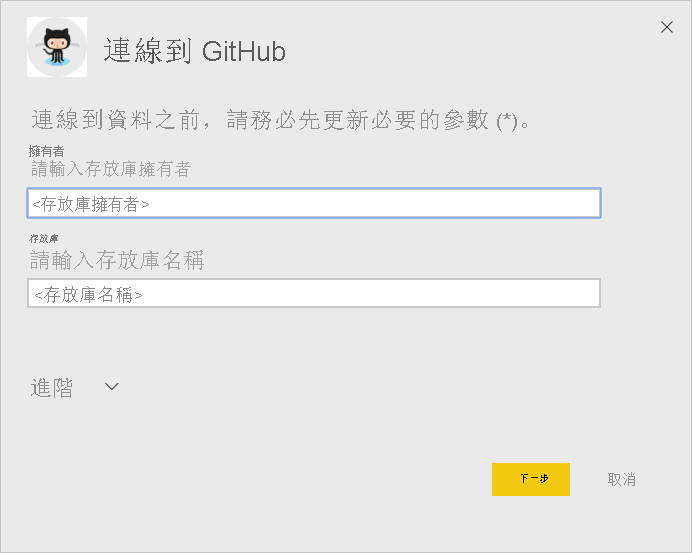
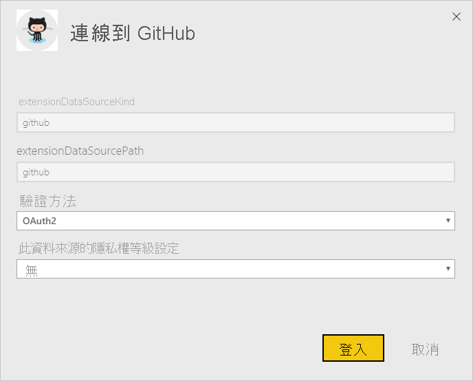
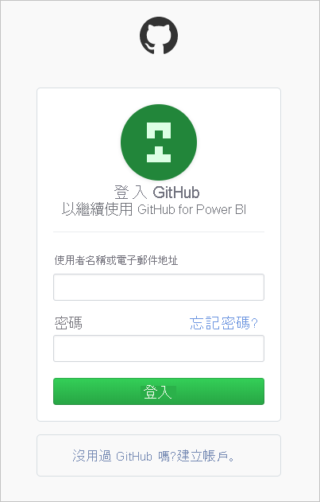
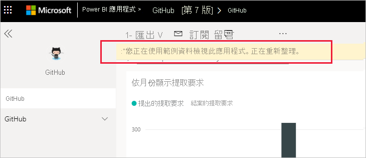

# <a name="connect-to-github-with-power-bi"></a>使用 Power BI 連接到 GitHub
本文將逐步引導您使用 Power BI 範本應用程式從 GitHub 帳戶提取資料。 範本應用程式會產生由儀表板、一組報表與資料集組成的工作區，可讓您探索 GitHub 資料。 適用於 Power BI 的 GitHub 應用程式會顯示 GitHub 存放庫 (也稱為 repo) 中的見解，以及參與、問題、提取要求和作用中使用者的相關資料。


安裝範本應用程式之後，您可以變更儀表板和報表。 然後您可以將它當作應用程式散發給組織中的同事。

連線到 [GitHub 範本應用程式](https://app.powerbi.com/groups/me/getapps/services/pbi-contentpacks.pbiapps-github)或深入了解 Power BI 與 [GitHub 的整合](https://powerbi.microsoft.com/integrations/github)。

您也可以嘗試 [GitHub 教學課程](service-tutorial-connect-to-github.md)。 它會安裝有關 Power BI 文件公用存放庫的實際 GitHub 資料。

>[!NOTE]
>此範本應用程式需要 GitHub 帳戶，才能存取存放庫。 下方有需求的詳細資料。
>
>此範本應用程式不支援 GitHub Enterprise。

## <a name="install-the-app"></a>安裝應用程式

1. 按一下下列連結以取得應用程式：[GitHub 範本應用程式](https://app.powerbi.com/groups/me/getapps/services/pbi-contentpacks.pbiapps-github)

1. 在應用程式的 [AppSource][ **頁面上選取 [立即取得]** ](https://app.powerbi.com/groups/me/getapps/services/pbi-contentpacks.pbiapps-github)。

    [](https://app.powerbi.com/groups/me/getapps/services/pbi-contentpacks.pbiapps-github)

1. 選取 [安裝]。 

    

    應用程式安裝完成後，會顯示在 [應用程式] 頁面上。

   ![[應用程式] 頁面上的 GitHub 應用程式](media/service-connect-to-github/service-github-app-apps-page-icon.png)

## <a name="connect-to-data-sources"></a>連接至資料來源

1. 選取 [應用程式] 頁面上的圖示以開啟應用程式。

1. 在啟動顯示畫面上，選取 [探索應用程式]。

   

   應用程式隨即開啟，其中顯示範例資料。

1. 在頁面頂端的橫幅中，選取 [連線至資料] 連結。

   ![GitHub 應用程式 [連線至資料] 連結](media/service-connect-to-github/service-github-app-connect-data.png)

1. 在出現的對話方塊中，輸入該存放庫的存放庫名稱與存放庫擁有者。 請參閱以下關於[尋找這些參數](#FindingParams)的詳細資料。 完成時，按一下 [下一步]。

   

1. 在下一個顯示的對話方塊中，確認已將驗證方法設為 [OAuth2]。 您不需要對隱私權設定執行任何操作。 在準備就緒後，請按一下 [登入]。

   

1. 輸入 GitHub 認證並遵循 GitHub 驗證流程 (如果您已經使用瀏覽器登入，則可能會略過此步驟)。

   


登入後，報表會連線至資料來源，並使用最新的資料填入。 在這段期間，活動監視器會開啟。



報表資料會每天自動重新整理一次，除非您在登入流程期間停用此功能。 您也可以視需要[設定自己的重新整理排程](./refresh-scheduled-refresh.md)，以將報表資料保持在最新狀態。

## <a name="customize-and-share"></a>自訂和共用

若要自訂和共用應用程式，請選取頁面右上角的鉛筆圖示。


如需在工作區中編輯成品的詳細資訊，請參閱
* [Power BI 中的報表編輯器導覽](../create-reports/service-the-report-editor-take-a-tour.md)
* [Power BI 服務中的設計工具基本概念](../fundamentals/service-basic-concepts.md)

當完成對工作區中成品的任何變更之後，即可開始發佈和共用應用程式。 請參閱[發佈應用程式](../collaborate-share/service-create-distribute-apps.md#publish-your-app)，以了解如何執行此操作。

## <a name="whats-included-in-the-app"></a>應用程式中包含的內容
在 Power BI 中 GitHub 提供下列資料：     

| 資料表名稱 | 描述 |
| --- | --- |
| 參與 |參與資料表提供每週彙總參與者所撰寫的總計新增、刪除和認可。 包含前 100 名參與者。 |
| 問題 |列出所有選取儲存機制的問題，其中包含計算，像是已解決問題的總計和平均時間、未解決問題總數、已解決問題總數。 當儲存機制中沒有任何問題時，此資料表為空白。 |
| 提取要求 |此表格包含此儲存機制和提取要求者之所有提取要求。 它也包含相關計算，像是有多少未解決、已解決和總計的提取要求，花多少時間來提取這些要求，以及提取要求所耗用平均時間。 當存放庫中沒有任何提取要求時，此資料表將是空的。 |
| 使用者 |下表提供 GitHub 使用者或參與者的清單，他們針對選取的存放庫參與、提出問題或解決提取要求。 |
| 里程碑 |它具有所選儲存機制的所有里程碑。 |
| DateTable |此資料表包含從今天開始推算，過去幾年來的日期，可讓您依日期分析 GitHub 資料。 |
| ContributionPunchCard |這個資料表可以當做所選取儲存機制的參與穿孔卡片。 它會依一週中各天和一天中各小時顯示認可。 此資料表未連接到模型中的其他資料表。 |
| RepoDetails |此資料表會提供選取的儲存機制詳細資料。 |

## <a name="system-requirements"></a>系統需求
* 可存取儲存機制的 GitHub 帳戶。  
* 第一次登入期間授與適用於 GitHub 應用程式之 Power BI 的權限。 請參閱以下撤銷存取權的詳細資訊。  
* 有足夠可用的 API 呼叫，以便提取和重新整理資料。
>[!NOTE]
>此範本應用程式不支援 GitHub Enterprise。

### <a name="de-authorize-power-bi"></a>取消授權 Power BI
若要取消讓 Power BI 連線到 GitHub 存放庫的授權，您可以撤銷 GitHub 中的存取權。 如需詳細資料，請參閱這個 [GitHub 說明](https://help.github.com/articles/keeping-your-ssh-keys-and-application-access-tokens-safe/#reviewing-your-authorized-applications-oauth)主題。

<a name="FindingParams"></a>
## <a name="finding-parameters"></a>尋找參數
您可以查看在 GitHub 本身的儲存機制來判斷擁有者和儲存機制：


第一個部分的 "Azure" 是擁有者，而第二個部分 "azure-sdk-for-php" 是儲存機制本身。  您會在儲存機制的 URL 中看到這兩個相同項目：

```console
<https://github.com/Azure/azure-sdk-for-php> .
```

## <a name="troubleshooting"></a>疑難排解
如有必要，您可以確認您的 GitHub 認證。  

1. 在另一個瀏覽器視窗中，前往 GitHub 網站並登入 GitHub。 在 GitHub 網站右上角，可以看到您已登入。    
2. 在 GitHub 中瀏覽至您計劃要在 Power BI 中存取之儲存機制的 URL。 例如： https://github.com/dotnet/corefx 。  
3. 回到 Power BI，嘗試連接至 GitHub。 在 [設定 GitHub] 對話方塊中，請使用相同儲存機制的儲存機制名稱和儲存機制擁有者名稱。  

## <a name="next-steps"></a>後續步驟

* [教學課程：使用 Power BI 連線到 GitHub 存放庫](service-tutorial-connect-to-github.md)
* [在 Power BI 中建立新的工作區](../collaborate-share/service-create-the-new-workspaces.md)
* [在 Power BI 中安裝和使用應用程式](../consumer/end-user-apps.md)
* [連線到 Power BI 應用程式以使用外部服務](service-connect-to-services.md)
* 有問題嗎？ [嘗試在 Power BI 社群提問](https://community.powerbi.com/)
