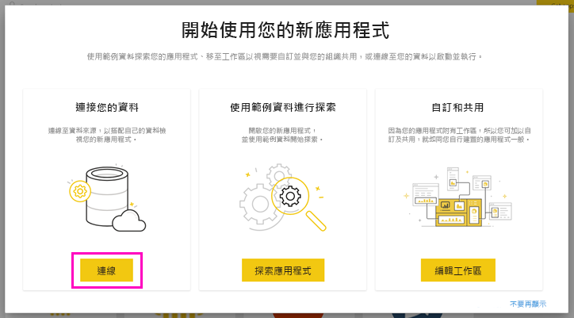
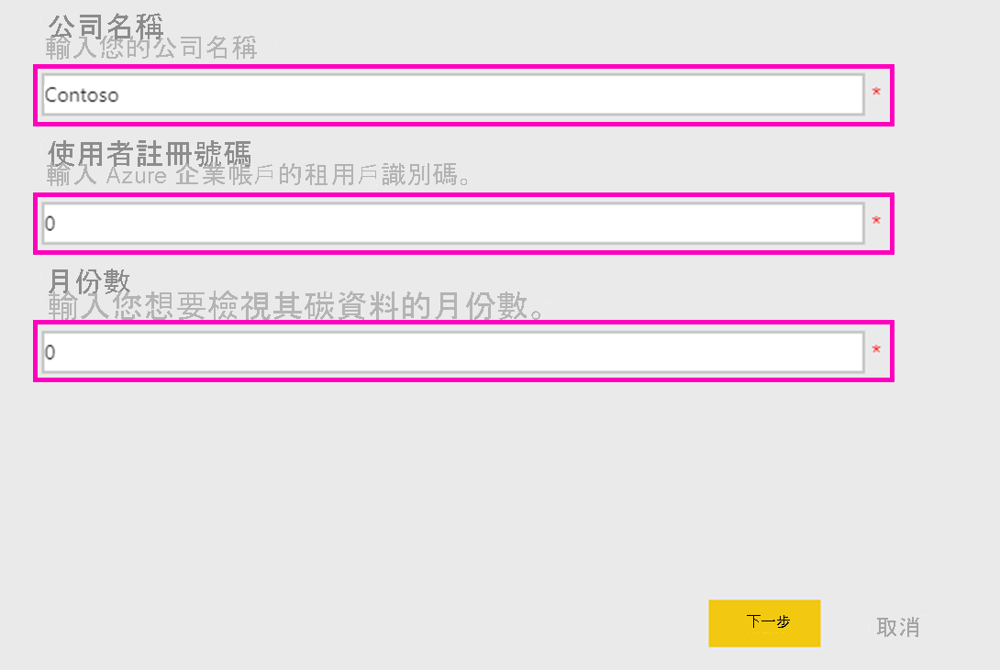
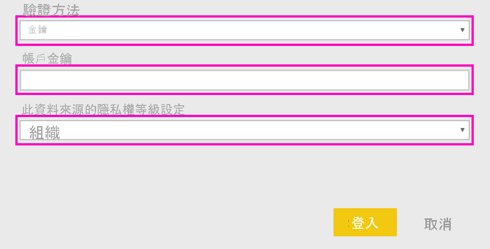
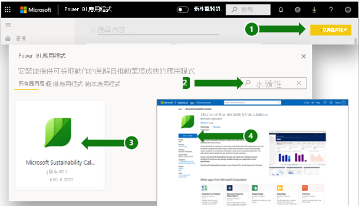
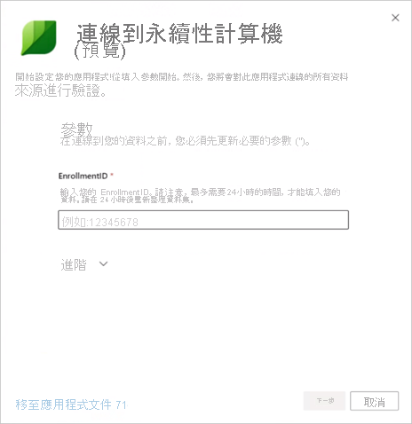
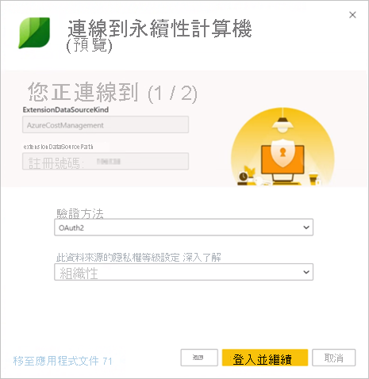
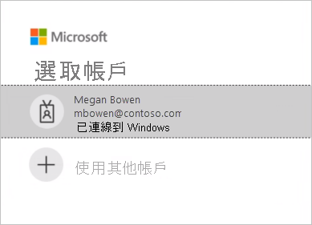

# Microsoft Sustainability Calculator 支援頁面

Microsoft Sustainability Calculator 會針對與 Azure 服務相關聯的碳排放量資料提供新見解。 組織內部負責報告和推動永續性的人員現在能夠將每個 Azure 訂用帳戶的碳衝擊量化，並且可以透過在 Azure 與內部部署資料中心執行那些工作負載來查看預估的減碳量。 此資料可用於範疇 3 排放量的溫室氣體報告。

> [!NOTE]
> 此連接器版本只支援來自 [Azure 企業版入口網站](https://ea.azure.com)的註冊。 中國目前不支援註冊。

## 必要條件

若要存取 Microsoft Sustainability Calculator，您需要下列由貴組織的 Azure 管理員所提供的資訊：

- 租用戶識別碼
- 存取金鑰
- 註冊號碼

尋找貴公司的註冊號碼：

1. 以管理員身分登入 [Azure 企業版入口網站](https://ea.azure.com)。
2. 選取 [Active Directory] 或左側瀏覽列上的 [管理]。 貴公司的註冊號碼隨即顯示。

   

尋找貴公司的存取金鑰：

1. 以管理員身分登入 [Azure 企業版入口網站](https://ea.azure.com)。
2. 依序選取 [報告] 和 [API 存取金鑰]，以取得主要註冊帳戶金鑰。

## Sustainability Calculator 2020 年 1 月版

### 如何連接

[!INCLUDE [powerbi-service-apps-get-more-apps](../includes/powerbi-service-apps-get-more-apps.md)]

3. 依序選取 [Microsoft Sustainability Calculator] 和 [立即取得]。

4. 在 [要安裝此 Power BI 應用程式嗎?] 中，選取 [安裝]。

5. 在 [應用程式] 窗格中，選取 [Microsoft Sustainability Calculator] 磚。

6. 在 [開始使用您的新應用程式] 中，選取 [連線]。

   

7. 輸入 **公司名稱**、**使用者註冊號碼** 和 **月份數**。 如需取得註冊號碼的相關資訊，請參閱[必要條件](#prerequisites)。 選取 [下一步]  。

   

8. 輸入下列資訊：

   | 欄位 | 值 |
   | --- | --- |
   | **驗證方法** | 選取 [金鑰]。 |
   | **帳戶金鑰** | 輸入您的存取金鑰。 |
   | **此資料來源的隱私權等級設定** | 選取 [組織]。 |

   

9. 選取 [登入]。

10. 匯入程序會自動開始。 完成時，新的儀表板、報表與模型會出現在 [瀏覽窗格] 中。 選取報表以檢視匯入的資料。

### 使用應用程式

更新參數：

1. 瀏覽至 [資料集] 設定，然後存取與應用程式工作區相關聯的設定。
2. 視需要更新 **公司名稱**、**使用者註冊號碼** 或 **月份數**。
3. 選取 [重新整理]，以使用套用的新參數重新載入資料。

## Sustainability Calculator 2020 年 12 月版 (預覽)

立即使用 Microsoft Sustainability Calculator 來計算您的雲端式碳排放量。

精確的碳核算需要合作夥伴、廠商和供應商提供的良好資訊。 Microsoft Sustainability Calculator 可讓您以透明方式使用 Azure 和 Microsoft Dynamics 所產生的碳排放量。

Microsoft 的碳核算採用丹佛大學在 2018 年所驗證的方法，擴大到這三個範疇的排放量。 其使用一致且精確的碳核算，將 Microsoft 雲端服務對客戶環境足跡的衝擊量化。 Microsoft 是唯一可在針對自願或法定報告需求編譯報告的同時，為客戶提供這種程度之透明度的雲端提供者。

### 開始之前

Microsoft Sustainability Calculator 在 Power BI Pro 上執行。 如果您沒有 Power BI Pro，請[立即取得免費試用](https://powerbi.microsoft.com/power-bi-pro)。

您將需要 Azure 註冊號碼。 如果您沒有，請洽詢貴組織的 Azure 管理員以取得協助。 如需詳細資訊，請參閱[必要條件](#prerequisites)。

### 連接計算機：五個進行碳核算的簡單步驟

1. 從 [AppSource](https://go.microsoft.com/fwlink/?linkid=2151690) \(英文\) 下載應用程式。

   

   您也可以在 Power BI 中搜尋該應用程式。

   

2. 開啟應用程式。

3. 輸入您的註冊號碼。 選取 [連接您的資料]，然後輸入您的註冊號碼。 如需取得註冊號碼的詳細資訊，請參閱[必要條件](#prerequisites)。

   

4. 連接您的帳戶：
   - 在 [您正在連接 (1/2)] 的 [驗證方法] 底下，選取 [OAuth2]，然後在 [此資料來源的隱私權等級設定] 底下，選取 [組織]。

      
 
   - 選取使用者帳戶。

      
       
   - 在 [您正在連接 (2/2)] 的 [驗證方法] 底下，選取 [匿名]，然後在 [此資料來源的隱私權等級設定] 底下，選取 [組織]。

     
    
5. 等候檢視建置，這最多可能需要 24 小時的時間。

### 其他資源

- [操作方法影片](https://go.microsoft.com/fwlink/?linkid=2151608) \(英文\)
- [雲端運算的碳效益：與 WSP 合作進行的 Microsoft Cloud 研究](https://download.microsoft.com/download/7/3/9/739BC4AD-A855-436E-961D-9C95EB51DAF9/Microsoft_Cloud_Carbon_Study_2018.pdf) \(英文\)

### 常見問題集

#### 應用程式設定

**我在使用計算機連接資料時收到錯誤。我該怎麼辦？**

首先，簽入您具有 IT 管理員權限的 Azure 成本管理。 如果您沒有此類權限，請向您的管理員要求此權限。 接著，確定您使用的是正確的註冊號碼。

**我輸入了註冊號碼，但我的公司資料並未載入。問題出在哪裡？**

Sustainability Calculator Public Preview 最多可能需要 24 小時的時間，才能載入您的資料。 請於 24 小時後返回，然後選取 Power BI 中的 [重新整理] 按鈕。

**Microsoft 是否正嘗試將排放量的責任從 Microsoft 轉移給我？**

否。 來自 Azure 服務的碳排放量會回報為 Microsoft 的範疇 1 和 2 排放量，與業界標準的[溫室氣體 (GHG) 盤查議定書](https://ghgprotocol.org/) \(英文\) 一致。 GHG 盤查議定書將範疇 3 排放量定義為另一個實體代表您排放的排放量，而其原本就會重複計算。 Microsoft Sustainability Calculator 會為與使用 Azure 服務相關聯的範疇 3 排放量提供新的透明度，特別是範疇 3 類別 1「購買的商品與服務」。

**為什麼我使用 Microsoft 雲端的排放量會比使用內部部署解決方案時的排放量低很多？**

Microsoft 進行了[一項研究 (已於 2018 年發佈)](https://blogs.microsoft.com/on-the-issues/2018/05/17/microsoft-cloud-delivers-when-it-comes-to-energy-efficiency-and-carbon-emission-reductions-study-finds/) \(英文\)，其中評估了 Microsoft 雲端與內部部署或傳統資料中心之間的差異。 結果顯示，相較於傳統企業資料中心，Azure 計算和儲存體的能源效率高出 52% 到 79%，其取決於具體的比較是否選擇了太低、中間或高效率的內部部署替代方案而定。 考慮到我們購買的再生能源時，Azure 的碳效率提高了 79% 到 98%。 這些減碳量歸因於 Microsoft Cloud 的四個主要功能：IT 營運效率、IT 設備效率、資料中心基礎結構效率及再生電力。

**如果 Microsoft 的營運為碳中和且受到再生能源支援，為什麼 Azure 服務的客戶排放量不是零呢？**

Microsoft 的客戶排放量不是零的主要原因有兩個。 第一個與 GHG 核算實務有關，第二個則與此分析的界限有關。 為了實現碳中和營運，Microsoft 使用碳補償來減少特定的排放源，例如，備用發動機、冷媒及車隊的現場燃料燃燒。 這些會將 Microsoft 的「淨」排放量降為零。 儘管計算機為了取得更高的透明度，而在 [GHG 報告] 索引標籤中報告已套用的補償量和純排放量，但還是會在套用這些補償之前報告「總」GHG 排放量。 第二個原因是，除了與 Microsoft 資料中心營運相關聯的能源與排放量之外，排放量足跡也包括 Microsoft 營運界限外部之網際網路服務提供者所使用以便在 Microsoft 資料中心與 Azure 客戶之間傳輸資料的能源。

**我應該如何使用此資料，以及要在哪裡報告？**

您可以將排放量當成貴公司範疇 3 間接碳排放量的一部分來報告。 範疇 3 排放量經常披露於永續性報告、CDP 氣候變遷及其他報告出處中。 除了總排放量，減碳量還提供了一個清晰易懂的範例，來說明貴公司對於使用 Microsoft Azure 服務的決策如何有助於降低全球排放量。 為了具體說明，應用程式會根據 EPA 截至 2020 年 1 月的對等計算機因素，指出已避免將對等的車輛里程數對應到減少的 GHG 排放量。

**我該怎麼做，才能進一步減少排放量？**

Azure 中的資源和成本效益，將降低因使用 Azure 而對環境造成的衝擊。 舉例來說，不論是在雲端或內部部署中，未使用的虛擬機器都很浪費。 適當調整虛擬機器大小以提高計算利用率 (CUF)，可減少每個有用輸出的能源使用，就像使用實體伺服器一樣。 [Azure 成本管理](https://docs.microsoft.com/azure/cost-management-billing/costs/cost-mgt-best-practices)可為您提供工具來規劃、分析及減少支出，以將您的雲端投資發揮到極致。

#### 方法

**工具背後的方法為何？**

Microsoft Sustainability Calculator 會反映已取用的特定雲端服務及相關聯的能源需求、提供那些服務的資料中心效率、那些資料中心營運所在區域的電力燃料組合，以及 Microsoft 購買的再生能源。 在應用程式開發過程中，此方法及其實作已經過協力廠商驗證，以確保其符合世界資源研究所 (WRI)/世界企業永續發展委員會 (WBCSD) 溫室氣體 (GHG) 盤查議定書企業核算與報告標準。 驗證的範疇 (根據＜ISO 14064-3：溫室氣體 -- 第 3 部分：指引如何驗證和確認溫室氣體主張的規格＞來進行) 包括預估來自 Azure 服務的排放量，但基於該預估違反事實的本質，已排除內部部署排放量的預估。 如需碳計算的更詳細說明，請參閱工具中的 [計算方法] 索引標籤。

**需要哪些資料，才能計算 Azure 碳足跡？您會存取我公司的資料嗎？**

預估的碳計算會根據使用 Azure 已使用收入存取的 Azure 服務使用量來執行。 Calculator 不會存取任何您已儲存的客戶資料。 使用量資料會與 Microsoft 的能源和碳追蹤資料合併，以根據提供那些服務的資料中心來計算與您的 Azure 服務使用量相關聯的預估排放量。

**此計算是否包括所有 Azure 服務和所有 Azure 區域？**

預估包括所有與安裝期間提供之租用戶識別碼相關聯的 Azure 區域中的所有 Azure 服務。

#### 描述內部部署排放量的特性

**Microsoft Sustainability Calculator 會在哪裡取得有關我內部部署排放量和營運的資料？**

Microsoft Sustainability Calculator 不會特別針對您的內部部署資料中心取得任何資訊，但您提供的資訊「除外」。 如後續常見問題集中所述，Microsoft Sustainability Calculator 依賴業界研究和使用者輸入，以了解如何混用內部部署替代方案的效率和能源來建立預估的內部部署排放量。

**關於內部部署預估的假設有哪些？節能僅僅是因為電力使用效率 (PUE) 的改善嗎？**

與 Microsoft 雲端服務相關聯的效率所涵蓋的範圍遠比已改善的 PUE 還多。 儘管 Microsoft 資料中心致力於將 PUE 最佳化，但主要的效率改善還是來自 IT 營運效率 (動態佈建、多租用戶、伺服器使用率) 和 IT 設備效率 (為服務量身打造硬體，以確保能讓更多能源用於有用的輸出)，以及資料中心基礎結構效率 (PUE 改善)。 相較於一系列內部部署替代方案 (範圍從低效率到高效率的資料中心)，我們 [2018 年的研究](https://blogs.microsoft.com/on-the-issues/2018/05/17/microsoft-cloud-delivers-when-it-comes-to-energy-efficiency-and-carbon-emission-reductions-study-finds/) \(英文\) 量化了這些減碳量。 這些調查結果可用來預估對應的內部部署資料中心所需的能源使用，以提供每個客戶在 Microsoft 雲端上取用的相同服務。

**針對內部部署基礎結構所採用的能源組合為何？**

根據預設，Microsoft Sustainability Calculator 會根據電網上再生能源和非再生能源的組合，來預估內部部署排放量。 假設內部部署資料中心與 Microsoft 的資料中心位於相同的電網上。 不過，針對例如透過再生能源購電協議購買再生電力的客戶 (「除了電網上的項目之外)，使用者可以選取再生電力的百分比，而 Microsoft Sustainability Calculator 將據以調整內部部署排放量。

**何時應針對內部部署基礎結構的效率選擇 [低]、[中] 或 [高]？**

使用者應根據此處的設備和資料中心特性，選擇最能代表其想要比較之內部部署的效率：

- **低**：小型區域性資料中心 (500-1,999 平方英呎) 內的實體伺服器和直接連結儲存體
- **中**：中間層內部資料中心 (2,000-19,999 平方英呎) 內實體/虛擬化伺服器和連結/專用儲存體的組合
- **高**：高階內部資料中心 (>20,000 平方英呎) 內的虛擬化伺服器和專用儲存體
