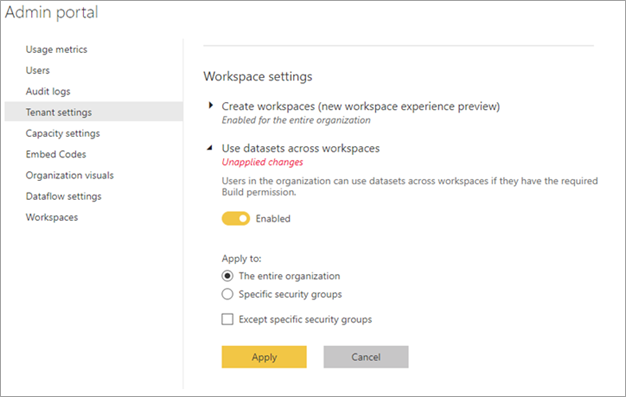

# 控制跨工作區使用資料集

跨工作區使用資料集是在組織內推動資料文化特性和資料民主化的強大方式。 儘管如此，如果您是 Power BI 系統管理員，有時候您想要限制 Power BI 租用戶內的資訊流程。 利用 [跨工作區使用資料集] 這個租用戶設定，您可以完全或部分限制每個安全性群組的資料集重複使用。

如果您關閉這項設定，以下是對報表建立者造成的影響：

- 跨工作區複製報表的按鈕無法使用。 
- 在根據共用資料集的報表中，[編輯報表] 按鈕無法使用。
- 在 Power BI 服務中，探索體驗只會顯示目前工作區中的資料集。
- 在 Power BI Desktop 中，探索體驗只會顯示您所隸屬工作區中的資料集。
- 在 Power BI Desktop 中，如果使用者開啟 .pbix 檔案，並即時連線至任何所屬工作區之外的資料集，他們會看到一則錯誤訊息，要求他們連接到不同的資料集。

## 提供認證程序的連結

身為 Power BI 系統管理員，您可在 [背書] 設定頁面上提供 [深入了解] 連結的 URL。  如需詳細資料，請參閱[啟用內容認證](../admin/service-admin-setup-certification.md)。 此連結可以移至認證程序的相關文件。 若您沒有為 [深入了解] 連結提供目的地，則該連結預設會指向[為內容簽署](../collaborate-share/service-endorse-content.md)一文。

## 後續步驟

- [跨工作區使用資料集](service-datasets-across-workspaces.md)
- 有問題嗎？ [嘗試在 Power BI 社群提問](https://community.powerbi.com/)
