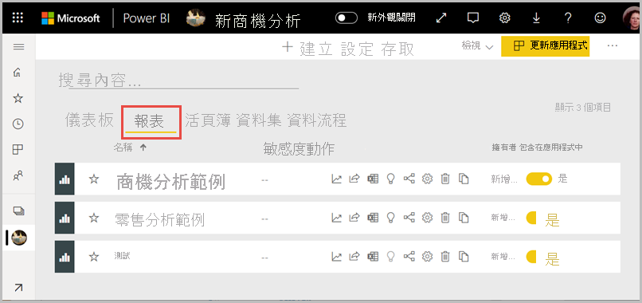

# 複製其他工作區的報表

當您在工作區或應用程式中找到喜歡的報表時，您可以複製該報表，然後將它儲存到不同的工作區中。 然後您可以修改您複製的報表、新增或刪除視覺效果和其他項目。 您不需要建立資料模型。 它已經為您建立。 修改現有的報表，比從頭開始要輕鬆許多。 但是，當您從您的工作區製作應用程式時，有時候您無法在應用程式內發佈您的報表複本。 請參閱[＜跨工作區使用資料集＞一文中的考量事項和限制](service-datasets-across-workspaces.md#considerations-and-limitations)以取得詳細資料。

## 先決條件

- 若要複製報表，您將需要 Pro 授權，即使原始報表位於 Premium 容量中的工作區也一樣。
- 若要複製報表，或根據其他工作區的資料集在某工作區中建立報表，則需要有該資料集的建置權限。 若是原始工作區中的資料集，具有系統管理員、成員和參與者角色的使用者可透過其工作區角色自動取得建置權限。 如需詳細資料，請參閱[新工作區中的角色](../collaborate-share/service-new-workspaces.md#roles-in-the-new-workspaces)。

## 在工作區中儲存報表複本

1. 在工作區中，移至 [報表] 清單檢視。

    

1. 在 [動作] 下選取 [儲存複本]。

    

    如果報表位在新體驗工作區中，而您有 [建置權限](service-datasets-build-permissions.md)，您只會看到 **儲存複本** 圖示。 即使您可以存取該工作區，您也必須有資料集的建置權限。

3. 在 [儲存此報表的複本] 中，為報表命名，然後選取目的地工作區。

    

    您可以將報表儲存在目前工作區或 Power BI 服務的其他工作區。 您只會看到您為所屬成員之新體驗工作區的工作區。 
  
4. 選取 [儲存]。

    如果報表是以工作區外的資料集為基礎，則 Power BI 會自動在資料集清單中建立報表複本和項目。 此資料集圖示和工作區資料集的圖示不同： 
    
    如此一來，工作區成員就可以分辨哪些報表和儀表板使用工作區外的資料集。 此項目會顯示資料集的相關資訊以及少數選取動作。

    

    如需有關報表和相關資料集的詳細資訊，請參閱本文中的[您的報表複本](#your-copy-of-the-report)。

## 在應用程式中複製報表

1. 在應用程式中，開啟您想要複製的報表。
2. 在功能表列中，選取 [多個選項] ( **...** ) > [儲存複本]。

    

    如果報表位在新體驗工作區中，而您有[建置權限](service-datasets-build-permissions.md)，您只會看到 [儲存複本] 選項。

3. 為報表命名 > [儲存]。

    

    您的複本會自動儲存至 [我的工作區]。

4. 選取 [移至報表] 以開啟您的複本。

## 您的報表複本

當您儲存報表的複本時，您即建立資料集的即時連線，並以可用的完整資料集來開啟報表建立體驗。 

您尚未製作資料集的複本。 資料集仍位在其原始位置。 您可以使用您報表的資料集中所有資料表和量值。 資料集的資料列層級安全性 (RLS) 限制已生效，因此您只會看到根據您 RLS 角色有權查看的資料。

## 檢視相關資料集

當您在一個工作區中有一個以另一個工作區中的資料集為基礎的報表時，您可能需要深入了解它所依據的資料集。

1. 在 [報表] 清單檢視中，選取 [檢視相關項目]。

    ![顯示 [動作] 下方與 [檢視] 相關圖示的螢幕擷取畫面。](media/service-datasets-copy-reports/power-bi-dataset-view-related.png)

1. [相關內容] 對話方塊會顯示所有相關項目。 在此清單中，資料集彼此看起來都差不多。 您無法分辨它是否位在不同的工作區中。 此為已知問題。
 
    ![[相關內容] 對話方塊](media/service-datasets-copy-reports/power-bi-dataset-related.png)

## 刪除報表及其共用資料集

您可能會決定自己已不再需要工作區中的報表和其相關聯的共用資料集。

1. 刪除報表。 在工作區的報表清單中，選取 **刪除** 圖示。

    

2. 在資料集清單中，您會看到共用資料集沒有 **刪除** 圖示。 請重新整理該頁面，或是移至不同的頁面再返回。 該資料集將會消失。 如果沒有，請檢查 [檢視相關項目]。 它可能與工作區中的另一個資料表相關聯。

    ![顯示資料集的螢幕擷取畫面，其中包含用來檢查相關資料表的 [檢視] 相關選項。](media/service-datasets-across-workspaces/power-bi-dataset-view-related-icon.png)

    > [!NOTE]
    > 刪除此工作區中的共用資料集並不會實際刪除該資料集。 系統只會刪除對它的參考。

## 後續步驟

- [跨工作區使用資料集](service-datasets-across-workspaces.md)
- 有問題嗎？ [嘗試在 Power BI 社群提問](https://community.powerbi.com/)
