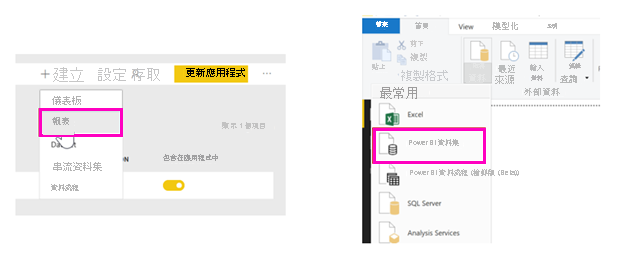
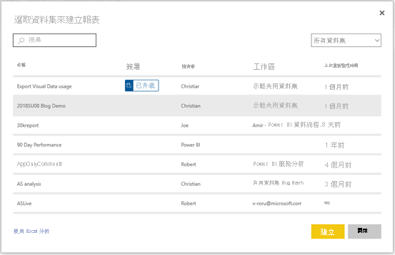

# 以不同工作區的資料集為基礎建立報表

了解如何以其他工作區的資料集為基礎，在您自己的工作區中建立報表。 若要在現有資料集的上層建置報表，您可以從 Power BI Desktop 或 Power BI 服務中「我的工作區」或[新工作區體驗](../collaborate-share/service-create-the-new-workspaces.md)開始。

- 在 Power BI 服務中：[取得資料] > [已發佈資料集]。
- 在 Power BI Desktop 中：[取得資料] > [Power BI 資料集]。

    
   
在這兩種情況下，資料集探索體驗都是在此 [選取資料集來建立報表] 對話方塊中開始。 您會看到所有能夠存取的資料集，不論其所在位置：

您注意到第一個標示為 **已升級** 。 我們會在本文稍後的[尋找已認可的資料集](#find-an-endorsed-dataset)中討論。

您在此清單中看到的資料集，至少符合下列條件之一：

- 資料集位在其中一個新工作區體驗的工作區中，而您是該工作區的成員。 請參閱[考量與限制](service-datasets-across-workspaces.md#considerations-and-limitations)。
- 您有新工作區體驗工作區的資料集建置權限。
- 資料集位在我的工作區中。

> [!NOTE]
> 如果您是免費的使用者，您只能看到我的工作區中資料集，或在 Premium 容量工作區中有建置權限的資料集。

當您按一下 [建立] 時，您會建立資料集的即時連線，並使用完整的資料集開啟報表建立體驗。 您尚未製作資料集的複本。 資料集仍位在其原始位置。 您可以使用資料集中所有資料表和量值建置您自己的報表。 資料集的資料列層級安全性 (RLS) 限制已生效，因此您只會看到根據您的 RLS 角色有權查看的資料。

您可以將報表儲存到 Power BI 服務目前的工作區中，或從 Power BI Desktop 將報表發佈至工作區。 如果報表是以工作區外的資料集為基礎，則 Power BI 會自動在資料集清單中建立項目。 此資料集圖示和工作區資料集的圖示不同： 

如此一來，工作區成員就可以分辨哪些報表和儀表板使用工作區外的資料集。 此項目會顯示資料集的相關資訊以及少數選取動作。

## 尋找已認可的資料集

有兩種不同的已簽署資料集。 資料集擁有者可以「升級」他們向您建議的資料集。 此外，Power BI 系統管理員可指定您組織中可「認證」資料集供大家使用的專家。 升級及認證的資料集都會顯示「徽章」，當您尋找資料集以及在工作區的資料集清單中，都會看到它們。 在資料集探索體驗期間，在工具提示中會顯示認證資料集的人員名稱；將滑鼠停留在 [認證] 標籤上即可看到它。

- 在 Power BI 服務中：[取得資料] > [已發佈資料集]。
- 在 Power BI Desktop 中：[取得資料] > [Power BI 資料集]。

    在 [選取資料集] 對話方塊中，根據預設，已認可的資料集位在清單頂端。 

    

## 後續步驟

- [跨工作區使用資料集](service-datasets-across-workspaces.md)
- 有問題嗎？ [嘗試在 Power BI 社群提問](https://community.powerbi.com/)
