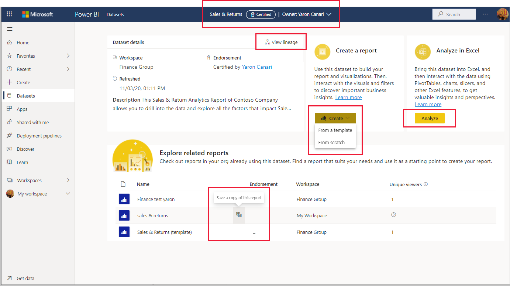

# 使用資料集中樞探索資料集 (預覽)

資料集中樞可讓您輕鬆地尋找、探索及使用組織中的資料集。 其提供資料集的相關資訊，以及在那些資料集之上建立報表或透過 [使用 Excel 分析] 使用那些資料集的進入點。

資料集中樞在許多案例中都很實用：
* 資料集擁有者可以查看資料集使用計量、重新整理狀態、相關報表及譜系，以協助監視和管理其資料集。
* 報表建立者可以使用該中樞來尋找適當的資料集以建置其報表，並使用連結，根據資料集從頭或從範本輕鬆建立報表。
* 報表取用者可以使用此頁面，來尋找以可信任的資料集為基礎的報表。

透過讓您輕鬆尋找品質資料集與其相關報表，資料集中樞有助於防止建立多餘的報表。 此外，其也可讓您輕鬆尋找適合用來作為建立新報表之起點的報表。

此文章說明您所看到的資料集中樞相關內容，並描述其使用方式。 對於資料集擁有者，文中也包含一些如何[增強資料集的探索功能和易用性](#make-your-dataset-discoverable)的相關提示。

**我會在資料集中樞看到哪些資料集？**
* 針對資料集中樞所顯示的資料集，其必須位於[新的工作區體驗](../collaborate-share/service-new-workspaces.md)。
* 您可以在資料集中樞看到的資料集，是您至少具有[建置權限](service-datasets-build-permissions.md)的資料集。
* 如果您是免費的使用者，您只能看到 [我的工作區] 中的資料集，或您具有[建置權限](service-datasets-build-permissions.md)且位於 Premium 容量工作區的資料集。

## 尋找所需的資料集

資料集探索體驗會從資料集中樞頁面開始。 存取資料集中樞頁面：
* 在 Power BI 服務中：在瀏覽窗格中選取 [資料集]。
* 在小組的 Power BI 應用程式中：選取 [資料集] 索引標籤或瀏覽窗格中的 [資料集]。

下圖顯示 Power BI 服務中的資料集中樞。

資料集中樞會為您提供建議資料集的選取項目，以及組織中您有權存取之所有資料集的清單。

下列各節將描述這些區段及您可執行的動作。

### 建議的資料集

建議的資料集是已背書的資料集 (已升階或已認證)，這類資料集是根據計算得出的，計算會考量最近重新整理資料集的方式，以及您最近瀏覽與資料集相關之報表和/或儀表板的方式。

### 資料集清單

資料集清單顯示組織中您至少具有[建置權限](service-datasets-build-permissions.md)的資料集。 此清單有三個索引標籤，可篩選資料集清單。
* **所有資料集**：顯示組織中您至少具有 [建置權限](service-datasets-build-permissions.md)的所有資料集。
* **最近**：顯示您最近曾存取其相關報表的資料集。 當您存取報表時，可能有數分鐘的延遲，直到相關資料集顯示於 [最近] 資料行為止。
* **我的資料集**：顯示您擁有的資料集。 

使用搜尋方塊，進一步篩選出目前索引標籤上的項目。

清單的資料行如下所述。 按一下資料行標題，依該資料行進行排序。 
* **名稱**：資料集名稱。 按一下資料集名稱，以探索使用此資料集建置的報表。
* **背書**：背書狀態。
* **擁有者**：資料集擁有者。
* **工作區**：資料集所在的工作區。
* **已重新整理**：上次重新整理時間 (四捨五入為小時、日、月和年。 如需上次重新整理的確切時間，請參閱資料集詳細資料頁面上的資料集資訊)。
* **敏感度**：敏感度 (如果已設定)。 按一下資訊圖示以檢視敏感度標籤描述。

### 建立新報表或透過 [使用 Excel 分析] 將資料提取到 Excel

若要根據資料集建立新報表，或透過 [[使用 Excel 分析](../collaborate-share/service-analyze-in-excel.md)] 將資料提取到 Excel，請在建議的資料集圖格右下角，或是資料集清單中的資料集行上，選取 [更多選項 (...)]。 根據您在資料集上所擁有的權限而定，下拉式功能表上可能會出現其他動作。

當您根據資料集建立新報表時，即會開啟報表編輯畫布。 當您儲存新報表時，如果您具有該工作區的寫入權限，其就會儲存於包含資料集的工作區。 如果您沒有該工作區的寫入權限，或者您是免費的使用者且資料集位於 Premium 容量工作區，則新報表將儲存於 [我的工作區]。

## 檢視資料集詳細資料和探索相關報表

若要查看資料集的詳細資訊、探索相關報表，或根據資料集建立新報表，請從頭或從範本中，從建議的資料集或從資料集清單中挑選資料集。 隨即開啟一個頁面，其中顯示資料集的相關資訊、列出建置於資料集之上的報表，並提供根據資料集建立新報表，或透過 [[使用 Excel 分析](../collaborate-share/service-analyze-in-excel.md)] 將資料提取到 Excel 的進入點。

頁首會顯示資料集名稱、背書 (如果有的話) 及資料集擁有者。 若要傳送電子郵件給資料集擁有者或資料集認證人 (如果有的話)，請按一下標頭，然後按一下擁有者的名稱。

### 資料集詳細資料

[資料集詳細資料] 區段會顯示資料集所在的工作區名稱、上次重新整理的確切時間、敏感度 (若已設定)、資料集描述 (如果有的話)，以及認證人名稱 (如果已認證)。 您也可以從這裡開啟資料集譜系。

### 相關報表

[探索相關報表] 區段會顯示建置於所選取資料集之上的所有報表。 您可以透過選取清單中的報表行，然後按一下 [儲存此報表的複本] 圖示，來建立報表的複本。

以下為相關報告清單中的資料行：
* **名稱**：報表名稱。 如果名稱的結尾是「(範本)」，則表示此報表已特別經過結構化，可作為範本使用。
* **背書**：背書狀態。
* **工作區**：報表所在的工作區名稱。

### 建立建置於資料集之上的報表

在 [建立報表] 區段中，按一下 [建立] 按鈕。 如果有適用於資料集的報表範本，下拉式功能表將會提供兩個選項：
* **從範本**：在 [我的工作區] 中建立範本的複本。
* **從頭**：將報表編輯畫布開啟至建置於資料集之上的新報表。 當您儲存新報表時，如果您具有該工作區的寫入權限，其就會儲存於包含資料集的工作區。 如果您沒有工作區的寫入權限，或者您是免費的使用者且資料集位於 Premium 容量工作區，則新報表將儲存於 [我的工作區]。

如果沒有任何報表範本，按一下 [建立] 將會直接開啟報表編輯畫布。

>[!NOTE]
> [建立報表] 下拉式清單中將只會顯示一個範本，即使此資料集中有一個以上的報表範本也一樣。 

### 透過 [使用 Excel 分析] 將資料集提取到 Excel

在 [使用 Excel 分析] 區段中，選取 [分析]，透過 [使用 Excel 分析] 將資料集提取到 Excel。

## 讓資料集可供探索

有數種方式可讓您增強資料集的探索功能：
* **為資料集背書**：您可以升階或認證資料集，讓使用者能夠更輕鬆尋找並讓其知道該資料集是可信任的資料來源。 已背書的資料集會以徽章標示，而且很容易在 Power BI 中加以識別。 在資料集中樞，只有已背書的資料集會顯示於 [建議的資料集] 區段中，而且資料集清單預設會先列出已背書的資料集。

    [了解如何為資料集背書](../collaborate-share/service-endorse-content.md)。 
* **為資料集提供有意義的描述**：您可以透過提供實用且有意義的資料集描述，協助使用者探索正確的資料集。 [您會在為資料集背書的過程中提供描述](../collaborate-share/service-endorse-content.md#promote-content)。 
* **為資料集提供令人印象深刻的影像**：您可以透過提供令人印象深刻的影像，讓使用者能夠更輕鬆地尋找並記住您的資料集。 這可讓您的資料集在資料集中樞頁面上及其他支援顯示資料集影像的任何位置上脫穎而出。 若要為資料集提供影像，請開啟您的資料集設定，然後展開 [資料集影像] 區段。
* **建立建置於資料集之上的報表範本**：您可以建立報表範本，讓使用者能夠根據您的資料集開始建置自己的報表。 此範本只是您設計的一般報表，請記住，其會用來作為範本。 當您儲存範本時，必須在報表名稱中新增後置詞「(範本)」，例如「每月銷售 (範本)」。

    當使用者從資料集中樞內 [資料集詳細資料] 檢視的 [建立報表] 區段中選取 [建立] > [從範本] 時，將會在使用者的 [我的工作區] 中建立範本的複本，然後在報表編輯畫布中開啟。

    您也可以輕鬆地在資料集中樞內 [資料集詳細資料] 檢視的相關報表清單中識別出報表範本。
  
## 後續步驟
* [跨工作區使用資料集](service-datasets-across-workspaces.md)
* [以不同工作區的資料集為基礎建立報表](service-datasets-discover-across-workspaces.md)
* [為資料集背書](../collaborate-share/service-endorse-content.md)
* 有任何問題嗎？ [嘗試在 Power BI 社群提問](https://community.powerbi.com/)
