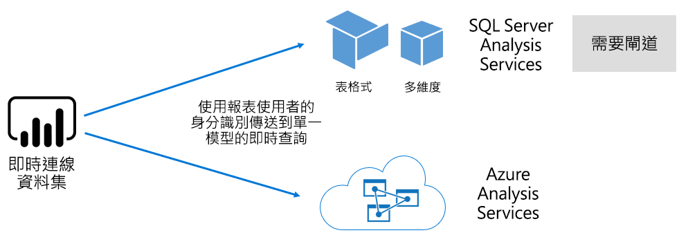

# Power BI 服務中的資料集

此文章提供 Power BI 資料集的技術說明。

## 資料集類型

Power BI 資料集代表可供用於報告及視覺效果的資料來源。 有五個不同的資料集類型，它們是以下列方式建立：

- 連線至未裝載在 Power BI 容量中的現有資料模型
- 上傳包含模型的 Power BI Desktop 檔案
- 上傳 Excel 活頁簿 (包含一或多個 Excel 資料表和/或活頁簿資料模型)，或是上傳 CSV (逗點分隔值) 檔案
- 使用 Power BI 服務來建立[推送資料集](../developer/automation/walkthrough-push-data.md)
- 使用 Power BI 服務來建立[串流或混合式串流資料集](service-real-time-streaming.md)

串流資料集以外的資料集會代表資料模型，它能利用 [Analysis Services](/analysis-services/analysis-services-overview) 的成熟模型化技術。

> [!NOTE]
> 在我們的文件中，有時會混合使用「資料集」  和「模型」  這兩個詞彙。 一般而言，從 Power BI 服務的觀點會將它稱為 **資料集**，而從開發觀點則會將它稱為 **模型**。 在我們文件的內容中，它們基本上具有相同的意義。

### 外部裝載的模型

有兩種類型的外部裝載模型：SQL Server Analysis Services 和 [Azure Analysis Services](/azure/analysis-services/analysis-services-overview)。

連線至 SQL Server Analysis Services 模型會涉及安裝[內部部署資料閘道](service-gateway-onprem.md)，無論它是內部部署或 VM 裝載的基礎結構即服務 (IaaS)。 Azure Analysis Services 不需要閘道。

在有現有的模型投資 (通常會是企業資料倉儲 (EDW) 的一部分) 時，連線至 Analysis Services 通常是合理的作法。 Power BI 可以針對 Analysis Services 建立「即時連線」  ，並透過使用 Power BI 報表使用者的身分識別來強制執行資料權限。 針對 SQL Server Analysis Services，同時支援多維度模型 (Cube) 和表格式模型。 如下列影像所示，即時連線資料集會將查詢傳遞至外部裝載的模型。

### Power BI Desktop 開發的模型

Power BI Desktop (適用於 Power BI 開發的用戶端應用程式) 可以用來開發模型。 該模型基本上便是 Analysis Services 表格式模型。 可以透過從資料流程匯入資料來開發模型，然後進一步將它與外部資料來源整合。 雖然達成模型化的細節已超出此文章的範圍，請務必了解使用 Power BI Desktop 可以開發出三種不同類型 (或「模式」  ) 的模型。 這些模式會決定資料會匯入到模型中，或是保留在資料來源中。 這三個模式為：匯入、DirectQuery 及複合。 如需每個模式的詳細資訊，請參閱 [Power BI 服務中的資料集模式](service-dataset-modes-understand.md)一文。

外部裝載的模型和 Power BI Desktop 模型可以強制執行資料列層級安全性 (RLS)，以限制為特定使用者擷取的資料。 例如，指派至 **銷售人員** 安全性群組的使用者只能檢視其所屬銷售區域的報表資料。 RLS 角色可以是「動態」  或「靜態」  。 動態角色會依報表使用者進行篩選，而靜態角色會針對指派至某個角色的所有使用者套用相同的篩選。 如需詳細資訊，請參閱 [Power BI 的資料列層級安全性 (RLS)](../admin/service-admin-rls.md)。

### Excel 活頁簿模型

建立以 [Excel 活頁簿](service-excel-workbook-files.md)或 [CSV 檔案](service-comma-separated-value-files.md)為基礎的資料集會自動建立模型。 系統會匯入 Excel 資料表和 CSV 資料以建立模型資料表，而 Excel 活頁簿資料模型則會轉換以建立 Power BI 模型。 在所有情況下，檔案資料都會匯入到模型中。

## 摘要

因此，我們可以針對代表模型的 Power BI 資料集進行區別：

- 它們可以裝載於 Power BI 服務中，或是由 Analysis Services 進行外部裝載。
- 它們可以儲存匯入的資料，或是針對基礎資料來源發出傳遞查詢要求，或是將兩者混合使用。

以下是關於代表模型之 Power BI 資料集的重要事實摘要：

- SQL Server Analysis Services 裝載的模型需要閘道以執行即時連線查詢。
- 匯入資料的 Power BI 裝載模型：
  - 必須完整載入至記憶體才能對它們進行查詢。
  - 需要重新整理來使資料保持最新狀態，且在來源資料無法直接透過網際網路存取時，必須涉及到閘道。
- 使用 [DirectQuery](desktop-directquery-about.md) 儲存模式的 Power BI 裝載模型需要針對來源資料的連線能力。 查詢模型時，Power BI 會向來源資料發出查詢以擷取最新資料。 此模式在來源資料無法直接透過網際網路存取時，必須涉及到閘道。
- 模型可以強制執行 RLS 規則，並強制執行篩選以將資料存取權限制在某些使用者身上。

## 考量

若要成功部署及管理 Power BI，請務必了解模型的裝載位置、其儲存模式、針對閘道的任何相依性、匯入資料的大小，以及重新整理的類型和頻率。 這些設定對於 Power BI 容量資源都可能會產生重大影響。 此外，模型設計本身，包括其資料準備查詢、關聯性及計算，也都需要納入考量。

此外，也請務必了解 Power BI 裝載的匯入模型可以根據排程進行重新整理，或是由 Power BI 服務中的使用者視需求觸發。

## 後續步驟

- [Power BI 服務中的資料集模式](service-dataset-modes-understand.md)
- 有其他問題嗎？ [嘗試在 Power BI 社群提問](https://community.powerbi.com/)
