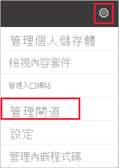
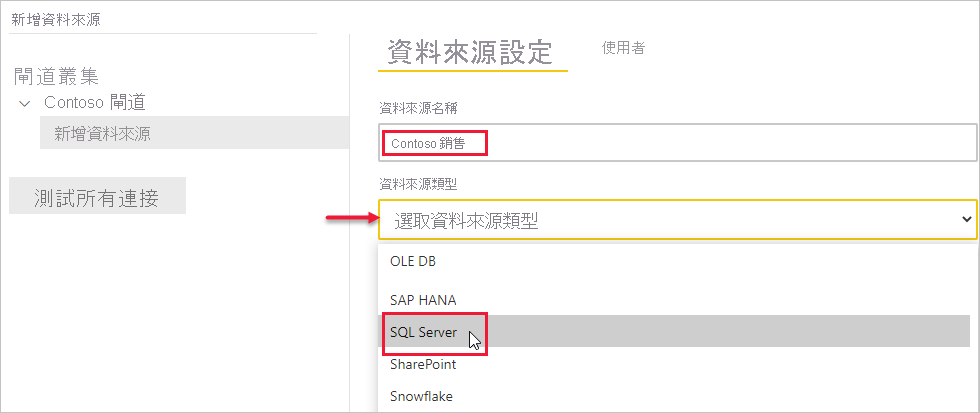
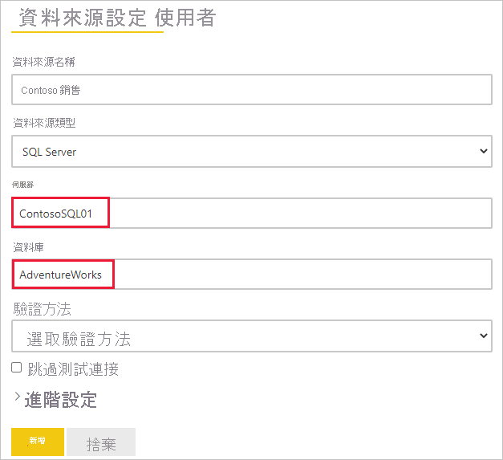
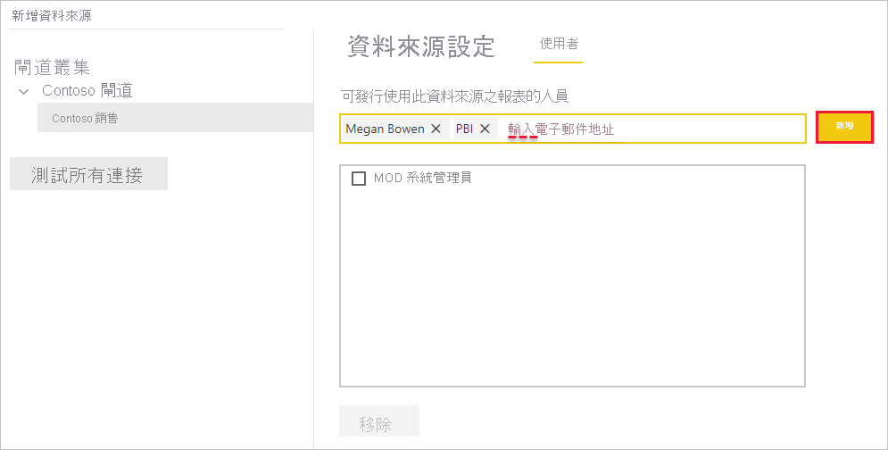
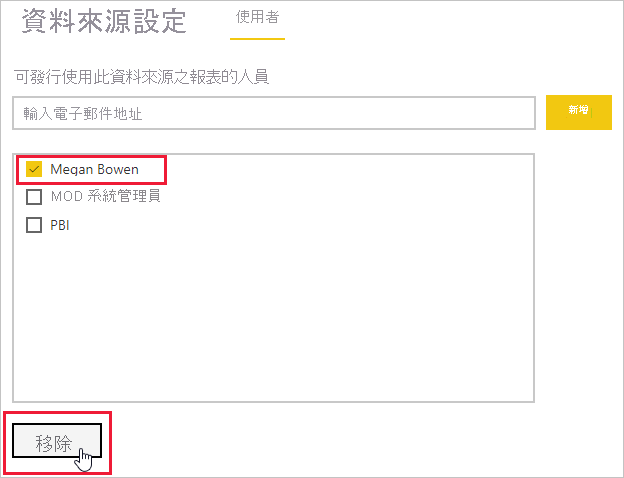

# 新增或移除閘道資料來源

[!INCLUDE [gateway-rewrite](../includes/gateway-rewrite.md)]

Power BI 支援許多的[內部部署資料來源](power-bi-data-sources.md)，且各有自己的需求。 閘道可以用於單一資料來源或多個資料來源。 針對此範例，我們會示範如何新增 SQL Server 作為資料來源。 其步驟與其他資料來源相似。

大多數的資料來源管理作業也都可以使用 API 來執行。 如需詳細資訊，請參閱 [REST API (閘道)](/rest/api/power-bi/gateways)。

如果您尚未安裝閘道，請先參閱[安裝內部部署資料閘道](/data-integration/gateway/service-gateway-install)。

## 加入資料來源

1. 從 Power BI 服務的頁首中，選取 [設定]  > [管理閘道]。

    

2. 選取閘道，然後選取 [新增資料來源]  。 您可以選取 [新增資料來源] 標頭文字，或將游標移到閘道項目旁邊，顯示更多選項功能表會隨即顯示。

    

3. 為您的資料來源指派名稱，然後選取 [資料來源類型]。 在此範例中，我們要選擇 SQL Server。

    

4. 輸入資料來源的相關資訊。 若為 SQL Server，請提供 **伺服器** 與 **資料庫**。

    

5. 連線到資料來源時，請先選取要使用的 [驗證方法]。 若為 SQL Server，請選擇 [Windows] 或 [基本] (SQL 驗證)。 為您的資料來源輸入認證。

   :::image type="content" source="media/service-gateway-data-sources/basic-auth.png" alt-text="基本驗證設定。":::

    > [!NOTE]
    > 如果選取的驗證方法是 OAuth，則所有執行時間超過 OAuth 權杖到期原則的查詢皆可能會失敗。

6. 您可以在 [進階設定] 中，為資料來源設定[單一登入 (SSO)](service-gateway-sso-overview.md)。 

    

    您可以針對以 DirectQuery 為基礎的報表，設定 [透過 Kerberos 使用 SSO 進行 DirectQuery 查詢] 或 [透過 Kerberos 使用 SSO 進行 DirectQuery 和匯入查詢]；或針對以重新整理為基礎的報表，設定 [透過 Kerberos 使用 SSO 進行 DirectQuery 和匯入查詢]。

    如果您使用 [透過 Kerberos 使用 SSO 進行 DirectQuery 查詢]，並將此資料來源用於以 DirectQuery 為基礎的報表，則其會使用登入 Power BI 服務之使用者的認證。 若為以重新整理為基礎的報表，其會使用您在 [使用者名稱] 與 [密碼] 欄位中所輸入的認證。

    若您使用 [透過 Kerberos 使用 SSO 進行 DirectQuery 和匯入查詢]，則不需要提供任何認證。 如果此資料來源用於以 DirectQuery 為基礎的報表，則其會使用對應至登入 Power BI 服務的 (Azure) Active Directory 使用者。  針對以重新整理為基礎的報表，其會使用資料集擁有者的安全性內容

    > [!NOTE]
    >匯入查詢的 SSO 僅適用於使用 [Kerberos 限制委派](service-gateway-sso-kerberos.md)的 SSO 資料來源清單。

7. 在 [進階設定]  下方，選擇性地為您的資料來源設定[隱私權等級](https://support.office.com/article/Privacy-levels-Power-Query-CC3EDE4D-359E-4B28-BC72-9BEE7900B540) (不適用於 [DirectQuery](desktop-directquery-about.md))。

    :::image type="content" source="media/service-gateway-data-sources/privacy-level.png" alt-text="隱私權等級選項。":::

8. 選取 [加入]  。 如果程序成功，您會看到 [連線成功]  。

    

您現在可以使用此資料來源，在 Power BI 儀表板和報表中包含 SQL Server 的資料。

## 移除資料來源

如果您不再使用資料來源，您可以移除它。 移除資料來源的同時也會中斷依賴該資料來源的所有儀表板和報表。

若要移除資料來源，請前往資料來源，然後從更多選項功能表中選取 [移除]。 當您將游標移至資料來源名稱的旁邊時，就會顯示更多選項功能表。

## 使用排程重新整理或 DirectQuery 的資料來源

建立資料來源之後，您便可以搭配 DirectQuery 連線，或是透過已排程的重新整理來使用它。 您可以在[設定排程的重新整理](refresh-scheduled-refresh.md)中，深入了解如何為排程的重新整理進行設定。

> [!NOTE]
>對於 Power BI Desktop 與新增至內部部署資料閘道中的資料來源，其伺服器與資料庫名稱必須相符。

您資料集和閘道內的資料來源連結，是以伺服器名稱和資料庫名稱為依據。 這些名稱必須相符。 例如，若您在 Power BI Desktop 中提供 IP 位址作為伺服器名稱，則必須使用該 IP 位址作為閘道設定的資料來源。 若您在 Power BI Desktop 中使用 *SERVER\INSTANCE*，則必須使用相同項目作為閘道設定的資料來源。

若您已列入閘道內所設定資料來源的 [使用者]  索引標籤，且伺服器和資料庫名稱相符，您便可以選擇搭配排程重新整理來使用閘道。

> [!WARNING]
> 如果您的資料集包含多個資料來源，則每個資料來源都必須新增至閘道中。 如果有一或多個資料來源未新增至閘道，您便無法選擇針對排程重新整理使用閘道。

### 限制

OAuth 驗證配置僅支援使用內部部署資料閘道的自訂連接器。 您無法新增其他必須使用 OAuth 的資料來源。 若資料集具備需要 OAuth 的資料來源，且此資料來源並非自訂連接器，您將無法針對排程重新整理使用閘道。

## 管理使用者

將資料來源新增至閘道後，您可以將特定資料來源 (非整個閘道) 存取權授與使用者和具電子郵件功能的安全性群組。 資料來源的存取清單能夠控制可以發行報表的人員，且這些報表可以包含來自資料來源的資料。 報表擁有者可以建立儀表板、內容套件和應用程式，然後與其他使用者共用這些項目。

您也可以授與使用者和安全性群組對閘道的管理存取權。

> [!NOTE]
> 有資料來源存取權的使用者可以將資料集關聯至資料來源，並根據建立資料來源時所選取的安全性選項 (預存認證或單一登入) 來連線。

### 將使用者加入至資料來源

1. 從 Power BI 服務的頁首中，選取 [設定]  > [管理閘道]。

2. 選取您想新增使用者的資料來源。

3. 選取 [使用者]，然後輸入來自您組織的使用者與具有郵件功能的安全性群組，這些人員將會存取所選的資料來源。 選取 [新增]，新增的成員名稱就會新增至人員清單，這些人員能夠發佈使用此資料來源的報表。

    

請注意，您必須將使用者新增至您要授與存取權的每個資料來源。 每個資料來源都有不同的使用者清單。 分別將使用者新增到每個資料來源。

### 從資料來源中移除使用者

您可以在 [使用者] 索引標籤上，為資料來源移除使用這個資料來源的使用者或安全性群組。

## 在雲端中儲存加密的認證

當您將資料來源新增到閘道時，您必須提供該資料來源的認證。 所有針對該資料來源的查詢都會使用這些認證來執行。 認證會安全地進行加密。 它們會使用對稱式加密，使其無法在儲存於雲端前於雲端中進行解密。 認證會傳送到執行閘道的內部部署電腦，並在存取資料來源時進行解密。

## 可用的資料來源類型清單

如需內部部署資料閘道支援哪些資料來源的詳細資訊，請參閱 [Power BI 資料來源](power-bi-data-sources.md)。

## 後續步驟

* [管理您的資料來源─Analysis Services](service-gateway-enterprise-manage-ssas.md)
* [管理您的資料來源 - SAP HANA](service-gateway-enterprise-manage-sap.md)
* [管理您的資料來源 - SQL Server](service-gateway-enterprise-manage-sql.md)
* [管理您的資料來源 - Oracle](service-gateway-onprem-manage-oracle.md)
* [管理您的資料來源 - 匯入/排程重新整理](service-gateway-enterprise-manage-scheduled-refresh.md)
* [部署資料閘道的指引](service-gateway-deployment-guidance.md)

有其他問題嗎？ 試試 [Power BI 社群](https://community.powerbi.com/)。
