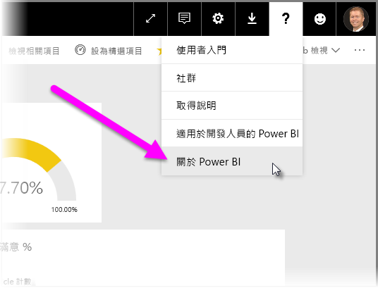

# 部署 Power BI 之資料閘道的指引

[!INCLUDE [gateway-rewrite](../includes/gateway-rewrite.md)]

本文提供在網路環境中部署 Power BI 資料閘道的指引和考量。

如需如何下載、安裝、設定和管理內部部署資料閘道的資訊，請參閱[什麼是內部部署資料閘道？](/data-integration/gateway/service-gateway-onprem)。 您也可以前往 [Microsoft Power Blog](https://powerbi.microsoft.com/blog/) (Microsoft Power 部落格) 及 [Microsoft Power BI Community](https://community.powerbi.com/) (Microsoft Power BI 社群) 網站來深入了解內部部署資料閘道及 Power BI。

## 內部部署資料閘道的安裝考量

在您為 Power BI 雲端服務安裝內部部署資料閘道前，建議您留意一些考量事項。 下列各節會描述這些考量事項。

### 使用者數目

取用使用閘道報表的使用者數量，在您決定閘道安裝位置的決策過程中是一項重要的計量。 以下是要考慮的一些問題：

* 使用者會在每天的不同時間使用這些報表嗎？
* 他們使用的連線類型為何 (DirectQuery 或 Import)？
* 所有使用者都使用相同的報表嗎？

若所有使用者都會在每天的相同時間存取指定報表，請務必將閘道安裝在足以處理所有要求的電腦上。 請參閱下列各節，了解可協助您判斷電腦是否合適的效能計數器和最低需求。

Power BI 中的條件約束只允許每個「報表」  「一個」  閘道。 若報表是以多個資料來源為基礎，則所有的資料來源都必須通過單一閘道。 若儀表板是以「多個」  報表為基礎，您可以針對每個參與的報表使用專用閘道。 透過這種方式，您便可以分散參與單一儀表板多個報表的閘道負載。

### 連線類型

Power BI 提供兩種連線類型：DirectQuery 和 Import (匯入)。 並非所有資料來源都支援這兩種連線類型。 許多因素都可能會讓您選擇其中一項，例如安全性需求、效能、資料限制和資料模型大小。 若要深入了解連線類型和支援的資料來源，請參閱[可用資料來源類型清單](service-gateway-data-sources.md#list-of-available-data-source-types)。

根據使用的連接類型而定，閘道使用量可能會不同。 例如，請盡可能地嘗試將 DirectQuery 資料來源與排程重新整理資料來源分開。 這是假設它們位於不同的報表中，因此可以進行區分。 區分來源可避免閘道在早上用於公司主要儀表板的大型資料模型進行排程重新整理時，同時將上千個 DirectQuery 要求排入佇列。 

以下是針對每個選項所要考量的事項：

* **排程重新整理**：取決於您的查詢大小和每天所發生重新整理數，您可以選擇保持建議的最低硬體需求，或是升級至更高效能的電腦。 若指定的查詢尚未摺疊，則轉換會在閘道電腦上發生。 如此，閘道電腦便可受益於擁有更多的可用 RAM。

* **DirectQuery**：查詢會在每次任何使用者開啟報表或查看資料時傳送。 若您預期會有超過 1,000 位使用者同時存取資料，請確保您的電腦具備強固且足以應付該需求的硬體元件。 CPU 核心數越多，DirectQuery 連線的輸送量便會越高。

如需了解電腦安裝需求，請參閱內部部署資料閘道的[安裝需求](/data-integration/gateway/service-gateway-install#requirements)。

### 位置

閘道的安裝位置可能會對查詢效能產生重大影響。 請盡可能地讓閘道、資料來源位置和 Power BI 租用戶彼此接近，以將網路延遲降至最低。 若要判斷 Power BI 租用戶位置，請在 Power BI 服務中選取右上角的 **?** 右上角的圖示。 然後，請選取 [關於 Power BI]  。

若您想要搭配 Azure Analysis Services 使用 Power BI 閘道，請確認在這兩個項目中的資料區域相符。 如需如何設定多個服務資料區域的詳細資訊，請觀看[此影片](https://guyinacube.com/2018/01/power-bi-azure-analysis-services-gateway-data-region/)。

## 後續步驟

* [設定 Proxy 設定](/data-integration/gateway/service-gateway-proxy)  
* [針對閘道進行疑難排解 - Power BI](service-gateway-onprem-tshoot.md)  
* [內部部署資料閘道常見問題集 - Power BI](service-gateway-power-bi-faq.md)  

有其他問題嗎？ 試試 [Power BI 社群](https://community.powerbi.com/)。
