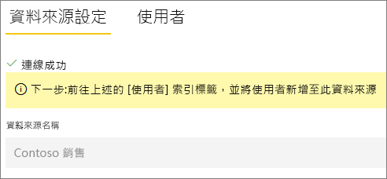

# 管理您的資料來源 - 匯入/排程重新整理

[!INCLUDE [gateway-rewrite](../includes/gateway-rewrite.md)]

在您[安裝內部部署資料閘道](/data-integration/gateway/service-gateway-install)後，您需要[新增資料來源](service-gateway-data-sources.md#add-a-data-source)，其可與閘道搭配使用。 本文將探討相對於 DirectQuery 或即時連線，如何使用可用於已排程重新整理的閘道和資料來源。

## 新增資料來源

如需如何新增資料來源的詳細資訊，請參閱[新增資料來源](service-gateway-data-sources.md#add-a-data-source)。 選取資料來源類型。

所有列出的資料來源類型都可搭配內部部署資料閘道用於已排程重新整理。 Analysis Services、SQL Server 和 SAP HANA 可以用於已排程重新整理或 DirectQuery/即時連線。

然後填入資料來源的資訊，包括來源資訊和用來存取資料來源的認證。

> [!NOTE]
> 資料來源的所有查詢都會使用這些認證來執行。 若要深入了解認證的儲存方式，請參閱[在雲端中儲存加密認證](service-gateway-data-sources.md#store-encrypted-credentials-in-the-cloud)。

如需可與已排程重新整理搭配使用的資料來源類型清單，請參閱[可用的資料來源類型清單](service-gateway-data-sources.md#list-of-available-data-source-types)。

填入所有資訊之後，選取 [新增]  。 您現在可以使用此資料來源，用於內部部署資料已排程的重新整理。 如果成功，您會看到「連線成功」  。

### 進階設定

您可以選擇性地設定您資料來源的隱私權等級。 此設定可以控制合併資料的方式。 只能用於已排程的重新整理。 若要深入了解您資料來源的隱私權等級，請參閱[隱私權等級 (Power Query)](https://support.office.com/article/Privacy-levels-Power-Query-CC3EDE4D-359E-4B28-BC72-9BEE7900B540)。

## 使用資料來源進行已排程的重新整理

建立資料來源之後，您便可以搭配 DirectQuery 連線，或是透過已排程的重新整理來使用它。

> [!NOTE]
> Power BI Desktop 和內部部署資料閘道內資料來源的伺服器和資料庫名稱必須相符。

您的資料集和閘道內的資料來源是根據您的伺服器名稱和資料庫名稱以建立連結。 這些名稱必須相符。 例如，若您在 Power BI Desktop 中為伺服器名稱提供 IP 位址，則必須在閘道設定中針對資料來源使用 IP 位址。 若您在 Power BI Desktop 中使用 *SERVER\INSTANCE*，則也必須在為閘道設定的資料來源內使用。

若您已列在閘道內所設定資料來源的 [使用者]  索引標籤中，且伺服器名稱和資料庫名稱相符，您將會看到可以與已排程重新整理搭配使用的閘道選項。

> [!IMPORTANT]
> 重新發佈之後，資料集擁有者必須再次將資料集重新關聯至閘道和對應的資料來源。 重新發佈之後，將不會繼續維持上一個關聯。 

> [!WARNING]
> 如果您的資料集包含多個資料來源，每個資料來源都必須新增至閘道中。 如果有一或多個資料來源未新增至閘道，您便無法選擇針對排程重新整理使用閘道。

## 後續步驟

* [為內部部署資料閘道進行疑難排解](/data-integration/gateway/service-gateway-tshoot)
* [針對閘道進行疑難排解 - Power BI](service-gateway-onprem-tshoot.md)

有其他問題嗎？ 試試 [Power BI 社群](https://community.powerbi.com/)。
