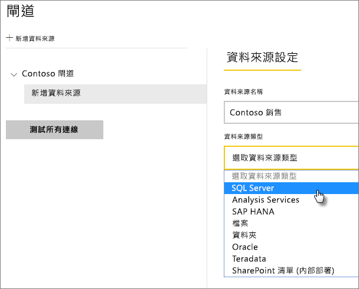
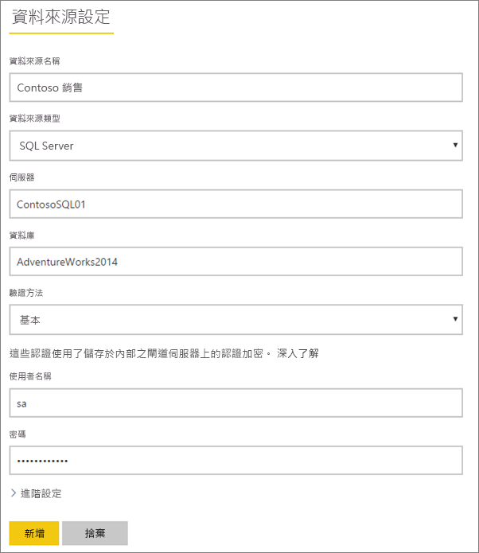
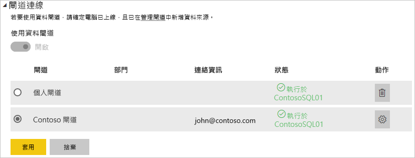

# 管理您的資料來源 - SQL Server

[!INCLUDE [gateway-rewrite](../includes/gateway-rewrite.md)]

在您[安裝內部部署資料閘道](/data-integration/gateway/service-gateway-install)後，您可以[新增資料來源](service-gateway-data-sources.md#add-a-data-source)，其可與閘道搭配使用。 本文會探討如何使用閘道和 SQL Server 資料來源，用於已排程重新整理或 DirectQuery。

## 新增資料來源

如需如何新增資料來源的詳細資訊，請參閱[新增資料來源](service-gateway-data-sources.md#add-a-data-source)。 在 [資料來源類型]  下選取 [SQL Server]  。

> [!NOTE]
> 當您使用 DirectQuery 時，此閘道僅支援 **SQL Server 2012 SP1** 與後續版本。

然後填入資料來源的資訊，包括 [伺服器]  和 [資料庫]  。 

在 [驗證方法]  下，選擇 [Windows]  或 [基本]  。 若您計劃使用 SQL 驗證而非 Windows 驗證，請選擇 [基本]  。 然後輸入要用於這個資料來源的認證。

> [!NOTE]
> 資料來源的所有查詢都會使用這些認證來執行，除非您為資料來源設定和啟用了 Kerberos 單一登入 (SSO)。 使用 SSO 時，匯入資料集會使用預存認證，但 DirectQuery 資料集會使用目前的 Power BI 使用者來使用 SSO 執行查詢。 若要深入了解認證的儲存方式，請參閱[在雲端中儲存加密認證](service-gateway-data-sources.md#store-encrypted-credentials-in-the-cloud)。 或者，請參閱描述如何[針對從 Power BI 到內部部署資料來源的單一登入 (SSO) 使用 Kerberos](service-gateway-sso-kerberos.md)的文章。

填入所有資訊之後，選取 [新增]  。 您現在可以使用此資料來源，針對內部部署的 SQL Server，用於已排程的重新整理或 DirectQuery。 如果成功，您會看到「連線成功」  。

### 進階設定

您可以選擇性地設定您資料來源的隱私權等級。 此設定可以控制合併資料的方式。 只能用於已排程的重新整理。 隱私權層級設定不適用於 DirectQuery。 若要深入了解您資料來源的隱私權等級，請參閱[隱私權等級 (Power Query)](https://support.office.com/article/Privacy-levels-Power-Query-CC3EDE4D-359E-4B28-BC72-9BEE7900B540)。

## 使用資料來源

建立資料來源之後，您便可以搭配 DirectQuery 連線，或是透過已排程的重新整理來使用它。

> [!NOTE]
> Power BI Desktop 和內部部署資料閘道內資料來源的伺服器和資料庫名稱必須相符。

您的資料集和閘道內的資料來源是根據您的伺服器名稱和資料庫名稱以建立連結。 這些名稱必須相符。 例如，若您在 Power BI Desktop 中為伺服器名稱提供 IP 位址，則必須在閘道設定中針對資料來源使用 IP 位址。 若您在 Power BI Desktop 中使用 *SERVER\INSTANCE*，則必須在為閘道設定的資料來源內使用。

這項需求適用於 DirectQuery 和已排程的重新整理。

### 使用 DirectQuery 連線來使用資料來源

請確定在 Power BI Desktop 和針對閘道所設定資料來源之間具有相符的伺服器和資料庫名稱。 您也必須確定資料來源的 [使用者]  索引標籤已列出使用者，才能發佈 DirectQuery 資料集。 當您第一次匯入資料時，Power BI Desktop 內會出現 DirectQuery 的選取項目。 如需如何使用 DirectQuery 的詳細資訊，請參閱[在 Power BI Desktop 中使用 DirectQuery](desktop-use-directquery.md)。

發佈之後，您的報表會從 Power BI Desktop 或**取得資料**開始工作。 建立閘道內的資料來源之後，可能需要幾分鐘的時間才能使用連線。

### 使用已排程的重新整理使用資料來源

若您已列在閘道內所設定資料來源的 [使用者]  索引標籤中，且伺服器名稱和資料庫名稱相符，您將會看到可以與已排程重新整理搭配使用的閘道選項。

## 後續步驟

* [連線到 SQL Server 中的內部部署資料](service-gateway-sql-tutorial.md)
* [為內部部署資料閘道進行疑難排解](/data-integration/gateway/service-gateway-tshoot)
* [針對閘道進行疑難排解 - Power BI](service-gateway-onprem-tshoot.md)
* [針對從 Power BI 到內部部署資料來源的單一登入 (SSO) 使用 Kerberos](service-gateway-sso-kerberos.md)

有其他問題嗎？ 請嘗試詢問 [Power BI 社群](https://community.powerbi.com/)。
