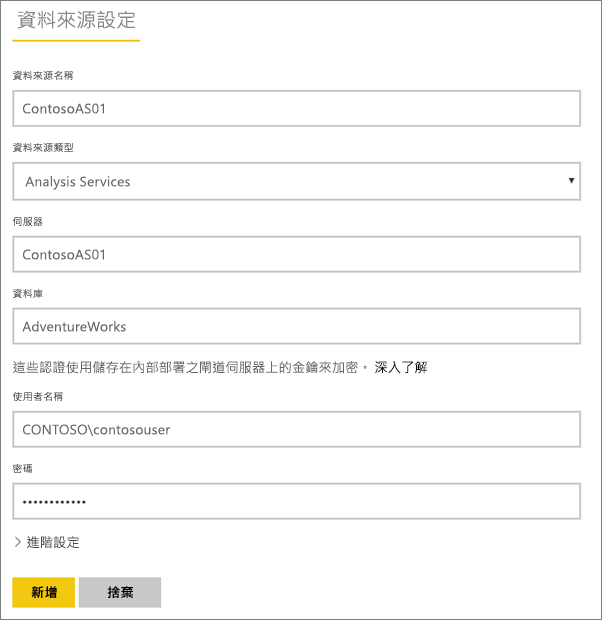
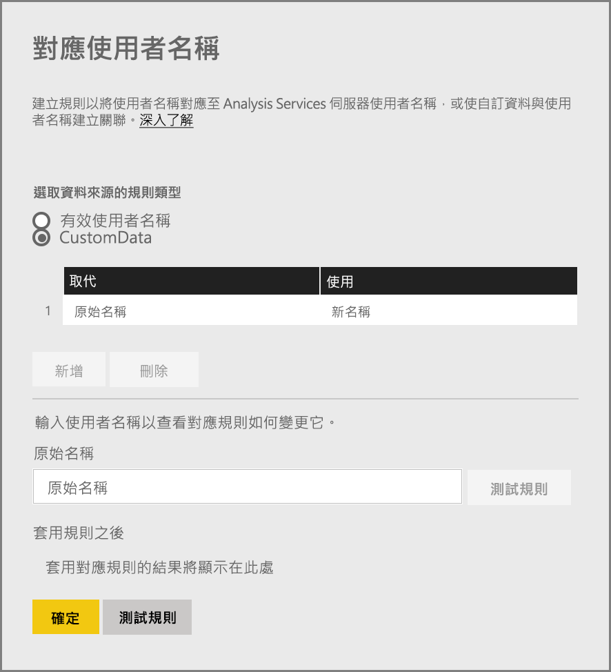
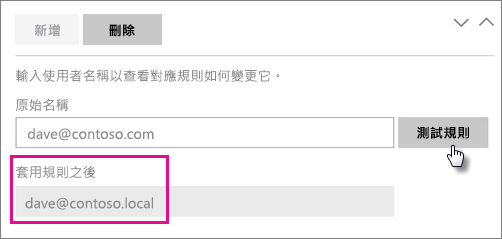
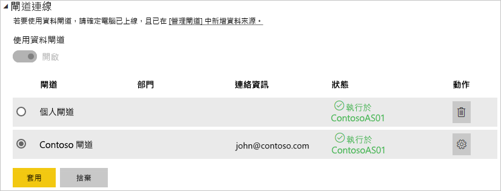

# <a name="manage-your-data-source---analysis-services"></a>管理您的資料來源 ─ Analysis Services

[!INCLUDE [gateway-rewrite](../includes/gateway-rewrite.md)]

在您[安裝內部部署資料閘道](/data-integration/gateway/service-gateway-install)後，您需要[新增資料來源](service-gateway-data-sources.md#add-a-data-source)，其可與閘道搭配使用。 本文會探討如何使用閘道和 SQL Server Analysis Services (SSAS) 資料來源，用來進行已排程重新整理或即時連線。

若要深入瞭解如何設定與 Analysis Services 的即時連線, 請[觀看此影片](https://www.youtube.com/watch?v=GPf0YS-Xbyo&feature=youtu.be)。

> [!NOTE]
> 如果您有 Analysis Services 資料來源，則需要在與 Analysis Services 伺服器加入同一個樹系/網域的電腦上安裝閘道器。

## <a name="add-a-data-source"></a>新增資料來源

如需如何新增資料來源的資訊，請參閱[新增資料來源](service-gateway-data-sources.md#add-a-data-source)。 若您要連線到多維度或表格式伺服器，請針對 [資料來源類型] 選取 [Analysis Services]。


填入資料來源的資訊，包括 [伺服器]  和 [資料庫]  。 閘道器將使用您輸入的 [使用者名稱]  和 [密碼]  連線到 Analysis Services 執行個體。

> [!NOTE]
> 您輸入的 Windows 帳戶，必須擁有您所連接執行個體的伺服器系統管理員權限。 如果此帳號的密碼設有期限，在密碼未針對資料來源更新的情況下，使用者就會收到連接錯誤。 若要深入了解認證的儲存方式，請參閱[在雲端中儲存加密認證](service-gateway-data-sources.md#store-encrypted-credentials-in-the-cloud)。



填入所有資訊之後，選取 [新增]  。 您現在可以使用此資料來源，針對內部部署的 Analysis Services 執行個體，用於已排程的重新整理或即時連線。 如果成功，您會看到「連線成功」  。


### <a name="advanced-settings"></a>進階設定

您可以選擇性地設定您資料來源的隱私權等級。 此設定可以控制合併資料的方式。 只能用於已排程的重新整理。 隱私權層級設定不適用於即時連線。 若要深入了解您資料來源的隱私權等級，請參閱[隱私權等級 (Power Query)](https://support.office.com/article/Privacy-levels-Power-Query-CC3EDE4D-359E-4B28-BC72-9BEE7900B540)。


## <a name="user-names-with-analysis-services"></a>Analysis Services 與使用者名稱

<iframe width="560" height="315" src="https://www.youtube.com/embed/Qb5EEjkHoLg" frameborder="0" allowfullscreen></iframe>

每次使用者和連接至 Analysis Services 的報表互動時，會將有效使用者名稱傳遞至閘道器，然後傳遞給內部部署 Analysis Services 伺服器。 您用來登入 Power BI 的電子郵件地址會當作有效使用者傳遞給 Analysis Services。 傳遞此內容時是使用連接屬性 [EffectiveUserName](/analysis-services/instances/connection-string-properties-analysis-services#bkmk_auth)。 

電子郵件地址必須和本機 Active Directory 網域內定義的使用者主體名稱 (UPN) 相符。 UPN 是 Active Directory 帳戶的屬性。 Windows 帳戶必須出現在 Analysis Services 角色中。 若在 Active Directory 中找不到任何相符項目，登入便不成功。 若要深入了解 Active Directory 和使用者命名，請參閱[使用者命名屬性](/windows/win32/ad/naming-properties)。

您也可以[將您的 Power BI 登入名稱與本機目錄 UPN 對應](service-gateway-enterprise-manage-ssas.md#map-user-names-for-analysis-services-data-sources)。

## <a name="map-user-names-for-analysis-services-data-sources"></a>對應 Analysis Services 資料來源的使用者名稱

<iframe width="560" height="315" src="https://www.youtube.com/embed/eATPS-c7YRU" frameborder="0" allowfullscreen></iframe>

Power BI 可讓您對應 Analysis Services 資料來源的使用者名稱。 您可以設定規則，將登入 Power BI 的使用者名稱對應至 Analysis Services 連線上傳遞給 EffectiveUserName 的名稱。 當您在 Azure Active Directory (Azure AD) 中的使用者名稱不符合本機 Active Directory 執行個體中 UPN 時，使用者名稱對應功能是暫時解決問題的好方法。 例如，如果您的電子郵件地址為 nancy@contoso.onmicrsoft.com，您將其對應至 nancy@contoso.com，然後該值就會傳遞至閘道。

您可以使用兩種不同的方式對應 Analysis Services 的使用者名稱：

* 手動使用者重新對應
* 可將 Azure AD UPN 重新對應至 Active Directory 使用者的內部部署 Active Directory 屬性查閱 (Active Directory 查閱對應)

您可以使用第二種方法來執行手動對應，但這樣做會很耗時且難以維護。 當模式比對不足時，尤其難以進行。 例如，Azure AD 與內部部署 Active Directory 之間的網域名稱不同，或 Azure AD 與 Active Directory 之間的使用者帳戶名稱不同時。 因此不建議使用第二種方法進行手動對應。

我們將在下列兩節依序描述這兩種方法。

### <a name="manual-user-name-remapping"></a>手動使用者名稱重新對應

針對 Analysis Services 資料來源，您可以設定自訂 UPN 規則。 如果您的 Power BI 服務登入名稱不符合本機目錄 UPN，則自訂規則可以協助您。 例如，若您使用 john@contoso.com 登入 Power BI，但本機目錄 UPN 為 john@contoso.local，則您可以設定對應規則以將 john@contoso.local 傳遞到 Analysis Services。

若要前往 UPN 對應畫面，請遵循下列步驟。

1. 移至齒輪圖示，然後選取 [管理閘道]  。
2. 請展開包含 Analysis Services 資料來源的閘道。 或者，若您尚未建立 Analysis Services 資料來源，可以暫時先這麼做。
3. 選取資料來源，然後選取 [使用者]  索引標籤。
4. 請選取 [對應使用者名稱]  。

    

您會看到指定使用者的新增規則及測試選項。

> [!NOTE]
> 您可能會變更無意變更的使用者。 例如，如果 [取代 (原始值)]  是 contoso.com，而 [使用 (新名稱)]  是 @contoso.local，則其所有登入包含 @contoso.com 的使用者會取代為 @contoso.local。 此外，如果 [取代 (原始名稱)]  為 dave@contoso.com，而 [使用 (新名稱)]  為 dave@contoso.local，則具有 v-dave@contoso.com 登入的使用者會傳送為 v-dave@contoso.local。

### <a name="active-directory-lookup-mapping"></a>Active Directory 查閱對應

若要執行內部部署 Active Directory 屬性查閱以將 Azure AD UPN 重新對應至 Active Directory 使用者，請遵循本節中的步驟。 若要開始，請檢閱這項作業的運作方式。

在 Power BI 服務中，發生下列情況：

* 針對 Power BI Azure AD 使用者對內部部署 SSAS 伺服器的每個查詢，會一起傳遞 UPN 字串，例如 firstName.lastName@contoso.com。

> [!NOTE]
> 將使用者名稱字串傳送至內部部署資料閘道「之前」  ，仍然會套用 Power BI 資料來源設定中所定義的任何手動 UPN 使用者對應。

在具有可設定自訂使用者對應的內部部署資料閘道上，遵循下列步驟。

1. 尋找要搜尋的 Active Directory。 您可以使用 [自動] 或 [可設定]。
2. 從 Power BI 服務查閱 Active Directory 人員屬性 (例如 Email)。 屬性是以傳入的 UPN 字串 (例如 firstName.lastName@contoso.com) 為基礎。
3. 如果 Active Directory 查閱失敗，則會嘗試使用一起傳遞的 UPN 作為 SSAS 的 EffectiveUser。
4. 如果 Active Directory 查閱成功，則會擷取該 Active Directory 人員的 UserPrincipalName。
5. 它會將 UserPrincipalName 電子郵件作為 EffectiveUser 傳遞給 SSAS，例如：Alias@corp.on-prem.contoso。

設定您的閘道執行 Active Directory 查閱：

1. [下載並安裝最新的閘道](/data-integration/gateway/service-gateway-install)。

2. 在閘道中，使用網域帳戶 (而非本機服務帳戶) 來變更內部部署資料閘道服務。 否則 Active Directory 查閱將無法在執行時間正常運作。 前往您電腦上的[內部部署資料閘道應用程式](/data-integration/gateway/service-gateway-app)，然後前往 [服務設定]   > [變更服務帳戶]  。 除非您想要改為建立新的閘道，否則請確定您有此閘道的修復金鑰，因為您必須在相同的電腦上才能進行還原。 重新啟動閘道服務，讓變更生效。

3. 以系統管理員身分移至閘道的安裝資料夾 *C:\Program Files\On-premises data gateway*，確認您具有寫入權限。 開啟 *Microsoft.PowerBI.DataMovement.Pipeline.GatewayCore.dll.config* 檔案。

4. 根據「您」  Active Directory 使用者的 Active Directory 屬性設定，編輯下列兩個設定值。 下列是範例的設定值。 根據您的 Active Directory 設定來指定值。 這些設定會區分大小寫，因此請確定它們符合 Active Directory 中的值。

    

    如果沒有為 ADServerPath 設定提供任何值，則閘道會使用預設的通用類別目錄。 您也可以為 ADServerPath 指定多個值。 每個值都必須以分號分隔，如下列範例所示：

    ```xml
    <setting name="ADServerPath" serializeAs="String">
        <value> >GC://serverpath1; GC://serverpath2;GC://serverpath3</value>
    </setting>
    ```

    閘道會從左到右剖析 ADServerPath 的值，直到找到相符項目為止。 如果找不到相符項目，則會使用原始的 UPN。 請確定執行閘道服務 (PBIEgwService) 的帳戶對您在 ADServerPath 中所指定所有 Active Directory 伺服器具有查詢權限。

    閘道支援兩種類型的 ADServerPath，如下列範例所示：

    **WinNT**

    ```xml
    <value="WinNT://usa.domain.corp.contoso.com,computer"/>
    ```

    **GC**

    ```xml
    <value> GC://USA.domain.com </value>
    ```

5. 重新啟動內部部署資料閘道服務，以讓設定變更生效。

### <a name="work-with-mapping-rules"></a>使用對應規則

若要建立對應規則，請輸入 [原始名稱]  和 [新名稱]  的值，然後選取 [新增]  。

| 欄位 | 描述 |
| --- | --- |
| 取代 (原始名稱) |您用來登入 Power BI 的電子郵件地址。 |
| 使用 (新名稱) |您要用來取代的值。 取代結果將會傳送至 EffectiveUserName 屬性，以進行 Analysis Services 連接。 |


當您在清單中選取項目時，您可以選擇使用 V 形箭號圖示，以進行重新排序。 或者，您可以刪除項目。


### <a name="use-a-wildcard"></a>使用萬用字元

[取代 (原始名稱)]  字串可以使用萬用字元 (*)。 它只能用於本身，不能搭配任何其他字串部分。 如果您想要接受所有使用者，將單一值傳遞給資料來源，請使用萬用字元。 當您希望組織中的所有使用者在本機環境中使用同一使用者時，這個方法非常有用。

### <a name="test-a-mapping-rule"></a>測試對應規則

若要驗證原始名稱取代成什麼內容，請輸入 [原始名稱]  的值。 選取 [測試規則]  。



> [!NOTE]
> 服務需要幾分鐘才會開始使用已儲存的規則。 此規則會立即在瀏覽器中運作。

### <a name="limitations-for-mapping-rules"></a>對應規則的限制

對應乃針對正在設定的特定資料來源。 它並不是全域設定。 若您有多個 Analysis Services 資料來源，您必須對應每個資料來源的使用者。

## <a name="authentication-to-a-live-analysis-services-data-source"></a>即時 Analysis Services 資料來源的驗證

每次使用者和 Analysis Services 互動時，有效使用者名稱皆會傳遞至閘道，然後傳到內部部署 Analysis Services 伺服器。 UPN 通常是您用來登入雲端的電子郵件地址，會當作有效使用者傳遞給 Analysis Services。 傳遞此 UPN 時是使用連接屬性 EffectiveUserName。 

此電子郵件地址應符合本機 Active Directory 網域內定義的 UPN。 UPN 是 Active Directory 帳戶的屬性。 該 Windows 帳戶必須出現於 Analysis Services 角色中，以取得伺服器的存取權。 如果沒有在 Active Directory 中找到符合的項目，則登入不會成功。

Analysis Services 也可以提供根據此帳戶進行篩選。 可以根據角色型安全性或資料列層級安全性來篩選。

## <a name="role-based-security"></a>角色型安全性

模型會依據使用者角色來提供安全性。 針對特定模型專案來定義角色的方式為使用 SQL Server Management Studio，時間點可能在使用 SQL Server Data Tools – 商業智慧撰寫期間，或者在部署模型之後。 角色所包含的成員依 Windows 使用者名稱或 Windows 群組而定。 角色定義使用者在模型上查詢或執行動作的權限。 大部分使用者屬於擁有讀取權限的角色。 其他角色適用於具有處理項目、管理資料庫函數及管理其他角色等權限的系統管理員。

## <a name="row-level-security"></a>資料列層級安全性

資料列層級安全性為 Analysis Services 資料列層級安全性所特有。 模型會提供動態的資料列層級安全性。 不同於具有至少一個使用者隸屬的角色，動態安全性並非任何表格式模型所需。 在較高的層級，動態安全性定義使用者讀取資料的權限，用於讀取特定資料表中特定資料列的資料。 動態資料列層級安全性與角色類似，也仰賴使用者的 Windows 使用者名稱。

使用者能否查詢和檢視模型資料取決於：

- 他們 Windows 使用者帳戶隸屬為其成員的角色。
- 動態資料列層級安全性，如果已設定的話。

在模型中實作角色和動態資料列層級安全性已超出本文的範圍。 若要深入了解，請參閱 MSDN 上的[角色 (SSAS 表格式)](/analysis-services/tabular-models/roles-ssas-tabular) 和[安全性角色 (Analysis Services - 多維度資料)](/analysis-services/multidimensional-models/olap-logical/security-roles-analysis-services-multidimensional-data)。 為了徹底了解表格式模型安全性，請下載並閱讀[保護表格式 BI 語意模型技術白皮書](https://download.microsoft.com/download/D/2/0/D20E1C5F-72EA-4505-9F26-FEF9550EFD44/Securing%20the%20Tabular%20BI%20Semantic%20Model.docx)。

## <a name="what-about-azure-ad"></a>那麼 Azure AD 呢？

Microsoft 雲端服務會使用 [Azure AD](/azure/active-directory/fundamentals/active-directory-whatis) 來負責驗證使用者。 Azure AD 是包含使用者名稱和安全性群組的租用戶。 一般而言，使用者登入時使用的電子郵件地址與帳戶的 UPN 相同。

## <a name="what-is-the-role-of-my-local-active-directory-instance"></a>本機 Active Directory 執行個體的角色為何？

為了讓 Analysis Services 可判斷予以連接的使用者所屬角色是否具有讀取資料權限，該伺服器需要轉換從 Azure AD 傳遞到閘道再傳遞到 Analysis Services 伺服器的有效使用者名稱。 Analysis Services 伺服器會將有效使用者名稱傳遞至 Windows Active Directory 網域控制站 (DC)。 然後 Active Directory DC 會驗證有效使用者名稱是否為本機帳戶的有效 UPN。 它會將該使用者的 Windows 使用者名稱傳回給 Analysis Services 伺服器。

EffectiveUserName 不能用在未加入網域的 Analysis Services 伺服器上。 Analysis Services 伺服器必須已加入網域中，以避免任何登入錯誤。

## <a name="how-do-i-tell-what-my-upn-is"></a>如何判斷我的 UPN 為何？

您可能不知道您的 UPN 為何，且您可能不是網域系統管理員。 您可以從工作站使用下列命令來查明您帳戶的 UPN。

    whoami /upn

結果看起來會與電子郵件地址相似，但這是您網域帳戶上的 UPN。 若您使用 Analysis Services 資料來源進行即時連線，且如果這個 UPN 不符合您用來登入 Power BI 的電子郵件地址，建議您查看如何[對應使用者名稱](#map-user-names-for-analysis-services-data-sources)。

## <a name="synchronize-an-on-premises-active-directory-with-azure-ad"></a>同步處理內部部署 Active Directory 和 Azure AD

如果您打算使用 Analysis Services 即時連線，您的本機 Active Directory 帳戶必須符合 Azure AD。 帳戶之間的 UPN 必須相符。

雲端服務只了解 Azure AD 內的帳戶。 是否將帳戶新增至您的本機 Active Directory 執行個體並不重要。 如果帳戶不存在於 Azure AD 中，就無法使用。 有不同的方式可以讓本機 Active Directory 帳戶和 Azure AD 相符：

- 您可以手動將帳戶新增至 Azure AD。

   您可以在 Azure 入口網站或 Microsoft 365 系統管理中心建立帳戶，帳戶名稱必須符合本機 Active Directory 帳戶的 UPN。

- 您可以使用 [Azure AD Connect](/azure/active-directory/hybrid/how-to-connect-sync-whatis) 工具，將本機帳戶同步處理至您的 Azure AD 租用戶。

   Azure AD Connect 工具提供目錄同步處理和設定驗證使用的選項。 選項包括密碼雜湊同步處理、傳遞驗證和同盟。 如果您不是租用戶系統管理員或本機網域系統管理員，請連絡 IT 管理員來協助進行這項設定。

   使用 Azure AD Connect 可確保 UPN 會在 Azure AD 與本機 Active Directory 執行個體之間相符。

> [!NOTE]
> 使用 Azure AD Connect 工具同步處理帳戶會在 Azure AD 租用戶內建立新的帳戶。

## <a name="use-the-data-source"></a>使用資料來源

建立資料來源之後，您便可以搭配即時連線，或是透過已排程的重新整理來使用它。

> [!NOTE]
> Power BI Desktop 和內部部署資料閘道內資料來源的伺服器和資料庫名稱必須相符。

您的資料集和閘道內的資料來源是根據您的伺服器名稱和資料庫名稱以建立連結。 這些名稱必須相符。 例如，若您在 Power BI Desktop 中為伺服器名稱提供 IP 位址，則必須在閘道設定中針對資料來源使用 IP 位址。 若您在 Power BI Desktop 中使用 *SERVER\INSTANCE*，則也必須在為閘道設定的資料來源內使用。

這項需求適用於即時連線和已排程的重新整理。

### <a name="use-the-data-source-with-live-connections"></a>使用即時連線來使用資料來源

請確定在 Power BI Desktop 和針對閘道所設定的資料來源之間具有相符的伺服器和資料庫名稱。 您也必須確定資料來源的 [使用者]  索引標籤已列出您的使用者，才能發佈即時連線資料集。 當您第一次匯入資料時，Power BI Desktop 內會出現即時連線的選取項目。

發佈之後，您的報表會從 Power BI Desktop 或**取得資料**開始工作。 建立閘道內的資料來源之後，可能需要幾分鐘的時間才能使用連線。

### <a name="use-the-data-source-with-scheduled-refresh"></a>使用已排程的重新整理使用資料來源

若您已列在閘道內所設定資料來源的 [使用者]  索引標籤中，且伺服器和資料庫名稱相符，您將會看到可以與已排程重新整理搭配使用的閘道選項。



### <a name="limitations-of-analysis-services-live-connections"></a>Analysis Services 即時連線的限制

您可以使用即時連線針對表格式或多維度執行個體。

| **伺服器版本** | **必要的 SKU** |
| --- | --- |
| 2012 SP1 CU4 或更新版本 |商業智慧和企業版 SKU |
| 2014 |商業智慧和企業版 SKU |
| 2016 |標準 SKU 或更高版本 |

* 不支援資料格層級格式化與轉譯功能。
* 動作和命名集不會公開至 Power BI。 您仍然可以連接至同樣包含動作或命名集的多維度 Cube，然後建立視覺效果和報表。

## <a name="next-steps"></a>後續步驟

* [為內部部署資料閘道進行疑難排解](/data-integration/gateway/service-gateway-tshoot)
* [針對閘道進行疑難排解 - Power BI](service-gateway-onprem-tshoot.md)

有其他問題嗎？ 試試 [Power BI 社群](https://community.powerbi.com/)。
