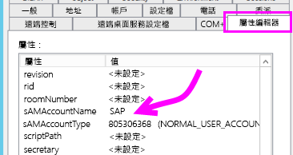

# <a name="troubleshoot-gateways---power-bi"></a>針對閘道進行疑難排解 - Power BI

[!INCLUDE [gateway-rewrite](../includes/gateway-rewrite.md)]

本文探討使用內部部署資料閘道搭配 Power BI 時的一些常見問題。 如果您遇到此處未列出的問題，可以使用 Power BI [社群](https://community.powerbi.com)網站。 或者，您可以建立[支援票證](https://powerbi.microsoft.com/support)。

## <a name="configuration"></a>設定

### <a name="error-power-bi-service-reported-local-gateway-as-unreachable-restart-the-gateway-and-try-again"></a>錯誤：Power BI 服務回報無法連繫區域閘道。 請重新啟動閘道，然後再試一次。

設定結束時，會再次呼叫 Power BI 服務以驗證閘道。 Power BI 服務未將閘道報告為即時。 重新啟動 Windows 服務可能會讓通訊成功。 如[從內部部署資料閘道應用程式收集記錄](/data-integration/gateway/service-gateway-tshoot#collect-logs-from-the-on-premises-data-gateway-app)中所述，您可以收集並檢閱記錄檔以取得詳細資料。

## <a name="data-sources"></a>資料來源

### <a name="error-unable-to-connect-details-invalid-connection-credentials"></a>錯誤：無法連線。 詳細資料:[連接認證無效]

在 [顯示詳細資料]  中，會顯示從資料來源收到的錯誤訊息。 若是 SQL Server，您會看到類似如下的訊息：

    Login failed for user 'username'.

請確認您擁有正確的使用者名稱和密碼。 另請確認這些認證可成功連接到資料來源。 請確定使用的帳戶符合驗證方法。

### <a name="error-unable-to-connect-details-cannot-connect-to-the-database"></a>錯誤：無法連線。 詳細資料:「無法連線到資料庫」

您可以連線到伺服器，但無法連線到提供的資料庫。 請確認資料庫的名稱，以及使用者認證具有存取該資料庫的適當權限。

在 [顯示詳細資料]  中，會顯示從資料來源收到的錯誤訊息。 若是 SQL Server，您會看到類似如下的訊息：

    Cannot open database "AdventureWorks" requested by the login. The login failed. Login failed for user 'username'.

### <a name="error-unable-to-connect-details-unknown-error-in-data-gateway"></a>錯誤：無法連線。 詳細資料:「資料閘道發生不明錯誤」

這個錯誤可能有數個不同的發生原因。 請務必驗證您可以從裝載閘道的電腦連線到資料來源。 這種情況可能是由於無法存取伺服器所致。

在 [顯示詳細資料]  中，您可能會看到錯誤碼 **DM_GWPipeline_UnknownError**。

您也可以查看 [事件記錄檔]   > [應用程式及服務記錄檔]   > [內部部署資料閘道服務]  ，以取得詳細資訊。

### <a name="error-we-encountered-an-error-while-trying-to-connect-to-server-details-we-reached-the-data-gateway-but-the-gateway-cant-access-the-on-premises-data-source"></a>錯誤：嘗試連線至 \<伺服器\> 時發生錯誤。 詳細資料:[已連線到資料閘道，但該閘道無法存取內部部署資料來源。]

您無法連線到指定的資料來源。 請務必驗證為該資料來源提供的資訊。

在 [顯示詳細資料]  中，您可能會看到錯誤碼 **DM_GWPipeline_Gateway_DataSourceAccessError**。

如果出現類似下列的基礎錯誤訊息，則表示為此資料來源所使用的帳戶不是該 Analysis Services 執行個體的伺服器管理員。 如需詳細資訊，請參閱 [Grant server admin rights to an Analysis Services instance](https://docs.microsoft.com/sql/analysis-services/instances/grant-server-admin-rights-to-an-analysis-services-instance) (將伺服器管理員許可權授與 Analysis Services 執行個體)。

    The 'CONTOSO\account' value of the 'EffectiveUserName' XML for Analysis property is not valid.

如果基礎錯誤訊息類似於下列訊息，這可能表示 Analysis Services 的服務帳戶可能遺漏了 [token-groups-global-and-universal](/windows/win32/adschema/a-tokengroupsglobalanduniversal) (TGGAU) 目錄屬性。

    The username or password is incorrect.

具有 Windows 2000 之前版本相容性存取權的網域會啟用 TGGAU 屬性。 最新建立的網域預設不會啟用此屬性。 如需詳細資訊，請參閱[某些應用程式和 API 需要存取帳戶物件上的授權資訊](https://support.microsoft.com/kb/331951)。

若要確認是否已啟用屬性，請遵循下列步驟。

1. 在 SQL Server Management Studio 中連接至 Analysis Services 電腦。 在進階連線屬性內，針對有問題的使用者包括 EffectiveUserName，並查看這項新增是否會重現錯誤。
2. 您可以使用 dsacls Active Directory 工具，以驗證屬性是否列出。 此工具可以在網域控制站上找到。 您必須知道帳戶的可辨別網域名稱為何，並將該名稱傳遞至工具。

        dsacls "CN=John Doe,CN=UserAccounts,DC=contoso,DC=com"

    您會想要在結果中看到類似下列的項目：

            Allow BUILTIN\Windows Authorization Access Group
                                          SPECIAL ACCESS for tokenGroupsGlobalAndUniversal
                                          READ PROPERTY

若要修正此問題，您必須在用於 Analysis Services Windows 服務的帳戶上啟用 TGGAU。

#### <a name="another-possibility-for-the-username-or-password-is-incorrect"></a>另一種「使用者名稱或密碼不正確」的可能性

如果 Analysis Services 伺服器和使用者位在不同的網域，且沒有建立雙向信任關係，也會發生此錯誤。

請和網域系統管理員合作，以驗證網域之間的信任關係。

#### <a name="unable-to-see-the-data-gateway-data-sources-in-the-get-data-experience-for-analysis-services-from-the-power-bi-service"></a>無法從 Power BI 服務查看 Analysis Services「取得資料」體驗中的資料閘道資料來源

請確定閘道設定內資料來源的 [使用者]  索引標籤中已列出您的帳戶。 若您沒有閘道存取權，請洽詢閘道管理員並請求驗證。 只有**使用者**清單中的帳戶才能查看 Analysis Services 清單所列出的資料來源。

### <a name="error-you-dont-have-any-gateway-installed-or-configured-for-the-data-sources-in-this-dataset"></a>錯誤：您尚未為此資料集中的資料資源安裝或設定任何閘道。

請確認您已將一或多個資料來源新增至閘道，如[新增資料來源](service-gateway-data-sources.md#add-a-data-source)中所述。 若閘道未在管理入口網站中的 [管理閘道]  下出現，請清除您的瀏覽器快取或登出服務，然後重新登入。

## <a name="datasets"></a>資料集

### <a name="error-there-is-not-enough-space-for-this-row"></a>錯誤：這個資料列沒有足夠空間。

若您有大小超過 4 MB 的單一資料列，就會發生這個錯誤。 請從資料來源判斷那是什麼資料列，並嘗試加以篩選或縮減該資料列的大小。

### <a name="error-the-server-name-provided-doesnt-match-the-server-name-on-the-sql-server-ssl-certificate"></a>錯誤：所提供伺服器名稱與 SQL Server SSL 憑證上的伺服器名稱不符。

當憑證通用名稱代表伺服器的完整網域名稱 (FQDN)，但您只提供伺服器的 NetBIOS 名稱時，就會發生此錯誤。 這種情況導致憑證不相符。 若要解決此問題，請讓閘道資料來源及 PBIX 檔案內伺服器名稱使用伺服器的 FQDN。

### <a name="error-you-dont-see-the-on-premises-data-gateway-present-when-you-configure-scheduled-refresh"></a>錯誤：您在設定排程的重新整理時，沒有看到任何內部部署資料閘道。

有幾個不同的案例可能造成此錯誤：

- 在 Power BI Desktop 中輸入的伺服器和資料庫名稱，不符合針對閘道設定的資料來源。 這些名稱必須相同。 它們不區分大小寫。
- 帳戶未列於閘道設定內資料來源的 [使用者]  索引標籤中。 您必須由閘道的系統管理員新增至該清單。
- 您的 Power BI Desktop 檔案中有多個資料來源，但並非所有資料來源都是使用閘道設定。 您必須使用閘道來定義每個資料來源，才能在排程的重新整理期間顯示閘道。

### <a name="error-the-received-uncompressed-data-on-the-gateway-client-has-exceeded-the-limit"></a>錯誤：閘道用戶端上所收到未經壓縮的資料超過限制。

確切的限制為每個資料表 10 GB 未壓縮的資料。 如果即將達到此限制，您有適當的選項可最佳化及避免此問題。 尤其是，請減少使用高度不變的長字串值，並改為使用正規化的索引鍵。 或者，如果資料行不在使用中便將它移除，會有所助益。

## <a name="reports"></a>報表

### <a name="error-report-could-not-access-the-data-source-because-you-do-not-have-access-to-our-data-source-via-an-on-premises-data-gateway"></a>錯誤：因為您無法透過內部部署資料閘道存取資料來源，所以報表無法存取資料來源。

此錯誤通常由下列其中一個項目所造成：

- 資料來源資訊與基礎資料集中的項目不符合。 伺服器和資料庫名稱必須與為內部部署資料閘道定義的資料來源，或是您在 Power BI Desktop 內提供的名稱相符。 如果您在 Power BI Desktop 中使用 IP 位址，則內部部署資料閘道的資料來源也必須使用 IP 位址。
- 組織內任何閘道上都沒有可用的資料來源。 您可以在全新或現有的內部部署資料閘道上設定資料來源。

### <a name="error-data-source-access-error-please-contact-the-gateway-administrator"></a>錯誤：資料來源存取錯誤。 請連絡閘道管理員。

如果這份報表使用即時 Analysis Services 連線，您可能會遇到將值傳遞至 EffectiveUserName 的問題，該值會是無效或在 Analysis Services 電腦上沒有權限。 一般而言，驗證問題是因為傳入的 EffectiveUserName 的值不符合本機使用者主體名稱 (UPN)。

若要確認有效的使用者名稱，請遵循下列步驟。

1. 在[閘道記錄檔](/data-integration/gateway/service-gateway-tshoot#collect-logs-from-the-on-premises-data-gateway-app)內尋找有效的使用者名稱。
2. 傳遞值之後，驗證其正確性。 如果是您的使用者，您可以從命令提示字元使用下列命令，以查看 UPN。 UPN 看起來像電子郵件地址。

        whoami /upn

您可以選擇性地查看 Power BI 從 Azure Active Directory 取得哪些項目。

1. 瀏覽至 [https://developer.microsoft.com/graph/graph-explorer](https://developer.microsoft.com/graph/graph-explorer)。
2. 在右上角選取 [登入]  。
3. 執行下列查詢。 您會看到相當大的 JSON 回應。

        https://graph.windows.net/me?api-version=1.5
4. 尋找 **userPrincipalName**。

如果您的 Azure Active Directory UPN 不符合您的本機 Active Directory UPN，您可以使用[對應使用者名稱](service-gateway-enterprise-manage-ssas.md#map-user-names-for-analysis-services-data-sources)功能，以有效的值加以取代。 或者，您可以和您的租用戶系統管理員或本機 Active Directory 系統管理員合作，以變更您的 UPN。

## <a name="kerberos"></a>Kerberos

如果未針對 [Kerberos 限制委派](service-gateway-sso-kerberos.md)正確設定基礎資料庫伺服器和內部部署資料閘道，請在閘道上啟用[詳細資訊記錄](/data-integration/gateway/service-gateway-performance#slow-performing-queries)。 然後，根據閘道記錄檔中的錯誤或追蹤進行調查，作為疑難排解的起點。 若要收集閘道記錄以進行檢閱，請參閱[從內部部署資料閘道應用程式收集記錄](/data-integration/gateway/service-gateway-tshoot#collect-logs-from-the-on-premises-data-gateway-app)。

### <a name="impersonationlevel"></a>ImpersonationLevel

ImpersonationLevel 與 SPN 設定或本機原則設定有關。

```
[DataMovement.PipeLine.GatewayDataAccess] About to impersonate user DOMAIN\User (IsAuthenticated: True, ImpersonationLevel: Identification)
```

**解決方案**

遵循下列步驟來解決問題。

1. 針對內部部署閘道設定 SPN。
2. 在 Active Directory 中設定限制委派。

### <a name="failedtoimpersonateuserexception-failed-to-create-windows-identity-for-user-userid"></a>FailedToImpersonateUserException：無法建立使用者使用者識別碼的 Windows 身分識別

如果您不能代表其他使用者進行模擬，就會發生 FailedToImpersonateUserException。 如果您正嘗試模擬的帳戶來自閘道服務網域所在網域以外其他網域，則也會發生此錯誤。 這是一項限制。

**解決方案**

* 確認已根據先前＜ImpersonationLevel＞一節中的步驟正確進行設定。
* 確定它正嘗試模擬的使用者識別碼是有效 Active Directory 帳戶。

### <a name="general-error-1033-error-while-you-parse-the-protocol"></a>一般錯誤：剖析通訊協定時發生 1033 錯誤

如果使用 UPN (alias@domain.com) 來模擬使用者，則當您在 SAP HANA 中設定的外部識別碼與登入不符時，就會收到 1033 錯誤。 在記錄中，您會在錯誤記錄檔上方看到「已將原始 UPN 'alias@domain.com' 取代為新的 UPN 'alias@domain.com'」，如下所示：

```
[DM.GatewayCore] SingleSignOn Required. Original UPN 'alias@domain.com' replaced with new UPN 'alias@domain.com.'
```

**解決方案**

* SAP HANA 會要求模擬使用者在 Active Directory 中使用 sAMAccountName 屬性 (使用者別名)。 如果這個屬性不正確，您會看到 1033 錯誤。

    

* 您會在記錄中看到 sAMAccountName (別名) 而不是 UPN，其為後面接著網域的別名 (alias@doimain.com)。

    

```xml
      <setting name="ADUserNameReplacementProperty" serializeAs="String">
        <value>sAMAccount</value>
      </setting>
      <setting name="ADServerPath" serializeAs="String">
        <value />
      </setting>
      <setting name="CustomASDataSource" serializeAs="String">
        <value />
      </setting>
      <setting name="ADUserNameLookupProperty" serializeAs="String">
        <value>AADEmail</value>
```

### <a name="sap-aglibodbchdb-dllhdbodbc-communication-link-failure-10709-connection-failed-rte-1-kerberos-error-major-miscellaneous-failure-851968-minor-no-credentials-are-available-in-the-security-package"></a>[SAP AG][LIBODBCHDB DLL][HDBODBC] 通訊連結失敗:-10709 連線失敗 (RTE:[-1] Kerberos 錯誤。 主要：「其他失敗 [851968]。」 次要:「安全性套件沒有可供使用的認證。」

如果未在 Active Directory 中正確設定您的委派，您會收到「-10709 連線失敗」錯誤訊息。

**解決方案**

* 針對閘道服務帳戶，在 Active Directory 中的 [委派] 索引標籤上，確定您有 SAP Hana 伺服器。

   ![[委派] 索引標籤](media/service-gateway-onprem-tshoot/delegation-in-AD.png)

## <a name="refresh-history"></a>重新整理歷程記錄

當您使用閘道進行排程的重新整理時，[重新整理記錄]  可以協助您查看發生了哪些錯誤。 如果您需要建立支援要求，它也可以提供有用的資料。 您可以檢視已排程及隨選的重新整理。 下列步驟顯示取得重新整理記錄的方式。

1. 在 Power BI 導覽窗格的 [資料集]  中，選取資料集。 開啟功能表，然後選取 [排程重新整理]  。

    

2. 在 [設定...]  中&gt; [排程重新整理]  ，選取 [重新整理記錄]  。

    

    

如需針對重新整理案例進行疑難排解的詳細資訊，請參閱[針對重新整理案例進行疑難排解](refresh-troubleshooting-refresh-scenarios.md)。

## <a name="fiddler-trace"></a>Fiddler 追蹤

[Fiddler](https://www.telerik.com/fiddler) 是 Telerik 所提供的免費工具，可監視 HTTP 流量。 您可以從用戶端電腦使用 Power BI 服務來反覆查看。 此流量清單可能會顯示錯誤與其他相關資訊。


## <a name="next-steps"></a>後續步驟

* [針對內部部署的資料閘道進行疑難排解](/data-integration/gateway/service-gateway-tshoot)
* [設定內部部署資料閘道的 Proxy 設定](/data-integration/gateway/service-gateway-proxy)  
* [管理您的資料來源─Analysis Services](service-gateway-enterprise-manage-ssas.md)  
* [管理您的資料來源 - SAP HANA](service-gateway-enterprise-manage-sap.md)  
* [管理您的資料來源 - SQL Server](service-gateway-enterprise-manage-sql.md)  
* [管理您的資料來源 - 匯入/排程重新整理](service-gateway-enterprise-manage-scheduled-refresh.md)  

有其他問題嗎？ 試試 [Power BI 社群](https://community.powerbi.com/)。
