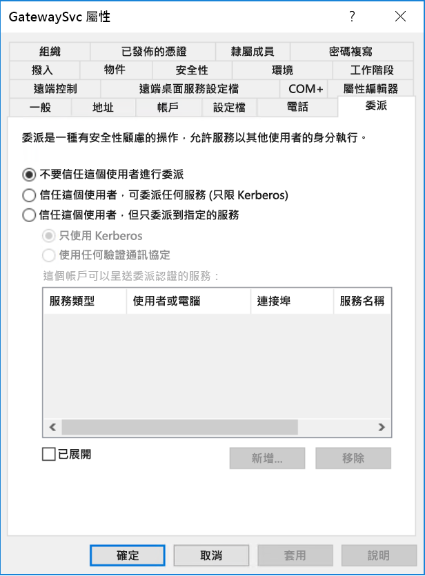
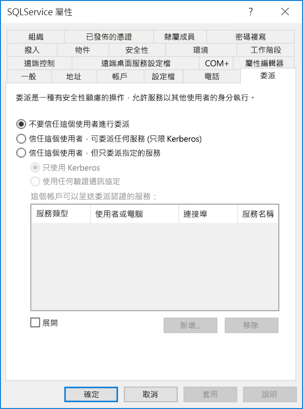
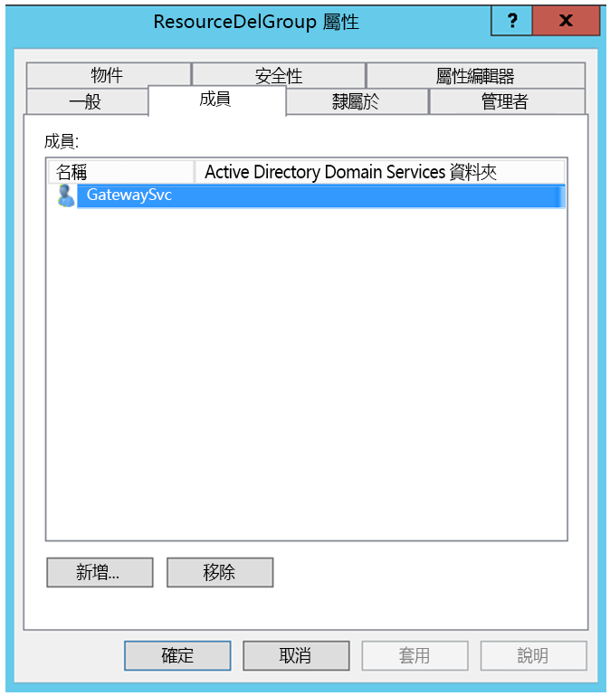
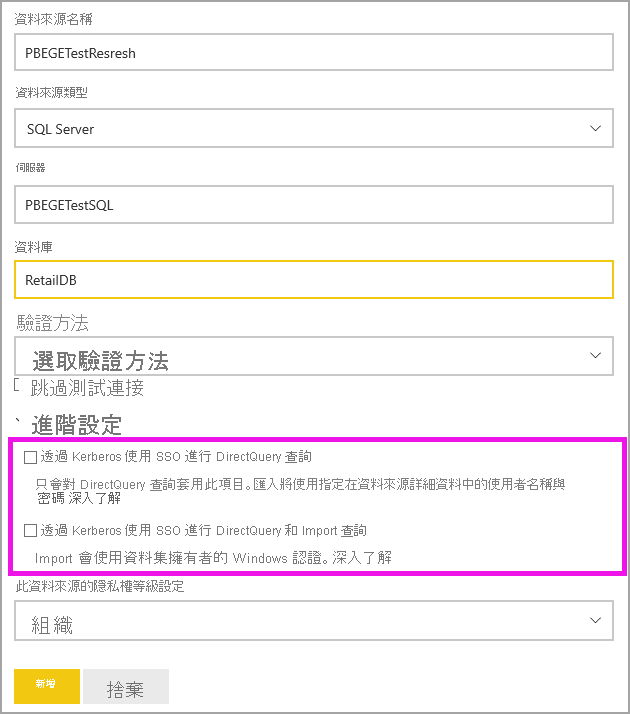

# <a name="configure-kerberos-based-sso-from-power-bi-service-to-on-premises-data-sources"></a>設定從 Power BI 服務到內部部署資料來源的 Kerberos 架構 SSO

啟用 SSO 可讓 Power BI 報表和儀表板輕鬆重新整理來自內部部署來源的資料，同時遵守在這些來源上設定的使用者層級權限。 使用 [Kerberos 限制委派](/windows-server/security/kerberos/kerberos-constrained-delegation-overview)來啟用無縫 SSO 連線。 

## <a name="prerequisites"></a>必要條件

必須設定數個項目，Kerberos 限制委派才能正常運作，包括服務帳戶上的「服務主體名稱 (SPN)」  和委派設定。

### <a name="install-and-configure-the-microsoft-on-premises-data-gateway"></a>安裝及設定 Microsoft 內部部署資料閘道

內部部署資料閘道支援就地升級，以及對現有閘道的「設定接管」  功能。

### <a name="run-the-gateway-windows-service-as-a-domain-account"></a>以網域帳戶身分執行閘道 Windows 服務

在標準安裝中，閘道是以電腦本機服務帳戶 **NT Service\PBIEgwService** 執行。


若要啟用 Kerberos 限制委派，閘道必須以網域帳戶執行，除非 Azure Active Directory (Azure AD) 已與本機 Active Directory 執行個體進行同步處理 (使用 Azure AD DirSync/Connect)。 若要切換為網域帳戶，請參閱[變更閘道服務帳戶](/data-integration/gateway/service-gateway-service-account)。

> [!NOTE]
> 若已設定 Azure AD Connect，且已同步使用者帳戶，則閘道服務並不需要在執行階段執行本機 Azure AD 查閱。 相反地，您可以直接使用本機服務 SID，讓閘道服務能完成 Azure AD 中所有必要設定。 本文概述的 Kerberos 限制委派設定步驟，與 Azure AD 內容中所需的設定步驟相同。 它們會套用至 Azure AD 中的閘道電腦物件 (以本機服務 SID 識別)，而不是網域帳戶。

## <a name="obtain-domain-admin-rights-to-configure-spns-setspn-and-kerberos-constrained-delegation-settings"></a>取得網域系統管理員權限以設定 SPN (SetSPN) 與 Kerberos 限制委派設定

若要設定 SPN 和 Kerberos 委派設定，則網域系統管理員應避免將權限授與沒有網域系統管理員權限的人員。 在下一節中，我們會更詳細地說明建議的設定步驟。

## <a name="configure-kerberos-constrained-delegation-for-the-gateway-and-data-source"></a>針對閘道和資料來源設定 Kerberos 限制委派

請視需要，以網域系統管理員身分設定閘道服務網域帳戶的 SPN，並在閘道服務網域帳戶上設定委派設定。

### <a name="configure-an-spn-for-the-gateway-service-account"></a>設定閘道服務帳戶的 SPN

首先，判斷 SPN 是否已針對作為閘道服務帳戶使用的網域帳戶建立：

1. 以網域系統管理員身分，啟動 [Active Directory 使用者和電腦]  Microsoft Management Console (MMC) 嵌入式管理單元。

2. 在左窗格中，以滑鼠右鍵按一下網域名稱、選取 [尋找]  ，然後輸入閘道服務帳戶的帳戶名稱。

3. 在搜尋結果中，以滑鼠右鍵按一下閘道服務帳戶，然後選取 [屬性]  。

4. 如果 [委派]  索引標籤顯示在 [屬性]  對話方塊中，則表示 SPN 已建立，可以跳至[決定要使用的 Kerberos 限制委派類型](#decide-on-the-type-of-kerberos-constrained-delegation-to-use)。

5. 如果 [屬性]  對話方塊中沒有任何 [委派]  索引標籤，則可在帳戶上手動建立 SPN 來加以啟用。 使用隨附於 Windows 的 [setspn 工具](https://technet.microsoft.com/library/cc731241.aspx)來完成 (您需要網域系統管理員權限才能建立 SPN)。

   例如，假設閘道服務帳戶是 **Contoso\GatewaySvc**，且閘道服務執行於名為 **MyGatewayMachine** 的電腦上。 若要為閘道服務帳戶設定 SPN，請執行下列命令：

   ```setspn -a gateway/MyGatewayMachine Contoso\GatewaySvc```

   也可以使用 [Active Directory 使用者和電腦]  MMC 嵌入式管理單元來設定 SPN。
   
### <a name="add-gateway-service-account-to-windows-authorization-and-access-group-if-required"></a>視需要將閘道服務帳戶新增至 Windows 授權和存取群組

在特定案例中，必須將閘道服務帳戶新增至 Windows 授權和存取群組。 這些案例包括 Active Directory 環境的安全性強化，以及當閘道服務帳戶與閘道將會模擬的使用者帳戶位於不同網域或樹系時。 在未強化網域 /樹系的情況下，您也可以將閘道服務帳戶新增至 Windows 授權和存取群組，但這不是必要的。

如需詳細資訊，請參閱 [Windows 授權和存取群組](/windows/security/identity-protection/access-control/active-directory-security-groups#bkmk-winauthaccess)。

若要完成此設定步驟，請針對每個網域 (包含您要讓閘道服務帳戶能夠模擬的 Active Directory 使用者)，執行下列步驟：
1. 登入網域中的電腦，然後啟動 [Active Directory 使用者及電腦] MMC 嵌入式管理單元。
2. 找出 [Windows 授權和存取群組]  群組，通常是在 [內建]  容器中。
3. 按兩下該群組，然後按一下 [成員]  索引標籤。
4. 按一下 [新增]  ，然後將網域位置變更為閘道服務帳戶所在的網域。
5. 輸入閘道服務帳戶名稱，然後按一下 [檢查名稱]  ，以確認閘道服務帳戶可供存取。
6. 按一下 [確定]  。
7. 按一下 [套用]  。
8. 重新啟動閘道服務。

### <a name="decide-on-the-type-of-kerberos-constrained-delegation-to-use"></a>決定要使用的 Kerberos 限制委派類型

您可以針對標準 Kerberos 限制委派或以資源為基礎的 Kerberos 限制委派來設定委派設定。 如果資料來源屬於與閘道不同的網域，請使用以資源為基礎的委派 (需要 Windows Server 2012 或更新版本)。 如需這兩個委派方法之間差異的詳細資訊，請參閱 [Kerberos 限制委派概觀](/windows-server/security/kerberos/kerberos-constrained-delegation-overview)。

 視您想要使用的方法而定，繼續進行下列其中一節。 請勿兩節都完成：
 - [設定閘道服務帳戶進行標準的 Kerberos 限制委派](#configure-the-gateway-service-account-for-standard-kerberos-constrained-delegation)
- [以資源為基礎的 Kerberos 限制委派](#configure-the-gateway-service-account-for-resource-based-kerberos-constrained-delegation)。 

## <a name="configure-the-gateway-service-account-for-standard-kerberos-constrained-delegation"></a>設定閘道服務帳戶進行標準的 Kerberos 限制委派

> [!NOTE]
> 如果想要啟用[標準的 Kerberos 限制委派](/windows-server/security/kerberos/kerberos-constrained-delegation-overview)，請完成本節中的步驟。 不然的話，如果想要啟用以資源為基礎的 Kerberos 限制委派，請完成[設定閘道服務帳戶進行以資源為基礎的 Kerberos 限制委派](#configure-the-gateway-service-account-for-resource-based-kerberos-constrained-delegation)中步驟。

現在，我們將設定閘道服務帳戶的委派設定。 您可以使用多個工具來執行這些步驟。 在這裡，我們將使用 [Active Directory 使用者和電腦]  MMC 嵌入式管理單元來管理及發佈目錄中的資訊。 預設會在網域控制站上提供，但在其他電腦上，也可以透過 [Windows 功能] 設定來加以啟用。

我們必須使用通訊協定傳輸來設定 Kerberos 限制委派。 使用限制委派，您必須明確指出要允許閘道向其呈現委派認證的服務。 例如，只有 SQL Server 或您的 SAP HANA 伺服器會接受來自閘道服務帳戶的委派呼叫。

本節假設您已經為基礎資料來源 (例如，SQL Server、SAP HANA、SAP BW、Teradata 或 Spark) 設定 SPN。 若要了解如何設定這些資料來源伺服器 SPN，請參閱個別資料庫伺服器的技術文件，並參閱 [My Kerberos Checklist](https://techcommunity.microsoft.com/t5/SQL-Server-Support/My-Kerberos-Checklist-8230/ba-p/316160) (我的 Kerberos 檢查清單) 部落格文章的 *What SPN does your app require?* (應用程式需要什麼 SPN？) 一節。

在下列步驟中，我們假設內部部署環境具有位於相同網域的兩部電腦：閘道電腦和執行 SQL Server 且已針對 Kerberos 架構 SSO 設定的資料庫伺服器。 只要已針對 Kerberos 架構單一登入設定資料來源，就可以針對其中一個支援的其他資料來源採用這些步驟。 針對此範例，我們將使用下列設定：

* Active Directory 網域 (Netbios)：**Contoso**
* 閘道電腦名稱：**MyGatewayMachine**
* 閘道服務帳戶：**Contoso\GatewaySvc**
* SQL Server 資料來源電腦名稱：**TestSQLServer**
* SQL Server 資料來源服務帳戶：**Contoso\SQLService**

以下是設定委派設定的方式：

1. 使用網域系統管理員權限，開啟 [Active Directory 使用者及電腦]  MMC 嵌入式管理單元。

2. 以滑鼠右鍵按一下閘道服務帳戶 (**Contoso\GatewaySvc**)，然後選取 [屬性]  。

3. 選取 [委派]  索引標籤。

4. 選取 [Trust this computer for delegation to specified services only] \(信任這部電腦，但只委派指定的服務\)   > [Use any authentication protocol] \(使用任何驗證通訊協定\)  。

5. 在 [Services to which this account can present delegated credentials] \(這個帳戶可以呈送委派認證的服務\)  下方，選取 [新增]  。

6. 在新的對話方塊中，選取 [使用者或電腦]  。

7. 輸入資料來源的服務帳戶，然後選取 [確定]  。

   例如，SQL Server 資料來源可以有類似 *Contoso\SQLService* 的服務帳戶。 此帳戶應該已經設定適當的資料來源 SPN。 

8. 選取您為資料庫伺服器建立的 SPN。 

   在我們的範例中，SPN 會以 *MSSQLSvc* 開頭。 如果您為資料庫服務新增了 FQDN 與 NetBIOS SPN，請同時選取兩者。 您可能只會看到一個。

9. 選取 [確定]  。 

   您現在應該會在閘道服務帳戶可以顯示委派認證的服務清單中看到 SPN。

    ![[閘道連接器屬性] 對話方塊](media/service-gateway-sso-kerberos/gateway-connector-properties.png)

10. 若要繼續設定處理程序，請前往[在閘道電腦上授與閘道服務帳戶本機原則權限](#grant-the-gateway-service-account-local-policy-rights-on-the-gateway-machine)。

## <a name="configure-the-gateway-service-account-for-resource-based-kerberos-constrained-delegation"></a>設定閘道服務帳戶進行以資源為基礎的 Kerberos 限制委派

> [!NOTE]
> 如果您想要啟用[以資源為基礎的 Kerberos 限制委派](/windows-server/security/kerberos/kerberos-constrained-delegation-overview#resource-based-constrained-delegation-across-domains)，請完成本節中的步驟。 不然的話，如果想要啟用標準的 Kerberos 限制委派，請完成[設定閘道服務帳戶進行標準的 Kerberos 限制委派](#configure-the-gateway-service-account-for-standard-kerberos-constrained-delegation)中步驟。

使用[以資源為基礎的 Kerberos 限制委派](/windows-server/security/kerberos/kerberos-constrained-delegation-overview#resource-based-constrained-delegation-across-domains)來針對 Windows Server 2012 和更新版本提供單一登入連線能力。 此類型的委派允許前端和後端服務位於不同網域中。 若要達成此目的，後端服務網域必須信任前端服務網域。

在下列步驟中，我們假設內部部署環境具有位於不同網域的兩部電腦：閘道電腦和執行 SQL Server 且已針對 Kerberos 架構 SSO 設定的資料庫伺服器。 只要已針對 Kerberos 架構單一登入設定資料來源，就可以針對其中一個支援的其他資料來源採用這些步驟。 針對此範例，我們將使用下列設定：

* Active Directory 前端網域 (Netbios)：**ContosoFrontEnd**
* Active Directory 後端網域 (Netbios)：**ContosoBackEnd**
* 閘道電腦名稱：**MyGatewayMachine**
* 閘道服務帳戶：**ContosoFrontEnd\GatewaySvc**
* SQL Server 資料來源電腦名稱：**TestSQLServer**
* SQL Server 資料來源服務帳戶：**ContosoBackEnd\SQLService**

完成下列設定步驟：

1. 在 **ContosoFrontEnd** 網域的網域控制站上，使用 [Active Directory 使用者和電腦]  MMC 嵌入式管理單元，並驗證沒有對閘道服務帳戶套用任何委派設定。

    

2. 在 **ContosoBackEnd** 網域的網域控制站上，使用 [Active Directory 使用者和電腦]  ，並驗證沒有對後端服務帳戶套用任何委派設定。

    

3. 在帳戶屬性的 [屬性編輯器]  索引標籤中，驗證未設定 **mdDS-AllowedToActOnBehalfOfOtherIdentity** 屬性。

    

4. 在 [Active Directory 使用者和電腦]  中，於 **ContosoBackEnd** 網域的網域控制站上建立群組。 將 **GatewaySvc** 閘道服務帳戶新增至 **ResourceDelGroup** 群組。 

    

5. 開啟命令提示字元，並在 **ContosoBackEnd** 網域的網域控制站中執行下列命令，以更新後端服務帳戶的 **msDS-AllowedToActOnBehalfOfOtherIdentity** 屬性：

    ```powershell
    $c = Get-ADGroup ResourceDelGroup
    Set-ADUser SQLService -PrincipalsAllowedToDelegateToAccount $c
    ```

6. 在 [Active Directory 使用者和電腦]  中，驗證更新已反映在後端服務帳戶屬性的 [屬性編輯器]  索引標籤中。 

## <a name="grant-the-gateway-service-account-local-policy-rights-on-the-gateway-machine"></a>在閘道電腦上授與閘道服務帳戶本機原則權限

最後，在執行閘道服務的電腦上 (在我們的範例中是 **MyGatewayMachine**)，將本機原則 [在驗證後模擬用戶端]  和 [當成作業系統的一部分 (SeTcbPrivilege)]  授與閘道服務帳戶。 使用本機群組原則編輯器 (**gpedit.msc**) 來執行此設定。

1. 在閘道電腦上，執行 **gpedit.msc**。

2. 請前往 [本機電腦原則]  &gt; [電腦設定]  &gt; [Windows 設定]  &gt; [安全性設定]  &gt; [本機原則]  &gt; [使用者權限指派]  。

    ![[本機電腦原則] 資料夾結構](media/service-gateway-sso-kerberos/user-rights-assignment.png)

3. 從 [使用者權限指派]  底下的原則清單中，選取 [Impersonate a client after authentication] \(在驗證後模擬用戶端\)  。

    
    
4. 以滑鼠右鍵按一下原則，開啟 [屬性]  ，然後檢視帳戶清單。 

    清單必須包含閘道服務帳戶 (**Contoso\GatewaySvc** 或 **ContosoFrontEnd\GatewaySvc**，視限制委派的類型而定)。

5. 在 [使用者權限指派]  底下，從原則清單中，選取 [當成作業系統的一部分 (SeTcbPrivilege)]  。 請確定閘道服務帳戶包含在帳戶清單中。

6. 重新啟動**內部部署資料閘道**服務處理程序。

### <a name="set-user-mapping-configuration-parameters-on-the-gateway-machine-if-necessary"></a>視需要在閘道電腦上設定使用者對應設定參數

如果您沒有設定 Azure AD Connect，請遵循下列步驟，將 Power BI 服務使用者對應至本機 Azure AD 使用者。 以這種方式對應的每個 Active Directory 使用者，都必須具有資料來源的 SSO 權限。 如需詳細資訊，請觀看 [Guy in a Cube 影片](https://www.youtube.com/watch?v=NG05PG9aiRw)。

1. 開啟主要閘道設定檔，Microsoft.PowerBI.DataMovement.Pipeline.GatewayCore.dll。 根據預設，這個檔案儲存於 C:\Program Files\On-premises data gateway。

1. 將 **ADUserNameLookupProperty** 設定為未使用的 Active Directory 屬性。 我們將在接下來的步驟中使用 `msDS-cloudExtensionAttribute1`。 這個屬性僅適用於 Windows Server 2012 和更新版本。 

1. 將 **ADUserNameReplacementProperty** 設定為 `SAMAccountName`，然後儲存設定檔。

1. 從 [工作管理員] 的 [服務]  索引標籤中，以滑鼠右鍵按一下該閘道服務，然後選取 [重新啟動]  。

    ![[工作管理員] 之 [服務] 索引標籤的螢幕擷取畫面](media/service-gateway-sso-kerberos/restart-gateway.png)

1. 針對您想要為其啟用 Kerberos SSO 的每個 Power BI 服務使用者，將本機 Active Directory 使用者 (具有資料來源 SSO 權限) 的 `msDS-cloudExtensionAttribute1` 屬性設定為 Power BI 服務使用者完整使用者名稱 (UPN)。 例如，若您以 test@contoso.com 的身分登入 Power BI 服務，且想要將此使用者對應至具有 SSO 權限的本機 Active Directory 使用者 (例如 test@LOCALDOMAIN.COM)，請將這個使用者的 `msDS-cloudExtensionAttribute1` 屬性設定為 test@contoso.com。

    您可以使用 [Active Directory 使用者和電腦] MMC 嵌入式管理單元來設定 `msDS-cloudExtensionAttribute1` 屬性：
    
    1. 以網域系統管理員身分啟動 **Active Directory 使用者和電腦**。
    
    1. 以滑鼠右鍵按一下網域名稱、選取 [尋找]  ，然後輸入要對應的本機 Active Directory 使用者帳戶名稱。
    
    1. 選取 [屬性編輯器]  索引標籤。
    
        找出 `msDS-cloudExtensionAttribute1` 屬性，然後按兩下該屬性。 將值設定為用來登入 Power BI 服務的使用者完整使用者名稱 (UPN)。
    
    1. 選取 [確定]  。
    
        ![[字串屬性編輯器] 視窗](media/service-gateway-sso-kerberos/edit-attribute.png)
    
    1. 選取 [ **套用**]。 確認已在 [值]  資料行中設定正確的值。

## <a name="complete-data-source-specific-configuration-steps"></a>完成資料來源特定的設定步驟

SAP HANA 和 SAP BW 有您需要先符合的額外資料來源特定設定需求和必要條件，才能透過閘道建立這些資料來源的 SSO 連線。 如需詳細資訊，請參閱 [SAP HANA 設定](service-gateway-sso-kerberos-sap-hana.md)和 [SAP BW - CommonCryptoLib (sapcrypto.dll) 設定頁面](service-gateway-sso-kerberos-sap-bw-commoncryptolib.md)。 雖然可以[設定 SAP BW 與 gx64krb5 SNC 程式庫搭配使用](service-gateway-sso-kerberos-sap-bw-gx64krb.md)，但不建議使用此程式庫，因為 SAP 已不再支援該程式庫。 您應該使用 CommonCryptoLib 或  gx64krb5 作為 SNC 程式庫。 請勿同時完成這兩個程式庫的設定步驟。

> [!NOTE]
> 雖然其他 SNC 程式庫也可能適用於 BW SSO，但 Microsoft 並未正式支援這些程式庫。

## <a name="run-a-power-bi-report"></a>執行 Power BI 報表

完成所有設定步驟之後，請在 Power BI 中使用 [管理閘道]  頁面來設定您將用於 SSO 的資料來源。 如果您有多個閘道，請務必選取為 Kerberos SSO 設定的閘道。 然後，在資料來源的 [進階設定]  中，確認已為以 DirectQuery 為基礎的報表選取 [透過 Kerberos 使用 SSO 進行 DirectQuery 查詢]  或 [透過 Kerberos 使用 SSO 進行 DirectQuery 和匯入查詢]  ；且已為以重新整理為基礎的報表設定 [透過 Kerberos 使用 SSO 進行 DirectQuery 和匯入查詢]  。



如果您從 Power BI Desktop 發佈以 DirectQuery 為基礎的報表，並將其對應至已選取 [透過 Kerberos 使用 SSO 進行 DirectQuery 查詢]  或 [透過 Kerberos 使用 SSO 進行 DirectQuery 和匯入查詢]  的資料來源，則此報表會使用對應至登入 Power BI 服務的 (Azure) Active Directory 使用者可存取的資料。

同樣地，如果您從 Power BI Desktop 發佈以重新整理為基礎的報表，並將其對應至已選取 [透過 Kerberos 使用 SSO 進行 DirectQuery 和匯入查詢]  的資料來源，則不需要提供任何認證。 重新整理會在資料集擁有者的 Active Directory 內容底下執行。

不過，如果您將其對應至未選取 [透過 Kerberos 使用 SSO 進行 DirectQuery 和匯入查詢]  的資料來源，則重新整理會在建立該資料來源時，使用您在 [使用者名稱]  與 [密碼]  欄位中所輸入的認證。 換句話說，*不會*使用 Kerberos SSO。 

 在發佈時，如果您有多個閘道，請選取為 SSO 設定的閘道。 

此設定在大部分情況下都能運作。 不過，使用 Kerberos 會有不同的設定，根據您的環境而異。 如果無法載入報表，請連絡網域系統管理員，以便進一步調查。 如果您的資料來源是 SAP BW，請視選擇的 SNC 程式庫而定，參閱適用於 [CommonCryptoLib](service-gateway-sso-kerberos-sap-bw-commoncryptolib.md#troubleshooting) 和 [gx64krb5/gsskrb5](service-gateway-sso-kerberos-sap-bw-gx64krb.md#troubleshooting) 資料來源特定設定頁面的疑難排解章節。

## <a name="next-steps"></a>後續步驟

如需內部部署資料閘道和 DirectQuery 的詳細資訊，請參閱下列資源：

* [什麼是內部部署的資料閘道？](/data-integration/gateway/service-gateway-onprem)
* [Power BI 中的 DirectQuery](desktop-directquery-about.md)
* [DirectQuery 支援的資料來源](power-bi-data-sources.md)
* [DirectQuery 和 SAP BW](desktop-directquery-sap-bw.md)
* [DirectQuery 和 SAP HANA](desktop-directquery-sap-hana.md)
