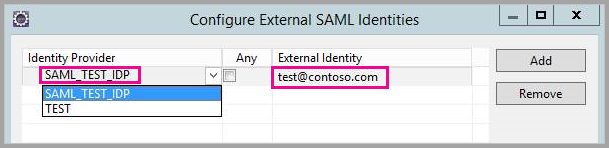
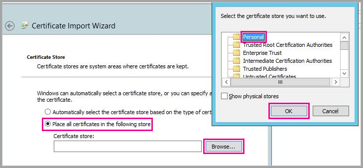
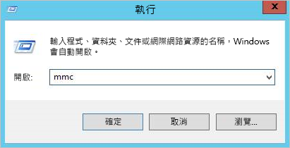
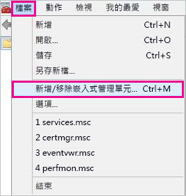
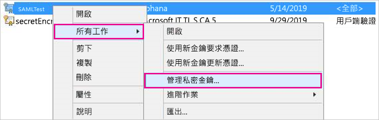
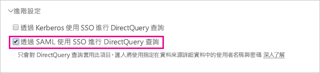

# <a name="use-security-assertion-markup-language-saml-for-sso-from-power-bi-to-on-premises-data-sources"></a>針對從 Power BI 到內部部署資料來源的 SSO，使用安全性聲明標記語言 (SAML)

啟用 SSO 可讓 Power BI 報表和儀表板輕鬆重新整理來自內部部署來源的資料，同時遵守在這些來源上設定的使用者層級權限。 使用[安全性聲明標記語言 (SAML)](https://www.onelogin.com/pages/saml) 啟用無縫單一登入連線。 

## <a name="supported-data-sources"></a>支援的資料來源

我們目前支援使用 SAML 的 SAP HANA。 如需使用 SAML 來安裝和設定 SAP HANA 單一登入的詳細資訊，請參閱[從 BI 平台到 HANA 的 SAML SSO](https://blogs.sap.com/2020/03/22/sap-bi-platform-saml-sso-to-hana-database/)。

我們使用 [Kerberos](service-gateway-sso-kerberos.md) 支援其他資料來源 (包含 SAP HANA)。

針對 SAP HANA，建議您先啟用加密再建立 SAML SSO 連線。 若要啟用加密，請將 HANA 伺服器設定為接受加密連線，並將閘道設定為使用加密來與您的 HANA 伺服器進行通訊。 因為 HANA ODBC 驅動程式預設不會加密 SAML 判斷提示，所以已簽署之 SAML 判斷提示會從閘道傳送到「沒有問題」  的 HANA 伺服器，且很容易被第三方攔截並重複使用。

> [!IMPORTANT]
> 由於 [SAP 已不再支援 OpenSSL](https://help.sap.com/viewer/b3ee5778bc2e4a089d3299b82ec762a7/2.0.05/en-US/de15ffb1bb5710148386ffdfd857482a.html)，因此 Microsoft 也已停止其支援。 現有的連線將會繼續運作，但從 2021 年 2 月開始，您將無法建立新的連線。 往後，請改為使用 CommonCryptoLib。

## <a name="configuring-the-gateway-and-data-source"></a>設定閘道和資料來源

若要使用 SAML，您必須在要啟用 SSO 的 HANA 伺服器與閘道之間建立信任關係。 在本案例中，閘道可作為 SAML 識別提供者 (IdP)。 建立此關聯性的方法有很多種。 SAP 建議使用 SAP 密碼編譯程式庫 (也稱為 CommonCryptoLib 或 sapcrypto) 來完成建立信任關係的設定步驟。 如需詳細資訊，請參閱官方的 SAP 文件。

下列步驟描述如何使用 HANA 伺服器所信任根 CA 來簽署閘道 IdP 的 X509 憑證，以建立 HANA 伺服器與閘道 IdP 之間的信任關係。 

### <a name="create-the-certificates"></a>建立憑證

採取下列步驟來建立憑證：

1. 在執行 SAP HANA 的裝置上，建立空的資料夾來儲存憑證，然後巡覽至該資料夾。
2. 執行下列命令來建立根憑證：

   ```
   openssl req -new -x509 -newkey rsa:2048 -days 3650 -sha256 -keyout CA_Key.pem -out CA_Cert.pem -extensions v3_ca'''
   ```

    您必須記住複雜密碼，才能使用此憑證來簽署其他憑證。
    您應該會看到所要建立的 *CA_Cert.pem* 和 *CA_Key.pem*。

   
3. 執行下列命令來建立 IdP 憑證：
 
    ```
    openssl req -newkey rsa:2048 -days 365 -sha256 -keyout IdP_Key.pem -out IdP_Req.pem -nodes
    ```
    您應該會看到所要建立的 *IdP_Key.pem* 和 *IdP_Req.pem*。

4. 使用根憑證簽署 IdP 憑證：

    ```
    openssl x509 -req -days 365 -in IdP_Req.pem -sha256 -extensions usr_cert -CA CA_Cert.pem -CAkey CA_Key.pem -CAcreateserial -out IdP_Cert.pem
    ```
    您應該會看到所要建立的 *CA_Cert.srl* 和 *IdP_Cert.pem*。
    我們只關心 *IdP_Cert.pem*。    

### <a name="create-saml-identity-provider-certificate-mapping"></a>建立 SAML 識別提供者憑證對應

使用下列步驟，建立 SAML 身分識別提供者憑證對應。

1. 在 **SAP HANA Studio** 中，以滑鼠右鍵按一下 SAP HANA 伺服器名稱，然後巡覽至 [安全性] > [開啟安全性主控台] > [SAML 識別提供者] 。
2. 如果未選取 [SAP 密碼編譯程式庫]，請加以選取。 請「勿」使用 OpenSSL 密碼編譯程式庫 (下圖中的左側選項)，SAP 已淘汰該選項。

    

3. 按一下藍色的匯入按鈕 (如下圖所示)，以匯入已簽署的憑證 *IdP_Cert.pem*。

    

請記得將名稱指派給「識別提供者名稱」。

### <a name="import-and-create-the-signed-certificates-in-hana"></a>在 HANA 中匯入並建立已簽署的憑證

接下來，您將在 HANA 中匯入並建立已簽署的憑證。 請遵循下列步驟：

1. 在 **HANA Studio** 中，執行下列查詢：

    ```
    CREATE CERTIFICATE FROM '<idp_cert_pem_certificate_content>'
    ```
    
    以下為範例：

    ```
    CREATE CERTIFICATE FROM
    '-----BEGIN CERTIFICATE-----
    MIIDyDCCArCgA...veryLongString...0WkC5deeawTyMje6
    -----END CERTIFICATE-----
    '
    ```

2. 如果沒有搭配 SAML 目的的 PSE，請在 **HANA Studio** 中執行下列查詢來建立一個：
    
    ```
    CREATE PSE SAMLCOLLECTION;<br>set pse SAMLCOLLECTION purpose SAML;<br>
    ```

3. 使用下列命令，將新建立的已簽署憑證新增至 PSE：

    ```
    alter pse SAMLCOLLECTION add CERTIFICATE <certificate_id>;
    ```

    例如：
    ```
    alter pse SAMLCOLLECTION add CERTIFICATE 1978320;
    ```

    您可使用下列查詢來檢查所建立的憑證清單：
    ```
    select * from PUBLIC"."CERTIFICATES"
    ```

    憑證現在已正確安裝。 您可執行下列查詢來確認：
    ```
    select * from "PUBLIC"."PSE_CERTIFICATES"
    ```

### <a name="map-the-user"></a>對應使用者

遵循下列步驟來對應使用者：

1. 在 **SAP HANA Studio** 中，選取 [安全性] 資料夾：

    ![選取 [安全性] 資料夾](media/service-gateway-sso-saml/service-gateway-sso-saml-03.png)

2. 展開 [使用者]，然後選取要對應 Power BI 使用者的目標使用者。

3. 選取 [SAML] 核取方塊，然後選取 [設定]，如下圖中醒目提示。

    ![選取 [SAML]，然後選取 [設定] 連結](media/service-gateway-sso-saml/service-gateway-sso-saml-04.png)

4. 選取在本文稍早的[建立 SAML 識別提供者憑證對應](#create-saml-identity-provider-certificate-mapping)一節中所建立識別提供者。 針對 [外部身分識別]，輸入 Power BI 使用者的 UPN (通常是使用者用來登入 Power BI 的電子郵件地址)，然後選取 [新增]。  下圖顯示這些選項和選取項目。

    

    若您設定閘道使用 *ADUserNameReplacementProperty* 設定選項，則請輸入將取代 Power BI 使用者原始 UPN 的值。 例如，若將 *ADUserNameReplacementProperty* 設為 *SAMAccountName*，則請輸入使用者的 *SAMAccountName*。

### <a name="configure-the-gateway"></a>設定閘道

現在您已設定閘道的憑證和身分識別，接下來即可透過下列步驟，將憑證轉換為 pfx 格式，並將閘道設定為使用憑證。

1. 請執行下列命令來將憑證轉換成 pfx 格式。 此命令會將產生的 .pfx 檔案命名為 samlcert.pfx，並設定 *root* 為其密碼：

    ```
    openssl pkcs12 -export -out samltest.pfx -in IdP_Cert.pem -inkey IdP_Key.pem -passin pass:root -passout pass:root
    ```

2. 將 pfx 檔案複製到閘道電腦：

    1. 按兩下 *samltest.pfx*，然後選取 [本機電腦] > [下一步]。

    2. 輸入密碼，然後選取 [下一步]。

    3. 選取 [將所有憑證放在下列存放區]，然後選取 [瀏覽] >  [個人] >  [確定]。

    4. 選取 [下一步]，然後選取 [完成]。

       

3. 使用下列步驟，將閘道服務帳戶存取權授與該憑證的私密金鑰：

    1. 在閘道電腦上執行 Microsoft Management Console (MMC)。

        

    2. 在 [檔案] 下方選取 [新增/移除嵌入式管理單元]。

        

    3. 選取 [憑證] > [新增]，然後選取 [電腦帳戶] > [下一步]。

    4. 選取 [本機電腦] > [完成] > [確定]。

    5. 依序展開 [憑證] > [個人] > [憑證]，並尋找憑證。

    6. 以滑鼠右鍵按一下憑證，並巡覽至 [所有工作]**[管理私用金鑰]** &gt; 。

        

    1. 將閘道服務帳戶新增至清單。 根據預設，此帳戶是 **NT SERVICE\PBIEgwService**。 您可以藉由執行  並尋找 **內部部署資料閘道服務**，來了解哪個帳戶正在執行閘道服務。

        

最後，請遵循下列步驟將憑證指紋新增至閘道設定：

1. 執行下列 PowerShell 命令來列出您電腦上的憑證：

    ```powershell
    Get-ChildItem -path cert:\LocalMachine\My
    ```

2. 複製您所建立憑證的指紋。

3. 巡覽至閘道目錄，其預設為 *C:\Program Files\On-premises data gateway*。

4. 開啟 *PowerBI.DataMovement.Pipeline.GatewayCore.dll.config*，並尋找 *SapHanaSAMLCertThumbprint* 區段。 貼上您複製的指紋。

5. 重新啟動閘道服務。

## <a name="running-a-power-bi-report"></a>執行 Power BI 報表

現在您可以使用 Power BI 中的 [管理閘道] 頁面來設定 SAP HANA 資料來源。 在 [進階設定] 下方，透過 SAML 啟用 SSO。 這麼做可讓您發佈繫結至該資料來源的報表和資料集。

   

## <a name="troubleshooting"></a>疑難排解

在您設定 SAML 式 SSO 之後，您可能會在 Power BI 入口網站中看到下列錯誤：提供的認證無法用於 SapHana 來源。 此錯誤表示 SAP Hana 拒絕了該 SAML 認證。

伺服器端驗證會追蹤提供的詳細資訊，以針對 SAP HANA 上的認證問題進行疑難排解。 請遵循以下步驟來為 SAP HANA 伺服器設定追蹤：

1. 在 SAP HANA 伺服器上，透過執行下列查詢來開啟驗證追蹤：

    ```
    ALTER SYSTEM ALTER CONFIGURATION ('indexserver.ini', 'SYSTEM') set ('trace', 'authentication') = 'debug' with reconfigure 
    ```

1. 重現問題。

1. 在 HANA Studio 中，開啟管理主控台並選取 [診斷檔案] 索引標籤。

1. 開啟最近的索引伺服器追蹤，然後搜尋 *SAMLAuthenticator.cpp*。

    您應該會看到指出根本原因的詳細錯誤訊息，例如：

    ```
    [3957]{-1}[-1/-1] 2018-09-11 21:40:23.815797 d Authentication   SAMLAuthenticator.cpp(00091) : Element '{urn:oasis:names:tc:SAML:2.0:assertion}Assertion', attribute 'ID': '123123123123123' is not a valid value of the atomic type 'xs:ID'.
    [3957]{-1}[-1/-1] 2018-09-11 21:40:23.815914 i Authentication   SAMLAuthenticator.cpp(00403) : No valid SAML Assertion or SAML Protocol detected
    ```

1. 完成疑難排解之後，透過執行下列查詢來關閉驗證追蹤：

    ```
    ALTER SYSTEM ALTER CONFIGURATION ('indexserver.ini', 'SYSTEM') UNSET ('trace', 'authentication');
    ```

## <a name="next-steps"></a>後續步驟

如需內部部署資料閘道和 DirectQuery 的詳細資訊，請參閱下列資源：

* [什麼是內部部署的資料閘道？](/data-integration/gateway/service-gateway-onprem)
* [Power BI 中的 DirectQuery](desktop-directquery-about.md)
* [DirectQuery 支援的資料來源](power-bi-data-sources.md)
* [DirectQuery 和 SAP BW](desktop-directquery-sap-bw.md)
* [DirectQuery 和 SAP HANA](desktop-directquery-sap-hana.md)
