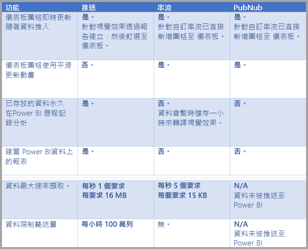

# Power BI 中的即時串流
搭配即時串流的 Power BI 可讓您即時串流資料及更新儀表板。 在 Power BI 中建立的任何視覺效果或儀表板，都能顯示及更新即時資料和視覺效果。 串流資料的裝置與來源可以是工廠感應器、社交媒體來源、服務使用計量，或任何其他時效性資料收集器或傳送器。

![[環境感應器] 儀表板的螢幕擷取畫面，即時顯示資料的結果。](media/service-real-time-streaming/real-time-streaming-10.png)

本文將說明如何在 Power BI 設定即時串流資料集。 首先，請務必了解設計用來顯示於圖格 (與儀表板) 中的即時資料集類型，以及那些資料集之間的差異。

## 即時資料集的類型
有三種即時資料集是專為在即時儀表板上顯示而設計的︰

* 推送資料集
* 串流資料集
* PubNub 串流資料集

首先，讓我們先了解這些資料集彼此有何不同 (本節)，然後我們會討論如何將資料推送到這些資料集中的各個資料集。

### 推送資料集
使用 **推送資料集** ，資料會推送到 Power BI 服務。 建立資料集時，Power BI 服務會自動在服務中建立新的資料庫來儲存資料。 因為具有在資料進入時持續儲存資料的基礎資料庫，所以可以使用資料來建立報表。 這些報表與其視覺效果就跟任何其他報表視覺效果一樣，這表示您可以使用所有 Power BI 報表建立功能來建立視覺效果，包括 Power BI 視覺效果、資料警示、釘選儀表板磚等。

使用推送資料集建立報表之後，其任何視覺效果都可以釘選到儀表板。 在該儀表板上，視覺效果一律會在資料更新時即時更新。 在服務中，每次收到新的資料，儀表板便會觸發磚重新整理。

關於推送資料集的釘選磚有兩項值得注意的考量︰

* 使用 [動態釘選頁面] 選項來釘選整個報表，將「不會」成自動更新資料。
* 視覺效果釘選到儀表板之後，您可以使用 **問與答** ，以自然語言提問推送資料集問題。 進行 **問與答** 查詢之後，您可以將結果產生的視覺效果釘選回儀表板，該儀表板「也會」即時更新。

### 串流資料集
使用 **串流資料集** 時，資料也會被發送到 Power BI 服務，不過有一個重要的差異：Power BI 只會將資料儲存到暫時快取，且該快取很快就會到期。 暫存快取只用來顯示具有短暫歷史感的視覺效果，例如具有一小時時間範圍的折線圖。

使用 **串流資料集** 時，「沒有」基礎資料庫，因此您「無法」使用從資料流流入的資料來建置報表視覺效果。 因此，您不能使用報表功能，例如篩選、Power BI 視覺效果和其他報表功能。

視覺化串流資料集的唯一方法是新增一個圖格，並使用串流資料集作為 **自訂串流資料** 來源。 以 **串流資料集** 為基礎的自訂串流磚最適合用於快速顯示即時資料。 將資料推送到 Power BI 服務與更新視覺效果兩者之間的延遲很短，因為資料不需要進入資料庫或從資料庫讀取。

實際上，串流資料集和其隨附的串流視覺效果最適合使用的情況為，必須在推送與視覺化資料時將兩者之間的延遲降到最低。 此外，最佳做法是讓資料以可以依現狀視覺化的格式推送，而不需要任何額外的彙總。 依現狀即已就緒的資料範例包括溫度，以及預先計算出的平均值。

### PubNub 串流資料集
使用 **PubNub** 串流資料集，Power BI Web 用戶端會使用 PubNub SDK 讀取現有的 PubNub 資料流。 Power BI 服務不會儲存任何資料。 因為此呼叫是直接從 Web 用戶端進行的，所以如果只允許來自網路且經過核准的輸出流量，則必須將流向 PubNub 的流量列為允許。 請參閱支援文章中[核准 PubNub 輸出流量](https://support.pubnub.com/support/solutions/articles/14000043522-can-i-whitelist-ips-for-pubnub-traffic-)的相關說明。

如同 **串流資料集** ， **PubNub 串流資料集** 在 Power BI 沒有基礎資料庫，因此無法對流入的資料建立報表視覺效果，且無法利用報表功能，例如篩選、Power BI 視覺效果等。 這麼一來， **PubNub 串流資料集** 也只能藉由新增磚至儀表板，並設定 PubNub 資料流作為來源的方式來進行視覺化。

以 **PubNub 串流資料集** 為基礎的磚最適合用於快速顯示即時資料。 因為 Power BI 直接連線至 PubNub 資料流，所以將資料推送到 Power BI 服務，與更新視覺效果兩者之間的延遲很短。

### 串流資料集矩陣
下列資料表 (或矩陣，如果您喜歡的話) 描述三種類型的即時串流資料集，並列出每一種的功能和限制。

> [!NOTE]
> 請參閱 [本文](../developer/automation/api-rest-api-limitations.md)，以取得可以推入多少資料的 **推送** 限制相關資訊。

## 將資料推送到資料集
上一節描述您可以用於即時串流的三種主要即時資料集類型，以及它們的差異。 本節說明如何建立及推送資料到這些資料集。

有三種主要方式可將資料推送至資料集︰

* 使用 Power BI REST API
* 使用串流資料集 UI
* 使用 Azure 串流分析

接著讓我們依序看看每一種方法。

### 使用 Power BI REST API 推送資料
**Power BI REST API** 可用來建立及傳送資料到 **推送** 資料集和 **串流** 資料集。 當您使用 Power BI REST API 建立資料集時，<預設模式> 旗標會指定資料集是推送還是或串流。 如果未設定 <預設模式> 旗標，資料集預設為 **推送** 資料集。

如果 <預設模式> 值設為 *pushStreaming* ，則資料集同時為 **推送** 「和」 **串流** 資料集，其提供兩種資料集類型的優點。 

> [!NOTE]
> 使用資料集並將 <預設模式> 旗標設為 pushStreaming 時，如果要求超過 **串流** 資料集 15 KB 的大小限制，但小於 **推送** 資料集 16 MB 的大小限制，要求將會成功，而且會在推送資料集中更新資料。 不過，任何串流磚會暫時失敗。

建立資料集之後，使用 REST API，以 [**PostRows** API](/rest/api/power-bi/pushdatasets/datasets_postrows) 來推送資料。

會使用 **Azure AD OAuth** 保護 REST API 的所有要求。

### 使用串流資料集 UI 推送資料
在 Power BI 服務中，您可以選取 **API** 方法來建立資料集，如下圖所示。

![[新增串流資料集] 選項的螢幕擷取畫面，其中顯示 API 選取項目。](media/service-real-time-streaming/real-time-streaming_0b.png)

在建立新的串流資料集時，您可以如下所示選取啟用 [歷史資料分析]，這會造成顯著影響。

![[新增串流資料集] 的螢幕擷取畫面，其中顯示已啟用的歷程資料分析。](media/service-real-time-streaming/real-time-streaming_0c.png)

當 [歷程資料分析] 停用 (預設為停用) 時，您會建立 **串流資料集** ，如此文章稍早所述。 當 [歷史資料分析]為「啟用」時，建立的資料集變成同時為 **串流資料集** 和 **推送資料集** 。 這相當於使用 Power BI REST API 來建立資料集，並將其 <預設模式> 設為 *pushStreaming* ，如本文稍早所述。

> [!NOTE]
> 對於使用 Power BI 服務 UI 所建立的串流資料集，如之前的段落中所述，不需要 Azure AD 驗證。 在這類的資料集，資料集擁有者會收到具有 rowkey 的 URL，它授權要求者將資料推送到資料集，而不必使用 Azure AD OAuth 持有人權杖。 但是，Azure AD (AAD) 方法仍適用於將資料推送到資料集。
> 
> 

### 使用 Azure 串流分析推送資料
您可以新增 Power BI 作為 **Azure 串流分析** (ASA) 內的輸出，然後即時在 Power BI 服務中視覺化那些資料流。 本節描述有關該程序之發生方式的技術詳細資料。

Azure 串流分析使用 Power BI REST API 建立目標為 Power BI 的輸出資料流，若將 *defaultMode* 設定為 *pushStreaming* ，會產生可以利用 **推送** 與 **串流** 的資料集。 建立資料集時，Azure 串流分析會將 **retentionPolicy** 旗標設定為 *basicFIFO* 。 若使用此設定，支援其推送資料集的資料庫可儲存 200,000 個資料列，而且在達到該限制之後，資料列會以先進先出 (FIFO) 的方式卸除。

> [!CAUTION]
> 如果 Azure 串流分析查詢導致對 Power BI 的輸出非常快速 (例如，每秒一次或兩次)，Azure 串流分析將會把那些輸出批次處理成單一要求。 這可能會導致要求大小超過串流磚限制。 在此情況下，如前一節所述，串流磚便無法轉譯。 在這種情況下，最佳做法是減緩資料輸出至 Power BI 的速率，比方說，不要用每秒最大值，而是將它設定為最大值超過 10 秒。
> 
> 

## 在 Power BI 中設定即時串流資料集
既然我們已介紹了三種主要類型的即時串流資料集，以及將資料推送至資料集的三種主要方式，接下來讓即時串流資料集能在 Power BI 中運作。

若要開始使用即時串流，您需要從下列兩種方式之中選擇其中一種，以在 Power BI 中取用串流資料：

* 具有串流資料視覺效果的 **磚**
* 從串流資料建立並在 Power BI 中保存的 **資料集**

不論使用哪種選項，您都必須在 Power BI 中設定 **串流資料** 。 若要執行這項操作，請在您的儀表板 (現有儀表板或新儀表板) 中，選取 [新增磚]，然後選取 [自訂串流資料]。

![儀表板的螢幕擷取畫面，其中顯示 [新增磚] 區段中的 [自訂串流資料] 選取項目。](media/service-real-time-streaming/real-time-streaming_1.png)

如果您尚未設定串流資料，別擔心 - 您可以選取 [管理資料] 來開始進行。

![儀表板的螢幕擷取畫面，其中顯示 [新增自訂串流資料磚] 中的 [管理資料] 連結。](media/service-real-time-streaming/real-time-streaming_2.png)

在此頁面上，如果您已經建立一個串流資料集，您可以在文字方塊中輸入其端點。 如果您還沒有串流資料集，請選取右上角的加號圖示 ( **+** )，以查看可用來建立串流資料集的選項。

當您按一下 **+** 圖示時，您會看到兩個選項：

![[新增串流資料集] 選項的螢幕擷取畫面，其中顯示 API 和 PubNub 選項。](media/service-real-time-streaming/real-time-streaming_4a.png)

下一節將描述這些選項，並深入說明如何從串流資料來源建立串流 **磚** 或 **資料集** ，以供稍後用來建立報表。

## 使用您最喜歡的選項來建立串流資料集
有兩種方式能建立可供 Power BI 取用及予以視覺化的即時串流資料摘要：

* 使用即時串流端點的 **Power BI REST API**
* **PubNub**

後續章節將輪流探討每個選項。

### 使用 POWER BI REST API
**Power BI REST API** - Power BI REST API 的最新增強功能是為了讓開發人員更容易使用即時串流所設計。 當您從 [新增串流資料集] 視窗選取 [API] 時，您有幾個選項可讓 Power BI 連接並使用您的端點：

![[新增串流資料集] 對話方塊的螢幕擷取畫面，其中顯示用於連線的 Power BI REST API 項目。](media/service-real-time-streaming/real-time-streaming_5.png)

如果您想要讓 Power BI 儲存透過此資料流傳送的資料，請啟用 [歷程資料分析]，您將能夠對收集的資料流進行報告和分析。 您也可以[深入了解此 API](/rest/api/power-bi/)。

成功建立資料流之後，系統會提供您 REST API URL 端點，您的應用程式可使用 *POST* 要求來呼叫此端點，以將您的資料發送到所建立 Power BI **串流資料** 資料集。

進行 *POST* 要求時，您應該確定要求主體符合 Power BI 使用者介面所提供的範例 JSON。 例如，將您的 JSON 物件包裝在陣列中。

> [!WARNING]
> 針對使用 Power BI 服務 UI 建立的串流資料集，資料集擁有者會收到包含 **資源金鑰** 的 URL。 此金鑰會授權要求者將資料推送至資料集，而不需要使用 Azure AD OAuth 持有人權杖，因此請記住在使用這種類型的資料集與方法時，URL 中 **祕密金鑰** 的含意。

### 使用 PubNub
透過 **PubNub** 串流與 Power BI 的整合，您可以使用低度延遲的 **PubNub** 資料流 (或建立新的資料流) 並將其用於 Power BI。 當您選取 [PubNub]，再選取 [下一步] 時，您會看到下列視窗：

![[新增串流資料集] 對話方塊的螢幕擷取畫面，其中顯示用於連線的 PubNub 項目。](media/service-real-time-streaming/real-time-streaming_7.png)

> [!WARNING]
> 可以使用 PubNub 存取管理員 (PAM) 驗證金鑰來保護 PubNub 通道。 此金鑰將與具有儀表板存取權的所有使用者共用。 您可以[深入了解 PubNub 存取控制](https://www.pubnub.com/docs/web-javascript/pam-security)。
> 
> 

**PubNub** 資料流通常很大量，而且並不一定適合使用其用於儲存和歷程分析的原始格式。 若要使用 Power BI 對 PubNub 資料進行歷程分析，您必須彙總原始 PubNub 資料流並將其傳送至 Power BI。 其中一個做法是使用 [Azure 串流分析](https://azure.microsoft.com/services/stream-analytics/)。

## 在 Power BI 中使用即時串流的範例
以下是 Power BI 即時串流運作方式的快速範例。 您可以依照此範例進行，以親自了解即時串流的價值。

在此範例中，我們使用 **PubNub** 中公開可用的資料流。 以下是步驟：

1. 在 [Power BI 服務] 中，選取儀表板 (或建立新的儀表板)，然後選取 [新增磚] > [自訂串流資料]，再選取 [下一步] 按鈕。
   
   ![儀表板的螢幕擷取畫面，其中顯示含有 [自訂串流資料] 區段的 [新增磚]。](media/service-real-time-streaming/real-time-streaming_1.png)
2. 如果您還沒有串流資料來源，請選取 [管理資料] 連結 ([下一步] 按鈕的正上方)，然後從視窗右上方的連結選取 [+ Add streaming data] \(+ 新增串流資料\)。 選取 [PubNub]，然後選取 [下一步]。
3. 建立您的資料集名稱，然後將下列值貼到出現的視窗中，再選取 [下一步]：
   
   **訂閱金鑰：** *sub-c-5f1b7c8e-fbee-11e3-aa40-02ee2ddab7fe*

   **通道：** *pubnub-sensor-network*
   
   ![[新增串流資料集] 對話方塊的螢幕擷取畫面，其中顯示如何在 [訂閱機碼] 和 [通道名稱] 欄位中建立資料集名稱和項目。](media/service-real-time-streaming/real-time-streaming_8.png)
4. 在下列視窗中，直接選取預設值 (這會自動填入)，然後選取 [建立]。
   
   ![[新增串流資料集] 對話方塊的螢幕擷取畫面，其中顯示資料流欄位中資料集名稱和值的預設。](media/service-real-time-streaming/real-time-streaming_9.png)
5. 回到 Power BI 工作區，建立新的儀表板，然後新增磚 (如果需要，請參閱上述步驟)。 當您建立磚並選取 [自訂串流資料] 時，這次會有可以使用的串流資料集。 現在就試試看。 將 [數目] 欄位新增至折線圖，然後新增其他磚，您可能會取得如下所示的即時儀表板：
   
   ![[環境感應器] 儀表板的螢幕擷取畫面，其中即時顯示結果。](media/service-real-time-streaming/real-time-streaming-10.png)

現在就利用範例資料集試試看。 接著建立您自己的資料集，並將即時資料串流到 Power BI。

## 問題和回答
以下是 Power BI 中即時串流的一些常見問題以及回答。

#### 可以對推送資料集使用篩選嗎？ 串流資料集呢？
不幸的是，串流資料集不支援篩選。 針對推送資料集，您可以建立報表、篩選報表，然後將篩選過的視覺效果釘選到儀表板。 不過，一旦視覺效果在儀表板上，便沒有辦法變更篩選。

您可以將即時報表磚分別釘選到儀表板，在這種情況下您可以變更篩選。 不過，即時報表磚不會在資料推送進來時即時更新，您必須使用 [詳細] 功能表中的 [重新整理儀表板磚] 選項來手動更新視覺效果。

在使用毫秒有效位數來套用篩選，並推送含 *DateTime* 欄位的資料集時，不支援「等價」運算子。 不過，大於 (>) 或小於 (<) 運算子可正常運作。

#### 如何查看推送資料集上的最新值？ 串流資料集呢？
串流資料集是設計為顯示最新的資料。 您可以使用 [卡] 串流視覺效果輕鬆地查看最新的數值。 不幸的是，卡並不支援「日期時間」 或「文字」類型的資料。

針對推送資料集，當您在結構描述中有時間戳記時，您可以嘗試使用最後 N 個篩選來建立報表視覺效果。

#### 我可以在 Power BI Desktop 中連接到推送或串流資料集嗎？
推送和混合式資料集可在 Power BI Desktop 中即時連線。 無法在 Power BI Desktop 中連線到其他串流資料集。

#### 就上一個問題，如何對即時資料集執行任何模型？
無法對串流資料集使用模型，因為資料不會永久儲存。 針對推送資料集，您可以使用建立資料集 REST API 來建立具有關聯性與量值的資料集和/或使用更新資料表 REST API 將量值加入現有的資料表。 

#### 如何清除推送資料集上的所有值？ 串流資料集呢？
在推送資料集上，您可以使用刪除資料列 REST API 呼叫。 目前沒有任何方法可清除串流資料集的資料，但資料會在一個小時之後自行清除。

#### 設定對 Power BI 的 Azure 串流分析輸出，但我沒看到其出現在 Power BI – 出了什麼問題？
以下是您可用來針對問題進行疑難排解的檢查清單︰

1. 重新啟動 Azure 串流分析作業 (串流 GA 版本之前所建立的作業將需要重新啟動)
2. 嘗試在 Azure 串流分析中重新授權 Power BI 連線
3. 您在 Azure 串流分析輸出中指定哪一個工作區？ 在 Power BI 服務中，您簽入該 (相同) 工作區嗎？
4. Azure 串流分析查詢是否明確輸出至 Power BI 輸出？ (使用 INTO 關鍵字)
5. Azure 串流分析作業有資料流過它嗎？ 只有在傳輸資料時，才會建立資料集。
6. 您可以查看 Azure 串流分析記錄檔中是否有任何警告或錯誤嗎？

## 自動重新整理頁面

自動頁面重新整理會在報表頁面層級運作，而且可讓您設定視覺效果 (只有在取用頁面時才會是作用中) 的重新整理間隔。 自動頁面重新整理僅適用於 DirectQuery 資料來源。 最小重新整理間隔取決於報表發佈所在的工作區類型，以及 Premium 工作區的容量管理員設定。

若要深入了解自動頁面重新整理，請參閱[自動頁面重新整理](../create-reports/desktop-automatic-page-refresh.md)一文。

## 後續步驟
以下是一些可能有助於在 Power BI 中使用即時串流的連結︰

* [Power BI REST API 與即時資料的概觀](/rest/api/power-bi/)
* [Azure 串流分析](https://azure.microsoft.com/services/stream-analytics/)