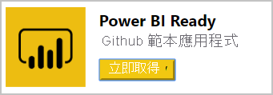

# 在 Power BI 中撰寫範本應用程式的提示

當您在 Power BI 中[撰寫自己的範本應用程式](service-template-apps-create.md)時，有一部分重點是建立工作區、進行測試和生產的邏輯。 而另一個重點則明顯是撰寫報表和儀表板。 撰寫程序可以細分成四大部分。 在這幾個部分投入心力能讓您建立最佳的範本應用程式：

* 您可利用**查詢**來將資料[連線](desktop-connect-to-data.md)和[轉換](../transform-model/desktop-query-overview.md)，以及定義[參數](https://powerbi.microsoft.com/blog/deep-dive-into-query-parameters-and-power-bi-templates/)。 
* 您可在**資料模型**中建立[關聯性](../transform-model/desktop-create-and-manage-relationships.md)、[量值](../transform-model/desktop-measures.md)和問與答改善項目。  
* **[報表頁面](../create-reports/desktop-report-view.md)** 包含可提供資料見解的視覺效果和篩選。  
* **[儀表板](../consumer/end-user-dashboards.md)** 和[磚](../create-reports/service-dashboard-create.md)能為包含的見解提供概觀。
* 在安裝應用程式後，範例資料可立即供您探索。

您可能以現有 Power BI 功能的角度熟悉每項元素。 在建置範本應用程式時，每項元素都有應考量的其他事項。 如需更多詳細資料，請參閱以下各節。

## 查詢
針對範本應用程式，在 Power BI Desktop 中開發的查詢會用來連線至資料來源和匯入資料。 系統需要這些查詢才能傳回一致的結構描述，並針對排程的資料重新整理支援這些查詢 (不支援 DirectQuery)。

### 連接到您的 API
若要開始，您需要從 Power BI Desktop 連線到您的 API，開始建置您的查詢。

您可以使用 Power BI Desktop 中提供的資料連接器，連接到您的 API。 您可以使用 Web 資料連接器 (取得資料 -> Web) 連接到您的 Rest API，或使用 OData 連接器 (取得資料 -> OData 摘要) 連接到 OData 摘要。

> [!NOTE]
> 範本應用程式目前不支援自訂連接器，建議針對一些連接使用案例，使用 Odatafeed Auth 2.0 以降低風險，或提交您的連接器進行認證。 如需如何開發連接器並進行認證的詳細資訊，請參閱[資料連接器文件](https://aka.ms/DataConnectors)。

### 考慮來源
查詢會定義將包含在資料模型中的資料。 根據您的系統大小，這些查詢也應包含篩選器，以確定您的客戶正在處理符合商務案例且可管理的大小。

Power BI 範本應用程式可以平行方式針對多個使用者同時執行多個查詢。  事先規劃您的節流和並行策略，並詢問我們如何讓您的範本應用程式具備容錯功能。

### 結構描述強制執行
請確定您的查詢可在系統中彈性變更，重新整理時結構描述中的變更可能會中斷模型。 如果來源可能會針對某些查詢傳回 Null 或遺失的結構描述結果，請考慮傳回空白資料表或有意義的自訂錯誤訊息。

### 參數
Power BI Desktop 中的[參數](https://powerbi.microsoft.com/blog/deep-dive-into-query-parameters-and-power-bi-templates/)可讓您的使用者提供輸入值，該值可自訂使用者擷取的資料。 預先考慮參數可避免在投入時間建置詳細查詢或報表之後的重新作業。

> [!NOTE]
> 範本應用程式支援 Any 和 Binary 以外的所有參數。
>

### 其他查詢秘訣

* 確認鍵入所有資料行的內容均正確。
* 資料行具有資訊性名稱 (請參閱[問與答](#qa))。  
* 針對共用邏輯，請考慮使用函式或查詢。  
* 服務目前不支援隱私權等級。 如果您收到有關隱私權等級的提示，則可能必須重寫查詢以使用相對路徑。  

## 資料模型

妥善定義的資料模型可確保您的客戶可以更輕鬆直覺的方式與範本應用程式互動。 在 Power BI Desktop 中建立資料模型。

> [!NOTE]
> 您應該在[查詢](#queries)中完成大部分的基本模型 (鍵入、資料行名稱)。

### 問與答
模型也會影響問與答可為客戶提供的結果品質。 請確定您將同義字新增至常用資料行，並在[查詢](#queries)中正確命名資料行。

### 其他資料模型秘訣

確認您已：

* 將格式化套用到所有值資料行。 套用查詢中的類型。  
* 將格式化套用到所有量值。
* 設定預設摘要。 特別是「不摘要」(如果適用) (例如針對唯一值)。  
* 設定資料類別 (如果適用)。  
* 設定關聯性 (如有需要)。  

## 報表
報表頁面可針對範本應用程式中包含的資料提供其他見解。 使用報表頁面回答範本應用程式嘗試解決的關鍵商務問題。 使用 Power BI Desktop 建立報表。

### 其他報表秘訣

* 在每頁中使用多個視覺特效以供交叉篩選。  
* 仔細對齊視覺效果 (沒有重疊)。  
* 將頁面設為 "4:3" 或 "16:9" 配置模式。  
* 顯示的所有彙總都具有數字層面的意義 (平均值、唯一值)。  
* 切割可產生合理的結果。  
* 至少在頂端報表中顯示標誌。  
* 盡可能以客戶的色彩配置設計項目。  

## 儀表板
儀表板是與您的客戶與範本應用程式互動的重點。 其中應包含所包含內容的概觀，特別是商務案例的重要指標。

若要建立範本應用程式的儀表板，您只要透過 [取得資料] > [檔案] 上傳您的 PBIX，或直接從 Power BI Desktop 發佈即可。

### 其他儀表板秘訣

* 在釘選時維持相同的佈景主題，讓儀表板上的磚具有一致性。  
* 將標誌釘選到佈景主題，讓消費者了解套件來源。  
* 可供大部分螢幕解析度使用的建議配置是 5-6 個小型磚的寬度。  
* 所有儀表板磚都應該具有適當的標題/副標題。  
* 針對水平或垂直等不同情況考慮儀表板中的群組。  

## 範例資料
在應用程式建立階段過程中，範本應用程式會將快取資料包裝在工作區中，作為應用程式的一部分：

* 在連接資料之前，讓安裝程式了解應用程式的功能和用途。
* 建立驅動安裝程式進一步探索應用程式功能的體驗，這會導致連接應用程式資料集。

建議取得高品質的範例資料，再建立應用程式。 確保應用程式報表和儀表板已填入資料。

## 在 AppSource 上發佈
範本應用程式可以在 AppSource 上發佈，請遵循下列方針，再將您的應用程式提交到 AppSource：

* 確定您建立的範本應用程式具有能用的範例資料，可協助安裝程式了解應用程式的功能 (不允許空白報表與儀表板)。
範本應用程式支援僅限範例資料的應用程式，請務必核取靜態應用程式核取方塊。 [深入了解](./service-template-apps-create.md#define-the-properties-of-the-template-app)
* 備妥驗證小組須遵循的指示，其中包含連接到資料所需的認證和參數。
* 應用程式必須在 Power BI 和您的 CPP 供應項目中包含應用程式圖示。 [深入了解](./service-template-apps-create.md#define-the-properties-of-the-template-app)
* 已設定登陸頁面。 [深入了解](./service-template-apps-create.md#define-the-properties-of-the-template-app)
* 請隨時關注 [合作夥伴中心 -> Power BI App 供應項目](/azure/marketplace/partner-center-portal/create-power-bi-app-offer) 上的文件。
* 如果儀表板屬於應用程式，請確定儀錶板不是空白。
* 在提交應用程式之前，請使用應用程式連結安裝應用程式，確保您能如預期連接資料集和應用程式體驗。
* 將 pbix 上傳到範本工作區之前，請務必卸載任何不必要的連線。
* 遵循 Power BI [Best design practices for reports and visuals](../visuals/power-bi-report-visualizations.md) (報表和視覺效果的最佳設計做法)，達到最大的使用者影響力並獲准散發。
<!--- * In general, only application with valuable functionality can be approved for general use on AppSource. Application with sample data content only must have either a guidance or statistical value.) -->

## 建立應用程式的下載連結

在 AppSource 上發佈範本應用程式之後，請考慮從您的網站建立下載連結，以連至：
* AppSource 下載頁面 - 可公開檢視，並從您的 AppSource 頁面取得連結。
* Power BI - 可供 Power BI 使用者檢視。

若要將使用者重新導向至 Power BI 中的應用程式下載連結，請參閱下列程式碼範例：[GitHub 存放庫](https://github.com/microsoft/Template-apps-examples/tree/master/src)。

## 後續步驟

[什麼是 Power BI 範本應用程式？](service-template-apps-overview.md)