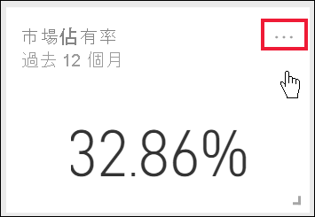

# 教學課程：設定 Power BI 儀表板的警示

[!INCLUDE[consumer-appliesto-yynn](../includes/consumer-appliesto-yynn.md)]

[!INCLUDE [power-bi-service-new-look-include](../includes/power-bi-service-new-look-include.md)]

在 Power BI 服務中設定警示，以便在儀表板上的資料變更超出或低於您設定的限制時通知您。 只可在從報表視覺效果釘選的磚上，為量測計、KPI 和卡片設定警示。 

您可以在儀表板上建立警示：
- 您已在 [我的工作區] 中建立並儲存
- 已在 [Premium 容量](end-user-license.md)中與您共用。 
- 在您可以存取的任何工作區中 (如果您有 Power BI Pro 授權)。    

警示只對重新整理的資料有作用。 當資料重新整理時，Power BI 會檢查該資料有無設定警示。 若資料已達警示臨界值，便會觸發警示。 

此功能仍在持續改進之中，請參閱下方的[提示與疑難排解小節](#tips-and-troubleshooting)。

即使將儀表板分享給他人共用，仍只有您才能查看您所設定的警示。 資料警示會在平台之間完全同步處理；請在 [ Power BI 行動裝置應用程式](mobile/mobile-set-data-alerts-in-the-mobile-apps.md)和 Power BI 服務中設定和檢視資料警示。 

> [!WARNING]
> 這些警示會提供您資料相關的資訊。 若您在行動裝置上檢視 Power BI 資料而裝置遭竊，建議您使用 Power BI 服務關閉所有警示。
> 

本教學課程涵蓋下列內容。
> [!div class="checklist"]
> * 誰可以設定警示
> * 哪些視覺效果支援警示
> * 誰可以看到我的警示
> * 警示是否可以在 Power BI Desktop 和行動版上運作
> * 如何建立警示
> * 我會在何處收到警示

## 必要條件

如果您尚未註冊 Power BI，請先進行[免費註冊](https://app.powerbi.com/signupredirect?pbi_source=web)再開始。

1. 此範例會使用來自銷售與行銷範例的儀表板卡片磚。 開啟 Power BI 服務 (app.powerbi.com)、登入，然後開啟 [我的工作區]。    
    ![開啟 [我的工作區]](media//end-user-alerts/power-bi-my-workspace.png)

2. 在左下角選取 [取得資料]  。

    ![選取 [取得資料]](media//end-user-alerts/power-bi-get-data.png)

3. 在顯示的 [取得資料] 頁面上，選取 [範例]。

4. 選取 [銷售與行銷範例]，然後選擇 [連線]。

    

5. 當 Power BI 連線到此範例之後，從出現的對話方塊中選取 [移至儀表板]。     
    

## 將警示新增至儀表板磚

1. 選取儀表板量測計、KPI 或卡片磚中的省略符號。
   
   

2. 選取警示圖示  或 [管理警示]，以便為 [市場佔有率] 卡片新增一或多個警示。

   

   
1. 在 [管理警示] 窗格上選取 [+ 新增警示規則]。  確認滑桿設定為 [開啟]，並為警示提供標題。 磚可幫助您輕鬆地辨識警示。
   
   ![[管理警示] 視窗](media/end-user-alerts/power-bi-alert-manage.png)
4. 向下捲動並輸入警示的詳細資料。  在此範例中，我們將建立警示，在市場佔有率提高到 40 或更高時通知我們。 警示將出現在我們的[通知中心](end-user-notification-center.md)內。 我們也同樣設定讓 Power BI 傳送電子郵件給我們。
   
   ![在 [管理警示] 視窗中設定 [臨界值]](media/end-user-alerts/power-bi-manage-alert-detail.png)

5. 選取 [儲存並關閉]。
 

   > 

## 接收警示
當正在追蹤的資料達到您所設定的其中一個臨界值時，會出現一些連鎖反應。 首先，Power BI 會檢查自上次傳送警示起，是否已超過 1 小時或 24 小時 (取決於您選取的選項)。 只要資料超過臨界值，您就會收到警示。

接下來，Power BI 會傳送警示到您的通知中心，或是寄發電子郵件。 每個警示都包含資料的直接連結。 選取連結以查看相關的磚。  

1. 您如有設定傳送電子郵件警示，將會在收件匣中看到類似如下所述的狀況。 這是我們為 [情緒] 卡片所設定的警示。
   
   
2. Power BI 也會將訊息新增至您的**通知中心**。
   
   
3. 若要查看警示詳細資料，請開啟您的通知中心。
   
    
   
  

## 管理警示

有許多方式可以管理您的警示：從儀表板磚本身、從 Power BI 的 [設定] 功能表，以及在 [iPhone 的 Power BI 行動裝置應用程式](mobile/mobile-set-data-alerts-in-the-mobile-apps.md)或 [Windows 10 的 Power BI 行動裝置應用程式](mobile/mobile-set-data-alerts-in-the-mobile-apps.md)中的個別磚上。

### 從磚本身

1. 當您需要變更或移除磚的警示時，請選取警示圖示 ，以重新開啟 [管理警示] 視窗。 您為該磚設定的所有警示皆會顯示。
   
    ![[管理警示] 視窗](media/end-user-alerts/power-bi-manage-alert.png).
2. 若要修改警示，請選取警示名稱左側的箭號。
   
    .
3. 若要刪除警示，請選取警示名稱右側的垃圾桶。
   
      

### 從 Power BI 的 [設定] 功能表

1. 從 Power BI 功能表列選取齒輪圖示。
   
    .
2. 選取 [設定] 下的 [警示]。
   
    ![[設定] 視窗的 [警示] 索引標籤](media/end-user-alerts/power-bi-settings.png)
3. 您可以在此處開啟及關閉警示、開啟 [管理警示] 視窗執行變更，或是刪除警示。

## 提示與疑難排解 

* 若無法為量測計、KPI 或卡片設定警示，請連絡您的租用戶管理員或 IT 技術支援中心以尋求協助。 有時儀表板或特定類型儀表板磚的警示可能會關閉或無法使用。
* 警示只對重新整理的資料有作用。 警示對靜態資料毫無作用。 Microsoft 大多提供靜態範例。 
* 需有 Power BI Pro 或 Premium 授權才能接收及檢視共用的內容。 如需詳細資訊，請閱讀[我有哪些授權？](end-user-license.md)。
* 您可以對建立自串流資料集 (從報表釘選到儀表板) 的視覺效果設定警示。 但不可對使用 [新增磚] > [自訂串流資料] 直接在儀表板上所建立串流磚設定警示。

## 清除資源
刪除警示的指示已在上方說明。 簡單來說，請從 Power BI 功能表列選取齒輪圖示。 在 [設定] 下，選取 [警示]，然後刪除警示。

> [!div class="nextstepaction"]
> [在行動裝置上設定資料警示](mobile/mobile-set-data-alerts-in-the-mobile-apps.md)

