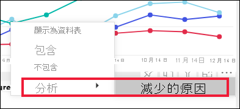

# 使用分析功能來說報表視覺效果中的波動

[!INCLUDE[consumer-appliesto-yynn](../includes/consumer-appliesto-yynn.md)]

在視覺效果中，您經常會看到值大幅增加，然後急遽下降，並想知道造成此類波動的原因。 使用 **Power BI 服務**中的 [分析]，您只要按幾下滑鼠就可以找到原因。

例如，請考慮下列視覺效果，其依 [月份] 與 [製造商] 顯示 [總單位]。 VanArsdel 的表現優於其競爭者，但在 2014 年 6 月以後不是這樣了。 在此情況下，您可以探索資料來協助說明發生的變更。 

您可以要求 Power BI 服務說明視覺效果中的增減情形或不尋常的分佈，並取得快速、自動化、具洞察力的資料分析。 以滑鼠右鍵按一下資料點，然後選取 [分析] > [說明減少的情形] (若前一條橫條較低的話，則為 [說明增加的情形])，或者 [分析] > [找出此分佈的不同之處]，即可在容易使用的視窗中查看見解。

[分析] 功能與內容相關，並會以正前方的資料點為基礎，例如之前的橫條或直條。

> [!NOTE]
> 這項功能目前處於預覽狀態，並可能有所變更。 見解功能即預設為啟用 (您不需要選取 [預覽] 方塊即可啟用)。

### 選擇的因素與類別

檢查不同的資料行之後，Power BI 會選取並顯示這些因素，顯示相對貢獻的最大變更。 針對每個資料行，會在描述中指出比重變更幅度最大的值。 此外，也會指出實際增減情況最大的值。

若要查看 Power BI 所產生的所有見解，請使用捲軸。 順序的排定方式會先顯示最重要的參與者。 

## 使用深入解析
若要使用見解來說明在視覺效果上看到的趨勢，請以滑鼠右鍵按一下橫條圖或折線圖中的任何資料點，然後選取 [分析]。 然後選擇顯示的選項：[說明增加的情形]、[說明減少的情形]，或 [說明差異]。

Power BI 接著會對資料執行其機器學習演算法，並於視窗中填入視覺效果與描述，以說明哪些類別對增加、減少或差異情況的影響最大。  針對此範例，第一個見解是瀑布圖。

選取瀑布圖視覺效果底部的小圖示，即可選擇要讓深入解析顯示散佈圖、堆疊直條圖，或功能區圖表。

使用頁面頂端的 [喜歡] 與 [不喜歡] 圖示，來提供視覺效果與功能的意見反應。  

當報表處於閱讀模式或編輯檢視時，您都可以使用見解，讓分析資料及建立可輕鬆新增至報表之視覺效果的作業更加多元。 如果您在 [編輯] 檢視中開啟報表，您會在拇指圖示旁看到加號圖示。 選取加號圖示，將您的報表見解加入為新的視覺效果。 

## 所傳回結果的詳細資料

見解所傳回的詳細資料是為了指出兩個時段之間的差異，以協助您了解之間的變更。  

您可以將此演算法想成擷取模型中的所有其他資料行，並依資料行計算時段「之前」與「之後」的明細，判斷該明細中發生的變更量，然後傳回具有最大變更的資料行。 例如，已在上面的瀑布式見解中選取 [州]，因為路易斯安那州、德克薩斯州與科羅拉多州的貢獻從六月到七月降了 13% (降到 19%)，且這是 [總單位] 中減少幅度最大的。  

針對傳回的每個見解，可能會顯示四個視覺效果。 其中三個視覺效果是為了指出兩個時段之間的比重變更。 例如，用於說明從「第 2 季」到「第 3 季」的增加情形。 功能區圖表會顯示在選取的資料點之前與之後的變更。

### 散佈圖

散佈圖視覺效果會針對資料行 (在此範例中為「州」) 的每個值，顯示第一個時段的量值 (x 軸上) 與第二個時段的量值 (y 軸上) 比較。 如果值增加，資料點會在綠色區域中；如果值減少，資料點則會在紅色區域中。 

虛線顯示最佳擬合，而此線條上方的資料點相較於整體趨勢呈現增加，而此線條下方的資料點則呈現減少。  

散佈圖不會顯示任一時段值為空白的資料項目。

### 100% 堆疊直條圖

100% 堆疊直條圖視覺效果會針對所選資料點與先前項目顯示貢獻對總計 (100%) 的值。 這可讓您並排比較每個資料點的貢獻。 在此範例中，工具提示會顯示所選德州值的實際比重。 因為州清單很長，所以工具提示可協助您查看詳細資料。 透過使用工具提示，我們看到德克薩斯州的貢獻約等於相同的總計百分比 (31% 與 32%)，但總單位數從 89 降到 71。 請記住，Y 軸是百分比，不是總計，而且每個資料行寬都是百分比，不是值。 

### 功能區圖表

功能區圖表視覺效果會顯示之前與之後的量值。 當貢獻者的「順序」 變更時 (例如，*LA* 從第二名貢獻者掉到第十一名)，對顯示貢獻變更特別有用。  此外，雖然頂端的寬功能區代表 *TX*，表示其是之前與之後最重要的參與者，但名次掉落顯示在選取的期間與之後貢獻值皆下降。

### 瀑布圖

第四個視覺效果是瀑布圖，其顯示不同時段之間的實際增減情況。 此視覺效果清楚地顯示在 2014 年 6 月減少的一個重要參與者 -- 在此案例中為 [州]。 而**州**的細節對整體單位的影響，就是路易斯安那州、德克薩斯州與科羅拉多州的衰退扮演了最重要的角色。      

 

## 考量與限制
因為這些見解都是以先前的資料點變更為依據，所以選取視覺效果中的第一個資料點時，就無法使用此功能。 

[分析]  不適用於所有類型的視覺效果。 

下列清單是**分析 - 說明增加情形/說明減少情形/說明差異**目前不支援的案例集合：

* TopN 篩選
* 包含/排除篩選
* 量值篩選
* 非數字量值
* 使用「顯示值為」
* 篩選的量值 - 所篩選量值為已套用特定篩選的視覺效果層級計算 (例如「法國總銷售額」)，並用於見解功能所建立的其中一些視覺效果
* X 軸上的類別資料行 (除非它定義純量的依資料行排序作業)。 如果使用階層，則在使用中階層內的每個資料行皆必須符合此條件

## 後續步驟
[瀑布圖](../visuals/power-bi-visualization-waterfall-charts.md)    
[散佈圖](../visuals/power-bi-visualization-scatter.md)    
[直條圖](../visuals/power-bi-report-visualizations.md)    
[功能區圖表](../visuals/desktop-ribbon-charts.md)
