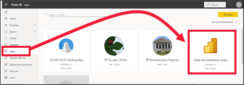

# 在 Power BI 服務中安裝和使用範例「銷售與行銷」應用程式

[!INCLUDE[consumer-appliesto-yyny](../includes/consumer-appliesto-yyny.md)]

既然您已[基本了解如何取得 Power BI 內容](end-user-app-view.md)，讓我們使用 Microsoft AppSource 來取得 Marketing and Sales 範本應用程式。 Marketing and Sales 範本應用程式包含可用來探索 Power BI 服務的範例資料。 此特定應用程式具有一個儀表板和數個報表頁面。 

> [!IMPORTANT]
> 若要從 Microsoft AppSource 安裝此應用程式，您必須有 **Power BI Pro** 授權。  如需詳細資訊，請參閱[授權](end-user-license.md)。

## 從 Microsoft AppSource 取得應用程式

1. 開啟 [https://appsource.microsoft.com](https://appsource.microsoft.com)。

   

1. 在搜尋方塊中，輸入 **Microsoft sample**，然後選取 [Microsoft Sample - Sales & Marketing]。 

    

1. 選擇性閱讀概觀與評論，並參考影像。  然後選取 [立即取得]。

   

1. 確認您想要安裝此應用程式。

   

5. Power BI 服務會在安裝應用程式之後顯示成功訊息。 選取 [移至應用程式]。 或者，從 [應用程式] 畫布中選取應用程式本身。 根據設計師建立應用程式的方式，會顯示應用程式儀表板或應用程式報表。

    

7.  此範本應用程式會設定為開啟至儀表板。 不過，應用程式「設計師」可能會將應用程式設定成改為開啟其中一個報表頁面。  

    

## 與應用程式中的儀表板和報表互動
請花一些時間探索組成應用程式的儀表板和報表中資料。 您可以進行所有標準 Power BI 互動，例如篩選、醒目提示、排序和向下切入。  還是有點分不清儀表板與報表之間的差異？  請參閱[儀表板](end-user-dashboards.md)和[報表](end-user-reports.md)的相關文章。  

## 後續步驟
* [回到應用程式概觀](end-user-apps.md)    
* [檢視 Power BI 報表](end-user-report-open.md)    
* [與我共用內容的其他方式](end-user-shared-with-me.md)
