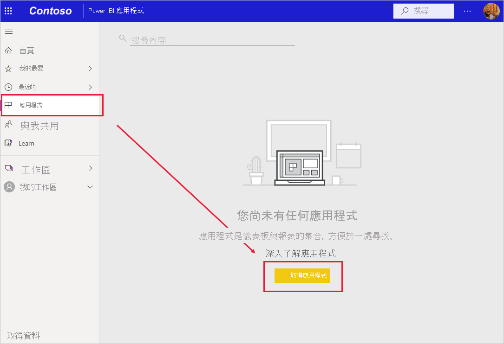
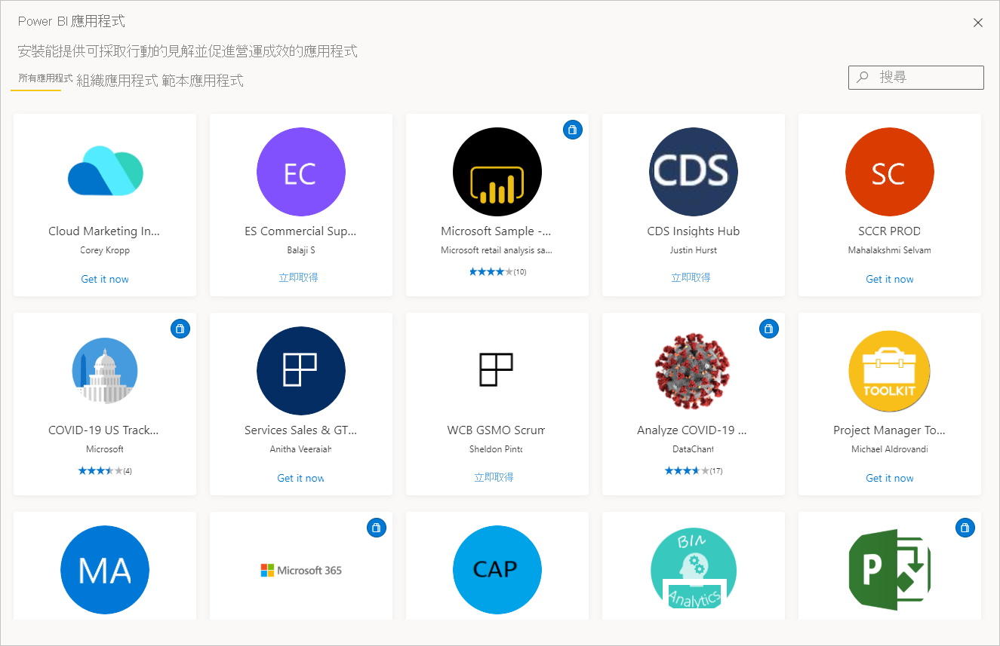
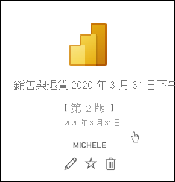
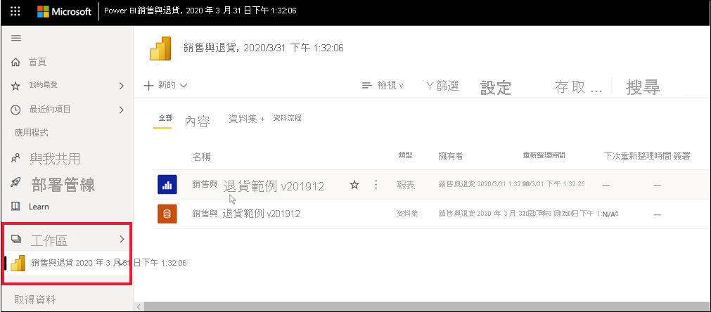
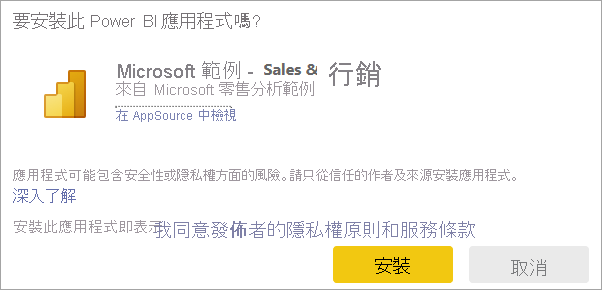

# 使用 Power BI 中的儀表板和報表安裝並使用應用程式

[!INCLUDE[consumer-appliesto-ynny](../includes/consumer-appliesto-ynny.md)]

您現在已[基本了解應用程式](end-user-apps.md)，接下來讓我們了解如何開啟並與應用程式互動。 

## 取得新應用程式的方式
有數種方式可取得新的應用程式：
* 您可以在 Power BI 服務中，從 Power BI 應用程式市集取得新的應用程式。
* 您可直接連結至從應用程式設計人員接收的應用程式。 
* 組織中的應用程式設計人員可在 Power BI 帳戶中自動安裝應用程式。

在 Power BI 行動版中，您只能透過直接連結來安裝應用程式。 如果應用程式設計工具自動安裝應用程式，您就會在應用程式清單中看到它。

## 應用程式和授權
並非所有的 Power BI 使用者都可檢視應用程式並與其互動。 
- 如有免費授權，可以開啟儲存在 Premium 容量中與您共用的應用程式。  
- 如有 Pro 授權，即可開啟與您共用的應用程式。

因此，若您無法開啟應用程式，請連絡您的管理員或技術支援中心。 如需授權的資訊，請參閱 [Power BI 授權](end-user-license.md)。

## 從 Power BI 應用程式市集取得應用程式

您可以從 Power BI 應用程式市集尋找並安裝應用程式。 在應用程式市集中，您可以取得組織應用程式和範本應用程式。

- 「組織應用程式」可供組織中的 Power BI 使用者使用。 這些應用程式也包含預先建立的儀表板和報表供立即使用，或自訂並共用自己的儀表板和報表。 組織可能會使用應用程式來追蹤銷售、測量業績或分析人才雇用。
- 「範本應用程式」包含預先建立的儀表板和報表，其可供連接到用於執行業務的各種服務，例如 SalesForce、Microsoft Dynamics 和 Google Analytics。

1. 如果您還沒有登入，請[登入 Power BI 服務](./end-user-sign-in.md)。 

1. Power BI 服務開啟之後，請選取 [應用程式] > [取得應用程式]。 

    

1. Power BI 應用程式市集隨即開啟。

   

   有三個索引標籤可供您使用：
   * **所有應用程式**：瀏覽可供您使用的範本應用程式和所有組織應用程式。 範本應用程式可以利用其磚右上角的購物袋圖示來區分。
   * **組織應用程式**：瀏覽已與您共用的組織應用程式。 
   * **範本應用程式**：瀏覽裝載於 AppSource 上的範本應用程式。

   或者，您可以使用搜尋方塊來取得篩選出的應用程式選取項目。 輸入部分應用程式名稱或類別名稱 (例如財務、分析、行銷等)，將能更輕鬆地找到您正在尋找的項目。 

   搜尋方塊對您已開啟的索引標籤很敏感 - 將只會傳回所選類型的應用程式。 如果 [所有應用程式] 索引標籤為開啟狀態，即會傳回組織和範本應用程式。 當組織應用程式和範本應用程式具有相同名稱時，這可能會造成混淆。 只需記住，範本應用程式磚的右上角有一個購物袋圖示。

4. 當找到想要的應用程式時，選取 [立即取得] 進行安裝。

   ![顯示 [立即取得] 按鈕的螢幕擷取畫面](./media/end-user-app-view/power-bi-get-now.png)

* 如果您正在安裝組織應用程式，就會立即將其新增至您的應用程式清單。
* 如果您正在安裝範本應用程式，即會將您帶往 AppSource 中的範本應用程式供應項目。 請參閱如何從 Power BI 應用程式市集下載並安裝範例範本應用程式的[範例](end-user-app-marketing.md)。 此應用程式會連同相同名稱的工作區一併安裝。

   > [!NOTE]
   > 如果使用免費的使用者授權，您可下載但無法檢視應用程式，除非升級至 Power BI Pro 帳戶，或該應用程式儲存於 Premium 共用容量中。 如需詳細資訊，請參閱[商務使用者授權](end-user-license.md)。

## 透過直接連結安裝應用程式
您也可以從直接連結安裝組織應用程式。    

**在您的電腦上** 

當您選取電子郵件中的連結時，Power BI 服務 ([https://app.powerbi.com](https://app.powerbi.com)) 會在您的瀏覽器中開啟應用程式。 

**在您的 iOS 或 Android 行動裝置上** 

當您在行動裝置上選取電子郵件中的連結時，應用程式就會自動安裝，並在行動裝置應用程式中開啟。 您可能必須先登入。 

## 與應用程式中的儀表板和報表互動
請花一些時間探索組成應用程式的儀表板和報表中資料。 您可以進行所有標準 Power BI 互動，例如篩選、醒目提示、排序和向下切入。  您可以使用應用程式執行的工作範圍，會由「設計師」指派給您的權限來控制。  如何與應用程式的儀表板和報表互動的方式，會由「設計師」指派給您的存取權與角色來控制。 

還是有點分不清儀表板與報表之間的差異？  請參閱[儀表板](end-user-dashboards.md)和[報表](end-user-reports.md)的相關文章。  

### 開啟應用程式

您已安裝應用程式，或已從同事那裡收到了應用程式。 若要查看該應用程式，請從功能窗格中選取 [應用程式] 來開啟應用程式內容清單。

將滑鼠暫留並選取要開啟的應用程式。 視應用程式而定，您可能會收到類似如下的提示：

![三個選項的螢幕擷取畫面：[探索]、[連線] 和 [自訂]](./media/end-user-app-view/power-bi-customize.png)

如需選取選項的指引，請參閱[安裝範本應用程式](../connect-data/service-template-apps-install-distribute.md)。

將滑鼠暫留在應用程式上以查看詳細資料，然後選取應用程式卡來開啟該應用程式。

應用程式隨即開啟。 每個應用程式看起來都不相同 - 不同的版面配置、視覺效果、色彩、選項。 但所有應用程式都具有幾項常用的功能。

1. 應用程式的名稱和上次更新時間。 選取下拉式箭號以查閱擁有者和說明連絡人。
1. 選取 [Power BI] 以返回[首頁](end-user-home.md)。
1. 動作列。 
1. [報表] 頁面畫布。
1. [應用程式瀏覽] 窗格。  應用程式的名稱底下是內容清單。 此應用程式有一份內含六頁的報表。 選取 [報表] 頁面名稱加以開啟。 我們目前已開啟 [傳回率] 頁面。 
1. 選取箭號以展開 [篩選] 窗格。

如果您已獲授與存取權，您也可以探索相關的工作區。  當您安裝或下載範本應用程式時，Power BI 服務會為您建立工作區。 當您安裝組織應用程式時，其可能不會包含對工作區的存取權。 [了解工作區](end-user-workspaces.md)。 選取 [Power BI] \(數字 2\) 以返回 [首頁]，然後選擇 [工作區]。 

## 更新應用程式 

應用程式設計人員可能會不時發行其應用程式的新版本。 您取得新版本的方式取決於您先前如何收到原始版本。 

* 如果您是從組織取得應用程式，則新版本的更新會完全透明，您不需要執行任何動作。 

* 如果您已從 AppSource 取得範本應用程式，則當您下次開啟該應用程式時，將會看到通知橫幅。 通知可讓您知道有新的版本可供使用。 

    1. 選取 [取得] 進行更新。  

        <!-- -->

    2. 當系統提示您安裝更新的應用程式時，請選取 [安裝]。 

         

    3. 由於您已經有此應用程式的版本，請決定是要取代現有版本，還是要在新工作區中安裝已更新的應用程式。   

         

     > [!NOTE] 
     > 安裝新版本會覆寫您對應用程式之報表與儀表板所作的任何變更。 若要保留已更新的報表和儀表板，您可以在安裝之前以不同名稱或不同位置將其儲存。 

    4. 安裝好更新版本之後，請選取 [更新應用程式] 以完成更新處理程序。 

## 考量與疑難排解

- Power BI 系統管理員可開啟和關閉安裝應用程式的功能。 如果需要啟用這項功能，請洽詢 IT 部門或技術服務人員。    
- 使用應用程式需要 Pro 授權，或將該應用程式儲存於 Premium 共用容量的工作區中。 [深入了解授權](end-user-license.md)。

## 後續步驟
* [回到應用程式概觀](end-user-apps.md)
* [檢視 Power BI 報表](end-user-report-open.md)
* [與我共用內容的其他方式](end-user-shared-with-me.md)

