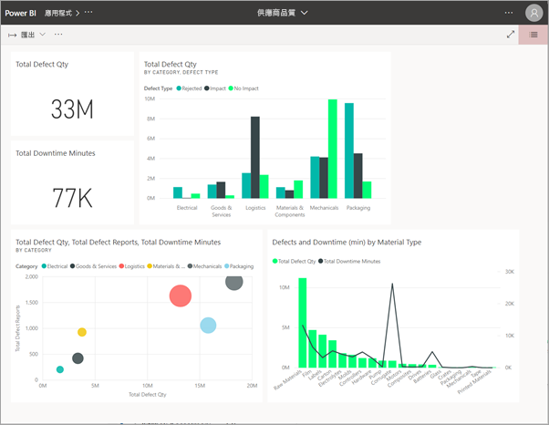
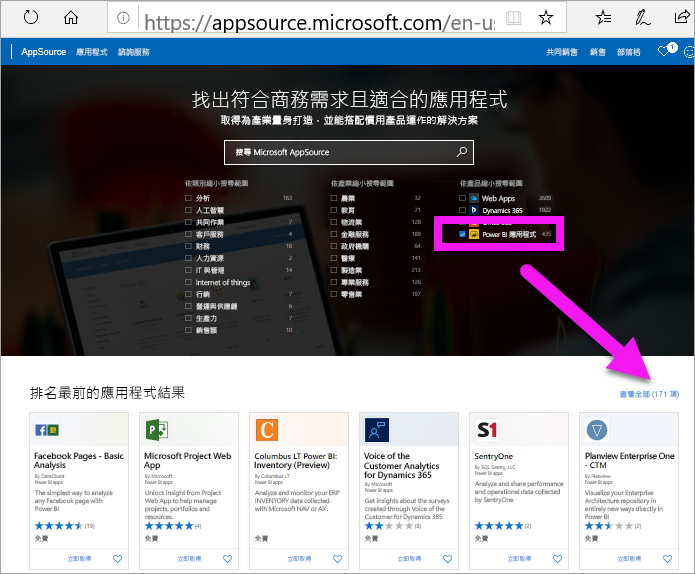
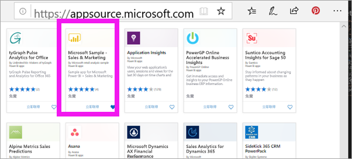
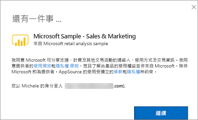
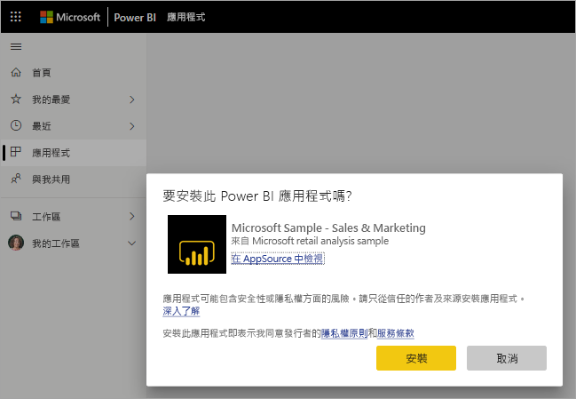
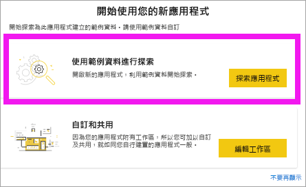
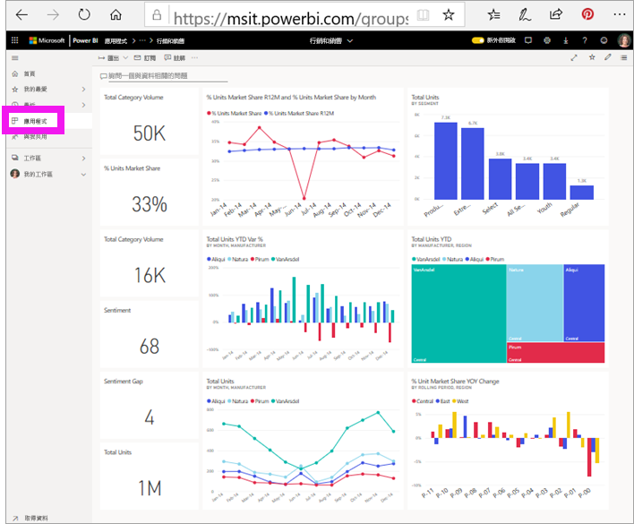

# 使用 Power BI 中的儀表板和報表安裝並使用應用程式

[!INCLUDE [power-bi-service-new-look-include](../includes/power-bi-service-new-look-include.md)]

您現在已[基本了解應用程式](end-user-apps.md)，接下來讓我們了解如何開啟並與應用程式互動。 

## 取得新應用程式的方式
有數種方式可取得新的應用程式。 報表設計師同事可以在您的 Power BI 帳戶中自動安裝應用程式，或向您傳送應用程式的直接連結。 而您可以前往 AppSource，並搜尋您公司內外應用程式設計師提供給您的應用程式。 

在行動裝置上的 Power BI 中，您只能從直接連結安裝應用程式，而不能從 AppSource 安裝。 如果應用程式設計工具自動安裝應用程式，您就會在應用程式清單中看到它。

## 透過直接連結安裝應用程式
自行安裝新應用程式的最簡單方式，是以電子郵件向應用程式設計師取得直接連結。  

**在您的電腦上** 

當您選取電子郵件中的連結時，Power BI 服務 ([https://powerbi.com](https://powerbi.com)) 會在您的瀏覽器中開啟應用程式。 

**在您的 iOS 或 Android 行動裝置上** 

當您在行動裝置上選取電子郵件中的連結時，應用程式就會自動安裝，並在行動裝置應用程式中開啟。 您可能必須先登入。 

## 從 Microsoft AppSource 取得應用程式
您也可以從 Microsoft AppSource 尋找並安裝應用程式。 只有可存取的應用程式 (亦即，應用程式作者已將權限授與您或所有人) 才會顯示。

1. 選取 [應用程式]    > [取得應用程式]  。 
   
        
2. 在 AppSource 的 [我的組織]  下方，您可以進行搜尋以縮小結果範圍，並尋找您要尋找的應用程式。
   
    ![在 AppSource 的 [我的組織] 下](./media/end-user-app-view/power-bi-opportunity-app.png)
3. 選取 [立即取得]  ，將它新增至 [應用程式] 內容清單。 

## 從 Microsoft AppSource 網站 (https://appsource.microsoft.com) 取得應用程式
在此範例中，我們會開啟其中一個 Microsoft 範例應用程式。 在 AppSource 上，您可以找到執行業務所用的多個服務應用程式。  例如 Salesforce、Microsoft Dynamics、Google Analytics、GitHub、Zendesk、Marketo 等服務。 若要深入了解，請瀏覽[搭配 Power BI 使用的服務應用程式](../service-connect-to-services.md)。 

1. 在瀏覽器中開啟 https://appsource.microsoft.com ，然後選取 **Power BI 應用程式**。

    

2. 選取 [查看全部]  以顯示 AppSource 上目前可用的所有 Power BI 應用程式清單。 捲動或搜尋名為 [Microsoft 範例 - 銷售與行銷]  的應用程式。

    

3. 選取 [立即取得]  並同意使用規定。

    

4. 確認您想要安裝此應用程式。

    

5. 安裝應用程式之後，Power BI 服務會顯示成功訊息。 選取 [前往應用程式]  以開啟應用程式。 根據設計師建立應用程式的方式，會顯示應用程式儀表板或應用程式報表。

    

    您也可以選取 [應用程式]  ，然後選擇 [銷售與行銷]  ，直接從您的應用程式內容清單中開啟應用程式。

    

6. 選擇是否要探索或自訂並共用您的新應用程式。 由於我們已選取 Microsoft 範例應用程式，讓我們開始探索。 

    

7.  您的新應用程式會以儀表板開啟。 應用程式「設計師」  可能會改將應用程式設定為開啟至報表。  

    

## 與應用程式中的儀表板和報表互動
請花一些時間探索組成應用程式的儀表板和報表中資料。 您可以進行所有標準 Power BI 互動，例如篩選、醒目提示、排序和向下切入。  還是有點分不清儀表板與報表之間的差異？  請參閱[儀表板](end-user-dashboards.md)和[報表](end-user-reports.md)的相關文章。  

## 後續步驟
* [回到應用程式概觀](end-user-apps.md)
* [檢視 Power BI 報表](end-user-report-open.md)
* [與我共用內容的其他方式](end-user-shared-with-me.md)
