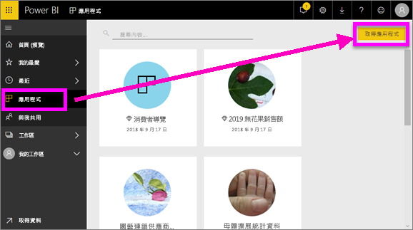
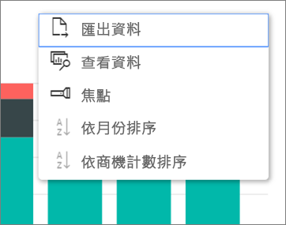

# 使用 Power BI 中的儀表板和報表安裝並使用應用程式
Power BI 的*應用程式*會將相關的儀表板和報表全都帶到同一處。 組織中的人員會使用關鍵的商務資訊來建立及發佈應用程式。 也許您已在使用 Google Analytics (分析) 和 Microsoft Dynamics CRM 這類[外部服務](end-user-connect-to-services.md)，而其中亦提供 Power BI 應用程式。 

在 Power BI 服務中和您的行動裝置上，可輕鬆找到並安裝應用程式。 安裝完應用程式之後，因為所有儀表板都會集中在一個應用程式、瀏覽器或在行動裝置中，所以您不必記住許多不同儀表板的名稱。

透過應用程式，每當應用程式作者發行更新時，您就會自動看到變更。 作者也會控制資料重新整理的排程頻率，因此您無須擔心如何將其保持在最新狀態。 

## 取得新的應用程式
您可以透過一些不同的方式取得應用程式。 應用程式作者可以在您的 Power BI 帳戶中自動安裝應用程式，或將應用程式的直接連結傳送給您，或者您可以在 AppSource 中搜尋應用程式，而在 AppSource 中，您可以看到所有可存取的應用程式。 在行動裝置上的 Power BI 中，您只可從直接連結進行安裝，而不可從 AppSource。 如果應用程式作者自動安裝應用程式，您就會在您的應用程式清單中看到它。

### 透過直接連結安裝應用程式
自行安裝新應用程式的最簡單方式是向應用程式作者取得直接連結。 Power BI 會建立安裝連結，作者可傳送該連結給您。

**在您的電腦上** 

選取電子郵件中的連結以在瀏覽器中開啟 Power BI 服務 ([https://powerbi.com](https://powerbi.com))。 確認您想要安裝應用程式，瀏覽器就會開啟應用程式登陸頁面。

**在您的 iOS 或 Android 行動裝置上** 

當您在行動裝置上選取電子郵件中的連結時，應用程式就會自動安裝，並開啟行動裝置應用程式中的應用程式內容清單。 

### 從 Microsoft AppSource 取得應用程式
您也可以從 Microsoft AppSource 尋找並安裝任何您可存取的應用程式。 

1. 選取 [應用程式]  > [取得應用程式]。 
   
     
2. 在 AppSource 的 [我的組織] 下方搜尋以縮小結果範圍，並找到您在尋找的應用程式。
   
     ![在 AppSource 的 [我的組織] 下](./media/end-user-apps/power-bi-appsource-my-org.png)
3. 選取 [Get it now]\(立即取得)，將它新增至 [應用程式] 頁面。 

## 與應用程式中的儀表板和報表互動
現在，您可以探索應用程式中儀表板和報表的資料。 您可以進行所有標準 Power BI 互動，例如篩選、反白顯示、排序和向下鑽研。 閱讀[與 Power BI 中的報表互動](end-user-reading-view.md)。 

## 後續步驟
[外部服務的 Power BI 應用程式](end-user-connect-to-services.md)

