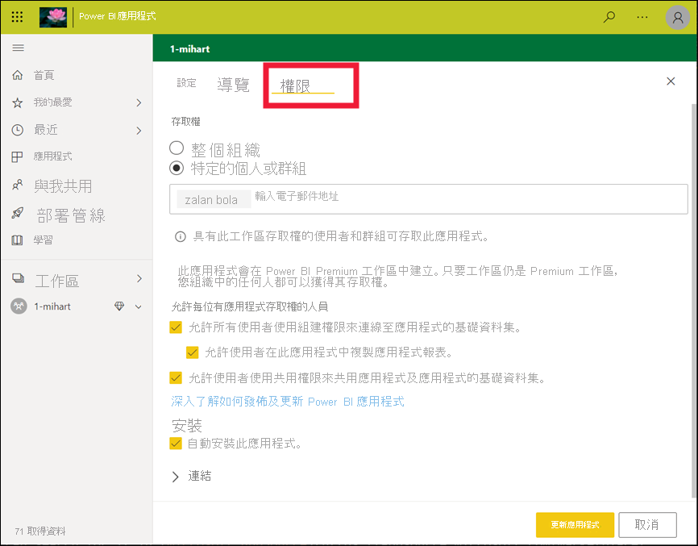

# Power BI 服務取用者的基本概念

[!INCLUDE[consumer-appliesto-ynnm](../includes/consumer-appliesto-ynnm.md)]

[!INCLUDE [power-bi-service-new-look-include](../includes/power-bi-service-new-look-include.md)]

此文章假設您已閱讀 [Power BI 概觀](../fundamentals/power-bi-overview.md)，並將自已識別為 [Power BI 商務使用者](end-user-consumer.md)。 「商務使用者」可從同事接收 Power BI 內容，例如儀表板、報表與應用程式。 「商務使用者」會使用 Power BI 服務 (app.powerbi.com)，也就是網站版 Power BI。

接收其他人的內容需要具備下列其中一個項目：
- Power BI Pro 使用者授權
- 您的組織必須有 Power BI Premium 的訂用帳戶，以及要透過 Power BI Premium 容量與您共用的內容。 [查詢您的授權與訂用帳戶類型](end-user-license.md)。

您一定會聽到字詞 "Power BI Desktop"，或只聽到 "Desktop"。 它是供「設計者」使用的獨立工具，而設計師會組建儀表板和報表，並與您共用它們。 請務必知道當中有其他 Power BI 工具。 只要您是商務使用者**，就只會使用 Power BI 服務。 本文僅適用於 Power BI 服務。

## 術語和概念

本文不是 Power BI 的視覺導覽，也不是實際操作教學課程。 相反地，它是我們讓您熟悉 Power BI 術語和概念的概觀文章。 它將教導您專用術語的涵義和使用情況。 如需導覽 Power BI 服務和其巡覽，請移至[快速入門 - 瀏覽 Power BI 服務](end-user-experience.md)。

## 第一次開啟 Power BI 服務

大部分的 Power BI「商務使用者」都可取得 Power BI 服務，因為 1) 其公司會購買授權，而且 2) 系統管理員會將這些授權指派給員工。

若要開始使用，請開啟瀏覽器並輸入 **app.powerbi.com** 。 第一次開啟 Power BI 服務時，您會看到類似下面的內容：

當您使用 Power BI 服務時，您會將每次開啟網站時所看到的內容個人化。 例如，有些人希望在 [常用] 畫面上開啟 Power BI，有些人則有自己最想先看到的儀表板。 別擔心，這兩篇文章將會教您如何將您的體驗個人化。

- [介紹 Power BI 首頁和全域搜尋](https://powerbi.microsoft.com/blog/introducing-power-bi-home-and-global-search)

- [Power BI 服務中的精選儀表板](end-user-featured.md)

![顯示 [首頁] 檢視和 [儀表板] 檢視的螢幕擷取畫面。](media/end-user-basic-concepts/power-bi-dash-home.png)

但是，在我們更進一步深入之前，讓我們來回顧一下並討論構成 Power BI 服務的建置組塊。

_______________________________________________________

## Power BI 內容

### 建置組塊簡介

Power BI「商務使用者」的五個建置組塊如下： **_視覺效果_** 、 **_儀表板_** 、 **_報表_** 、 **_應用程式_** 與 **_資料集_** 。 這些有時稱為「Power BI 內容」 **** 。 「內容」存在於「工作區」 **** 。 一般工作流程涉及所有建置區塊：Power BI 的「設計師」(下圖中的黃色部分) 會收集資料集中的資料、將其帶入 Power BI 中進行分析、建立充滿視覺效果 (醒目提示有趣的事實與見解) 的報表、將報表中的視覺效果釘選到儀表板，並與像您一樣 (下圖中的黑色部分) 的商務使用者共用報表與儀表板。 「設計師」會以儀表板、報表或應用程式的形式加以共用。

最基本概念：

-  「視覺效果」 **** 是 Power BI「設計者」建置的圖表類型。 視覺效果顯示「報表」和「資料集」中的資料。 「設計工具」通常會在 Power BI Desktop 中建置視覺效果。

    如需詳細資訊，請參閱[在報表、儀表板和應用程式中與視覺效果互動](end-user-visualizations.md)。

-  「資料集」是資料的容器。 例如，它可能是來自世界衛生組織的 Excel 檔案。 也可能是公司擁有的客戶資料庫，或可能是 Salesforce 檔案。 資料集是由「設計師」所管理。

-  「儀表板」是具有互動式視覺效果、文字和圖形的單一畫面。 儀表板會在一個畫面上收集您最重要的計量，以表達意涵或回答問題。 儀表板內容來自一或多份報表以及一或多個資料集。

    如需詳細資訊，請參閱[適用於 Power BI 服務商務使用者的儀表板](end-user-dashboards.md)。

-  「報表」是一或多個頁面的互動式視覺效果、文字和圖表，共同組成單一個報表。 Power BI 根據單一資料集建立報表。 通常，「設計師」會組織報表頁面來處理感興趣的中央區域，或回答單一問題。

    如需詳細資訊，請參閱 [Power BI 中的報表](end-user-reports.md)。

-  「應用程式」是可讓「設計者」將相關的儀表板和報表組合在一起並共用的方式。 「商務使用者」會自動收到某些應用程式，但也可以搜尋由同事或由社群建立的其他應用程式。 例如，現成可用的應用程式適用於您可能已經在使用的外部服務，如 Google Analytics (分析) 與 Microsoft Dynamics CRM。

明確地說，如果您是新使用者並第一次登入 Power BI 服務，可能還看不到任何共用的儀表板、應用程式或報表。

_______________________________________________________

## 資料集

「資料集」是「設計工具」匯入或連線至其中，然後用來建立報表和儀表板的資料集合。 身為「商務使用者」，您不會直接與資料集互動，但了解如何將其放入較大的結構仍然不錯。  

每個資料集代表單一資料來源。 例如，來源可以是 OneDrive上的 Excel 活頁簿、內部部署 SQL Server Analysis Services 表格式資料集，或 Salesforce 資料集。 Power BI 支援許多不同的資料來源。

當設計師與您共用應用程式時，您可以透過開啟 **相關內容** 來查詢正在使用的資料集。  您將無法新增或變更資料集中的任何內容。 但是，如果設計師提供您權限，您將能下載報表、尋找[資料中的見解](end-user-insights.md)，或甚至根據資料集[建立您自己的報表](../create-reports/service-report-create-new.md)。  

![Power BI 使用者介面以及指向畫布上 [資料集] 區段之箭號的螢幕擷取畫面。](media/end-user-basic-concepts/power-bi-datasets.png)

一個資料集...

- 報表設計者可以一再用來建立儀表板和報表

- 可以用來建立許多不同的報表

- 資料集可在其中出現在許多不同儀表板的視覺效果

  

請前進到下一個建置組塊 -- 視覺效果。

_______________________________________________________

## 視覺效果

視覺效果會顯示 Power BI 在資料中探索到的見解。 視覺效果可讓您更輕鬆地解譯見解，因為您的大腦能夠比數字試算表更快地理解圖片。

在 Power BI 中會遇到的一些視覺效果如下：瀑布圖、緞帶圖、樹狀圖、圓形圖、漏斗圖、卡片、散佈圖與量測計。

   

請參閱 [Power BI 包含的視覺效果完整清單](end-user-visual-type.md)。

社群也會提供特殊的視覺效果，這些視覺效果稱為「自訂視覺效果」。 如果您收到無法辨識具有視覺效果的報表時，它可能是自訂視覺效果。 如果您需要解譯自訂視覺效果方面的協助，請查閱報表或儀表板「設計者」的名稱並連絡他們。 從頂端功能表列中選取標題，即可取得連絡資訊。

報表中的一個視覺效果...

- 可以在相同的報表中出現多次

- 可在許多不同的儀表板上出現

_______________________________________________________

## 報表

Power BI 報表是一或多個頁面的視覺效果、圖表及文字。 報表中的所有視覺效果都是來自單一資料集。 「設計師」會建置報表，並將其與其他人共用；單獨或作為應用程式的一部分。  一般來說，「商務使用者」會[在閱讀檢視中與報表互動](end-user-reading-view.md)。

一個報表...

- 可以與多個儀表板相關聯 (從該單一報表釘選的磚可出現在多個儀表板上)。

- 只能使用一個資料集的資料建立而成。  

- 可以是多個應用程式的一部分。

  

_______________________________________________________

## 儀表板

儀表板代表底層資料集其中一部分子集的自訂圖形檢視。 「設計師」會建置儀表板，並將其與「商務使用者」共用；單獨或作為應用程式的一部分。 儀表板是具有「圖格」、圖表和文字的單一畫布。

  

磚是視覺效果的呈現，例如，「設計工具」 *可將其從報表「釘選」* 到儀表板。 每個已釘選圖格會顯示設計工具從某個資料集建立並釘選到該儀表板的[視覺效果](end-user-visualizations.md)。 圖格也可以包含整份報表頁面，而且可以包含即時串流資料或影片。 「設計師」有許多方法可將圖格新增至儀表板中，不過此概觀文章無法全部涵蓋。 若要深入了解，請參閱 [Power BI 的儀表板磚](end-user-tiles.md).

「商務使用者」無法編輯儀表板。 不過，您可以新增註解、檢視相關資料、將它設為我的最愛、訂閱等。

儀表板的一些用途為何？  以下是幾個範例︰

- 所有必要的資訊一目了然，以利做出決策

- 監視最重要的業務相關資訊

- 確保所有同事都能檢視並使用相同的資訊

- 監視企業、產品、業務單位或行銷活動等的狀況

- 建立較大型儀表板的個人化檢視 -- 放入所有重要的計量

**一個** 儀表板...

- 可顯示許多不同資料集的視覺效果

- 可顯示許多不同報表的視覺效果

- 可以顯示從其他工具 (例如 Excel) 釘選的視覺效果

  

_______________________________________________________

## 應用程式

這些儀表板和報表的集合會將相關內容一起組織成單一套件。 Power BI 的「設計師」會在工作區中建置這些集合，並將應用程式與個人、群組、整個組織或大眾共用。 身為「商務使用者」，您可以確信您與您的同事正在使用相同的資訊，亦即事實的單一受信任版本。

有時候會共用應用程式的工作區本身，而且可以有許多人共同作業並更新工作區與應用程式。 您可以使用應用程式來執行的工作範圍，將取決於您所獲得的權限與存取權。

> [!NOTE]
> 使用應用程式需要有 Power BI Pro 授權，或應用程式工作區必須儲存在 Premium 容量中。 [深入了解授權](end-user-license.md)。

在 [Power BI 服務](https://powerbi.com)中和您的行動裝置上，可輕鬆找到並安裝應用程式。 安裝應用程式之後，您不必記住許多不同儀表板與報表的名稱。 它們全都放在某個應用程式中、您的瀏覽器中，或您的行動裝置上。

此應用程式有兩個儀表板與兩個報表，這些項目會構成單一應用程式。 如果您要選取報表名稱右邊的箭號，就會看到構成該報表的頁面清單。

每當應用程式更新時，您就會自動看到變更。 此外，設計師也會控制 Power BI 重新整理資料頻率的排程。 您不需要擔心如何保持最新狀態。

您可以透過一些不同的方式取得應用程式：

- 應用程式設計者可以自動將應用程式安裝在您的 Power BI 帳戶中。

- 應用程式設計者可以將應用程式的直接連結傳送給您。

- 您可以從 Power BI 服務中，搜尋您的組織或社群提供給您的應用程式。 您也可以瀏覽 [Microsoft AppSource](https://appsource.microsoft.com/marketplace/apps?product=power-bi)，其中您將會看到可使用的所有應用程式。

在行動裝置上的 Power BI 中，您只能從直接連結安裝應用程式，而不能從 AppSource 安裝。 如果應用程式設計工具自動安裝應用程式，您就會在應用程式清單中看到它。

一旦您安裝了應用程式，只需從您的應用程式清單中選取它，並選取要先開啟及瀏覽的儀表板或報表。

我希望此文章可讓您了解針對商務使用者構成 Power BI 服務的建置組塊。

## 後續步驟

- 檢閱[字彙](end-user-glossary.md)並加入書籤

- [導覽 Power BI 服務](end-user-experience.md)

- 閱讀[特別針對商務使用者所撰寫的 Power BI 概觀](end-user-consumer.md)

- 觀看影片，在此影片中，Will 會檢閱基本概念並介紹 Power BI 服務。

    <iframe width="560" height="315" src="https://www.youtube.com/embed/B2vd4MQrz4M" frameborder="0" allowfullscreen></iframe>
