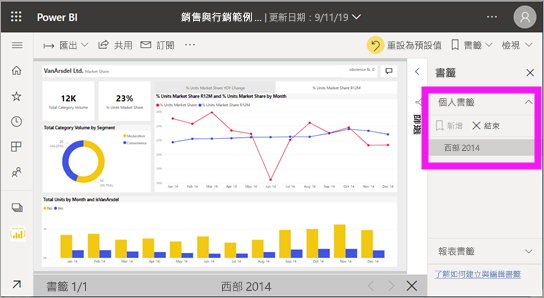

# 什麼是書籤？

[!INCLUDE[consumer-appliesto-ynnm](../includes/consumer-appliesto-ynnm.md)]

[!INCLUDE [power-bi-service-new-look-include](../includes/power-bi-service-new-look-include.md)]

書籤會擷取目前設定的報表頁面檢視，包括篩選、交叉分析篩選器，以及視覺效果的狀態。 當您選取書籤時，Power BI 會將您帶回到該檢視。 有兩種類型的書籤：您自行建立的書籤和由報表「設計師」  建立的書籤。 所有的 Power BI 使用者皆可建立個人書籤。 但需有 Power BI Pro 或 Premium 授權才能使用其他人建立的書籤。 [我有哪些授權？](end-user-license.md)

## 在 Power BI 中使用書籤來共用深入解析並建立故事 
書籤有許多用途。 假設您發現一個有趣的見解，且想要加以保留，請建立一個書籤，讓您可以稍後返回。 必須離開且想要保留目前的工作，請建立書籤。 您甚至可以將書籤設為報表的預設檢視，因此每次返回時，都會先開啟報表頁面的此檢視。 

您也可以建立書籤集合，依您想要的順序加以排列，然後在簡報中逐步執行每個書籤，以醒目提示一系列述說故事的見解。  

![從功能區中選取 [書籤] 窗格加以顯示。](media/end-user-bookmarks/power-bi-select-bookmark.png)

## 開啟書籤
若要開啟 [書籤] 窗格，請從功能表列選取 [書籤]   > [顯示更多書籤]  。 若要返回報表的原始發佈檢視，請選取 [重設為預設]  。

### 報表書籤
如果報表「設計師」  包含報表書籤，則您會在 [報表書籤]  標題底下找到這些書籤。 此報表頁面有兩個書籤 (B1 和 B2)。 

> [!NOTE]
> 您需要有 Power BI Pro 或 Premium 才能檢視共用報表。 

選取要變更為該報表檢視的書籤。 

### 個人書籤

當您建立書籤時，下列項目會與書籤一起儲存：

* 目前頁面
* 篩選器
* 交叉分析篩選器，包括交叉分析篩選器類型 (例如，下拉式清單或清單) 和交叉分析篩選器狀態
* 視覺效果選取狀態 (例如交叉醒目提示篩選條件)
* 排序次序
* 鑽研位置
* 可見度 (使用 [選取]  窗格之物件的可見度)
* 任何可見物件的焦點或**聚焦**模式

以您想要在書籤中顯示的方式來設定報表頁面。 將報表頁面和視覺效果排列成您想要的方式之後，從 [書籤]  窗格中選取 [新增]  以新增書籤。 在此範例中，我們新增了一些區域和日期的篩選條件。 

**Power BI** 會建立個人書籤，並為其提供泛型名稱或您輸入的名稱。 您可以選取書籤名稱旁的省略符號，然後從出現的功能表中選取一個動作，以「重新命名」  、「刪除」  或「更新」  書籤。

一旦有了書籤，只要在 [書籤]  窗格中選取書籤，就可以加以顯示。 

<!--
## Arranging bookmarks
As you create bookmarks, you might find that the order in which you create them isn't necessarily the same order you'd like to present them to your audience. No problem, you can easily rearrange the order of bookmarks.

In the **Bookmarks** pane, simply drag-and-drop bookmarks to change their order, as shown in the following image. The yellow bar between bookmarks designates where the dragged bookmark will be placed.

The order of your bookmarks can become important when you use the **View** feature of bookmarks, as described in the next section. 

-->

## 以投影片放映書籤
若要依序顯示或檢視書籤，請從 [書籤]  窗格中選取 [檢視]  來開始投影片放映。

在 [檢視]  模式中，有一些需要注意的功能：

- 書籤的名稱會出現在畫布底部的書籤標題列中。
- 書籤標題列的箭號可讓您移至下一個或上一個書籤。
- 您可以從 [書籤]  窗格中選取 [結束]  ，或選取可在書籤標題列中找到的 **X**，來結束 [檢視]  模式。

當您在 [檢視]  模式時，您可以關閉 [書籤]  窗格 (藉由按一下該窗格上的 X)，為您的簡報提供更多空間。 此外，在 [檢視]  模式中，所有視覺效果都是互動式，並可用於交叉醒目提示，就像是與其互動一樣。 

<!--
## Visibility - using the Selection pane
With the release of bookmarks, the new **Selection** pane is also introduced. The **Selection** pane provides a list of all objects on the current page and allows you to select the object and specify whether a given object is visible. 

You can select an object using the **Selection** pane. Also, you can toggle whether the object is currently visible by clicking the eye icon to the right of the visual. 

When a bookmark is added, the visible status of each object is also saved based on its setting in the **Selection** pane. 

It's important to note that **slicers** continue to filter a report page, regardless of whether they are visible. As such, you can create many different bookmarks, with different slicer settings, and make a single report page appear very different (and highlight different insights) in various bookmarks.

## Bookmarks for shapes and images
You can also link shapes and images to bookmarks. With this feature, when you click on an object, it will show the bookmark associated with that object. This can be especially useful when working with buttons; you can learn more by reading the article about [using buttons in Power BI](../create-reports/desktop-buttons.md). 

To assign a bookmark to an object, select the object, then expand the **Action** section from the **Format Shape** pane, as shown in the following image.

Once you turn the **Action** slider to **On** you can select whether the object is a back button, a bookmark, or a Q&A command. If you select bookmark, you can then select which of your bookmarks the object is linked to.

There are all sorts of interesting things you can do with object-linked bookmarking. You can create a visual table of contents on your report page, or you can provide different views (such as visual types) of the same information, just by clicking on an object.

When you are in editing mode you can use ctrl+click to follow the link, and when not in edit mode, simply click the object to follow the link. 

## Bookmark groups

Beginning with the August 2018 release of **Power BI Desktop**, you can create and use bookmark groups. A bookmark group is a collection of bookmarks that you specify, which can be shown and organized as a group. 

To create a bookmark group, hold down the CTRL key and select the bookmarks you want to include in the group, then click the ellipses beside any of the selected bookmarks, and select **Group** from the menu that appears.

**Power BI Desktop** automatically names the group *Group 1*. Fortunately, you can just double-click on the name and rename it to whatever you want.

With any bookmark group, clicking on the bookmark group's name only expands or collapses the group of bookmarks, and does not represent a bookmark by itself. 

When using the **View** feature of bookmarks, the following applies:

* If the selected bookmark is in a group when you select **View** from bookmarks, only the bookmarks *in that group* are shown in the viewing session. 

* If the selected bookmark is not in a group, or is on the top level (such as the name of a bookmark group), then all bookmarks for the entire report are played, including bookmarks in any group. 

To ungroup bookmarks, just select any bookmark in a group, click the ellipses, and then select **Ungroup** from the menu that appears. 

Note that selecting **Ungroup** for any bookmark from a group takes all bookmarks out of the group (it deletes the group, but not the bookmarks themselves). So to remove a single bookmark from a group, you need to **Ungroup** any member from that group, which deletes the grouping, then select the members you want in the new group (using CTRL and clicking each bookmark), and select **Group** again. 
-->

## 限制與考量
在本版的**書籤**中，有幾點限制和考量要留意。

* 大部分的 Power BI 視覺效果都可以和書籤搭配使用。 如果在使用書籤和 Power BI 視覺效果時遇到問題，請連絡該 Power BI 視覺效果的建立者，並請他們將書籤的支援新增到其視覺效果。
* 如果您在建立書籤之後將視覺效果新增至報表頁面，視覺效果就會以其預設狀態顯示。 換句話說，如果您在先前建立書籤的頁面中引進交叉分析篩選器，交叉分析篩選器就會以其預設狀態運作。
* 一般來說，如果報表「設計師」  更新或重新發佈報表，您的書籤不會受到影響。 不過，如果設計師對報表進行重大變更 (例如移除書籤所使用的欄位)，則您下次嘗試開啟該書籤時，將會收到錯誤訊息。 

<!--
## Next steps
spotlight?
-->
