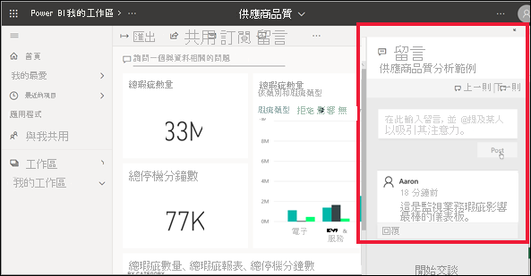
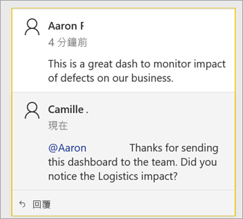
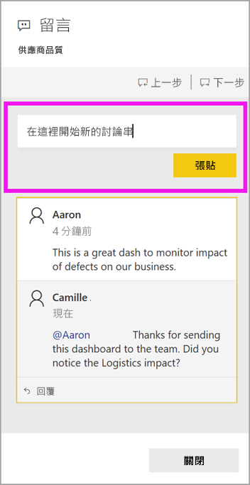
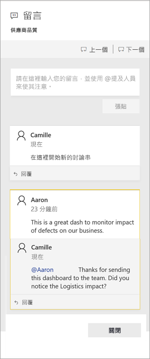
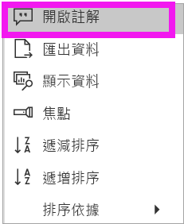

# 將註解新增至儀表板或報表

[!INCLUDE[consumer-appliesto-ynny](../includes/consumer-appliesto-ynny.md)]

[!INCLUDE [power-bi-service-new-look-include](../includes/power-bi-service-new-look-include.md)]

新增個人註解，或是和您的同事開始儀表板或報表相關交談。 **註解**功能只是「取用者」  可與其他人共同作業的其中一種方法。 

> [!NOTE]
> 需有 Power BI Pro 或 Premium 授權才可與其他人共同作業 (包括在共用報表新增留言)。 [我有哪種授權類型？](end-user-license.md)

## 如何使用註解功能
可以新增註解至整個儀表板、儀表板上的個別視覺效果、報表頁面、編頁報表，以及報表頁面上的個別視覺效果。 請新增一般註解或鎖定特定同事的註解。  

當您將註解新增至報表時，Power BI 會擷取目前的篩選和交叉分析篩選器的值。 這表示當您選取或回應註解時，報表頁面或報表視覺效果可能會變更，以顯示第一次新增註解時，使用中的篩選和交叉分析篩選器選取項目。  

為什麼這很重要？ 假設有一位同事套用了篩選，以顯示他們想要與小組共用的有趣見解。 若未選取該篩選，註解可能沒有意義。

如果您使用編頁報表，則只能留下有關報表的一般註解。  不提供對個別編頁報表視覺效果留言的支援。

### 將一般註解新增至儀表板或報表
將註解新增至儀表板或報表的處理程序很類似。  在本例中，我們使用儀表板。 

1. 開啟 Power BI 儀表板或報表，然後選取**註解**圖示。 這會開啟 [註解] 對話方塊。

    

    在此我們會看到儀表板建立者已新增一般註解。  有權存取此儀表板的任何人都可以看到此註解。

    

2. 若要回應，請選取 [回覆]  ，鍵入您的回應，然後選取 [張貼]  。  

    

    根據預設，Power BI 將引導您回應發起註解討論串的同事，在本例中為 Aaron。 

    

 3. 如果您想要新增不屬於現有討論串的註解，請在上方文字欄位中輸入您的註解。

    

    此儀表板的註解現在看起來如下。

    

### 將註解新增至特定儀表板或報表的視覺效果
除了將註解新增至整個儀表板或整個報表頁面之外，您還可以將註解新增至個別儀表板磚和個別報表視覺效果。 處理程序很類似，且我們在本範例中使用報表。

1. 將滑鼠暫留在視覺效果上並選取 [更多選項]  (...)。    
2. 從下拉式清單中，選取 [開啟註解]  。

      

3.  [註解]  對話方塊隨即開啟，且頁面上的其他視覺效果會呈現灰色。此視覺效果還沒有任何註解。 

      

4. 鍵入您的註解，然後選取 [張貼]  。

      

    - 在報表頁面上，選取在視覺效果上所輸入的註解即會醒目提示該視覺效果 (如上所示)。

    - 在儀表板上，圖表圖示  可讓我們知道註解會繫結至特定的視覺效果。 套用到整個儀表板的註解沒有特殊圖示。 選取圖表圖示會醒目提示儀表板上的相關視覺效果。
    

    

5. 按一下 [關閉]  返回儀表板或報表。

### 使用 @ 符號吸引同事注意
不論您是建立儀表板、報表、磚或視覺效果的註解，請使用 "\@" 符號來吸引同事注意。  當您鍵入 "\@" 符號時，Power BI 會開啟下拉式清單，您可以在其中搜尋並選取組織中的個人。 任何前面加上 "\@" 符號的已驗證名稱都會以藍色字型顯示。 

以下是我和視覺效果「設計師」  進行的交談。 他們會使用 @ 符號，確保我看到註解。 我知道這個註解是寫給我看的。 當我在 Power BI 中開啟這個應用程式儀表板時，從標頭選取 [註解]  。 [註解]  窗格會顯示我們的交談。

  

## 後續步驟
回到[適用於取用者的視覺效果](end-user-visualizations.md)    
<!--[Select a visualization to open a report](end-user-open-report.md)-->
