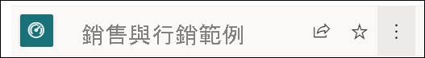
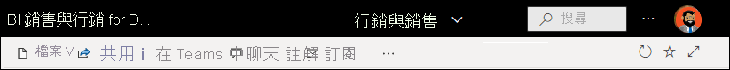
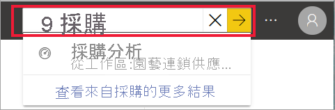
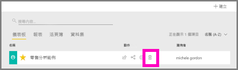

# 快速入門 - 瀏覽 Power BI 服務

[!INCLUDE [power-bi-service-new-look-include](../includes/power-bi-service-new-look-include.md)]

您現在已經知道 [Power BI 的基本概念](end-user-basic-concepts.md)，讓我們來瀏覽 **Power BI 服務** 。 如先前文章中所述，您小組中的同事可能將所有時間都花費在 **Power BI Desktop** 上，用來合併資料，並為其他人建立報表、儀表板與應用程式。 這些同事就是「設計師」。 另一方面，您可能將所有時間都花費在 Power BI 服務上，用來檢視其他人所建立的內容並與之互動 ( **取用** 體驗)。 則您是「商務使用者」。 此快速入門適用於「商務使用者」。 

   
 
## 必要條件

- 如果您尚未註冊 Power BI，請先進行[免費註冊](https://app.powerbi.com/signupredirect?pbi_source=web)再開始。

- 請閱讀 [Power BI 服務基本概念](end-user-basic-concepts.md)

- 若要檢視「設計師」所建立的 Power BI 內容 (報表、儀表板、應用程式)，需要下列兩個條件之一：
    - Power BI Pro 授權
    - 您的組織必須具備 Power BI Premium 訂用帳戶，以及透過 Premium 容量來與您共用的內容。    
    [了解授權和訂用帳戶](end-user-license.md)。     

    基於此快速入門的目的，我們不需符合上述任一條件。 Microsoft 已為您提供可直接從 Power BI 服務介面取得的範例內容。 我們將使用此範例內容來了解 Power BI 服務。 

## 開啟 Power BI 服務

若要開始，請開啟 Power BI 服務 (app.powerbi.com)。 
1. 如果左瀏覽窗格已摺疊，請選取瀏覽窗格圖示  加以展開。 

1. 從左下角選取 [取得資料]。 我們將擷取一些範例資料，以用於瀏覽 Power BI 服務。 我們提供所有類型的範例資料供您探索，這次我們將使用行銷與銷售的相關資料。 

   ![螢幕擷取畫面顯示 [取得資料] 的按鈕。](./media/end-user-experience/power-bi-get-data.png)

1. 在 [取得資料] 畫面開啟之後，選取 [範例]。

   ![螢幕擷取畫面顯示 [取得資料] 畫面，其中會以紅色方塊將 [範例] 框起來。](./media/end-user-experience/power-bi-sample.png)

1. 選取 [銷售與行銷] > [連線]。 

   ![螢幕擷取畫面顯示已選取 [銷售與行銷] 範例。](./media/end-user-experience/power-bi-sales.png)

5. Power BI 服務會在 [我的工作區] 中安裝範例。  [我的工作區] 是您用來學習及實驗的私人沙箱。  只有您可以看見 [我的工作區] 中的內容。 此範例包含一個儀表板、一份報表與一個資料集。 一般來說，「商務使用者」將不會接收到資料集，但此範例是針對所有使用者設計，並確實包含一個。

    ![螢幕擷取畫面顯示 Power BI [應用程式] 畫面，其中包含名為「銷售與行銷範例」的應用程式。](./media/end-user-experience/power-bi-new-sample.png)

    身為「商務使用者」，大部分與您共用的內容都不會包含直接存取底層資料集的權限。 由於 Power BI 範例是針對所有的 Power BI 客戶建立，因此會包含資料集。   

    若要深入了解範例，請參閱[取得 Power BI 的範例](../create-reports/sample-datasets.md)。

## 檢視內容 (儀表板和報表)
內容會在工作區的上下文中加以組織。 每個商務使用者至少都有一個工作區，稱為 **我的工作區** 。 當「設計師」同事與您共用內容時，您最後可能會有額外的工作區。  例如，如果「設計師」將存取其中一個工作區的存取權限指派給您，該工作區將會顯示在您的 Power BI 網站中。  

[我的工作區] 會儲存您擁有並建立的所有內容。 請將它視為您專屬內容的個人沙箱或工作區域。 針對許多 Power BI「商務使用者」，[我的工作區] 會保持空白，因為您的作業不會牽涉到建立新內容。  根據定義，「商務使用者」會取用其他人所建立的資料，並使用該資料來制定商務決策。 如果您發現正在建立內容，請考慮改為閱讀[適用於「報表建立者」  的 Power BI 文章](../index.yml)。

工作區不僅是簡單的內容清單。 在此頁面上，您可以深入了解工作區的儀表板和報表。 請花幾分鐘的時間來識別內容擁有者、上次重新整理的日期、資料敏感度與簽署 (如果有的話)。 選取 [其他動作 (...)]，以顯示儀表板與報表的動作清單。   

若要深入了解，請參閱[工作區](end-user-workspaces.md)。

![針對報表顯示 [其他動作] 功能表的應用程式工作區畫面](./media/end-user-experience/power-bi-more-actions.png)

工作區也是您資料的其中一個路徑。 從工作區，您可以從清單中選取儀表板或報表加以開啟。  您可以將游標暫留在星號圖示上並選取該圖示，以將儀表板或報表設為我的最愛。 如果「設計師」已為您提供[共用權限](end-user-shared-with-me.md)，則您也可以從這裡共用。 

1. 選取儀表板的名稱加以開啟。 儀表板是 Power BI 服務與 Power BI Desktop 的不同之處。 [了解儀表板](end-user-dashboards.md)

    

2. 您可以在儀表板上執行的動作均顯示於頂端功能表列中。    

    

3. 將滑鼠暫留在儀表板磚上，然後選取 [其他選項 (...)] 以查看可與該磚互動的選項。

    

4. 選取儀表板磚，以開啟用來建立該磚的報表。 此報表會開啟為包含磚上視覺效果的頁面。 在這裡，我選取了含有樹狀圖的儀表板磚。 Power BI 服務會開啟 [年初迄今類別] 報表頁面。

    

    報表有數個區段。 左側是可按式報表頁面清單。 頂端則是包含您可對報表採取之動作的功能表列。  可用的選項將取決於報表「設計師」指派給您的角色與權限。 右側是 [篩選] 窗格。 中間畫布則包含報表本身。 與儀表板類似，您可以針對整份報表、針對個別視覺效果，以及針對單一報表頁面採取動作。 

    了解報表 [Power BI 報表](end-user-reports.md)。

## 使用左側瀏覽窗格
當同事與您共用內容時，瀏覽窗格將變得更有用。 在這一節的快速入門中，我們會暫時將「銷售與行銷」範例放在一旁，並查看屬於擁有許多共用內容之 Power BI「商務使用者」的儀表板與報表。

1. 當您登入 Power BI 服務時， **首頁** 是預設登陸頁面。 首頁是瀏覽內容的絕佳跳躍點與替代方式。 首頁上的內容會依我的最愛、最近、常用與精選來組織。 首頁也會顯示您最近使用的工作區與應用程式。 只需選取一個項目，即可加以開啟。

    [首頁] 結合搜尋和排序工具、瀏覽窗格，以及具有「卡片」  的畫布，讓您可以選擇用來開啟儀表板、報表和應用程式。 一開始，您在 [首頁] 畫布上可能沒有太多的卡片，但當開始與同事使用 Power BI 時，此情況就會改變。 您的 [首頁] 畫布也會以建議的內容和學習資源進行更新。

   

    若要深入了解，請參閱 [Power BI 首頁](end-user-home.md)。

2. [我的最愛] 與 [最近] 都含有箭號。 選取箭號，以快速查看前五名我的最愛或五名最近曾瀏覽過的內容。 從飛出視窗中，選取內容予以開啟。 

   ![[最近] 內容的飛出視窗清單。](./media/end-user-experience/power-bi-recent.png)

    若要查看 [我的最愛] 或 [最近] 的完整清單，請選取該單字或圖示。 這些內容清單會提供有關報表、應用程式與儀表板的其他詳細資料。

    ![[我的最愛] 的內容清單。](./media/end-user-experience/power-bi-favorites.png)

    若要深入了解，請參閱 [Power BI 中的 [最近]](end-user-recent.md) 與 [Power BI 中的 [我的最愛]](end-user-recent.md)。

4. 選取 [應用程式]，以顯示已與您共用或您已安裝的所有應用程式。 然後選取 [與我共用]，以顯示已與您共用的儀表板與報表。 由於您才剛開始使用 Power BI 服務，因此這些內容區域將是空的。 

    了解[應用程式](end-user-apps.md)和[與我共用](end-user-shared-with-me.md)。

### 搜尋和排序內容
開始使用 Power BI 服務時，您只會有一些內容。 但當同事開始與您共用內容，而您開始下載應用程式時，您可能就會有多內容。 這就是您發現搜尋和排序非常有幫助的時候了。

Power BI 服務的幾乎每個部分都可以使用搜尋。 只要尋找搜尋方塊或搜尋放大鏡圖示即可。    

在 [搜尋] 欄位中，輸入儀表板、報表、活頁簿、應用程式或擁有者的全部或部分名稱。 Power BI 會搜尋您的所有內容。

也有許多排序內容的方式。 將游標暫留在資料行標頭上，並尋找指出資料行可以進行排序的箭號。 並非所有資料行都可以進行排序。 

![[類型] 資料行標頭旁的箭號](./media/end-user-experience/power-bi-sort-icon.png)

或者，尋找內容清單右上角附近的搜尋 [篩選]。 從內容類型、擁有者或任何其他可用欄位中選取，以快速尋找內容。

若要深入了解，請參閱 [Power BI 導覽：搜尋和排序](end-user-search-sort.md)

## 尋找擁有者
我們將以實用的提示來結束此快速入門。 如果您對於儀表板、報表或應用程式有任何疑問，您可以查閱擁有者。 開啟內容之後，選取 [標題] 下拉式清單以顯示擁有者。 擁有者可以是個人或群組。

![[首頁] 畫布](./media/end-user-experience/power-bi-owner.png)

## 清除資源
完成此快速入門後，您可視需要刪除範例儀表板、報表和資料集。

1. 開啟 Power BI 服務 (app.powerbi.com) 並登入。    
2. 開啟 Power BI 首頁、向下捲動，然後選取 [我的工作區]。      

3. 將游標暫留在儀表板、報表或資料集上，然後選取 [更多選項 (...)]   > [刪除]  。 重複執行，直到移除所有三項。

    

## 後續步驟

> [!div class="nextstepaction"]
> [Power BI 服務中的閱讀檢視](end-user-reading-view.md)
