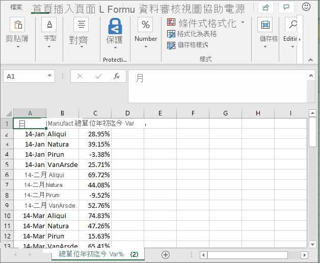
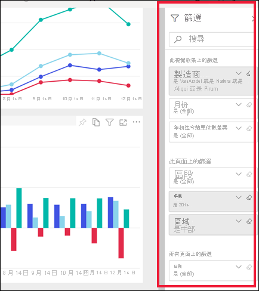
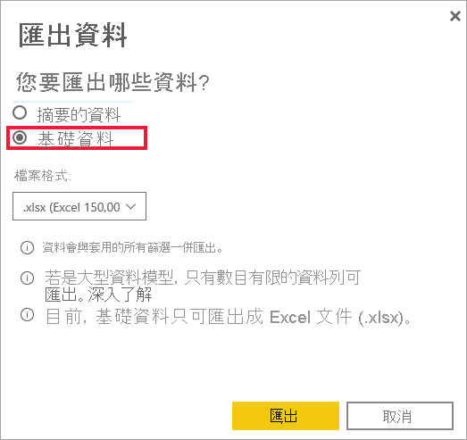

# 匯出視覺效果的資料

[!INCLUDE[consumer-appliesto-yyny](../includes/consumer-appliesto-yyny.md)]

若要查看用來建立視覺效果的資料，[您可在 Power BI 中顯示該資料](end-user-show-data.md)或將其匯出至 Excel。 本文說明如何匯出至 Excel。

將資料匯出至 Excel 需要 Power BI Pro 的授權，或讓儀表板或報表與您共用使用 Premium 容量。 若要深入了解，請參閱[我擁有哪些授權？](end-user-license.md)。 

> [!IMPORTANT]
> 如果您無法匯出至 Excel，報表作者或您的 Power BI 系統管理員可能已停用這項功能。 這通常是為了保護私用資料而進行。

## 從儀表板上的視覺效果匯出資料

1. 從 Power BI 儀表板上開始。 在這裡，我們使用來自 ***行銷與銷售範例** _應用程式的儀表板。 您可以[從 AppSource.com 下載此應用程式](https://appsource.microsoft.com/en-us/product/power-bi/microsoft-retail-analysis-sample.salesandmarketingsample)。

    

2. 將滑鼠暫留在視覺效果上方以顯示_ [更多選項]* (...)，然後按一下以顯示動作功能表。

    

3. 選取 [匯出至 .csv]。

4. 後續步驟取決於所正在使用的瀏覽器。 系統可能會提示儲存檔案，或您可能會在瀏覽器底部看到所匯出檔案的連結。 根據預設，您的匯出會儲存到本機的 [下載] 資料夾中。 

    

5. 在 Excel 中開啟檔案。 

    > [!NOTE]
    > 如果您沒有資料的權限，就無法以 Excel 匯出或開啟。 請聯絡儀表板擁有者或您的 Power BI 系統管理員，以要求匯出許可權。 

    

## 從報表中的視覺效果匯出資料
您可以從報表中的視覺效果將資料匯出為 .csv 或 .xlsx (Excel) 格式。 

1. 在儀表板上，選取圖格來開啟基礎報表。  在此範例中，我們選取與上方相同的視覺效果的「年初迄今單位總量差異 %」。 

    

    因為此圖格是從「銷售與行銷範例」報表建立的，所以會開啟該報表。 而且，報表會開啟到包含所選圖格視覺效果的頁面。 

2. 在報表中選取視覺效果。 請注意右邊的 [篩選] 窗格。 此視覺效果已套用篩選。 若要深入了解篩選，請參閱[在報表中使用篩選](end-user-report-filter.md)。

    

3. 選取視覺效果右上角的 [更多選項 (...)]。 選擇 [匯出資料]。

    ![下拉式清單中已選取的 [匯出資料]](media/end-user-export/power-bi-export-reports.png)

4. 您會看到匯出摘要資料或基礎資料的選項。 如果您使用的是「銷售與行銷範例」應用程式，將會停用 [基礎資料]。 需要額外的許可權，才能查看比 visual (基礎資料) 中顯示更多的資料。 這些許可權可保護資料免于遭到不當地查看、重複使用，或與非預期物件的人共用。

    **摘要的資料**：如果您想要匯出在該視覺效果中目前所看到內容的資料，請選取此選項。  此類型匯出只會顯示用來建立視覺效果目前狀態的資料。 如果視覺效果已套用篩選，則您匯出的資料也會經過篩選。 例如，針對此視覺效果，您的匯出只會包含 2014 年和中部區域的資料，且只有四個製造商的資料：VanArsdel、Natura、Aliqui 和 Pirum。 如果視覺效果具有彙總 (加總、平均值等)，則匯出也會彙總。 
  

    **基礎資料**：如果您想要匯出視覺效果中所見的資料 **和** 來自基礎資料集的其他資料，請選取此選項。  這可能包括資料集所包含但未在視覺效果中使用的資料。 如果視覺效果已套用篩選，則您匯出的資料也會經過篩選。  如果您的視覺效果有彙總 (加總、平均值等)，則匯出將會移除彙總；基本上會將資料扁平化。 

    

5. 後續步驟取決於所正在使用的瀏覽器。 系統可能會提示您儲存檔案，或者您可能會在瀏覽器底部看到所匯出檔案的連結。 如果您在 Microsoft Teams 中使用 Power BI 應用程式，則匯出的檔案會儲存在本機的 [下載] 資料夾中。 

    

    > [!NOTE]
    > 如果您沒有資料的權限，就無法以 Excel 匯出或開啟。 請聯絡報表擁有者或您的 Power BI 系統管理員，要求匯出許可權。 

6. 在 Excel 中開啟檔案。 比較從儀表板上相同視覺效果匯出的資料量。 差別在於此匯出包含 **基礎資料**。 

    

## 考量與疑難排解
匯出至 Excel 有許多相關考慮。 這是報表設計師和 Power BI 系統管理員可能會針對個人或甚至整個組織停用的其中一項功能。 他們會這麼做，以確保私用資料不會公開給錯誤的物件。 

如果您發現無法使用這項功能，請與報表擁有者和您的系統管理員聯繫，以瞭解為何無法從特定視覺效果或從所有視覺效果匯出資料。 這可能是因為這項功能已刻意停用，而且可能會為您啟用。  有時候，匯出無法正常運作的原因可能有某些。  它可能與許可權、資料內容、資料類型、視覺效果類型、設計工具命名欄位的方式以及更多相關。 當您聯絡報表擁有者或系統管理員時，請參閱這些文章：系統 [管理員租使用者設定](../guidance/admin-tenant-settings.md)、資料 [列層級安全性](../admin/service-admin-rls.md)和 [資料保護](../admin/service-security-data-protection-overview.md)。

- 可以匯出至 Excel 的資料列數目有限制。  若是 .xlsx 檔案，限制為150000個數據列。  若為 .csv 檔案，限制為30000個數據列。 

- 資料集可能會有 RLS (角色層級安全性) 套用至資料。 這表示某些資料可能會因為不適合您看到而隱藏。  例如，如果您是人員經理，HR 資料集可能會套用 RLS，只允許您查看直接向您報告的員工資料。 

- 不支援某些類型的視覺效果。 這些包括自訂視覺效果、R 視覺效果等等。 

## 後續步驟

[顯示用來建立視覺效果的資料](end-user-show-data.md)