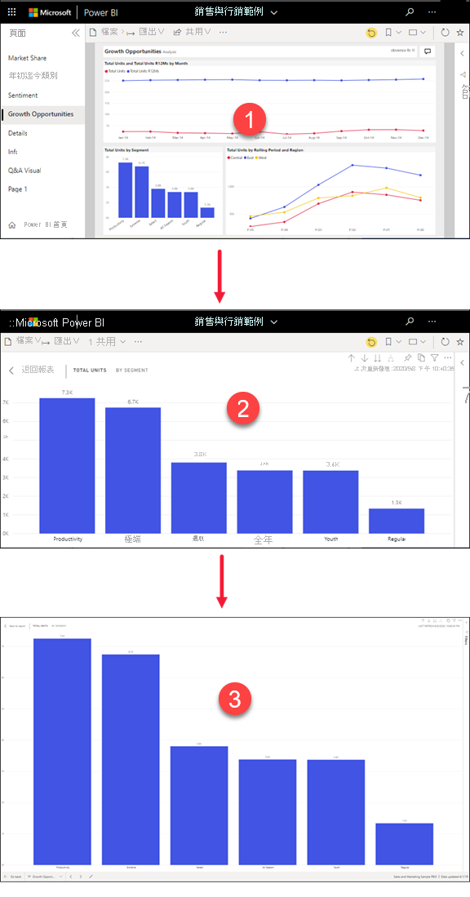
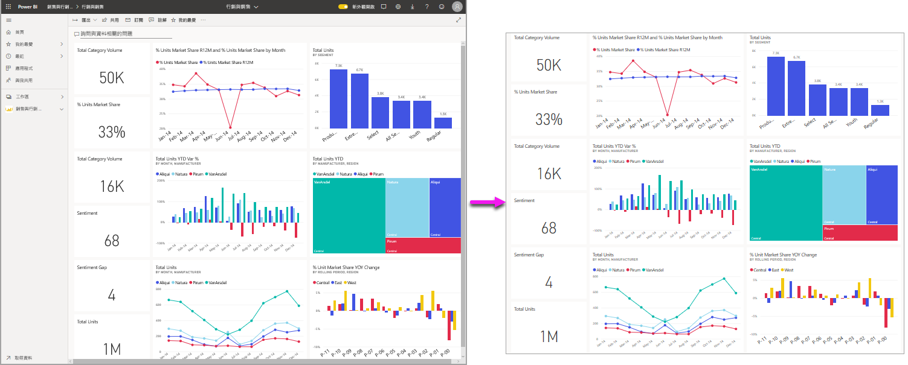
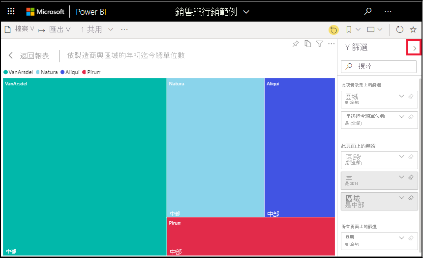
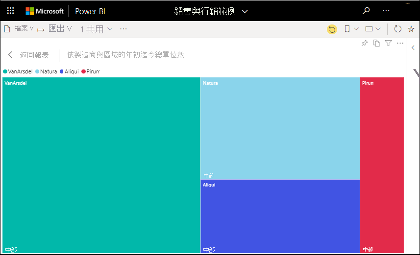

# 顯示更詳細的內容：焦點模式與全螢幕模式

[!INCLUDE [consumer-appliesto-yynn](../includes/consumer-appliesto-yynn.md)]

[!INCLUDE [power-bi-service-new-look-include](../includes/power-bi-service-new-look-include.md)]    

<iframe width="560" height="315" src="https://www.youtube.com/embed/dtdLul6otYE" frameborder="0" allowfullscreen></iframe>

焦點模式與全螢幕模式是可在您的視覺效果、報表和儀表板中查看更多詳細資料的兩種不同方式。  這兩種模式的主要差異在於，全螢幕會移除內容周圍的所有窗格，而焦點模式讓您仍能與視覺效果互動。 讓我們仔細查看相似性與差異性。  

|內容    | 焦點模式  |全螢幕模式  |
|---------|---------|----------------------|
|儀表板     |   不可能     | 是 |
|報表頁面   | 不可能  | 是|
|報表視覺效果 | 是    | 是 |
|儀表板磚 | 是    | 不可能 |
|Windows 10 Mobile | 不可能 | 是 |

在下面的範例中，我們會從報表 (1) 開始，以焦點模式 (2) 開啟其中一個視覺效果，然後在全螢幕模式 (3) 中開啟相同的視覺效果。 

## 使用全螢幕模式的時機

顯示您 Power BI 服務的內容 (儀表板、報表頁面及視覺效果) 而不受功能表和功能窗格所干擾。  您可隨時取得內容的完整檢視，而不含其他無關項目。 這有時稱為電視模式。   

如果您使用 Power BI 行動版，[Windows 10 行動裝置應用程式可使用全螢幕](./mobile/mobile-windows-10-app-presentation-mode.md)。 

全螢幕模式的部分用法如下：

* 在會議或研討會中呈現您的儀表板、視覺效果或報表
* 在辦公室的專用大螢幕或投影機上顯示
* 在小螢幕上檢視
* 以鎖定模式檢閱 -- 您可以透過觸控螢幕或用滑鼠點選磚，而不需要開啟基礎報表或儀表板

## 使用焦點模式的時機為何？

「焦點」*_模式可讓您展開 (彈出) 視覺效果或磚，以查看更多詳細資料。  您的儀表板或報表可能有點擁擠，而您只想放大其中一個視覺效果。  此時非常適合使用焦點模式。  

使用焦點模式時，Power BI「商務使用者」_*可與建立此視覺效果時所套用的任何篩選進行互動。  在 Power BI 服務中，您可以在儀表板磚或報表視覺效果上使用焦點模式。

## 以全螢幕模式運作

全螢幕模式適用於儀表板、報表頁面，以及報表視覺效果。 

- 若要以全螢幕模式開啟儀表板，請選取全螢幕圖示  (在頂端功能表列中)。 

- 若要以全螢幕模式開啟報表頁面，請選取 [檢視] > [全螢幕]。

    ![從 [檢視] 功能表選取 [全螢幕]](media/end-user-focus/power-bi-view.png)

- 若要以全螢幕模式查看視覺效果，請先以焦點模式開啟該視覺效果，然後選取 [檢視] > [全螢幕]。  

您選取的內容隨即會填滿整個螢幕。 當進入全螢幕模式後，請使用頂端和底部 (報表) 的功能表列，或移動游標時出現的功能表 (儀表板與視覺效果) 來進行瀏覽。 由於全螢幕適用於各式各樣的內容，所以瀏覽方式也會有所不同。   

  * 選取 [上一頁]、[返回]，或 [返回報表] 按鈕即可巡覽至瀏覽器中的上一頁。 如果上一頁是 Power BI 頁面，則也會以全螢幕模式顯示。  全螢幕模式會持續到您關閉全螢幕為止。

  *     
    使用 [全螢幕] 按鈕可用最大的大小顯示儀表板，而無須使用捲軸。  

    ![顯示 [全螢幕] 呈現方式的擷取畫面](media/end-user-focus/power-bi-fit-screen.png)

  *        
    有時候您會不在意捲軸，但希望儀表板能填滿整個可用空間的寬度。 選取 [符合寬度] 按鈕。    

    ![顯示 [調整寬度] 變更畫布呈現方式的螢幕擷取畫面。 ](media/end-user-focus/power-bi-fit-to-width-new.png)

  *        
    在全螢幕報表中，可使用這些箭頭在報表的頁面間移動。    
  *      
  若要結束全螢幕模式，請選取 **結束全螢幕** 圖示。

      

## 以焦點模式運作

焦點模式適用於儀表板磚和報表視覺效果。 

- 若要以焦點模式開啟儀表板磚，請將滑鼠指標暫留在儀表板磚或報表視覺效果上方，選取 [更多選項 (...)]，然後選擇 [以焦點模式開啟]。

    .. 

- 若要以焦點模式開啟報表視覺效果，請將滑鼠指標暫留在報表視覺效果上方，並選取 **焦點模式** 圖示 。  

   

此視覺效果會隨即開啟，並填滿整個畫布。 請注意，您仍有 [篩選] 窗格可與視覺效果互動。 [篩選] 窗格可以摺疊。

   

     

[修改篩選](end-user-report-filter.md)，然後在資料中尋找有趣的發現，以便進一步瀏覽。 因為您是「商務使用者」，所以無法新增篩選、變更視覺效果中使用的欄位，或建立新的視覺效果。  不過，您可以與現有的篩選互動。 

針對儀表板磚，您的變更無法儲存。 針對報表視覺效果，當您結束 Power BI 時，即會儲存您對現有篩選所做的任何修改。 如果您不想要讓 Power BI 記住您的修改，請選取 [重設為預設值]。   

選取 [結束焦點模式] 或 [回到報表] (位於視覺效果左上角)，以離開焦點模式並返回儀表板或報表。

![[結束焦點模式] 按鈕](media/end-user-focus/power-bi-exit.png)    

  

## 考量與疑難排解

* 在對報表中的視覺效果使用焦點模式時，您可以檢視所有篩選並與之互動：視覺效果層級、頁面層級、鑽研和報表層級。    
* 在對儀表板上的視覺效果使用焦點模式時，您只能檢視視覺效果層級的篩選並與之互動。

## 後續步驟

[檢視報表的設定](end-user-report-view.md)