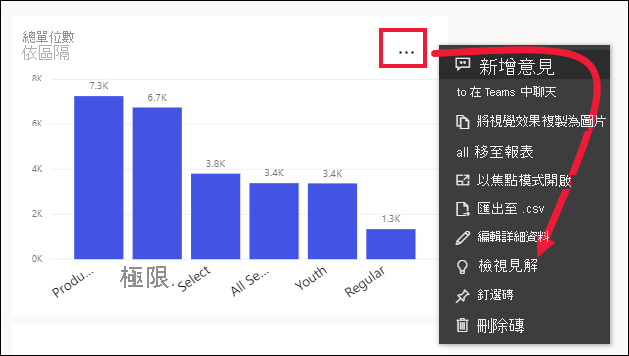
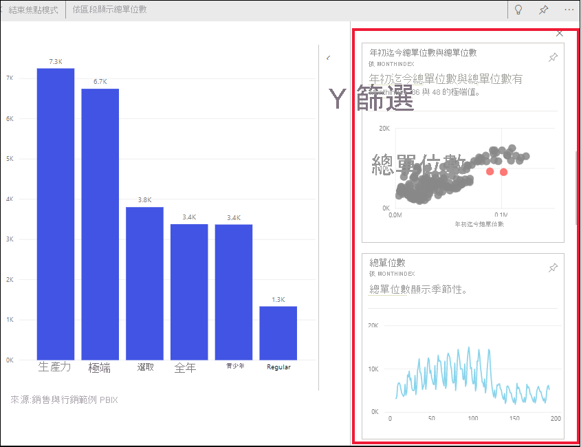

# 使用 Power BI 在儀表板圖格上檢視資料見解

[!INCLUDE[consumer-appliesto-yyny](../includes/consumer-appliesto-yyny.md)]

儀表板上每個視覺效果[磚](end-user-tiles.md)都是資料探索的入口。 當您選取磚時，磚會開啟報表或[開啟問與答](end-user-q-and-a.md)，您可以在其中篩選和排序報表後方的資料集，並深入挖掘。 當您執行見解時，Power BI 會為您探索資料。

![顯示 [檢視深入資訊] 選項的省略符號功能表模式](./media/end-user-insights/power-bi-insight.png)

您可以執行見解以根據資料產生相關的互動式視覺效果。 您可對特定的儀表板磚執行見解，甚至可以對見解執行深入解析！

見解功能的建置基礎是一組會持續完善的[進階分析演算法](end-user-insight-types.md)，該演算法是與 Microsoft Research 合作開發，且會持續使用，讓更多人能透過全新的直覺式方式在資料中尋找見解。

## 對儀表板磚執行深入解析
當您對儀表板磚執行見解時，Power BI 只會搜尋用來建立這一個儀表板磚的資料。 

1. [開啟儀表板](end-user-dashboards.md)。
2. 將游標停留在磚上方， 選取 [更多選項] (...)，然後選擇 [檢視見解]。 

    

3. 隨即在[焦點模式](end-user-focus.md)中開啟磚，而深入解析卡片會沿著右側顯示。    
   
        
4. 一個深入剖析是否引起您的興趣？ 選取該資訊摘要卡片可挖掘更深入的資料。 選取的資訊摘要會顯示於左側，只以該單一資訊摘要中資料為依據的新資訊摘要卡片則沿著右側顯示。    

 ## 與深入解析卡片互動
在您開啟見解之後，請繼續探索。

   * 篩選畫布上的視覺效果。  若要顯示篩選，請選取右上角的箭號來展開 [篩選] 窗格。

      ![展開 [篩選] 功能表的見解](./media/end-user-insights/power-bi-filter.png)
   
   * 對見解卡片本身執行見解。 這通常是指**相關的見解**。 選取要啟用的見解卡片。 卡片會移至報表畫布的左側，而只以單一見解中資料為基礎的新卡片則會在右側顯示。
   
      ![展開的 [篩選] 功能表與相關見解](./media/end-user-insights/power-bi-insights-card.png)
   
     
若要返回您的報表，請選取左上角的 [結束焦點模式]。

## 考量與疑難排解
- **檢視見解**並不適用於所有類型的儀表板磚。 例如，其不適用於 Power BI 自訂視覺效果。<!--[Power BI visuals](end-user-custom-visuals.md)-->

## 後續步驟

[使用 [分析] 功能](end-user-analyze-visuals.md)  在報表視覺效果上執行見解  
深入了解[可用深入資訊類型](end-user-insight-types.md)

