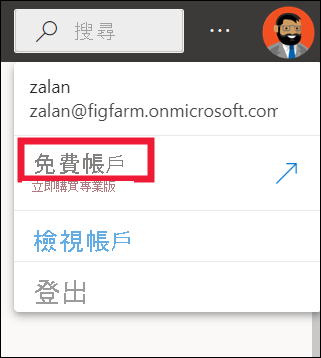
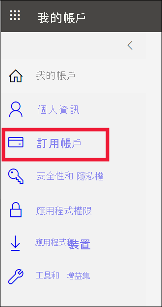
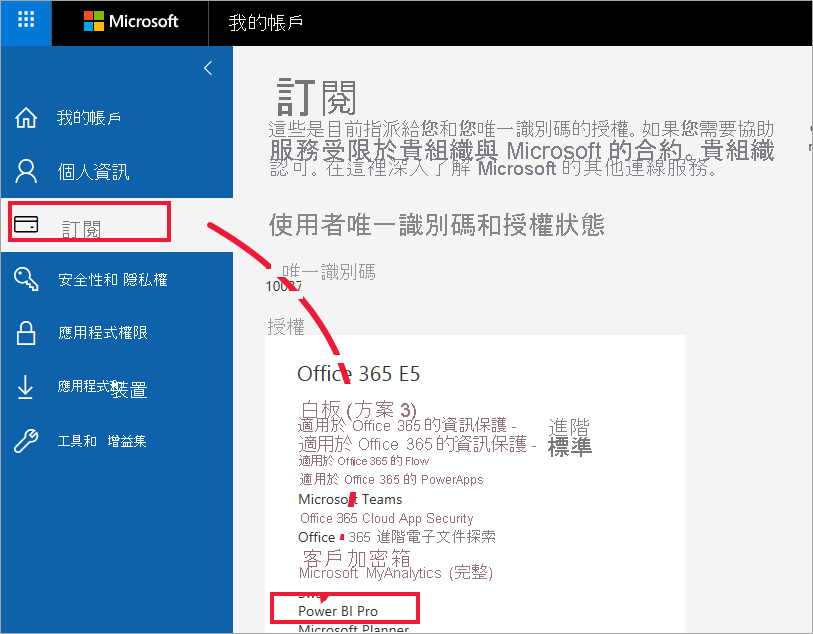
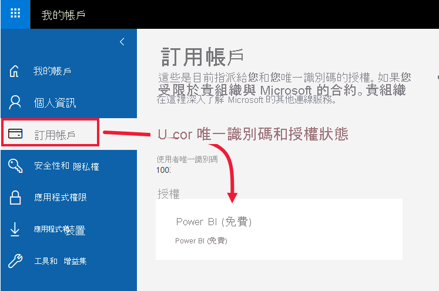
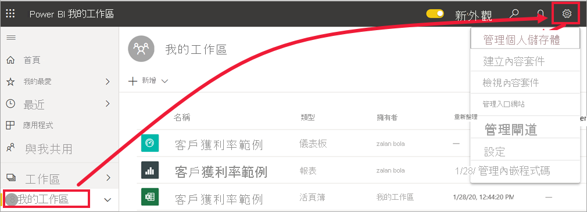
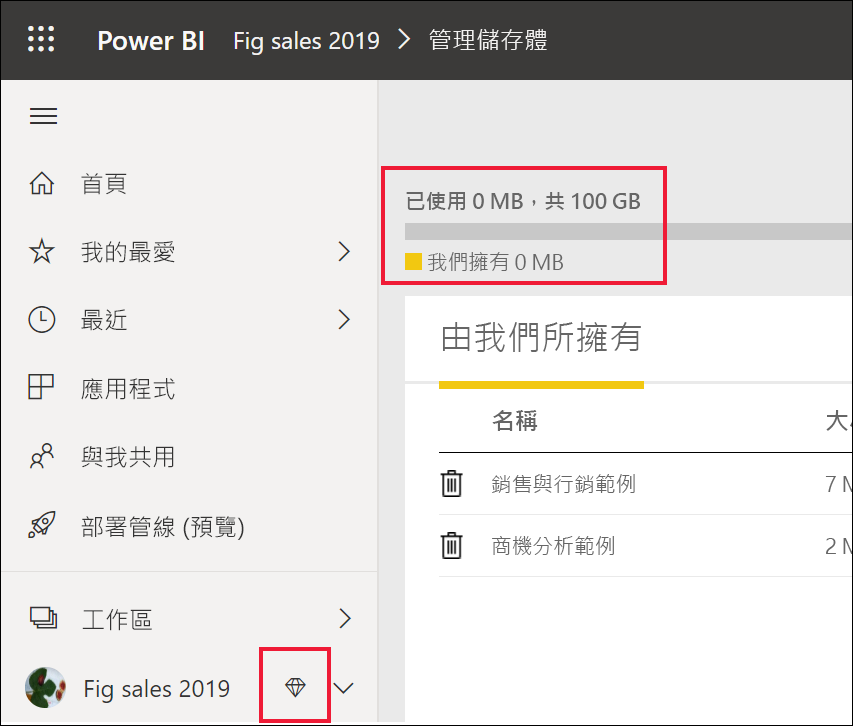
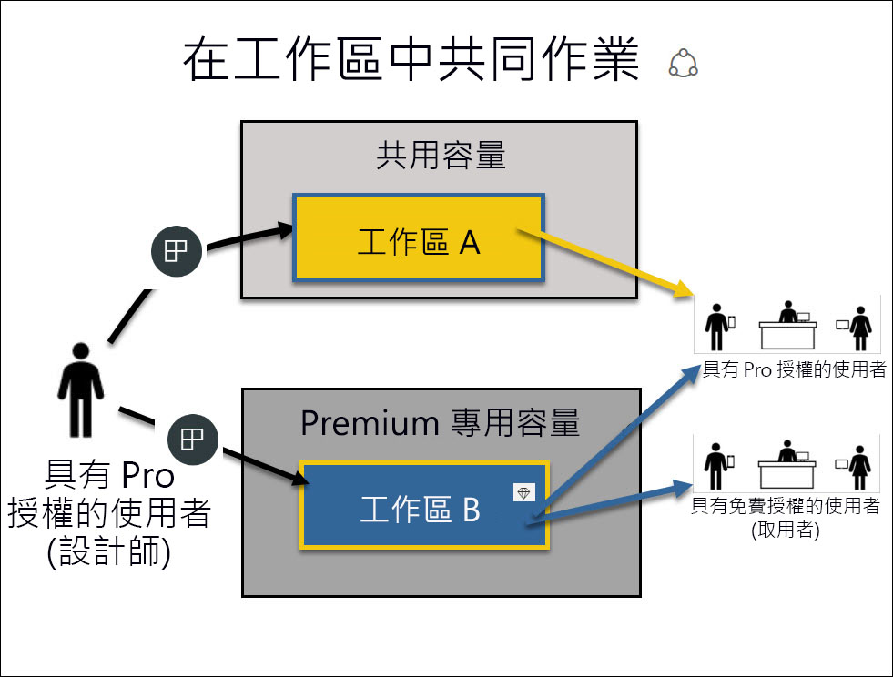

# 「商務使用者」的授權和訂閱

[!INCLUDE[consumer-appliesto-ynnn](../includes/consumer-appliesto-ynnn.md)]

身為[商務使用者](end-user-consumer.md)，您可以使用 Power BI 服務來探索報表與儀表板，從而透過參考資料來制定商務決策。 若已使用 Power BI 一段時間，或曾與「設計師」同事聊過，則可能會發現有些功能只在擁有特定類型的授權、訂閱或權限時才可運作。

您在 Power BI 服務中能執行哪些作業，取決於下列三個要件：
-    您使用的授權與訂用帳戶類型、
-    內容的儲存位置，以及
-    指派給您的角色與權限。

在此文章中，我們將描述各種授權類型的功能，以及「內容儲存位置」對於「您能執行的作業」，會造成哪些影響。 此外，您也將學習如何查詢您的授權與訂閱，以及了解內容的儲存位置。 如需角色與權限的詳細資訊，請參閱[工作區角色](end-user-workspaces.md)。

## 授權

Power BI 服務的每個使用者都有 *免費* 授權、 *Pro* 授權或 *Premium 每位使用者** 授權。 若您是 Power BI 的「商務使用者」，可能會使用由 Power BI 系統管理員所管理的免費授權。

您可能同時擁有多個授權。  此服務一律會提供與您目前所有最寬鬆授權相等的體驗。

## Power BI Premium 容量訂用帳戶

Premium 是組織 *訂* 用帳戶，可提供不同的方式來儲存內容，也就是在稱為 *容量* 的虛擬容器中。 在 Premium 容量中，不論許可權是在組織內部或外部的任何人，都可以查看儲存在此 Premium 容量中的內容，而不需購買個別的 Power BI Pro 或 Premium 的每個使用者授權。 

Premium 容量可讓 Pro 使用者廣泛地散發內容，而不需要為查看內容的收件者提供 Pro 授權。 在 Premium 容量中建立內容的人會使用 Pro 授權連接到資料來源、建立資料模型，以及建立儲存至 Premium 容量中工作區的報表和儀表板。 只要使用者獲指派 Power BI Premium 容量中[工作區的角色](end-user-workspaces.md)，即使沒有 Pro 授權仍然可加以存取。 如果工作區擁有者會根據該工作區中的內容建立應用程式，則沒有 Pro 授權的使用者仍然可以在 Premium 容量中看到該應用程式，只要他們已獲得該應用程式的許可權即可。 

在那些工作區中，設計師會指派角色，例如，**檢視者**、**參與者**、**成員** 與 **系統管理員**。 這些角色會決定每位同事能與內容互動的範圍。 如需詳細資訊，請參閱[工作區權限與角色。](end-user-workspaces.md) 

當設計工具建立併發布應用程式時，會將存取權授與整個組織或個人。 您可以與應用程式內容互動的範圍取決於指定給您的特定存取權限。 例如，您可能會獲得存取權來查看應用程式、連接到基礎資料集、建立報表的複本，或共用內容。

如需 Premium 容量的詳細資訊，請參閱[什麼是 Microsoft Power BI Premium？](../admin/service-premium-what-is.md)。

## 了解您擁有的授權
選取您的設定檔圖片以顯示帳戶資訊。 Zalan 使用免費授權。 其他類型的授權為：**每位使用者** 的 **Pro** 和 Premium。 

若要查看有關您帳戶的其他詳細資料，請選取 [檢視帳戶]。 

<!-- [Your Microsoft **My account** page](https://portal.office.com/account) opens in a new browser tab.  To see what licenses are assigned to you.  Select the tab for  **Subscriptions**.

This first user, Pradtanna, has Office 365 E5, which includes a Power BI Pro license.

This second user, Zalan, has a Power BI free license. 

 

## Find out if you have access to Premium capacity

Next, check to see if you're part of an organization that has Premium capacity. Either of the users above, Pro or free, could belong to an organization that has Premium capacity.  Let's check for our second user, Zalan.  

We can determine whether Zalan's organization has Premium capacity by looking up the amount of storage available. 

- In the Power BI service, select **My workspace** and then select the cog icon from the upper right corner. Choose **Manage personal storage**.

    

    If you see more than 10 GB, then you're a member of an organization that has a Premium subscription. The image below shows that Zalan's organization has up to 100 GB of storage. Zalan, personally, doesn't own 100GB as indicated by the heading **Owned by us**.  

    

    Notice that a Pro user has already shared a workspace with Zalan. The diamond icon shows that this workspace is stored in Premium capacity. 

    If you see any amount of storage, the words **Pro user** next to your name, and the heading **Owned by me**, then you have a Premium per-user license.  

    -->

## 找出裝載在 Premium 容量中的內容

有幾種方式可以識別儲存在 Premium 容量中的內容。 其中一種方式是尋找具有鑽石圖示的應用程式和應用程式工作區。 鑽石圖示表示此內容儲存在 Premium 容量中。 

在下圖的應用程式中，有三個儲存在 Premium 容量中。

![[應用程式] 畫面](media/end-user-license/power-bi-premium.png)

如果您是具有免費授權的使用者，只要「設計師」將工作區置於 Premium 的容量中，您就能 **在該工作區內** 檢視共用的內容、與同事共同作業、使用應用程式儀表板與報表等。 您的權限範圍由您的 Power BI 系統管理員與內容設計師設定。

## 總整理

組織有許多不同的方式可組織其 Power BI 訂用帳戶和授權。 從 *商務使用者* 的觀點來看，其中一個最常見的案例是當組織購買 Premium 訂用帳戶時，系統管理員會將 Pro 授權指派給一群使用者，而其他所有使用者則使用免費授權。 系統管理員通常會將 Pro 授權指派給將會建立及共用內容的員工。 Pro 使用者可以建立 [工作區](end-user-workspaces.md) ，並將內容 (儀表板、報表、資料集、應用程式) 到這些工作區。 若要允許免費使用者在這些工作區中共同作業，系統管理員或 Pro 使用者接著將工作區指派給 *Premium 容量*。  

|授權類型  |不在 Premium 容量中 | 進階容量  |
|---------|---------|---------|
|**免費**     |  以個人沙箱的形式使用，您可以在其中建立自己的內容，並與該內容互動。 免費授權是試用 Power BI 服務的絕佳方式。 您無法取用他人的內容，也無法與他人共用您的內容 1     |   與指派至 Premium 容量並與您共用的內容互動。 免費、高階的每位使用者和專業使用者可以共同作業，而不需要免費的使用者擁有 Pro 帳戶。      |
|**Pro**     |  藉由建立和共用內容，與 Premium 每位使用者和專業使用者共同作業。        |  藉由建立和共用內容，與免費、高階的每位使用者和 Pro 使用者共同作業。       |

1 請參閱[考量與疑難排解](#considerations-and-troubleshooting)。

在下列圖表中，左側代表在應用程式工作區中建立及共用內容的 Pro 使用者。

- 未在 Premium 容量中建立 **工作區 A** 。

- **工作區 B** 已建立並儲存在 Premium 容量中。 此工作區標示有鑽石圖示。  

    

Power BI Pro 的「設計師」可在這些工作區中的任一個工作區內，與其他 Pro 使用者共用及共同作業。 但 Power BI Pro 的使用者若要與免費使用者共用及共同作業，只能使用位於 Premium 容量中的「工作區 B」。  在該工作區內，設計師會為共同作業者指派角色。 您的角色會決定您可以在工作區內採取的動作。 Power BI「商務使用者」通常會獲指派「檢視人員」角色。 若要深入了解這些角色，請參閱 [Power BI 商務使用者的工作區](end-user-workspaces.md)。

## 考量與疑難排解

- 您可以同時擁有多個 Power BI 授權。 Power BI 服務提供給您的體驗，以您擁有的授權中，條件最佳者為準。 例如，若您同時擁有 Pro 授權與免費授權，Power BI 服務將會使用 Pro 授權。

- 如果您想要建立和共用內容 (儀表板、報表、應用程式) 或其他人與您共用的內容，則您需要擁有 Pro 使用者授權或每位使用者的 Premium。 您可以註冊 Power BI Pro 的 60 天個人免費試用版。 當您想要使用 Pro 功能時，可以隨時選取出現在 Power BI 服務中的升級對話方塊。

    

  當 60 天試用版到期時，您的授權將會回復成免費的 Power BI 授權。 您的授權還原之後，就無法再存取需要 Power BI Pro 授權的功能。 若要繼續使用 Pro 授權，請洽詢系統管理員或 IT 技術支援人員有關購買 Power BI Pro 授權的相關事宜。 若無系統管理員或 IT 技術支援人員，請瀏覽 [Power BI 定價頁面](https://powerbi.microsoft.com/pricing/)。

- 如果選取「免費試用」類型的按鈕來自行註冊免費授權，則其永遠不會到期。 因此，若升級為 Pro 試用版，或組織提供您 Pro 授權，則當試用版結束，或組織移除 Pro 授權時，除非取消授權，否則您仍可回復成免費授權。

- 1 Power BI 服務的免費使用者授權，十分適合使用 **我的工作區** 執行探索，或是執行個人資料分析與視覺效果的人員使用。 免費的獨立使用者無法使用 Power BI 與同事共同作業。 使用免費授權的獨立使用者無法檢視由他人所共用內容，也無法將自己的內容與其他 Power BI 使用者共用。

## 後續步驟

- [我是 Power BI「商務使用者」嗎？](end-user-consumer.md)    
- [深入了解工作區](end-user-workspaces.md)    
- [依授權類型檢視 Power BI 商務使用者功能](end-user-features.md)
