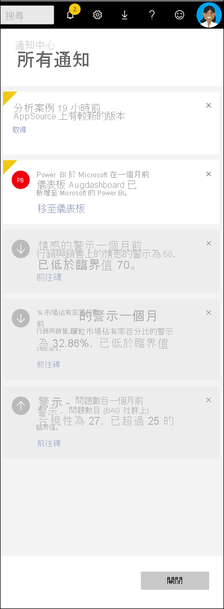

# 檢視 Power BI 通知

[!INCLUDE[consumer-appliesto-yynn](../includes/consumer-appliesto-yynn.md)]

Power BI 服務會持續追蹤自從您上次登入之後發生的事件。 這包括應用程式的更新、在儀表板上觸發的警示、有關 Power BI 事件和會議的資訊，以及新增至工作區的新內容。 這些事件的連續清單會儲存在您的 *通知中心*。 

當您準備好要審核通知時，請選取鐘圖示  . 最新的通知會列在最上方。 已查看的專案會以灰色顯示，且 unviewed 專案會反白顯示並具有黃色角落。   

觀看 Amanda 如何檢閱、管理及回應通知。 然後遵循影片下方的指示親自試試看。    

> [!NOTE]
> 這部影片會示範較舊版本的 Power BI 服務。 

<iframe width="560" height="315" src="https://www.youtube.com/embed/bZMSv5KAlcE" frameborder="0" allowfullscreen></iframe>

## 檢視您的通知
當您登入 Power BI 時，當您離線時所收到的任何新通知都會新增至摘要。 如果您有新的通知，Power BI 會顯示具有通知中心圖示上方新專案數目的黃色反升。 由於通知中心是 Power BI 服務頂端功能表列的一部分，您可以從 Power BI 服務的大部分區域開啟您的通知，包括首頁、最近專案、儀表板、報表、應用程式、工作區和 Power BI Q&畫面。

通知會基於各種原因傳送給您，而且通常也會透過電子郵件將相同的通知傳送給您。 
- 當應用程式已更新且有較新版本可供使用時
- 當新內容 (例如，儀表板、報表) 已新增至工作區
- 觸發 [警示](end-user-alerts.md) 時 (可以在 Power BI 服務中設定警示，也可以在 Power BI mobile apps 中設定警示。 ) ) 
- 還有更多

   
1. 在 [Power BI 服務] 功能表列中，選取鐘圖示。 在此範例中，使用者自上次開啟通知中心時，有兩個新的通知。
   
   
2. 最新通知會列在頂端，而且未讀取的訊息會有醒目提示。 通知會保留 90 天，除非您將其刪除，或是達到 100 則上限。
   
   

3. 閱讀通知並採取動作。 大部分的通知都包含一或多個使用中的連結。  下列範例包含儀表板的連結。

   

1. 當您不再需要通知時，請選取 X 圖示將其關閉。    

 
## 如何取消通知
某些通知會由 Power BI 服務自動傳送。 其他通知則由您的同事或您所建立。 您可以在讀取通知中心之前，從通知中心刪除所有通知。 但是，如果您經常收到某些通知，或您不再需要該資訊，則有方法可以取消傳遞。 

針對您或您的同事所建立的通知，您可以取消通知而不刪除它所參考的內容。 例如，若要在每次「每日銷售額總計」高於 $100 時停止接收警示，請從儀表板 [編輯或取消警示](end-user-alerts.md) 。 如果您的同事建立了警示通知，請與他們聯絡並要求移除。

## 後續步驟
* [Power BI 服務中的資料警示](end-user-alerts.md)
* [在 iPhone App (Power BI for iOS) 中設定資料警示](mobile/mobile-set-data-alerts-in-the-mobile-apps.md)
* [在 Power BI for Windows 10 行動裝置 App 中設定資料警示](mobile/mobile-set-data-alerts-in-the-mobile-apps.md)
* 有其他問題嗎？ [試試 Power BI 社群](https://community.powerbi.com/)

