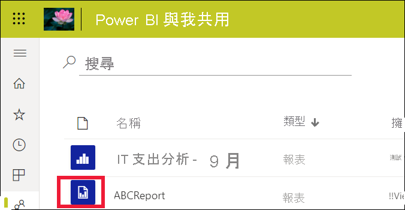
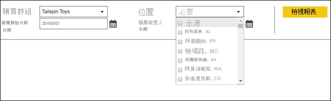
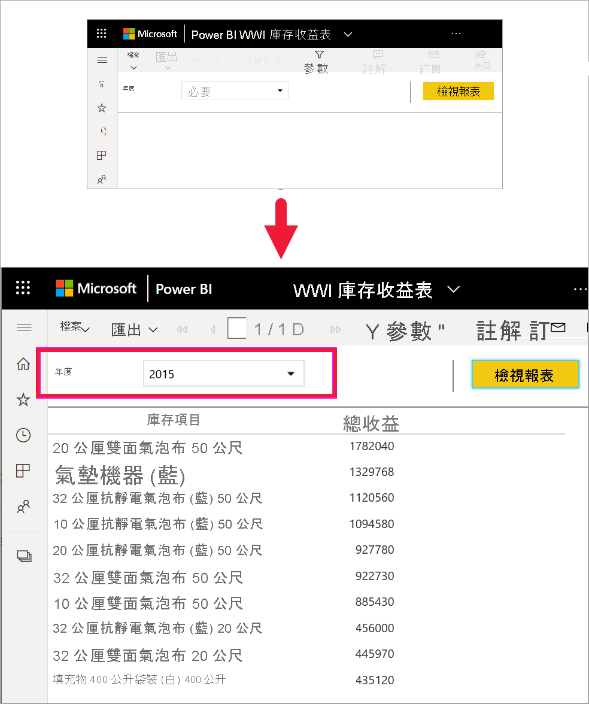
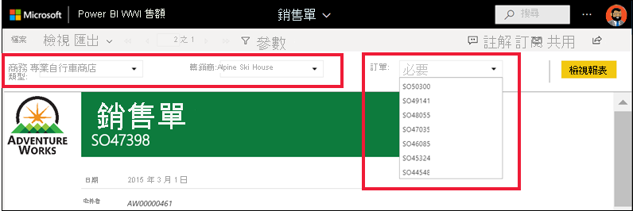
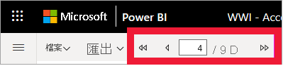
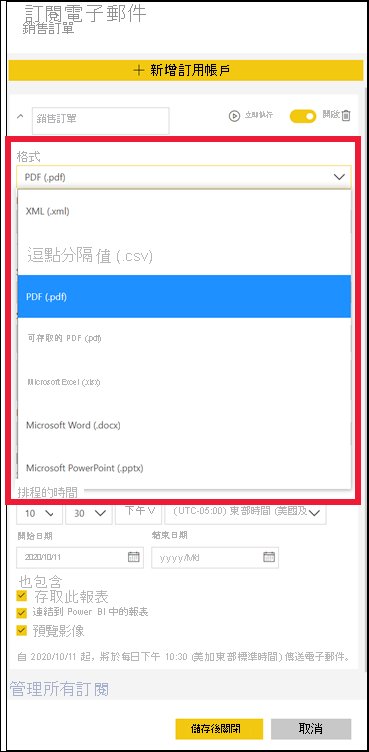

# Power BI 服務中的編頁報表

[!INCLUDE[consumer-appliesto-yyny](../includes/consumer-appliesto-yyny.md)]

您已了解 [Power BI 報表](end-user-reports.md)，這些是您最可能遇到的報表類型。 Power BI 報表已針對探索和互動進行最佳化。 銷售報表可讓不同的銷售人員針對其特定區域/產業/客戶，在同一份報表中為資料進行配量，並查看數字如何變化，而此報表最好透過 Power BI 報表來提供。

不過，還有另一種類型的報表，稱為「編頁報表」  。 接收及檢視編頁報表需要 Power BI Pro 授權，才能將報表儲存於 Premium 容量中。  [深入了解授權](end-user-license.md)。  

## 識別編頁報表

在內容清單中及 [首頁] 登陸頁面上，編頁報表可以透過其圖示  加以識別。  編頁報表可以直接與您共用，或作為 [Power BI 應用程式](end-user-apps.md)的一部分共用。 如果報表「設計師」  授與您權限，則您將能夠重新共用編頁報表，並為您自己和其他人訂閱。

## 什麼是編頁報表？

這些報表之所以稱為「編頁」  ，是因為其格式設定為適當符合列印頁面大小。 優點之一是即使資料表跨越多個頁面，這些報表也會以一個資料表來顯示所有資料。 編頁報表有時稱為「完美像素」，因為報表「設計師」可以完全控制報表頁面配置。

如果案例需要已高度格式化且具完美像素的輸出，並已基於列印或產生 PDF 用途進行最佳化，則最適合使用編頁報表。 損益表就是一個您可能想要查看以作為編頁報表之報表類型的良好範例。

## 編頁報表如何運作？

在建立編頁報表時，報表「設計師」  實際上是在建立「報表定義」  。 它不包含資料。 它會指定要取得資料的位置、要取得哪些資料，以及如何顯示資料。 當您執行報表時，報表處理器會採用報表定義、擷取資料，並結合報表配置來產生報表。 有時候，報表會顯示預設資料。 其他時候，您必須先輸入參數，報表才會顯示任何資料。 

選取編頁報表，以在 Power BI 服務中開啟。 如果報表具有參數，則您需要選取它們，才能檢視該報表。

   

這通常屬於互動範圍 - 設定參數。 如果您是計費分析師，則可使用編頁報表來建立或列印發票。 如果您是銷售經理，則可使用編頁報表來依商店或銷售人員檢視訂單。 

這個簡單的編頁報表會在選取 [年]  參數之後，產生該年度收益。 

相較於編頁報表，Power BI 報表的互動性較高。 Power BI 報表允許隨選報表，並支援更多類型的視覺效果，包括自訂視覺效果。

## 與編頁報表互動

您與編頁報表互動的方式不同於其他報表。 您可以執行列印、書籤、匯出和註解之類的動作，但互動性較低。 通常，編頁報表需要您的輸入才能填入報表畫布。  其他時候，報表會顯示預設資料，且您可以輸入參數來查看不同的資料。

### 列印編頁報表

「編頁」  報表的格式設定為適當符合頁面大小並可適當進行列印。 您在瀏覽器中看到的內容，就是您在列印時所看到的內容。 此外，如果報表有一個很長的資料表，則即使該資料表跨越多個頁面也會列印整個資料表。 

編頁報表可以有許多頁面。 例如，此報表有 563 頁。 每頁都有精確的版面配置，每個發票一頁並重複頁首和頁尾。 當列印此報表時，您會在發票之間進行分頁。

   

### 巡覽編頁報表

在此銷售訂單報表中，有三個參數：[商務類型]、[轉銷商] 和 [訂單號碼]。 

若要變更所顯示的資訊，請針對這三個參數輸入新的值，然後選取 [檢視報表]  。 在這裡，我們選取了 [Specialty bike shop] \(專業自行車店\)  、[Alpine Ski House]  和訂單號碼 [SO46085]  。 選取 [檢視報表]  會使用這個新的銷售訂單來重新整理報表畫布。

新的銷售訂單會使用我們所選取的參數來隨即顯示。 

某些編頁報表會有許多頁面。  您可以使用頁面控制項來巡覽報表。 

### 匯出編頁報表
您有各種匯出編頁報表的選項，包括 PDF、Word、XML、PowerPoint、Excel 等。 匯出時，會盡可能保留大部分的格式。 例如，匯出至 Excel、Word、PowerPoint、MHTML 和 PDF 的編頁報表會保留「完美像素」格式。 

### 訂閱編頁報表
當您訂閱編頁報表時，Power BI 會傳送內含報表附件的電子郵件給您。 在您的訂閱設定中，選擇希望收到電子郵件的頻率：每天、每週、每小時或每月。 訂閱會包含整個報表輸出的附件，大小上限為 25 MB。 匯出整個報表或事先選擇參數。 從許多不同的附件類型中選擇，包括 Excel、PDF、PowerPoint 等。  

## 考量與疑難排解

- 在選取參數並選擇 [檢視報表]  之前，編頁報表可能會顯示為空白。

- 如果您沒有任何編頁報表，可能是因為沒有人與您共用這種類型的報表。 也可能表示系統管理員尚未為您啟用編頁報表。 

 

## 後續步驟
- [Power BI 報表](end-user-reports.md)
- [Power BI 中的編頁報表：常見問題集](../paginated-reports/paginated-reports-faq.md)
- 有其他問題嗎？ 試試 [Power BI 社群](https://community.powerbi.com/)。
