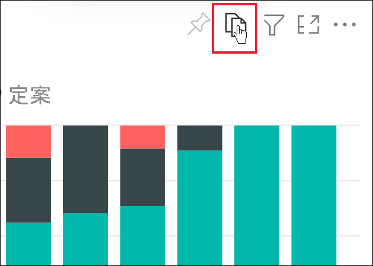
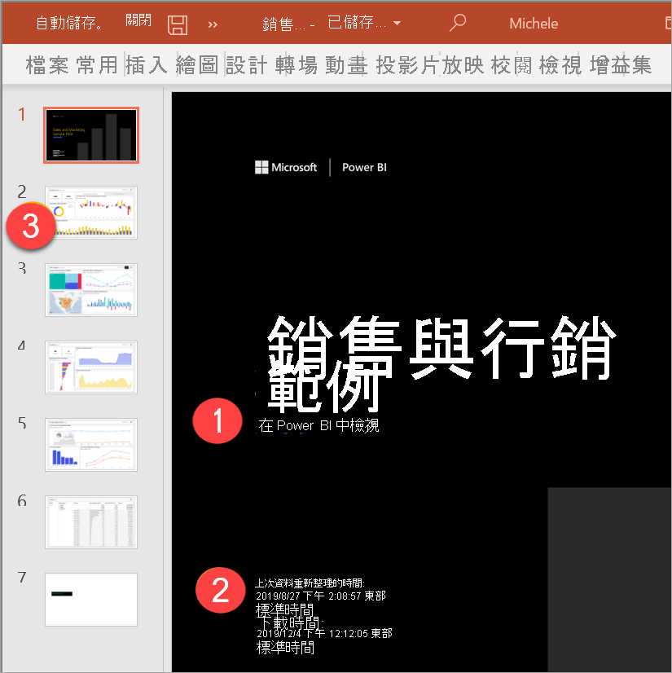
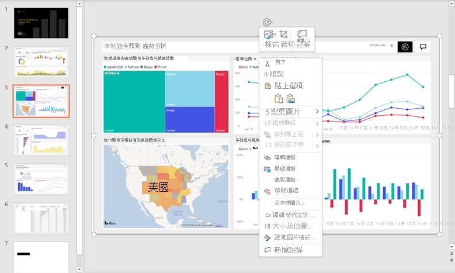

# 將報表匯出至 PowerPoint

[!INCLUDE[consumer-appliesto-yynn](../includes/consumer-appliesto-yynn.md)]

使用 Power BI 服務 (app.powerbi.com)，即可將報表發佈至 Microsoft PowerPoint，並根據 Power BI 報表輕鬆建立投影片組。 當您匯出至 PowerPoint 時，會發生下列狀況：

* Power BI 報表中每個頁面都會變成 PowerPoint 的個別投影片。
* Power BI 報表中每個頁面都會匯出成 PowerPoint 中的單一高解析度影像。
* 您可以保留新增至報表的篩選條件和交叉分析篩選器設定。
* PowerPoint 中會建立連結回 Power BI 報表的連結。

將 **Power BI 報表** 匯出到 **PowerPoint** 的程序非常簡單快速。 請遵循下一節中概述的步驟。

您也可以從 Power BI 服務一次複製一個視覺效果並貼入至 PowerPoint (或支援貼上的任何其他程式)。 選取 **複製成影像** 圖示，將視覺效果複製到剪貼簿。 然後，開啟 PowerPoint 並貼上視覺效果。 如需詳細資訊，請參閱[將視覺效果複製為靜態影像](../visuals/power-bi-visualization-copy-paste.md)。

## 將 Power BI 報表匯出至 PowerPoint
在 **Power BI 服務** 中，選取要顯示在畫布上的報表。 您也可以從瀏覽窗格的 [首頁]、[應用程式] 或任何其他容器中選取報表。

當畫布上顯示想要匯出至 PowerPoint 的報表時，請從功能表列選取 [檔案] > [匯出至 PowerPoint]。

![從功能表列選取 [匯出]](media/end-user-powerpoint/power-bi-export.png)

隨即出現快顯視窗，其中有選項可供您選取 [目前的值] 或 [預設值]。 [目前的值] 會以目前狀態匯出報表，其中包括您對交叉分析篩選器和篩選值進行的有效變更。  大多數使用者會選取此選項。 如果您已捲動，[目前的值] 就不會包含視覺效果的捲動狀態，而是會匯出資料的最上層部分。 或者，選取 [預設值] 以「設計師」共用時的原始狀態匯出報表，而不反映您對該原始狀態進行的任何變更。

 
另外，還會出現核取方塊供您選取是否要匯出報表的隱藏索引標籤。 如果您只要在瀏覽器中匯出可看見的報表索引標籤，請選取此核取方塊。 如果您希望在匯出過程中取得所有隱藏索引標籤，請不要選取此核取方塊。 如果核取方塊呈現灰色，即代表報表中沒有任何隱藏索引標籤。 工具提示索引標籤即為其中一個隱藏的索引標籤範例。[自訂工具提示](../create-reports/desktop-tooltips.md)是由報表「設計師」所建立，且不會在「商務使用者」的 Power BI 服務中顯示為報表索引標籤。 

您也可以按一下 [僅匯出目前頁面] 選項，只匯出報表中您目前正在檢視的頁面。  根據預設，系統會取消選取此選項，而且會從您的報表匯出所有頁面。

在您選取完成後，請選取 [匯出] 繼續。 您會在 Power BI 服務瀏覽器視窗的右上角，看到報表正在匯出至 PowerPoint 的通知橫幅。 

匯出可能需要幾分鐘的時間。 影響所需時間的因素，包括報表結構及 Power BI 服務目前的負載。 您可以在正在匯出報表時繼續使用 Power BI 工作。

在 Power BI 服務完成匯出程序後，通知橫幅會隨即變更以讓您知道。 您可以在瀏覽器顯示下載檔案的位置取得檔案。 在下圖中，是以瀏覽器視窗底部的下載橫幅方式顯示。

就是這麼簡單。 您可以下載檔案、使用 PowerPoint 開啟檔案，然後像您處理任何其他 PowerPoint 簡報一樣修改或加強檔案。

## 開啟 PowerPoint 檔案
當您開啟 Power BI 匯出的 PowerPoint 檔案時，您會發現一些很棒又實用的元素。 請看下圖，然後查看描述其中幾項酷炫功能的編號項目。 PowerPoint 中的頁面一律會以標準的 9:16 大小建立，而不論 Power BI 報表中的原始頁面大小或維度為何。

1. 投影片組的第一頁包含報表名稱及連結，讓您能夠 **在 Power BI 中檢視** 作為投影片組基礎的報表。
2. 您也可以取得有關報表的一些實用資訊。 [上次資料重新整理] 會顯示匯出報表所依據的日期和時間。 [下載於] 則顯示將 Power BI 報表匯出至 PowerPoint 檔案時的日期和時間。 將 [下載於] 時間設定為匯出時的電腦時區。

3. 每張報表頁面都是一張個別的投影片，如導覽窗格中所示。 
4. 已發行的報表會根據您 Power BI 設定中的語言來進行轉譯，否則會根據您的瀏覽器地區設定來進行轉譯。 若要在您的瀏覽器中查看或設定語言喜好設定，請選取齒輪圖示  > [設定] > [一般] > [語言]。 如需地區設定的資訊，請參閱 [Power BI 支援的語言與國家或地區](../fundamentals/supported-languages-countries-regions.md)。

當您檢視個別投影片時，您會發現每個報表頁面都是一個獨立的影像。 您無法在 PowerPoint 中捲動，因為每張投影片都是一個靜態影像。

您可在此隨意處理 PowerPoint 簡報或任何高解析度影像。

## 考量與疑難排解
當您使用 [匯出至 PowerPoint] 功能時，需牢記幾項考量與限制。
 

* 如果您看不到 [ **匯出** ] 選項，請確定您正在查看 (不是儀表板) 的報表。

* 當您針對匯出選擇 [目前的值] 時，目前不適用 [URL 篩選](../collaborate-share/service-url-filters.md)。

* 匯出至 PowerPoint 時，如果報表使用自訂字型，則會使用預設字型來取代該字型。

* 下列視覺效果類型不受支援，且將不會匯出至 PowerPoint：
   - 不支援[未經認證的自訂視覺效果](../developer/visuals/power-bi-custom-visuals-certified.md))。 
   - 不支援 [ESRI ArcGIS 視覺效果](../visuals/power-bi-visualizations-arcgis.md)
   - 不支援 R 和 Python 視覺效果。
   - 背景影像會按圖表的周框區域剪裁。 我們建議您先移除背景影像，再匯出至 PowerPoint。

* 某些報表無法匯出。 這些包括：
    - 如果您與組織外部的某人 (也就是不在您 Power BI 租用戶中的使用者) 共用儀表板，則該使用者無法將共用儀表板的相關聯報表匯出至 PowerPoint。 例如，如果您是 aaron@contoso.com，您可以與 david@cohowinery.com 共用。 但是 david@cohowinery.com 無法將相關聯報表匯出至 PowerPoint。
    - 具有超過 50 個報表頁面的報表。
    - 匯出時大於 500 MB 的報表。 
    - 匯出到舊版 PowerPoint 的報表。
    - 花費超過一小時的時間來處理的報表。 
    - 載入時間超過 6 分鐘的報表頁面。 

* 若 Power BI 服務中沒有 [匯出至 PowerPoint] 功能表項目，可能是因為 Power BI 管理員或報表擁有者停用此功能。 請洽詢管理員或擁有者，以取得詳細資料。
* Power BI 服務會使用您的 Power BI 語言設定作為 PowerPoint 的輸出語言。 若要在您的瀏覽器中查看或設定語言喜好設定，請選取齒輪圖示  > [設定] > [一般] > [語言]。

## 後續步驟
[將視覺效果複製為靜態影像](../visuals/power-bi-visualization-copy-paste.md)    
[列印報表](end-user-print.md)
