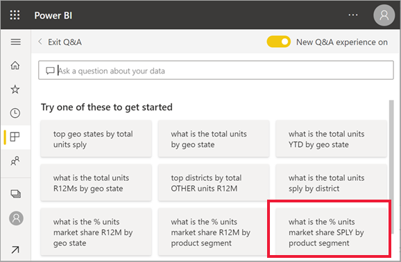
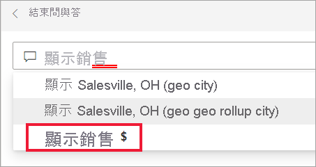
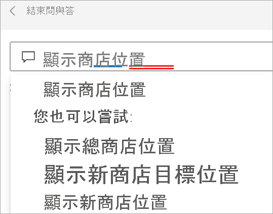

# Power BI 取用者問與答

[!INCLUDE [power-bi-service-new-look-include](../includes/power-bi-service-new-look-include.md)]

## 問與答是什麼？
有時若要從您的資料獲得解答，最快的方法是使用自然語言詢問問題。 例如，「去年總銷售額是多少」。

使用問與答來探索資料，可使用直覺式的自然語言功能，並以圖表和圖形形式接收回應。 問與答不同於搜尋引擎 -- 問與答只會提供有關 Power BI 中資料的結果。

## 問與答會使用哪一種視覺效果？
問與答會根據要顯示的資料挑選最佳視覺效果。 有時在基礎資料集中資料的定義是特定類型或類別，這有助於問與答知道要如何加以顯示。 例如，如果將資料定義為日期類型，則較有可能顯示為折線圖。 分類為城市的資料比較有可能顯示為地圖。

您也可以告知問與答要使用哪一種視覺效果，方法是將視覺效果類型新增至您的問題。 但是請記住，以您要求的視覺效果類型讓問與答顯示資料，並不一定可行。 問與答將提示您可用的視覺效果類型清單。

## 我可以在哪裡使用問與答？
您可以在 Power BI 服務的儀表板上，以及 Power BI 行動版的儀表板底部找到問與答。 除非設計工具已授與您編輯權限，否則您將能夠使用問與答來探索資料，但無法儲存以問與答建立的任何視覺效果。

如果報表「設計師」  新增了[問與答視覺效果](../visuals/power-bi-visualization-q-and-a.md)，則您也可以在報表上找到問與答。   

## 儀表板上的問與答

**Power BI 問與答**可透過專業或進階授權提供。  [Power BI 行動應用程式的問與答](mobile/mobile-apps-ios-qna.md)和 [Power BI Embedded 的問與答](../developer/qanda.md)會在不同的文章中說明。 目前，**Power BI 問與答**只可回答以英文詢問的自然語言查詢，但您可以透過 Power BI 管理員啟用西班牙文預覽。

提問只是第一步。  縮小或擴充您的問題，讓查閱資料更加有趣，探索值得信賴的新資訊、聚焦於詳細資料，並且放寬條件以求得更廣泛的檢視。 您獲得的深入資訊和發現，讓人雀躍不已。

這種體驗真正充滿互動...而且快速！ 採用記憶體內部儲存體的回應幾乎可瞬間完成。

## 在 Power BI 服務的儀表板上使用問與答
在 Power BI 服務 (app.powerbi.com) 中，儀表板包含從一或多個資料集釘選的磚，因此您可以詢問這些資料集包含的所有資料。 若要查看使用了哪些報表和資料集來建立儀表板，請從 [其他動作]  下拉式清單選取 [檢視相關項目]  。

![功能表列中的 [檢視相關項目]](media/end-user-q-and-a/power-bi-q-and-a-view-related.png)

## 我該如何開始？
首先，熟悉內容。 請在儀表板和報表中查看視覺效果。 了解可供您使用的資料類型和範圍。 

例如：

* 如果視覺效果的軸標籤和值包含「銷售」、「帳戶」、「月份」與「商機」，您就可以安心地提出問題，例如：「哪一個『帳戶』  有最高的『商機』  ，或以橫條圖根據月份顯示『銷售』  。」

* 如果您在 Google Analytics 網站中擁有效能資料，您可以詢問問與答有關花在網頁的時間、特定網頁瀏覽次數和使用者參與率。 或者，如果您要查詢人口統計資料，您可能會想詢問各地區年齡和家庭收入的相關問題。

在您熟悉資料過後，請返回儀表板並將游標放在問題方塊中。 即會開啟問與答畫面。

 

即使您還沒開始輸入，問與答也會顯示包含建議的新畫面，以協助您提出問題。 您會在基礎資料集中看到包含資料表名稱的片語和問題，甚至可能會看到資料集擁有者所建立的「精選」  問題。

您可以選取其中任何一個以將其新增至問題方塊，然後縮小搜尋範圍以尋找特定解答。 

 

Power BI 協助您詢問問題的另一種方式為使用提示、自動完成和視覺提示等功能。Power BI 會在儀表板問與答、報表問與答，以及問與答視覺效果中提供此說明。 我們會在後文的[鍵入自然語言查詢以建立問與答視覺效果](#create-a-qa-visual-by-typing-a-natural-language-query)一節中詳細討論這些功能

<!--  -->

## Power BI 報表中的問與答視覺效果

問與答視覺效果可讓您詢問自然語言問題，並以視覺效果形式獲得解答。 問與答視覺效果的表現和報表中任何其他視覺效果如出一轍，可交叉篩選/交叉醒目顯示，也支援書籤和註解。 

問與答視覺效果識別方式為其出現在頂端的問題方塊。 這是您使用自然語言來輸入或鍵入問題的地方。 您可以重複使用問與答視覺效果來詢問資料的相關問題。 當您離開報表時，問與答視覺效果會重設為其預設值。 

## 使用問與答 
若要在儀表板上使用問與答或在報表中使用問與答視覺效果，請選取其中一個建議的問題，或鍵入您自己的自然語言問題。 

### 使用建議的問題來建立問與答視覺效果

在這裡，我們選取了 [top geo states by total units] \(依單位總量的前幾州地區\)  。 Power BI 會竭盡所能選取要使用的視覺效果類型。 在此案例中是地圖。

但您可以告知 Power BI 要使用的視覺效果類型，方法是將其新增至您的自然語言查詢。 請記住，並非所有視覺效果類型都適用於您的資料或對其有意義。 例如，此資料不會產生有意義的散佈圖。 但適合以區域分布圖顯示。

### 鍵入自然語言查詢來建立問與答視覺效果

如果您不確定要詢問的問題類型或要使用的術語，請展開 [顯示所有建議]  或查看報表中的其他視覺效果。 這可協助您熟悉資料集的字詞和內容。

1. 使用自然語言在問與答欄位中鍵入您的問題。 當您鍵入問題時，Power BI 會使用自動完成、視覺提示和意見反應來協助您。

    **自動完成** - 當您鍵入問題時，Power BI 問與答會顯示內容相關建議，協助您快速有效地使用自然語言。 當您鍵入時，您會立即收到意見反應和結果。 該體驗類似於在搜尋引擎中鍵入。

    在此範例中，我們想要最後一個建議。 

    

    **紅色/藍色底線** - Power BI 問與答會顯示加底線的文字，協助您查看 Power BI 辨識出或無法辨識的字詞。 藍色實心底線表示 Power BI 辨識出該字詞。 以下範例顯示問與答辨識出**商店**一詞。

    

    選取藍色底線的字詞，以顯示建議問題的下拉式清單。 

    

    通常當您在問與答中鍵入字詞時，該字詞會以紅色底線標示。 紅色底線可能表示兩個潛在問題的其中一個。 第一類問題可分類為低信賴度。 如果您鍵入含糊或不明確的字組，此欄位會加紅色底線。 例如 'Location' (位置)。 多個欄位可能會包含 'Location' (位置)，因此系統會使用紅色底線提示您選擇有意的欄位。 在此範例中，Power BI 會提示您選取要用於 'VanArsdel' 的欄位。
    
    
    
    低信賴度的另一例為，當您鍵入 'area' (區域)，但其比對的資料行卻是 'district' (區域)。 多虧與 Bing 和 Office 的整合，Power BI 問與答可辨識代表同一件事的字組。 問與答會為字詞加上紅色底線，讓您知道這不是直接相符的項目

    

    第二種問題類型是當問與答完全無法辨識該字組時。 例如使用 'geography'，但其不存在於資料中的任何位置。 該字出現在英文字典中，但問與答以紅色底線標示此字詞。 Power BI 問與答無法建立視覺效果，建議您要求報表設計師新增該字詞。

    

    **建議** - 當您鍵入更多問題時，Power BI 會在不了解問題時讓您知道，並嘗試協助。 在以下範例中，Power BI 會詢問您「您的意思是...」，並使用資料集中的術語來建議不同問題陳述方式。 

    

    選取 Power BI 的校正之後，您的結果會顯示為折線圖。 

    

    但您可以將折線圖變更為另一種視覺效果類型。  

    

## 考量與疑難排解

**問題**：我在儀表板上找不到問與答。    
**解答 1**：如果您找不到問題方塊，請先檢查您的設定。 請選取 Power BI 工具列右上角的齒輪圖示。   

然後選擇 [設定]   > [儀表板]  。 請確定已勾選 [在此儀表板上顯示問與答搜尋方塊]  。    
  

**解答 2**：有時您無法存取設定。 如果儀表板「設計師」  或您的系統管理員已關閉問與答，請與其確認以查看是否可以重新開啟。   

**問題**：當我輸入問題時無法取得我想看到的結果。    
**解答**：選取連絡報表或儀表板擁有者的選項。 您可以直接從問與答儀表板頁面或問與答視覺效果執行這項操作。 或者，您可以從 Power BI 頁首查詢擁有者。  為了改善問與答的結果，設計工具可能會進行很多作業。 比方說，設計工具可能會重新命名資料集中的資料行，來使用較容易了解的詞彙 (例如以 `CustomerFirstName` 取代 `CustFN`)。 由於設計師十分了解資料集，因此設計師也可以提出有幫助的問題，並將其新增至問與答建議的問題。

## 隱私權

Microsoft 可能會將您的問題用於改善 Power BI。 請檢閱 [Microsoft Azure 隱私權聲明](https://go.microsoft.com/fwlink/?LinkId=521839)以取得詳細資訊。

## 後續步驟
若要了解如何透過報表「設計師」  來建立和管理問與答視覺效果，請參閱[問與答視覺效果類型](../visuals/power-bi-visualization-q-and-a.md)。
