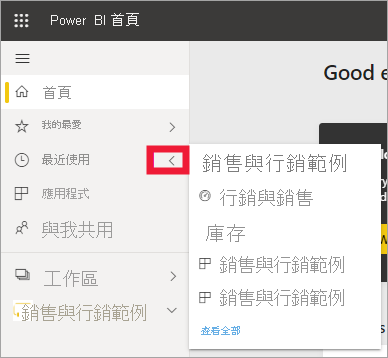
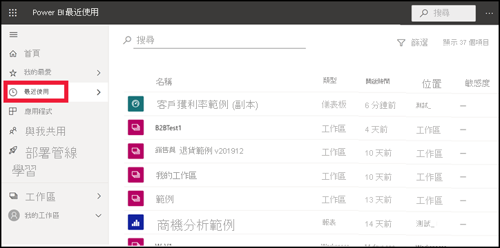
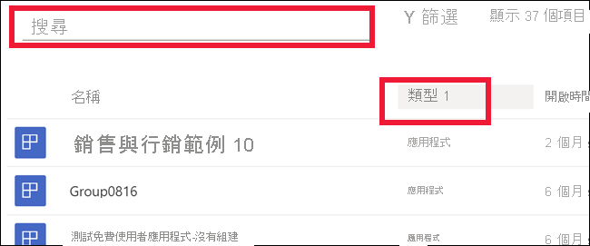

# Power BI 服務中的 [最近]  內容

[!INCLUDE[consumer-appliesto-yyny](../includes/consumer-appliesto-yyny.md)]

[最近] 內容是您在 Power BI 服務中最後瀏覽的項目。 這包括：儀表板、報表、應用程式、工作區和活頁簿。 當從導覽列選取 [最近] 時，Power BI 會依日期遞減排序來顯示此內容。  若要變更排序次序，請選取其中一個標題，然後選擇 [遞增] 或 [遞減]。

請注意，其中有兩個項目為[我的最愛](end-user-favorite.md)，並具有星形圖示。 而其中一個項目 Customer Profitability Sample (客戶獲利率範例) 則儲存在 [Premium 容量](end-user-license.md)中。

## 查看五個您最近的項目

若要只顯示您最近瀏覽過的五個項目，請從瀏覽窗格中選取 [最近] 右側的箭號。  然後在這裡選取內容予以開啟。 

## 查看您最近的所有內容

若最近瀏覽過的項目超過五個，請選取 [查看全部] 以開啟 [最近] 畫面。 就像在本文一開始所做的一樣，您可略過飛出視窗，並從瀏覽窗格中選取 [最近] 或其來開啟 [最近] 畫面。

## 搜尋並排序最近內容的清單

若清單太長，請[使用搜尋欄位和排序來找出所需的內容](end-user-search-sort.md)。 若要了解是否可以排序資料行，請將游標停留其上以查看是否出現箭號。 在此範例中，將游標停留在 [類型] 上方會顯示箭號 -- 則最近的內容即可依內容類型的字母順序排序。 

觀看 Amanda 示範如何填入 Power BI 服務 [最近] 內容清單，接著遵循影片下的逐步指示，自己試試看。

<iframe width="560" height="315" src="https://www.youtube.com/embed/G26dr2PsEpk" frameborder="0" allowfullscreen></iframe>

> [!NOTE]
> 這部影片使用較舊版本的 Power BI 服務。

<!--
## Actions available from the **Recent** content list
The actions available to you will depend on the settings assigned by the content *designer*. Some of your options may include:
* Select the star icon to [favorite a dashboard, report, or app](end-user-favorite.md) .
* Some dashboards and reports can be re-shared  .
* [Open the report in Excel](end-user-export.md)  
* [View insights](end-user-insights.md) that Power BI finds in the data . -->

## 後續步驟
[Power BI 服務應用程式](end-user-apps.md)

有其他問題嗎？ [試試 Power BI 社群](https://community.powerbi.com/)

