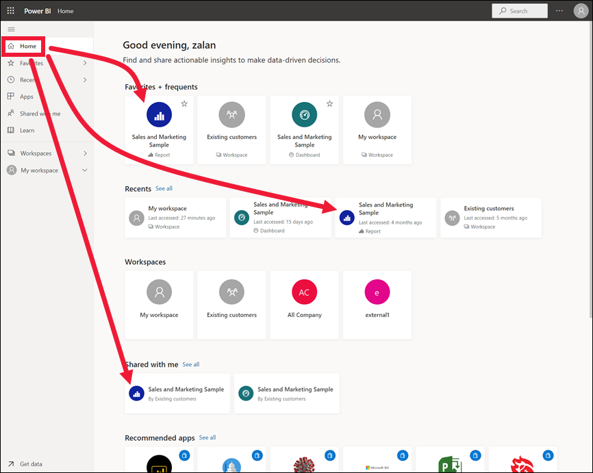
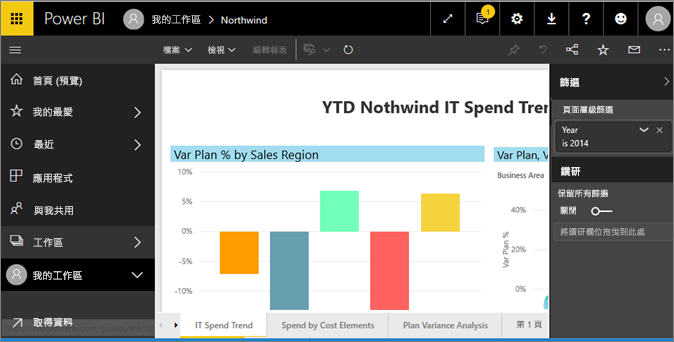
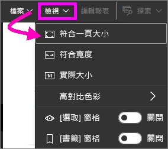
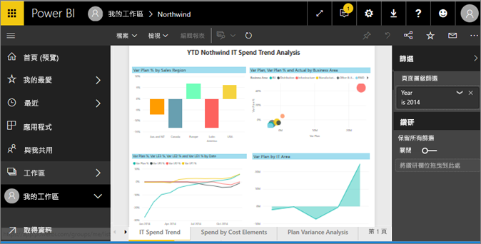

# 在 Power BI 服務 (app.powerbi.com) 中檢視報表
報表是一或多頁的視覺效果。 Power BI「報表設計者」會建立報表，並[直接與您共用](end-user-shared-with-me.md)或在[應用程式](end-user-apps.md)中共用。 

要開啟報表有很多種不同的方法，我們將示範其中兩種：從首頁開啟，以及從儀表板開啟。 

<!-- add art-->

## 從您的首頁開啟報表
讓我們開啟與您直接共用的報表，然後開啟在應用程式中共用的報表。

   

### 開啟已與您共用的報表
Power BI「設計者」只要按一下頂端功能表列的 [共用] 按鈕，就可以直接與您共用報表。 以這種方式共用的內容會顯示在左側導覽列的 [與我共用] 容器中，以及首頁的 [與我共用] 區段中。

1. 開啟 Power BI 服務 (app.powerbi.com)。

2. 從左側瀏覽列中，選取 [首頁 (預覽)] 來開啟您的首頁。  

   
   
3. 向下捲動，直到您看到 [與我共用] 為止。 尋找報表圖示 。 在這個螢幕擷取畫面中，我們有兩份報表：*Financial* 和 *Northwind*。 
   
   

4. 只要選取其中一個報表卡片即可開啟報表。

   

5. 請注意底部的索引標籤。 每個索引標籤各代表一個報表「頁面」。 我們目前開啟的是 [IT 支出趨勢] 頁面。 選取其他索引標籤即可開啟該報表頁面。 

   

6. 現在我們只能看到報表頁面的一部分。 若要變更頁面的顯示 (縮放)，請選取 [檢視] > [符合一頁大小]。

   

   

### 開啟應用程式中的報表
如果您收到了來自同事或 AppSource 的應用程式，這些應用程式可從您首頁以及左側導覽列上的 [應用程式] 容器中開啟。 [應用程式](end-user-apps.md)是儀表板和報表的組合。

1. 若要返回至您的首頁，請從左側導覽列中選取 [首頁 (預覽)]。

7. 向下捲動，直到您看到**我的應用程式**為止。

   

8. 選取其中一個應用程式加以開啟。 根據應用程式「設計者」所設定的選項，應用程式將會開啟儀表板或報表。 若選取應用程式：
    - 會開啟報表，您已萬事俱備。
    - 會開啟儀表板，請參閱下方的[從儀表板開啟報表](#Open-a-report-from-a-dashboard)。

## 從儀表板開啟報表
您可以從儀表板開啟報表。 大部分的儀表板磚從報表「釘選」。 選取磚會開啟用來建立磚的報表。 

1. 從儀表板選取磚。 在此範例中，我們已選取 [總單位 YTD...] 直條圖磚。

    

2.  相關的報表隨即開啟。 請注意，我們在「YTD 類別」頁面上。 此報表頁面包含我們從儀表板選取的直條圖。

    ![在 [閱讀檢視] 中開啟報表](./media/end-user-report-open/power-bi-report-new.png)

> [!NOTE]
> 並非所有的磚都會帶您前往報表。 如果您選取的磚是[使用問與答建立](../service-dashboard-pin-tile-from-q-and-a.md)，問與答畫面將會開啟。 如果您選取的磚是[使用儀表板 [新增磚] Widget建立的](../service-dashboard-add-widget.md)，則會開啟 [編輯磚精靈]。  

##  仍然有更多方法來開啟報表
當您更熟悉巡覽 Power BI 服務之後，便會找出最適合您的工作流程。 還有一些其他方法可存取報表：
- 從左側功能窗格使用 [我的最愛]和 [最近]    
- 使用[檢視相關項目](end-user-related.md)    
- 在電子郵件中，當有人[與您共用](../service-share-reports.md)或您[設定警示](../service-set-data-alerts.md)時。    
- 從您的 [通知中心]    (end-user-notification-center.md)    
- 以及更多

## 後續步驟
有[很多方式可用來與報表互動](end-user-reading-view.md)。  選取報表畫布底部的每個索引標籤，來開始探索。

