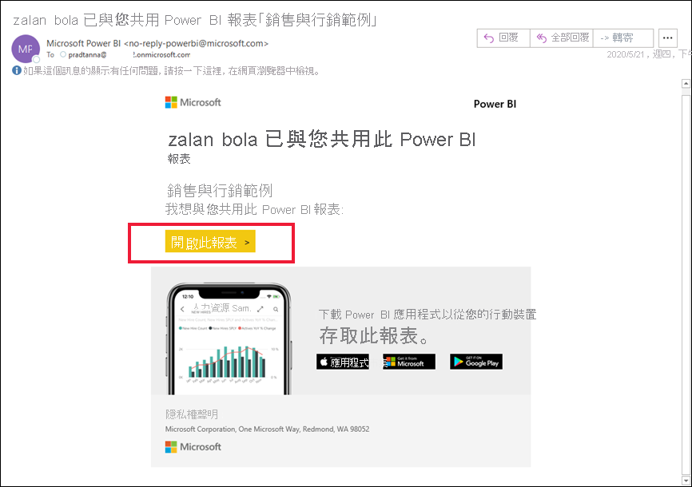
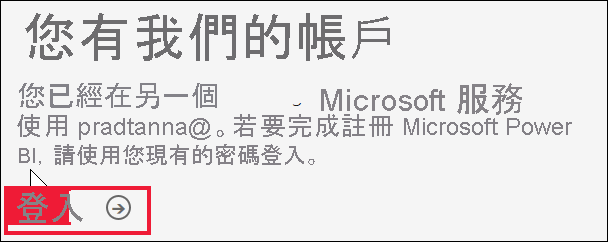
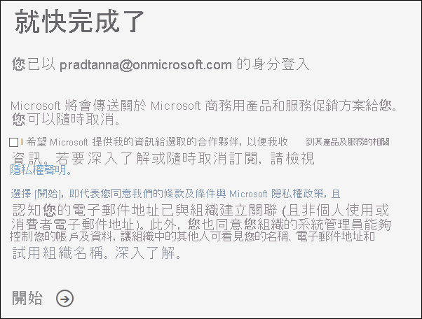
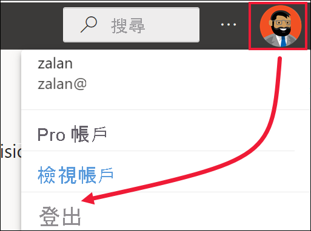

# 登入 Power BI 服務

[!INCLUDE[consumer-appliesto-yynn](../includes/consumer-appliesto-yynn.md)]

## Power BI 帳戶
在您登入 Power BI 之前，您需要一個帳戶。 有兩種方式可取得 Power BI 帳戶。 第一種是當組織為員工購買 Power BI 授權時。 而第二種是當[個人註冊免費試用版或個人授權](../fundamentals/service-self-service-signup-for-power-bi.md)時。 本文涵蓋第一種狀況。

## 第一次登入

### 步驟 1：開啟 Power BI 服務
Power BI 服務是在瀏覽器中執行的。 

- 如果收到同事附有儀表板或報表連結的電子郵件，請選取 [開啟此報表] 或 [開啟此儀表板] 連結。

        

- 否則，請開啟慣用的瀏覽器，然後鍵入 **app.powerbi.com**。

        

### 步驟 2：輸入您的電子郵件地址
第一次登入時，Microsoft 會檢查是否已經有 Microsoft 365 帳戶。 在以下範例中，Pradtanna 已有其他 Microsoft 服務授權。 

輸入您的密碼。 這是 Microsoft 365 帳戶密碼。 和您在 Outlook 和 Office 等其他 Microsoft 產品所用的電子郵件和密碼一樣。  視帳戶的設定方式而定，系統可能也會提示輸入傳送至電子郵件或行動裝置的驗證碼。   

![螢幕擷取畫面顯示 [輸入密碼] 對話方塊。](media/end-user-sign-in/power-bi-pass.png)

有時候，全域管理員會指派您授權，並以電子郵件將此資訊傳送給您。 請查看 [收件匣] 有沒有歡迎電子郵件，然後遵循其中的指示完成第一次登入。 請使用此相同的電子郵件帳戶登入。 
 
### 步驟 3：檢閱條款及條件
檢閱條款及條件，如果同意，請選取核取方塊，然後選擇 [開始]。

### 步驟 4：檢閱您的首頁登陸頁面
在您第一次瀏覽時，Power BI 會開啟您的 [首頁] 登陸頁面。 若 [首頁] 未開啟，請從瀏覽窗格中選取它。 

![顯示已選取 [首頁] 的螢幕擷取畫面](media/end-user-sign-in/power-bi-home-blank.png)

在 [首頁] 中，您將會看到您有權使用的所有內容。 一開始，可能沒有太多的內容，不過別擔心，當您開始與同事使用 Power BI 時，此情況就會改變。 還記得同事透過電子郵件與您共用的報表嗎？ 其位於 [首頁] 的登陸頁面上，在 [與我共用] 的標題下。

![[首頁] 登陸頁面](media/end-user-sign-in/power-bi-home-new.png)

如果您不想要 Power BI 開啟到 [首頁]，可以改為 [設定 **精選** 儀表板或報表](end-user-featured.md)加以開啟。 

## 安全地與內容互動
身為「商務使用者」***_，其他人將與您共用內容，而您將會與該內容互動，以探索資料並制訂商務決策。在您篩選、配量、訂閱、匯出和調整大小時，請別擔心，您的工作不會影響基礎資料集或原始共用的內容 (儀表板和報表)。Power BI 是可讓您進行探索和實驗的安全位置。這並不表示您無法儲存變更；您可以儲存變更。但那些變更只會影響_* 您** 對內容的檢視。 而且還原成原始預設檢視非常簡單，只需按一下按鈕即可。

![[重設為預設值] 按鈕](media/end-user-sign-in/power-bi-reset.png)

## 登出 Power BI 服務
當您關閉或登出 Power BI 服務時，系統會儲存您的變更，讓您能夠從先前離開的地方繼續。

若要關閉 Power BI，請關閉所使用的瀏覽器索引標籤。 

 

如果您共用電腦，建議您在每次關閉 Power BI 時進行登出。  若要登出，請從右上角選取您的 [個人資料] 圖片，然後選擇 [登出]。  

 

## 疑難排解與考量
- 如果您以個人身分註冊 Power BI，請使用您用來註冊的電子郵件地址進行登入。

- 某些人利用多個帳戶使用 Power BI。 如果是這樣，當您登入時，系統將提示您從清單中選取帳戶。 

## 後續步驟
[檢視 Power BI 應用程式](end-user-app-view.md)
