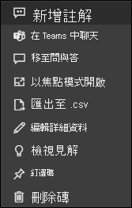

# Power BI 的儀表板圖格

[!INCLUDE[consumer-appliesto-yyny](../includes/consumer-appliesto-ynny.md)]

[!INCLUDE [power-bi-service-new-look-include](../includes/power-bi-service-new-look-include.md)]

圖格是您的資料快照集，由「設計師」釘選到儀表板。 「設計師」  可以從報表、資料集、儀表板、問與答問題方塊、Excel 和 SQL Server Reporting Services (SSRS) 等項目來建立磚。  這個螢幕擷取畫面顯示許多釘選到儀表板的不同磚。

除了從報表中釘選的圖格， *設計工具* 也可以使用 [新增圖格]  直接在儀表板上新增獨立圖格。 獨立磚包括：文字方塊、影像、視訊、串流資料和 Web 內容。

您想要了解構成 Power BI 的建置組塊嗎？  請參閱 [Power BI - 基本概念](end-user-basic-concepts.md)。

## 與儀表板上的圖格互動

1. 將滑鼠暫留在圖格上以顯示省略符號。
   
    
2. 選取省略符號開啟圖格的 [動作] 功能表。 根據權限、視覺效果類型與用來建立圖格的方法，可用的選項會有所不同。 例如，可從 Q&A 釘選之圖格的功能表項目，與可從報表釘選之圖格的功能表項目不同。 以下是使用 Q&A 建立之圖格的 [動作] 功能表。

   
    

   
    這些功能表提供的一些動作包括：
   
   * [開啟用於建立圖格的報表](end-user-reports.md)   
   
   * [開啟用於建立磚的問與答問題](end-user-reports.md)  
   

   * [開啟用於建立圖格的活頁簿](end-user-reports.md)   
   * [在焦點模式中檢視磚](end-user-focus.md)  
   * [檢視見解](end-user-insights.md)
   * [新增註解並開始討論](end-user-comment.md)
   * [管理儀表板磚上設定的警示](end-user-alerts.md)
   * [在 Excel 中開啟資料](end-user-export.md)

3. 若要關閉動作功能表，選取畫布中的空白區域。

### 選取 (按一下) 圖格
當您選取磚時，接下來的情況取決於該磚的建立方式，以及其是否有[自訂連結](../create-reports/service-dashboard-edit-tile.md)。 如果有自訂連結，則選取圖格會帶您前往該連結。 否則，選取磚會帶您前往建立此磚所使用的報表、Excel Online 活頁簿、內部部署 SSRS 報表或問與答。

> [!NOTE]
> 此情況的例外是由「設計師」新增到儀表板的影片圖格。 選取影片磚 (以此方式建立) 會直接在儀表板上播放視訊。   
> 
> 

## 考量與疑難排解
* 如果您在選取 (按一下) 圖格時沒有發生任何事，或您收到錯誤訊息，以下是一些可能的原因：
  - 用來建立視覺效果的報表未儲存，或已遭刪除。
  - 如果圖格是從 Excel Online 中的活頁簿建立，而且您並未至少擁有該活頁簿的讀取權限。
  - 如果圖格是從 SSRS 建立的，而且您沒有 SSRS 報表的權限，或您沒有 SSRS 伺服器所在網路的存取權。
* 至於使用 [新增磚]  直接在儀表板上建立的磚，如果您已設定自訂超連結，選取標題、子標題及/或磚即會開啟該 URL。  否則，選取針對影像、Web 程式碼或文字方塊直接在儀表板上建立的其中一個磚，預設不會執行任何動作。
* 如果用來建立圖格的原始視覺效果有了變更，也不會改變圖格。  例如，如果「設計工具」  已從報表釘選折線圖，然後將折線圖變更為長條圖，則儀表板圖格仍會顯示折線圖。 資料會重新整理，但視覺效果類型不會。

## 後續步驟
[資料重新整理](../connect-data/refresh-data.md)

[Power BI - 基本概念](end-user-basic-concepts.md)

