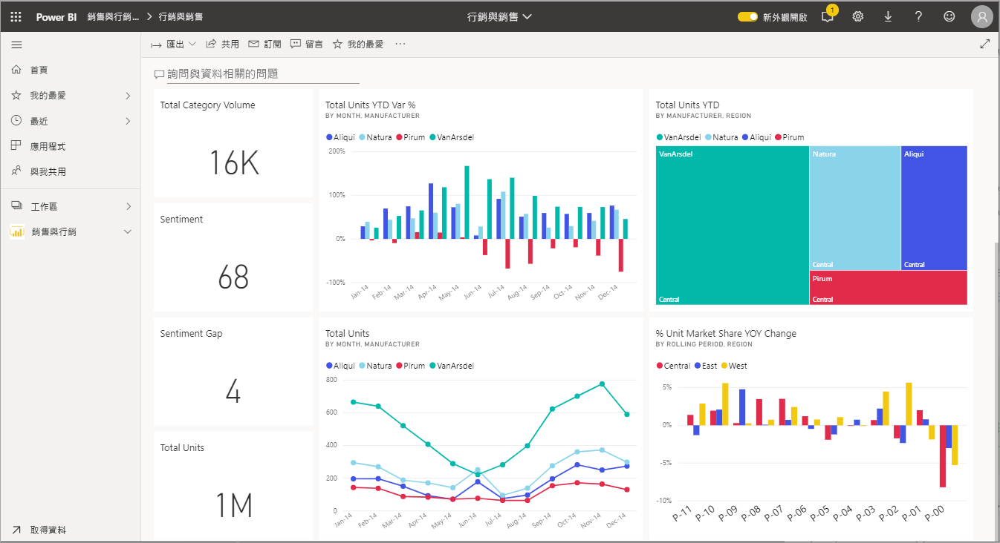
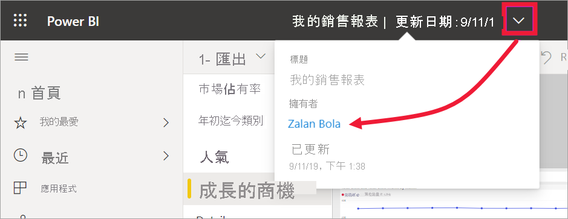

# 在報表、儀表板和應用程式中與視覺效果互動

[!INCLUDE[consumer-appliesto-ynny](../includes/consumer-appliesto-ynny.md)]

就基礎而言，「視覺效果 (visualization)」(或 *visual* )，是 Power BI「設計者」  使用報表和資料集中的資料所建立的一種圖表。 

您可以在儀表板上找到視覺效果，也可以在報表中使用 Power BI 問與答隨即建立。 當設計師在報表中建立視覺效果時，他們可以將該視覺效果「釘選」  至儀表板。 [儀表板上的視覺效果稱為「磚」  ](end-user-tiles.md)。 此儀表板有八個磚。 

> [!TIP]
> 在閱讀這份更詳細的內容之前，建議您先閱讀概觀主題：[適用於「商務使用者」的 Power BI 基本概念](end-user-basic-concepts.md)。

## 視覺效果有哪些功能？

視覺效果會由報表與儀表板「設計者」建立，並與同事共用。 設計師會根據同事使用報表或儀表板的方式，為同事指派不同權限。 例如，「開發人員」可能會獲指派不同於「商務使用者」的權限。 

適用於「商務使用者」的最常見工作均列於下面的表格中，並提供逐步指示的連結。 「商務使用者」有許多選項可讓您與視覺效果互動，以發掘見解並作出資料驅動的商務決策。  

針對其中許多選項，系統管理員或「設計師」  可以停用這些功能的查看或使用權限。 其中某些功能只適用於特定的視覺效果類型。  如果您有任何問題，請洽詢您的系統管理員或報表/儀表板的擁有者。 若要尋找擁有者，請選取儀表板或報表下拉式清單。 

> [!IMPORTANT]
> 但是首先，讓我們談談問與答。 問與答是 Power BI 的自然語言搜尋工具。 您可以使用自然語言來鍵入問題，而問與答會以視覺效果形式來回答問題。 商務使用者可以透過 Q&A，即時建立自己的視覺效果。 然而，您使用問與答所建立的視覺效果無法儲存。 但是，如果您想要從資料中知道特定資訊，而設計者未在報表或儀表板中包含該資訊，問與答便是絕佳的選項。 若要深入了解 Q&A，請參閱[適用於商務使用者的 Q&A](end-user-q-and-a.md)。

|Task  |在儀表板中  |在報表中  | 在問與答中
|---------|---------|---------|--------|
|[替自己新增視覺效果的註解，或與同事展開關於視覺效果的對話](end-user-comment.md)。     |  是       |   是      |  否  |
|[開啟並探索要建立視覺效果的報表](end-user-tiles.md)。     |    是     |   NA      |  否 |
|[檢視影響視覺效果的篩選條件和交叉分析篩選器清單](end-user-report-filter.md)。     |    如果您以焦點模式開啟     |   是      |  否 |
| 使用了問與答來建立視覺效果)](end-user-q-and-a.md)。     |   是      |   NA      |  NA  |
|[在問與答中建立視覺效果 (其用於瀏覽而無法儲存)](end-user-q-and-a.md)。     |   可以      |   如果設計師已將問與答新增至報表      |  是  |
|在視覺效果的資料內[要求 Power BI 替您尋找有趣的事物或趨勢](end-user-insights.md)。  這些自動產生的視覺效果稱為「見解」  。     |    是，適用於磚    |  否       | 否   |
| 模式，一次檢視一個視覺效果](end-user-focus.md)。     | 是，適用於磚        |   是，適用於視覺效果      | NA  |
|[查閱上次視覺效果更新的時間](end-user-fresh.md)。     |  是       |    是     | NA  |
| 。     |   是      |  是       | 根據預設  |
|[列印](end-user-print.md)。     |  是       |   是      | 不可以  |
|[透過新增和修改視覺效果篩選，深入挖掘視覺效果](end-user-report-filter.md)。     |    不可以     |   是      | 否  |
|將滑鼠暫留於視覺效果，以顯示其他詳細資料和工具提示。     |    可以     |   是      | 是  |
|[交叉篩選和交叉醒目提示頁面上的其他視覺效果](end-user-interactions.md)。    |   否      |   是      | NA  |
|[顯示用來建立視覺效果的資料](end-user-show-data.md)。     |  不可以       |   是      | 不可以  |
| [變更視覺效果的排序方式](end-user-change-sort.md)。 | 否  | 是  | 可以改寫問題來變更排序  |
| [將焦點新增至視覺效果](end-user-spotlight.md)。 | 不可以  | 是  |  否 |
| [匯出至 Excel。](end-user-export.md) | 是 | 是 | 否|
| [建立警示](end-user-alerts.md)，以在任何值超過所設閾值時通知您。  | 是  | 否  | 不可以 |
| [交叉篩選和交叉醒目提示頁面上的其他視覺效果](end-user-report-filter.md)。  | 否      | 是  | NA |
| [切入具有階層的視覺效果](end-user-drill.md)。  | 不可以  | 是   | 否 |

## 後續步驟
回到[商務使用者的基本概念](end-user-basic-concepts.md)    
[選取視覺效果以開啟報表](end-user-report-open.md)    
[Power BI 提供的視覺效果類型](end-user-visual-type.md)