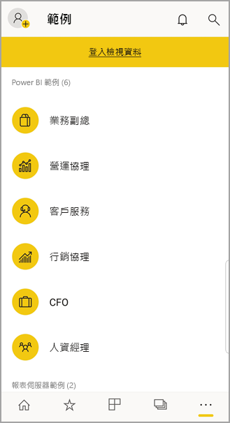

# 開始在 Android 裝置上使用 Power BI 行動裝置應用程式
Microsoft Power BI for Android 應用程式傳遞 Power BI、Power BI 報表伺服器和 Reporting Services 的行動 BI 體驗。 您可以利用即時的觸控式行動裝置存取功能，隨處檢視內部部署和雲端中的公司儀表板並與之互動。 探索儀表板中的資料，並使用電子郵件或文字訊息與同事共用。 

在 Power BI Desktop 中建立 Power BI 報表，並發行報表：

* [將它們發行至 Power BI 服務](../../fundamentals/power-bi-overview.md)，並建立儀表板。
* [將內部部署的報表發佈至 Power BI 報表伺服器](../../report-server/quickstart-create-powerbi-report.md)。

然後在 Android 的 Power BI 應用程式中，與您內部部署或雲端中的儀表板和報表互動。

了解 [Power BI 行動裝置應用程式的新功能](mobile-whats-new-in-the-mobile-apps.md)。

## 必要條件

### 取得應用程式

從 Google Play [下載 Power BI for Android 應用程式](https://go.microsoft.com/fwlink/?LinkID=544867)。
  
Power BI 可以在多種不同的 Android 裝置 (執行 Android 5.0 作業系統或更新版本) 上執行。 若要檢查您的裝置，請前往 [設定] > [關於裝置] > [Android 版本]。 

**開啟應用程式時啟動**    
即使您沒有註冊或登入，只要開啟應用程式，便可以翻閱登入頁面，並快速概覽可以利用 Power BI 應用程式在 Android 裝置上執行的事項。 點選 [跳過] 可檢視及探索範例，並取得應用程式的實際操作體驗。 您隨時可以從儀表板首頁[返回範例](mobile-android-app-get-started.md#try-the-power-bi-and-reporting-services-samples)。

了解 [Power BI 行動裝置應用程式的新功能](mobile-whats-new-in-the-mobile-apps.md)。

## 在網路上註冊 Power BI 服務
如果您尚未註冊，請前往 [Power BI 服務](https://powerbi.com/)來註冊您用來建立及儲存儀表板和報表的專屬帳戶，並將您的資料匯聚在一起。 然後從您的 Android 裝置登入 Power BI，藉此可從任何地方查看您自己的儀表板。

1. 在 Power BI 服務中，點選 [註冊](https://go.microsoft.com/fwlink/?LinkID=513879) 來建立 Power BI 帳戶。
2. 開始[建立您自己的儀表板和報表](../../fundamentals/service-get-started.md)。

## 開始在您的裝置上使用 Power BI 應用程式
1. 在您的 Android 裝置上，從開始畫面開啟 Power BI for Android 應用程式。
   
   
2. 若要登入 Power BI，請點選 [Power BI] 索引標籤並填寫您的登入詳細資料。

    如果您收到一則訊息指出 Power BI 無法讓您登入，請參閱[「由於您的公司 SSL 憑證不受信任，因此無法驗證」](mobile-android-app-error-corporate-ssl-account-is-untrusted.md)，取得如何解決此問題的詳細資訊。

   若要登入 Reporting Services 行動報表和 KPI，請點選 [報表伺服器] 索引標籤並填寫您的登入詳細資料。
   
   

## 試用 Power BI 和 Reporting Services 範例
即使未註冊，您也可以檢視 Power BI 和 Reporting Services 範例並與其互動。

若要存取範例，請點選導覽列上的 [更多選項] (...)，然後選擇 [範例]。

幾個 Power BI 範例後面接著幾個報表伺服器範例。
   
   

   
   > [!NOTE]
   > 這些範例並未提供所有功能。 例如，您無法檢視構成儀表板的範例報表、您無法與他人共用範例，且您無法將這些範例設為我的最愛。 
   > 
   >

## 在 Power BI 行動裝置應用程式中尋找內容

請點選標頭中的放大鏡，開始搜尋您的 Power BI 內容。

## 檢視您最愛的儀表板和報表
點選導覽列上的 [我的最愛] ()，檢視 [我的最愛] 頁面。 

閱讀更多以了解 [Power BI 行動裝置應用程式中的我的最愛](mobile-apps-favorites.md)。

## Power BI 行動裝置應用程式的企業支援
組織可以使用 Microsoft Intune 管理裝置和應用程式，包括 Power BI for Android 和 iOS 行動裝置應用程式。

Microsoft Intune 讓組織可以控制像是要求存取 PIN、控制應用程式處理資料的方式，甚至是加密待用應用程式的資料等項目。

> [!NOTE]
> 您的組織設定 Microsoft Intune MAM 之後，如果您在 Android 裝置上使用 Power BI 行動裝置應用程式，則背景的資料重新整理會關閉。 下次進入應用程式時，Power BI 會從網路上的 Power BI 服務重新整理資料。
> 
> 

深入了解[使用 Microsoft Intune 設定 Power BI 行動裝置應用程式](../../admin/service-admin-mobile-intune.md)。 

## 後續步驟
您還可以在適用於 Power BI 的 Android 裝置應用程式中，運用 Power BI 中的儀表板和報表，以及 Power BI 報表伺服器或 Reporting Services 入口網站中的報表與 KPI 來執行其他作業。

### Power BI 儀表板和報表
* 檢視[應用程式](../../collaborate-share/service-create-distribute-apps.md)。
* 檢視您的[儀表板](mobile-apps-view-dashboard.md)。
* 探索[儀表板上的磚](mobile-tiles-in-the-mobile-apps.md)。
* 開啟 [Power BI 報表](mobile-reports-in-the-mobile-apps.md)。
* 檢視[您的應用程式](../../collaborate-share/service-create-distribute-apps.md)。
* [標註並共用磚](mobile-annotate-and-share-a-tile-from-the-mobile-apps.md)。
* 共用[儀表板](mobile-share-dashboard-from-the-mobile-apps.md)。
* 使用 Android 手機[掃描 Power BI QR 代碼](mobile-apps-qr-code.md)，以開啟相關儀表板圖格或報表。 
* 檢視 [Power BI 帳戶更新的相關通知](mobile-apps-notification-center.md)，例如同事與您共用的儀表板。

### Power BI 報表伺服器和 Reporting Services 入口網站的報表與 KPI
* 在 Power BI for Android 行動裝置應用程式中[檢視入口網站的報表和 KPI](mobile-app-ssrs-kpis-mobile-on-premises-reports.md)。
* [在入口網站中建立 KPI](https://docs.microsoft.com/sql/reporting-services/working-with-kpis-in-reporting-services)。
* [在 Power BI Desktop 中建立報表，並將它們發行至 Power BI 報表伺服器入口網站](../../report-server/quickstart-create-powerbi-report.md)

### 另請參閱
* 從 Android App Store [下載 Android 應用程式](https://go.microsoft.com/fwlink/?LinkID=544867)。
* [Power BI 是什麼？](../../fundamentals/power-bi-overview.md)
* 有問題嗎？ [嘗試在 Power BI 社群提問](https://community.powerbi.com/)
