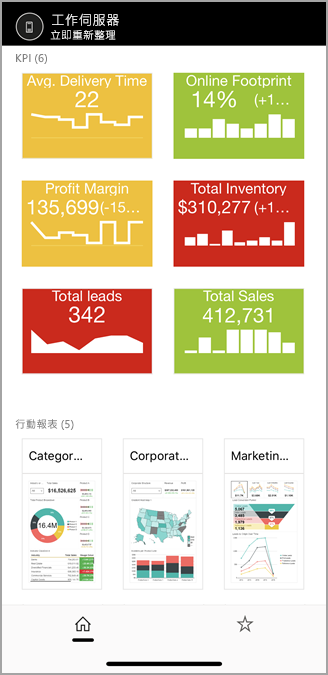
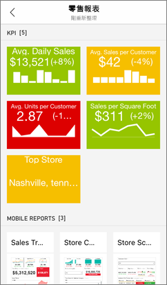
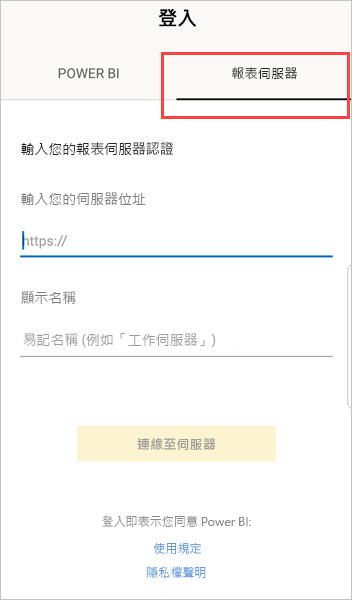
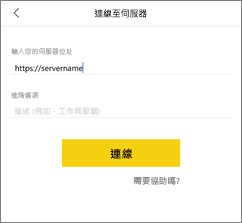
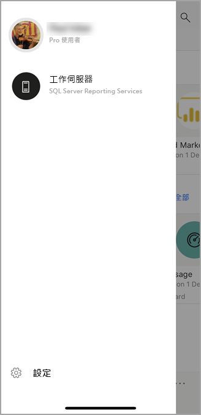
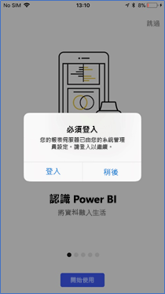
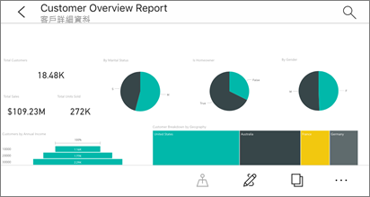
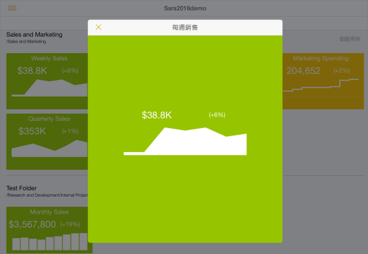

# 在 Power BI 行動裝置應用程式中檢視內部部署報表伺服器報表和 KPI

Power BI 行動裝置應用程式提供 Power BI 報表伺服器及 SQL Server 2016 Reporting Services (SSRS) 中，內部部署商務資訊的即時觸控式行動存取。

適用於：

|  |  |  |  |
|:--- |:--- |:--- |:--- |
| iPhone |iPad |Android 手機 |Android 平板電腦 |

## 最重要的第一件事
**行動裝置應用程式是您檢視 Power BI 內容的位置，不是建立內容的位置。**

* 您和貴組織的其他報表建立者[使用 Power BI Desktop 建立 Power BI 報表，然後將其發行至 Power BI 報表伺服器](../../report-server/quickstart-create-powerbi-report.md)入口網站。 
* 您可[直接在入口網站中建立 KPI](https://docs.microsoft.com/sql/reporting-services/working-with-kpis-in-reporting-services)、在資料夾中加以整理及標示您的最愛，以便輕鬆找到這些 KPI。 
* 使用 SQL Server 2016 Enterprise Edition 行動報表發行工具[建立 Reporting Services 行動報表](https://docs.microsoft.com/sql/reporting-services/mobile-reports/create-mobile-reports-with-sql-server-mobile-report-publisher)，並將其發行至 [Reporting Services 入口網站](https://docs.microsoft.com/sql/reporting-services/web-portal-ssrs-native-mode)。  

然後在 Power BI 行動裝置應用程式中，連線到最多五部報表伺服器，以檢視資料夾中整理或收集為我的最愛的 Power BI 報表及 KPI。 

## 在沒有伺服器連線的行動裝置應用程式中探索範例
即使您沒有 Reporting Services 入口網站的存取權，您仍然可以探索 Reporting Services 行動報表與 KPI 的功能。 

1. 點選左上角的設定檔圖片，再於滑出的 [帳戶] 窗格中點選 [設定]  。

2. 在開啟的 [設定] 頁面中，點選 [Reporting Services 範例]  ，然後瀏覽至範例 KPI 和行動報表來與其互動。
   
   

## 連線到內部部署報表伺服器
您可在 Power BI 行動裝置應用程式中檢視內部部署 Power BI 報表、Reporting Services 行動報表和 KPI。 

1. 在您的行動裝置上開啟 Power BI 應用程式。
2. 如果您還沒有登入 Power BI，請點選 [報表伺服器]  。
   
   
   
   如已登入 Power BI 應用程式，請點選左上角的設定檔圖片，然後於滑出的 [帳戶] 窗格中點選 [設定]  。
3. 在開啟的 [設定] 頁面中，點選 [連線到伺服器]  。
   
    

    行動裝置應用程式需要以某種方式存取伺服器。 有幾種方式可執行此作業：
     * 位於相同的網路上/使用 VPN 是最簡單的方式。
     * 可以使用 Web Application Proxy 從組織外部進行連線。 如需詳細資訊，請參閱[使用 OAuth 連線到 Reporting Services](mobile-oauth-ssrs.md)。
     * 在防火牆中開啟連線 (連接埠)。

4. 如果願意，您可填入伺服器位址並提供好記的伺服器名稱。 請使用此格式的伺服器位址：
   
     `https://<servername>/reports`
   
     或
   
     `https://<servername>/reports`
   
   請在連接字串前面包含 **http** 或 **https**。
   
    
5. 填入伺服器位址及選用的好記名稱後，點選 [連線]  ，然後在提示出現時填入您的使用者名稱和密碼。
6. 您現在可在 [帳戶] 窗格中看到伺服器，本例中稱為「工作伺服器」。
   
   

## 在 iOS 或 Android 中連線到內部部署報表伺服器

如果您正在檢視 iOS 或 Android 行動裝置應用程式中的 Power BI，您的 IT 系統管理員可能已定義應用程式設定原則。 如果是這樣，連線到報表伺服器的體驗就會變得流暢，且在連線到報表伺服器時不必提供詳細資訊。 

1. 您會看到一條訊息，確認您的行動裝置應用程式已設定報表伺服器。 點選 [登入]  。

    

2.  在 [連線到伺服器]  頁面上，報表伺服器的詳細資料已填入。 點選 [連接]  。

    

3. 鍵入密碼以進行驗證，然後點選 [登入]  。 

    

現在您可以檢視 KPI 和儲存在報表伺服器上的 Power BI 報表，並與其互動。

## 在 Power BI 應用程式中檢視 Power BI 報表與 KPI
Power BI 報表、Reporting Services 行動報表和 KPI 皆顯示在 Reporting Services 入口網站的同一個資料夾中。 

* 點選 Power BI 報表 . 它會以橫向模式開啟，而且您可以在 Power BI 應用程式中與之互動。

    > [!NOTE]
  > 在 Power BI 報表伺服器上，目前未啟用 Power BI 報表中的向下切入和向上切入。
  
    
* 在 Power BI Desktop 中，報表擁有者可以為 Power BI 行動裝置應用程式[最佳化報表](../../create-reports/desktop-create-phone-report.md)。 在您的行動電話上，最佳化的報表會有特殊圖示和配置。
  
    
* 點選 KPI，以焦點模式查看。
  
    

## 檢視您最愛的 KPI 和報表
您可以在入口網站中，將 KPI 和報表標示為 [我的最愛]，然後將其與您 Power BI 最愛的儀表板放置在行動裝置方便存取的資料夾中並加以檢視。

* 點選導覽列上的 [我的最愛]  。
  
   ![導覽窗格中的 [我的最愛]](./media/mobile-app-ssrs-kpis-mobile-on-premises-reports/power-bi-ipad-faves-pbi-report-server-update.png)
  
   入口網站上您最愛的 KPI 和報表以及在 Power BI 服務中的 Power BI 儀表板，都在這個頁面上：
  
   

## 移除報表伺服器的連線
1. 開啟 [帳戶] 窗格，點選 [設定]  。
2. 點選您不要連線的伺服器名稱。
3. 點選 [移除伺服器]  。

## 後續步驟
* [Power BI 是什麼？](../../fundamentals/power-bi-overview.md)  
* 有任何問題嗎？ [嘗試在 Power BI 社群提問](https://community.powerbi.com/)
