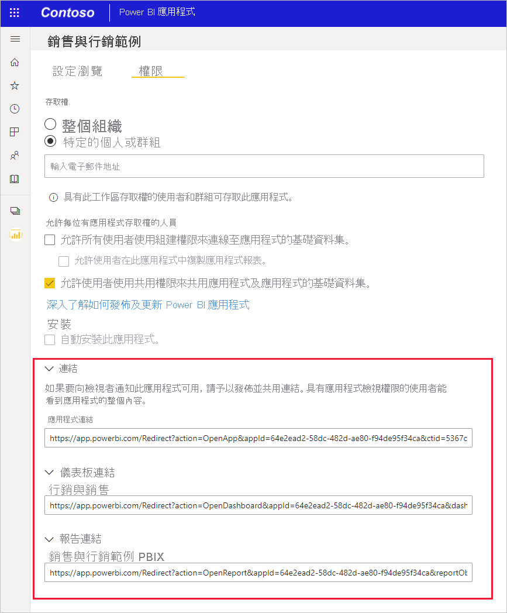

# 建立 Power BI 行動裝置應用程式中的特定位置連結
您可以使用連結來直接存取特定的 Power BI 內容，例如特定的報表、報表頁面、儀表板、磚等。

在 Power BI 行動應用程式中使用連結來存取內容的主要案例有兩種： 

* 從 **行動應用程式外部** 開啟 Power BI，並登陸特定內容。 這通常是整合案例，其中您會從另一個應用程式開啟 Power BI 行動應用程式。 
* 為了在 Power BI 內部 **巡覽**。 這通常會在您想要於 Power BI 中建立自訂瀏覽時進行。

此文章涵蓋下列案例：
* 使用連結來從行動應用程式外部開啟特定的 Power BI 內容。 其中描述兩種連結格式。 一種會使用重新導向方法，而且不論 Power BI 將在何處開啟，均可使用。 另一種則會在 Power BI 行動應用程式中直接開啟，而且只能在已安裝該行動應用程式的行動裝置上運作。
* 使用 Power BI 內的連結來瀏覽至特定的 Power BI 內容。

## 使用來自行動應用程式外部的連結
當您想要從行動應用程式外部連結到 Power BI 中的特定項目時，根據將開啟連結的位置而定，會有兩個選項：

* 如果您希望無論是在電腦瀏覽器中或在行動裝置上按一下連結，其都能正確開啟，則可以建立能確保無論是在哪裡按一下都能正確開啟的連結。 此連結具有特殊的重新導向語法以啟用此智慧行為。

* 如果您知道連結只會在已安裝 Power BI 行動應用程式的行動裝置上開啟，則可避免上述方法的重新導向額外負荷，並使用另一種連結語法，其能在行動裝置上的 Power BI 行動應用程式中直接開啟連結。 但請務必注意，雖然此連結可避免第一種方法的重新導向額外負荷，如果不是在已安裝 Power BI 行動應用程式的行動裝置上加以開啟，此連結將不會有任何作用。

### 建立可在任何地方運作的連結
此節所述的連結格式會使用重新導向，以確保無論是在哪裡按一下連結，其都能正常運作。
* 如果在行動裝置上按一下連結，其會確保裝置會使用 Power BI 行動應用程式來開啟連結。 如果行動應用程式並未安裝於該裝置上，則其會建議使用者前往商店加以取得。
* 如果在電腦上按一下連結，其將在 Power BI Web 入口網站中開啟相關項目。

連結必須以特殊前置詞開頭，後面接著查詢參數：

https<nolink>://app.powerbi.com/Redirect? **[QUERYPARAMETERS]** </code>

> [!IMPORTANT]
> 如果您的內容裝載於特殊資料中心 (例如政府、中國等)，則連結應該要以適當的 Power BI 位址開頭，例如 **app.powerbigov.us** 或 **app.powerbi.cn**。

查詢參數包括：

|參數  | 值  | 描述 |
|---------|---------|---------|
|**action** (強制)    | OpenApp OpenReport OpenDashboard OpenTile | |
|**appId**| 36 個字元 GUID | 如果您想要開啟屬於應用程式的報表或儀表板，則必須指定。 範例：**appId=baf4b16d-b5bd-4360-8a3a-51d11242c09b** |
|**groupObjectId**| 36 個字元 GUID | 如果您想要開啟不屬於 [我的工作區] 的報表或儀表板，請指定工作區。 範例：**groupObjectId=9a3841c6-74b3-46f1-85fd-bdd78f27b30e** |
| **dashboardObjectId** | 36 個字元 GUID | 儀表板物件識別碼 (如果 action 是 OpenDashboard 或 OpenTile) 範例：**dashboardObjectId=033bb049-5b68-4392-b3ef-ae9a43738a4a** |
| **reportObjectId** | 36 個字元 GUID | 報表物件識別碼 (如果 action 是 OpenReport) 範例：**reportObjectId=6114cec7-78e1-4926-88ff-0bc5338452cf** |
| **tileObjectId** | 36 個字元 GUID | 磚物件識別碼 (如果 action 是 OpenTile) 範例：**tileObjectId=a845dcb8-a289-43a8-94ea-67a8c0a068f9** |
| **reportPage** | ReportSection&lt;num&gt; | 如果您想要開啟特定的報表頁面，請指定頁面名稱。 (如果 action 是 OpenReport) 範例：**reportPage=ReportSection6**  |
| **bookmarkGuid** | 36 個字元 GUID | 如果您想要開啟特定的書籤檢視，請指定書籤識別碼。 (如果 action 是 OpenReport) 範例：**bookmarkGuid=18e8872f-6db8-4cf8-8298-3b2ab254cc7f** |
| **ctid** | 36 個字元 GUID | 項目組織識別碼 (與 B2B 案例相關。 如果項目屬於使用者的組織，就可以省略此參數) 範例：**ctid=5367c770-09d0-4110-bf6a-d760cb5ef681**。 |
||||

**範例：**

在下列範例中，會以粗體醒目提示參數值的預留位置。 若要取得實際值，請移至 Power BI 服務，開啟您要連結的項目，然後從項目的 URL 中擷取您所需的值。

* **開啟應用程式**

    https<nolink>://app.powerbi.com/Redirect?action=OpenApp&appId= **&lt;appid-guid&gt;** &ctid= **&lt;ctid-guid&gt;**
   
* **開啟屬於應用程式的儀表板**

    https<nolink>://app.powerbi.com/Redirect?action=OpenDashboard&appId= **&lt;appid-guid&gt;** &dashboardObjectId= **&lt;dashboardid-guid&gt;** &ctid= **&lt;ctid-guid&gt;**

* **開啟屬於 [我的工作區] 以外之工作區的報表**

    https<nolink>://app.powerbi.com/Redirect?Action=OpenReport&reportObjectId= **&lt;reportid-guid&gt;** &groupObjectId= **&lt;groupobjectid-guid&gt;** &reportPage=**ReportSection&lt;num&gt;**

### 如何取得正確的連結格式

#### 應用程式和應用程式中項目的連結

對於 **應用程式，以及屬於應用程式的報表和儀表板**，取得連結最簡單的方式是移至應用程式工作區，然後選擇 [更新應用程式]。 這會開啟「發佈應用程式」體驗。 開啟 [權限] 索引標籤並展開 [連結] 區段，以查看應用程式及其所有內容的連結。 您可以從 Power BI 外部使用這些連結，直接存取應用程式及其內容。

#### 不在應用程式中之項目的連結 

對於不屬於應用程式的報表和儀表板，您需要從項目的 URL 中擷取您所需的物件識別碼。 若要這麼做，請移至 Power BI 服務，瀏覽至您要連結的項目，然後在您於瀏覽器網址列中看到的 URL 中尋找所需的值。

下列範例顯示您可在要連結之項目的 URL 中尋找所需識別碼的位置。

* 若要尋找 36 個字元的儀表板物件識別碼，請在 Power BI 服務中瀏覽至您想要連結的特定儀表板，然後在以下所示的位置中，尋找儀表板物件識別碼及任何其他必要的識別碼：

    https<nolink>://app.powerbi.com/groups/me/dashboards/ **&lt;dashboard-object-id&gt;** ?ctid= **&lt;org-object-id&gt;**

* 若要尋找 36 個字元的報表物件識別碼，請在 Power BI 服務中瀏覽至您想要連結的特定報表，然後尋找必要的識別碼，如下所示。 請注意，此範例包含對特定報表頁面和特定書籤的參考。

    https<nolink>://app.powerbi.com/groups/me/reports/ **&lt;report-object-id&gt;** /**ReportSection&lt;num&gt;** ?bookmarkGuid= **&lt;bookmark-id&gt;**

* 若要連結至 [我的工作區] 以外之工作區中的項目，您必須擷取群組物件識別碼。 此範例顯示來自 [我的工作區] 以外之工作區的報表。

    https<nolink>://app.powerbi.com/groups/ **&lt;group-object-id&gt;** /reports/ **&lt;report-object-id&gt;** /**ReportSection&lt;report-section-num&gt;** ?ctid= **&lt;org-object-id&gt;**

### 建立僅能在已安裝 Power BI 行動應用程式的裝置上開啟的連結

此節所述的連結格式會連結至所有行動平台 (如下所列) 上的 Power BI 行動應用程式內的特定位置：iOS、Android 裝置和 Windows 10。 此連結格式會直接開啟該位置，而不需使用涉及上一節所述方法的任何重新導向。 **此格式只能在已安裝 Power BI 行動應用程式的行動裝置上開啟**。

此格式的連結可以直接指向儀表板、磚和報表。 深層連結的目的地會決定其格式。 請遵循下列步驟來建立不同位置的深層連結。 

* **開啟 Power BI 行動裝置應用程式**

    使用此連結來在任何裝置上開啟 Power BI 行動應用程式：

    mspbi://app/

* **開啟至特定儀表板**

    此連結會將 Power BI 行動應用程式開啟至特定儀表板：

    mspbi://app/OpenDashboard?DashboardObjectId= **<36-character-dashboard-id>**

    若要取得 36 個字元的儀表板物件識別碼，請瀏覽至 Power BI 服務中的特定儀表板，並從 URL 中加以擷取。 例如，已在下列來自 Power BI 服務的 URL 中醒目提示儀表板物件識別碼：

    https<nolink>://app.powerbi.com/groups/me/dashboards/ **&lt;61b7e871-cb98-48ed-bddc-6572c921e270&gt;**

    如果儀表板不在 [我的工作區] 中，您也需要在儀表板識別碼之前或之後新增群組物件識別碼。 以下所示的深層連結已在儀表板物件識別碼之後新增群組物件識別碼參數：

    mspbi://app/OpenDashboard?DashboardObjectId=**e684af3a-9e7f-44ee-b679-b9a1c59b5d60**&GroupObjectId=**8cc900cc-7339-467f-8900-fec82d748248**</code>

    請注意兩個參數之間的連字號 (&)。

* **以焦點模式開啟至特定磚**

    此連結會在 Power BI 行動應用程式中，以焦點模式開啟特定磚：

    mspbi://app/OpenTile?DashboardObjectId= **<36-character-dashboard-id>** &TileObjectId= **<36-character-tile-id>**

    若要尋找 36 個字元的儀表板和磚物件識別碼，請瀏覽至 Power BI 服務中的特定儀表板，然後以焦點模式開啟磚。 在下列範例中，已醒目提示儀表板和磚識別碼。

    https<nolink>://app.powerbi.com/groups/me/dashboards/**3784f99f-b460-4d5e-b86c-b6d8f7ec54b7**/tiles/**565f9740-5131-4648-87f2-f79c4cf9c5f5**/infocus

    若要直接開啟此磚，則連結會是：

    mspbi://app/OpenTile?DashboardObjectId=3784f99f-b460-4d5e-b86c-b6d8f7ec54b7&TileObjectId=565f9740-5131-4648-87f2-f79c4cf9c5f5

    請注意兩個參數之間的連字號 (&)。

    如果儀表板不在 [我的工作區] 中，請新增 GroupObjectId 參數，例如 &GroupObjectId=<36-character-group-id>

* **開啟至特定報表**

    此連結會在 Power BI 行動應用程式中，開啟特定報表：

    mspbi://app/OpenReport?ReportObjectId= **<36-character-report-id>**

    若要尋找 36 個字元的報表物件識別碼，請瀏覽至 Power BI 服務中的特定報表。 下列來自 Power BI 服務的 URL 會說明您需要擷取的報表識別碼。

    https<nolink>://app.powerbi.com/groups/me/reports/**df9f0e94-31df-450b-b97f-4461a7e4d300**

    如果報表不在 [我的工作區] 中，您也必須在報表識別碼之前或之後新增 **&GroupObjectId=<36-character-group-id>** 。 例如，在此案例中，深層連結會是：

    mspbi://app/OpenReport?ReportObjectId=**e684af3a-9e7f-44ee-b679-b9a1c59b5d60**&GroupObjectId=**8cc900cc-7339-467f-8900-fec82d748248**

    請注意兩個參數之間的連字號 (&)。

* **開啟特定報表頁面**

    此連結會在 Power BI 行動應用程式中，開啟特定報表頁面：

    mspbi://app/OpenReport?ReportObjectId= **<36-character-report-id>** &reportPage=**ReportSection&lt;number&gt;**

    此報表頁面稱為 **ReportSection**，後面接著一個數字。 同樣地，若要尋找您所需的值，請在 Power BI 服務中開啟報表，瀏覽至特定報表頁面，然後從 URL 中擷取您所需的值。 例如，此 URL 醒目提示的區段代表開啟至特定報表頁面所需的值：

    https<nolink>://app.powerbi.com/groups/me/reports/**df9f0e94-31df-450b-b97f-4461a7e4d300**/**ReportSection11**</code>

* **以全螢幕模式開啟 (僅適用於 Windows 裝置)**

    針對 Windows 裝置，您也可以新增 **openFullScreen** 參數，來以全螢幕模式開啟特定報表。 下列範例會以全螢幕模式開啟報表頁面：

    mspbi://app/OpenReport?ReportObjectId=500217de-50f0-4af1-b345-b81027224033&**openFullScreen=true**

* **新增內容** (選擇性)

    您也可以在字串中新增內容。 然後，如果您需要與我們連絡，我們就能使用該內容來篩選我們的資料，以尋找與您應用程式相關的內容。 若要新增內容，請將參數 **context=&lt;app-name&gt;** 新增至連結：

    例如，下列範例顯示包含內容參數的連結： 

    mspbi://app/OpenReport?ReportObjectId=**e684af3a-9e7f-44ee-b679-b9a1c59b5d60**&GroupObjectId=**8cc900cc-7339-467f-8900-fec82d748248**&**context=SlackDeepLink**

## 使用 Power BI 內部的連結

在 Power BI 行動應用程式中，Power BI 內連結的運作方式和其在 Power BI 服務中的運作方式相同。

如果您想要在報表中新增指向另一個 Power BI 項目的連結，只需從瀏覽器網址列複製該項目的 URL。 閱讀更多[如何將超連結新增至報表中的文字方塊](https://docs.microsoft.com/power-bi/service-add-hyperlink-to-text-box)相關資訊。

## 下一步
您的意見反應可協助我們決定要在未來實作的項目，因此別忘了對您想在 Power BI 行動應用程式中看到的其他功能進行投票。 

* [行動裝置的 Power BI 應用程式](mobile-apps-for-mobile-devices.md)
* 請在 Twitter 上關注 @MSPowerBI
* 加入 [Power BI 社群](http://community.powerbi.com/)的交談
* [Power BI 是什麼？](../../power-bi-overview.md)
