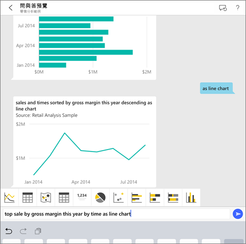
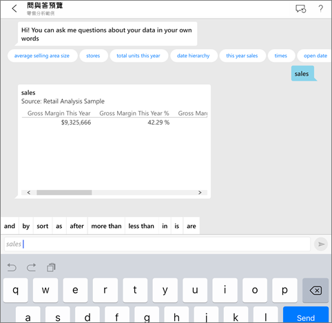
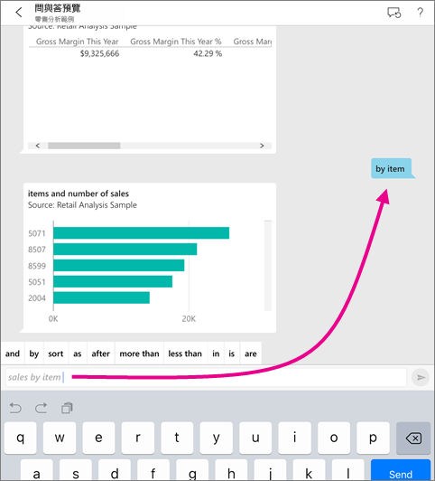
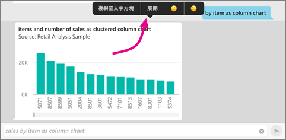
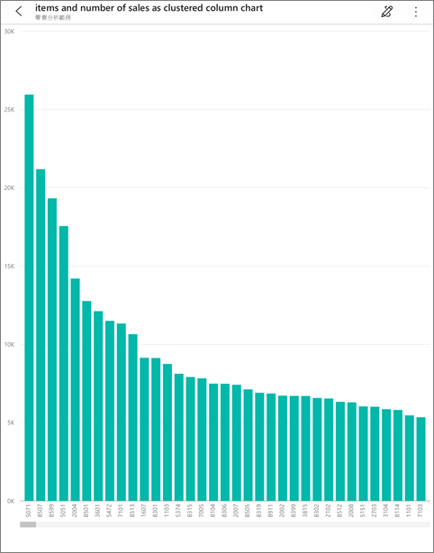
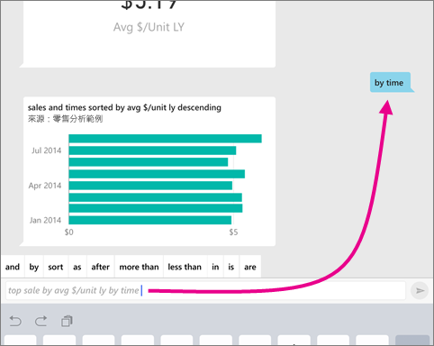
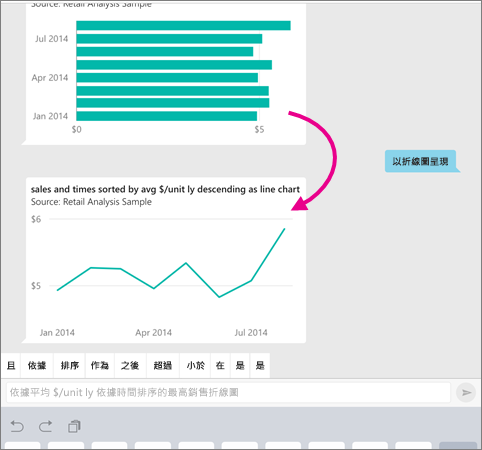
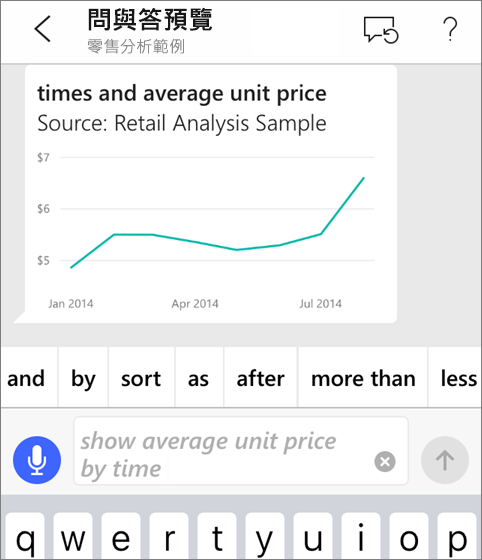
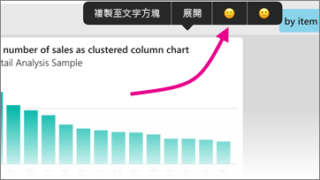

# iOS 應用程式中的問與答虛擬分析師 - Power BI

如果您想要了解資料，最簡單的方法就是用自己的文字來詢問相關問題。 在本文中，您可以使用 iPad、iPhone 和 iPod Touch 上的 Microsoft Power BI 行動裝置應用程式中的問與答虛擬分析師詢問問題，並查看有關範例資料的深入見解。 

適用於︰

|  |  |
|:--- |:--- |
| iPhone |iPad |

問與答虛擬分析師是便利的 BI 體驗，可存取 Power BI 服務 [(https://powerbi.com)](https://powerbi.com) 中最基本的問與答資料。 它提供了資料見解，而您可以輸入或使用您自己的問題。

如果您尚未註冊 Power BI，請先進行[免費註冊](https://app.powerbi.com/signupredirect?pbi_source=web)再開始。

## 必要條件

* **安裝 iOS 版 Power BI 應用程式**：[將 iOS 應用程式](https://go.microsoft.com/fwlink/?LinkId=522062)下載到您的 iPhone 或 iPad。
這些版本支援 iOS 版 Power BI 應用程式：
    * iPad (iOS 11 或更新版本)。
    * iPhone 5 與後續機種 (iOS 11 或更新版本)。
* **下載零售分析和商機分析範例**：本快速入門的第一個步驟是下載 Power BI 服務中的零售分析及商機分析範例。 [了解如何下載範例](./mobile-apps-download-samples.md)到 Power BI 帳戶以開始使用。 請務必選擇 [零售分析範例] 和 [商機分析範例]。

完成必要條件之後，您隨時可以試用問與答虛擬分析師。

## 請嘗試在您的 iPhone 或 iPad 上詢問問題
1. 在 iPhone 或 iPad 的底部導覽列上，點選 [工作區] 按鈕 ![[工作區] 按鈕](./media/mobile-apps-ios-qna/power-bi-iphone-workspaces-button.png)並前往 [我的工作區]，開啟 [零售分析範例] 儀表板。

2. 在頁面底部 (若是 iPad 則為頁面頂端) 的 [動作] 功能表中，點選問與答虛擬分析師圖示。
     問與答虛擬分析師提供了一些開始使用的建議。
3. 鍵入 **show**，從建議清單中點選 [sales]  > [傳送]  。

    
4. 從關鍵字中點選 **by**，然後從建議清單中點選 [item]  > [傳送]  。

    
5. 依序從關鍵字中點選 **as**、資料行圖表圖示 ，然後點選 [傳送]  。
6. 按住產出的圖表，然後點選 [展開]  。

    

    圖表會在應用程式中以焦點模式開啟。

    
7. 點選左上角的箭號，可返回問與答虛擬分析師聊天視窗。
8. 點選文字方塊右邊的 X 以刪除文字，然後重新開始。
9. 嘗試新的提問︰從關鍵字點選 **top**，然後點選 [依單位平均銷售金額排序]   > [傳送]  。

    
10. 從關鍵字選擇 **by**，從頂端的建議清單點選 [time]  > [傳送]  。

     
11. 鍵入 **as**，然後從建議清單中選取折線圖圖示  > [傳送]  。

    

## 請說出您的問題
您現在可以口說的方式來取代鍵入文字，詢問有關 Power BI 行動應用程式中資料的問題。

1. 點選問與答虛擬分析師圖示  點選問與答圖示。
2. 點選麥克風圖示。

    

1. 當麥克風圖示啟動時開始說話。 例如，說出「依時間計算的平均單價」，然後點選 [傳送]  。

    

### 在使用語音轉換文字時，有關於隱私權的問題嗎？
請參閱 Apple iOS 開發人員指南之 [What's New in iOS](https://go.microsoft.com/fwlink/?linkid=845624) (iOS的新功能) 中的＜Speech Recognition＞(語音辨識) 一節。

## 說明與意見反應
* 需要協助嗎？ 只需要說聲「嗨」或「求助」，您就可以提出新的問題來取得協助。
* 要對結果提供意見反應嗎？ 請按住圖表或其他結果，然後點選笑臉或苦臉。

    

    您的意見反應是匿名的，可協助我們改進問題的解答。

## 增強您的問與答虛擬分析師結果
您可以提出更具針對性的問題，或強化資料集，以改善您與客戶針對資料集使用問與答虛擬分析師時所得的結果。

### 如何提出問題
* 使用 Power BI 服務或 iOS 行動應用程式的問與答虛擬分析師時，請遵循[在問與答中詢問問題的祕訣](../end-user-q-and-a-tips.md)。

### 如何增強資料集
* 增強 Power BI Desktop 或 Power BI 服務中的資料集，[讓資料適用於問與答以及問與答虛擬分析師](../../create-reports/service-prepare-data-for-q-and-a.md)。

## 後續步驟
* [Power BI 服務中的問與答](../end-user-q-and-a.md)
* 有問題嗎？ 請查看 [Power BI 社群的 mobile apps](https://go.microsoft.com/fwlink/?linkid=839277) 一節
