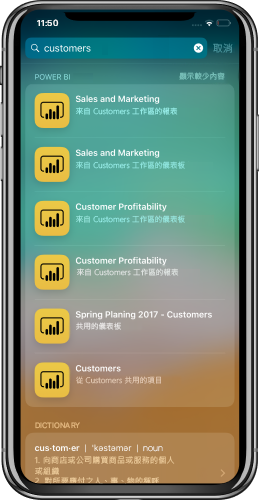

# 與 Power BI iOS 行動裝置應用程式的 iOS 裝置搜尋 (焦點) 整合 (預覽)
使用 iOS 裝置搜尋來尋找並存取您需要的內容。

當您使用 iOS 裝置搜尋 (焦點) 來尋找特定內容時，結果清單中會包含 Power BI 項目。 從結果清單點選 Power BI 項目會直接帶您前往 Power BI 應用程式內的該項目。

## 使用裝置搜尋來尋找項目

若要使用裝置搜尋來尋找項目：

1. 從 [首頁]  畫面中間向下撥動以進入裝置搜尋。

2. 點選 [搜尋]  欄位並鍵入您要尋找的文字。
 
   搜尋結果會包含下列類型的 Power BI 項目：

    * 儀表板
    * 報表
    * 應用程式
    * 工作區
    * 您所搜尋連絡人共用的項目

    

 3. 一旦找到您想要的項目，請加以點選。 Power BI 應用程式會直接在所選取的項目上開啟。 

裝置搜尋是由 Siri 提供，也會根據您在 Power BI 應用程式中經常執行的動作來加入建議。 Siri 建議會顯示在搜尋和鎖定畫面中。

>[!NOTE]
>
>若要停用裝置搜尋與 Siri 建議，請移至 [裝置設定]  > [Power BI 設定]  > [Siri 與搜尋]  ，然後停用 [Siri 與建議]  設定。
>

## 後續步驟
如需 Power BI 行動裝置應用程式的詳細資訊，請執行下列動作： 

* 下載 [Power BI iPhone 行動裝置應用程式](https://go.microsoft.com/fwlink/?LinkId=522062)
* 關注 [Twitter 上的 @MSPowerBI](https://twitter.com/MSPowerBI)
* 加入 [Power BI 社群](https://community.powerbi.com/)的交談

