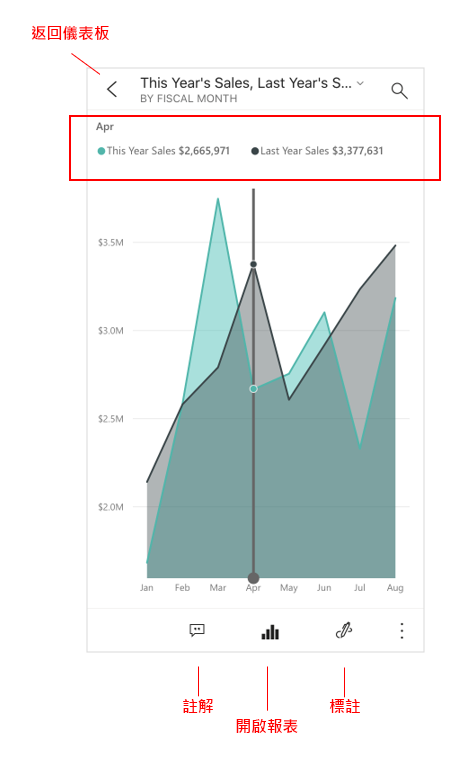
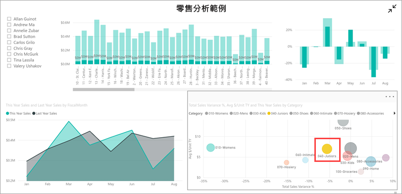
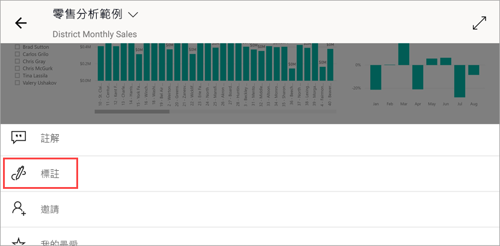
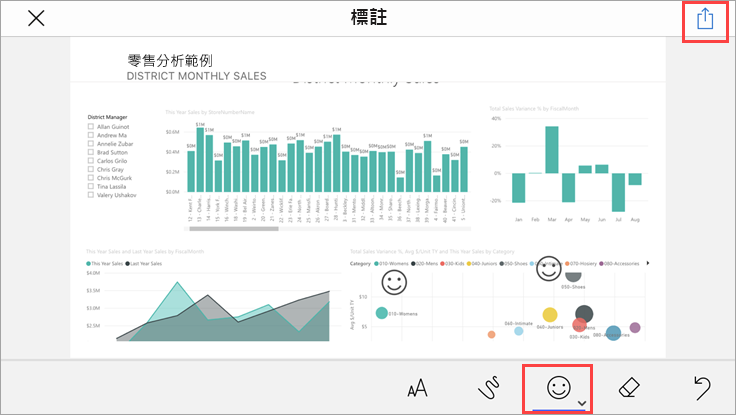

# 快速入門：在 Power BI 行動裝置應用程式中探索儀表板和報表
在本快速入門中，您可快速瀏覽 Power BI 行動裝置應用程式，以及探索範例儀表板和報表。 您會看到 iOS 版 Power BI 應用程式，但在其他裝置上也可以輕鬆掌握。

適用於︰

|  |  |  |  |
|:--- |:--- |:--- |:--- |
| iPhone | iPad | Android | Windows 10 |

>[!NOTE]
>**使用 Windows 10 行動裝置版手機** 的 Power BI 行動裝置應用程式支援，將於 2021 年 3 月 16 日停止。 [深入了解](/legal/powerbi/powerbi-mobile/power-bi-mobile-app-end-of-support-for-windows-phones)

儀表板是您公司生命週期和流程的入口網站。 儀表板是總覽，用於監控企業目前狀態的單一位置。 報表是資料的互動式檢視，以視覺效果顯示資料的各種發現與見解及需要深入了解的事項。 

## 必要條件

* **註冊 Power BI**：如果您尚未註冊 Power BI，請先進行 [免費註冊](https://app.powerbi.com/signupredirect?pbi_source=web)再開始。
* **為裝置安裝 Power BI 應用程式**：從 [App store](https://apps.apple.com/app/microsoft-power-bi/id929738808) (iOS) 或 [Google play](https://play.google.com/store/apps/details?id=com.microsoft.powerbim&amp;amp;clcid=0x409) (Android) 下載 Power BI 行動裝置應用程式**。
* **下載零售分析範例**：本快速入門的第一個步驟是下載 Power BI 服務中的零售分析範例。 [了解如何下載範例](./mobile-apps-download-samples.md)到您的 Power BI 帳戶以開始使用。 請務必選擇零售分析範例。

當完成必要條件並將零售分析範例下載到 Power BI 帳戶之後，您即可開始本快速瀏覽。

## 在行動裝置上檢視儀表板
1. 在裝置上開啟 Power BI 應用程式並使用 Power BI 帳戶認證登入，這與您在瀏覽器的 Power BI 服務中所使用認證相同。
 
1. 現在，點選 **工作區** 圖示 ，選擇 [我的工作區]，然後點選開啟 [零售分析範例]。

    ![[我的工作區] 中的儀表板](./media/mobile-apps-quickstart-view-dashboard-report/power-bi-android-quickstart-dashboard.png)
   
    Power BI 儀表板在行動裝置上和在 Power BI 服務中看起來稍有不同。 所有圖格會以相同的寬度出現，且其排列方式為從上到下逐一排列。

6. 向下捲動並點選「本年度銷售額，去年的銷售額」區域分布折線圖。

    

    它會在焦點模式中開啟。

7. 在焦點模式中，點選圖表中的 [4 月]。 4 月的值即會出現在圖表最上方。

    

8. 點選右上角的  在畫面底部 (在 Android 裝置上，可能位於畫面最上方)。 以橫向模式開啟與此圖格相關的報表。

    

9. 點選泡泡圖中的黃色「040 - 童裝」泡泡。 請注意其他圖表中相關值的醒目提示方式。 

    

10. 向上滑動以查看底部的工具列，然後點選 [更多選項 (...)]。

    ![螢幕擷取畫面顯示位於右下角之 [更多選項] 控制項的位置。](./media/mobile-apps-quickstart-view-dashboard-report/power-bi-android-quickstart-tap-pencil.png)

11. 向下捲動清單，並選取 [標註]。

    

12. 在 [標註] 工具列上，點選笑臉圖示，然後點選您想要新增一些笑臉的報表頁面。
 
    

13. 現在點選右上角的 [共用]。

14. 選擇您想要共用報表的方式。  

    

    您可以與組織內外的任何人共用此快照。 如果這些人在您的組織中且擁有自己的 Power BI 帳戶，就也能夠開啟零售分析範例報表。

## 清除資源

完成此快速入門後，您可視需要刪除零售分析範例儀表板、報表和資料集。

1. 開啟 Power BI 服務 ([Power BI 服務](https://app.powerbi.com)) 並登入。

2. 在導覽窗格中，選取 [我的工作區]。

3. 選取 [儀表板] 索引標籤，然後按一下 [垃圾桶]。

    

    現在，按一下 [報表] 索引標籤，然後執行相同的動作。

4. 現在選取 [資料集] 索引標籤，按一下 [更多選項] (...)，然後選擇 [刪除]。 

    ![選取 [刪除資料集]](./media/mobile-apps-quickstart-view-dashboard-report/power-bi-android-quickstart-delete-retail-datasets.png)

## 後續步驟

在此快速入門中，您探索了自己行動裝置上的範例儀表板和報表。 深入了解如何使用 Power BI 服務。 

> [!div class="nextstepaction"]
> [快速入門：瀏覽 Power BI 服務](../end-user-experience.md)