# 在 Power BI 行動裝置應用程式中檢視儀表板和報表
適用於︰

|  |  |  |  | 
|:--- |:--- |:--- |:--- |:--- |
| [iPhone](mobile-apps-view-dashboard.md#view-dashboards-on-your-iphone) |[iPad](mobile-apps-view-dashboard.md#view-dashboards-on-your-ipad) |[Android 手機](mobile-apps-view-dashboard.md#view-dashboards-on-your-android-phone) |[Android 平板電腦](mobile-apps-view-dashboard.md#view-dashboards-on-your-android-tablet) |

儀表板是貴公司生命週期和流程的入口網站。 儀表板則是概觀，是用來監控企業目前狀態的單一位置。

## 在 Power BI 服務中建立儀表板 (https://powerbi.com)
**您未在行動應用程式中建立儀表板。** 

若要在您的行動裝置上查看儀表板和報表，您需要在網頁瀏覽器中建立或連線到該儀表板和報表。 

1. 前往 Power BI 服務 ([https://www.powerbi.com](https://www.powerbi.com))，然後[註冊帳戶](../../fundamentals/service-self-service-signup-for-power-bi.md)。
2. [建立您自己的 Power BI 儀表板和報表](../../fundamentals/service-get-started.md)，或連線到現有的 [Power BI 應用程式](../../connect-data/service-connect-to-services.md)來取得各項服務，例如 [Microsoft Dynamics CRM](../../connect-data/service-connect-to-services.md)。

這是 Power BI 服務中的其中一個 Power BI 儀表板：

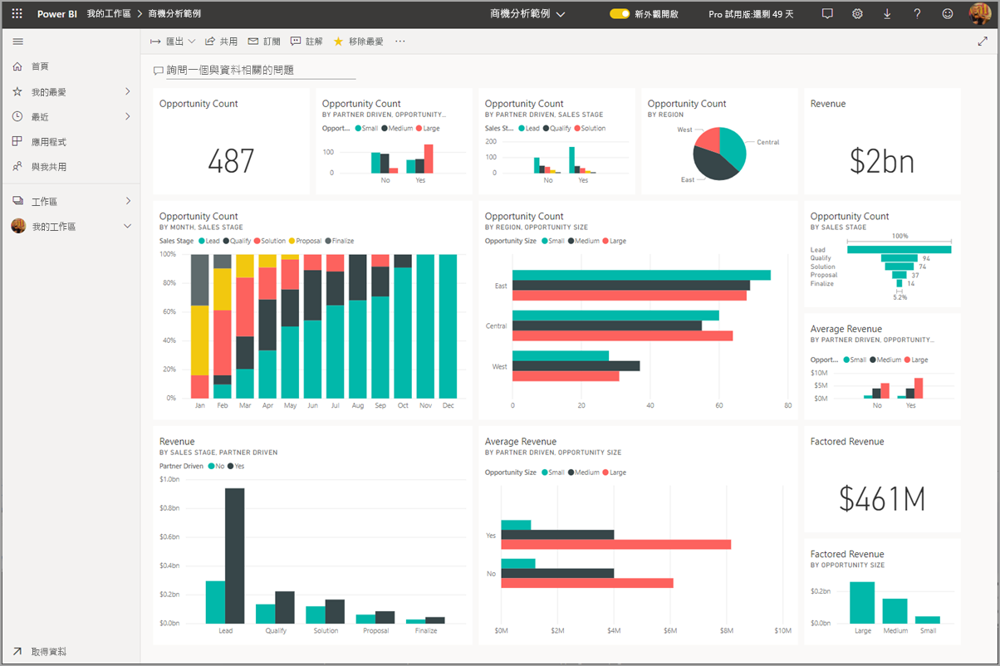

## 在 iPhone 上檢視儀表板
1. 在您的 iPhone 上開啟 Power BI App 並登入。
   
   需要從 Apple App Store [下載 iPhone 應用程式](https://go.microsoft.com/fwlink/?LinkId=522062)嗎？
2. 點選以開啟儀表板。  
   
    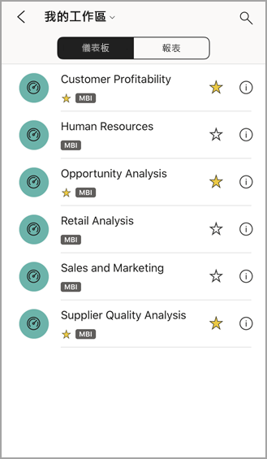
   
   * 黃色星星  會顯示您最愛的儀表板。 
   * 每個儀表板名稱下的標記法 (在此例中為 "MBI") 會顯示每個儀表板中資料的分類方式。 深入了解 [Power BI 的資料分類](../../create-reports/service-data-classification.md)。
   
   Power BI 儀表板預設在 iPhone 上看起來會略有不同。 所有圖格會以相同的大小出現，且其排列方式為從上到下逐一排列。
   
    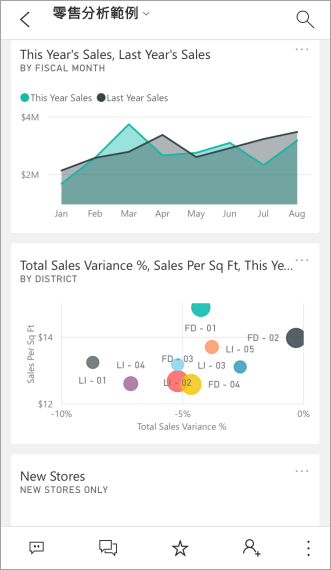
   
   > [!TIP]
   > 如果您是儀表板的擁有者，在 Power BI 服務中，您可以[建立手機直向模式專用的儀表板檢視](../../create-reports/service-create-dashboard-mobile-phone-view.md)。 
   > 
   > 
   
    您也可以直接旋轉手機，在手機上以橫向模式檢視儀表板。
   
    
3. 上下撥動以查看在儀表板中的所有圖格。 您可以：
   
   * [點選磚](mobile-tiles-in-the-mobile-apps.md)在焦點模式中開啟，並與其互動。
   * 點選星星[使其成為我的最愛](mobile-apps-favorites.md)。
   * 點選 [邀請]  以[邀請同事](mobile-share-dashboard-from-the-mobile-apps.md)檢視您的儀表板。
   * [同步處理儀表板與您的 Apple Watch](mobile-apple-watch.md)。
4. 若要回到儀表板清單，請點選儀表板標題旁的箭號，然後點選 [我的工作區]。
   
   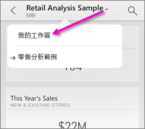

### 在 iPhone 中以橫向模式檢視儀表板
只要旋轉電話，就可以橫向模式檢視儀表板。 儀表板版面配置由一系列磚變更為整個儀表板的檢視，您會看到所有儀表板的磚配置和其在 Power BI 服務中一樣。

您可以使用「捏合」手勢放大及縮小儀表板的不同區域，平移以巡覽。 您也可以[點選磚](mobile-tiles-in-the-mobile-apps.md)，並在焦點模式中開啟，然後與您的資料互動。

## 在 iPad 上檢視儀表板
1. 開啟 Power BI App。
   
   需要先從 Apple App Store [下載 iPad 應用程式](https://go.microsoft.com/fwlink/?LinkId=522062)嗎？
2. 點選應用程式頂端的 [儀表板]。  
   
   
   
   * 黃色星星  會顯示您最愛的儀表板。 
   * 每個儀表板名稱下的標記法 (在此例中為 "MBI") 會顯示每個儀表板中資料的分類方式。 深入了解 [Power BI 的資料分類](../../create-reports/service-data-classification.md)。
3. 您可以從工作區中共用儀表板。 點選儀表板磚右下角的省略符號 ( **...** )，然後點選 [邀請其他人]。
   
   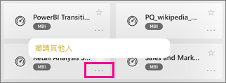
4. 您也可以點選儀表板，以開啟並查看該儀表板中的磚。 您可在儀表板中與其互動：
   
   * [點選磚與其互動](mobile-tiles-in-the-mobile-apps.md)。
   * [開啟磚後方的報表](mobile-reports-in-the-mobile-apps.md)。
   * [邀請其他人檢視儀表板](mobile-share-dashboard-from-the-mobile-apps.md)。
   * [標註並共用磚的快照集](mobile-annotate-and-share-a-tile-from-the-mobile-apps.md)。
5. 若要返回 [我的工作區]，請點選左上角的儀表板名稱，然後點選 [我的工作區]。
   
   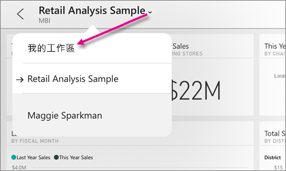

## 在 Android 手機上檢視儀表板
1. 在您的 Android 手機上開啟 Power BI App 並登入。
   
   需要先[下載 Android 應用程式](https://go.microsoft.com/fwlink/?LinkID=544867)嗎？
2. 點選以開啟儀表板。   
   
   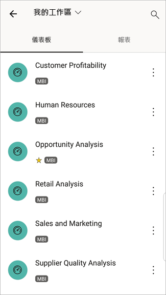

    黃色星形  會顯示您最愛的儀表板。 

    每個儀表板名稱下的標記法 (在此例中為 "MBI") 顯示每個儀表板中資料的分類方式。 深入了解 [Power BI 的資料分類](../../create-reports/service-data-classification.md)。

    Power BI 儀表板在您的 Android 手機上看起來稍有不同。 所有圖格會以相同的寬度出現，且其排列方式為從上到下逐一排列。

    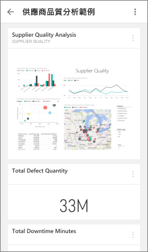

    如果您是儀表板的擁有者，在 Power BI 服務中，您可以[建立手機直向模式專用的儀表板檢視](../../create-reports/service-create-dashboard-mobile-phone-view.md)。 

1. 在儀表板中時，您可以點選名稱旁邊的垂直 [更多選項] (...) 按鈕來邀請同事、重新整理，或取得儀表板的相關資訊：
   
   
2. 上下撥動，即可查看[儀表板中的所有磚](mobile-tiles-in-the-mobile-apps.md)。 
3. 若要返回儀表板首頁，請點選儀表板名稱以開啟軌跡，然後點選 [我的工作區]：   

## 在 Android 平板電腦上檢視儀表板
1. 在您的 Android 平板電腦上開啟 Power BI 應用程式並登入。
   
   需要先[下載 Android 應用程式](https://go.microsoft.com/fwlink/?LinkID=544867)嗎？
2. 點選以開啟儀表板。   
   
   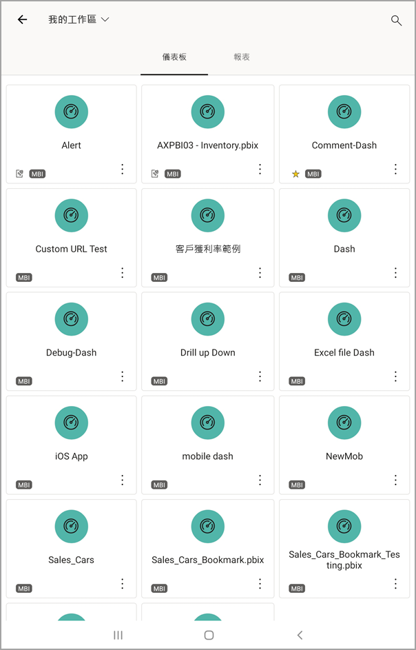
   
   * 黃色星星  顯示您最愛的儀表板。 
   * 每個儀表板名稱下的標記法 (在此例中為 "MBI") 會顯示每個儀表板中資料的分類方式。 深入了解 [Power BI 的資料分類](../../create-reports/service-data-classification.md)。
3. 在儀表板中時，您可以點選名稱旁邊的垂直 [更多選項] (...) 按鈕來邀請同事、重新整理，或取得儀表板的相關資訊：
   
   
4. 上下撥動，即可查看[儀表板中的所有磚](mobile-tiles-in-the-mobile-apps.md)。 
   
   您可以使用「捏合」手勢放大及縮小儀表板的不同區域，平移以巡覽。 您也可以[點選磚](mobile-tiles-in-the-mobile-apps.md)，並在焦點模式中開啟，然後與您的資料互動。
5. 若要返回儀表板首頁，請點選儀表板名稱開啟追蹤，然後點選 [我的工作區]：
   
    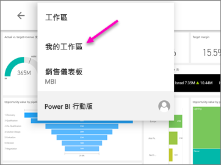

    您可以使用「捏合」手勢放大及縮小儀表板的不同區域，平移以巡覽。 您也可以[點選磚](mobile-tiles-in-the-mobile-apps.md)，並在焦點模式中開啟，然後與您的資料互動。

## 在 Power BI 服務中建立儀表板的手機檢視
如果您是儀表板的擁有者，在 Power BI 服務中，您可以建立專供手機在直向模式中使用的儀表板檢視。 

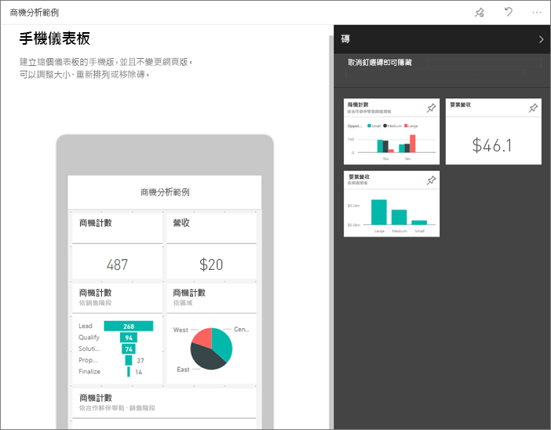

深入了解[建立儀表板的手機檢視](../../create-reports/service-create-dashboard-mobile-phone-view.md)。

## 後續步驟
* 從 Google Play [下載 Android 應用程式](https://go.microsoft.com/fwlink/?LinkID=544867)  
* [開始使用 Power BI 的 Android 應用程式](mobile-android-app-get-started.md)  
* [Power BI 是什麼？](../../fundamentals/power-bi-overview.md)
* 有問題嗎？ [嘗試在 Power BI 社群提問](https://community.powerbi.com/)
