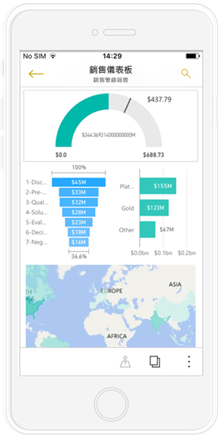
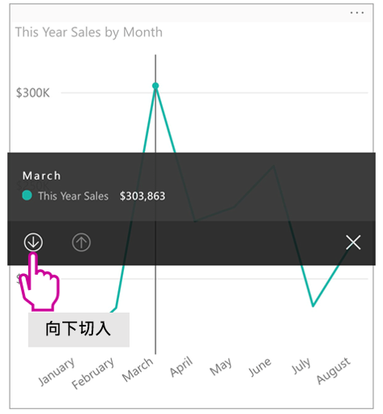

# 檢視為手機最佳化的 Power BI 報表

適用於︰

|  |  |
|:--- |:--- |
| iPhone |Android 手機 |

當您在手機上檢視 Power BI 報表時，Power BI 會檢查是否已為手機最佳化的報表。 如果是，Power BI 會自動以直向檢視開啟最佳化的報表。

如果為手機最佳化的報表不存在，報表仍會開啟，但會使用非最佳化的橫向檢視。 即使在為手機最佳化的報表中，如果您將手機橫放，報表也會以非最佳化的檢視開啟，並顯示原始報表配置。 如果只有部分頁面經過最佳化，您會在直向檢視中看到訊息指出報表可以橫向呈現。

Power BI 報表的其他所有功能都仍可在為手機最佳化的報表中運作。 深入了解您可以在下列項目執行的作業︰

* [iPhone 上的報表](mobile-reports-in-the-mobile-apps.md)。 
* [Android 手機上的報表](mobile-reports-in-the-mobile-apps.md)。

## 在電話上篩選報表頁面
如果已為電話最佳化的報表定義篩選，則當您在電話上檢視報表時，就可以使用這些篩選。 報表會開啟您的手機，在網站上報表中進行篩選的值進行篩選。 您會看到訊息指出頁面上有作用中的篩選器。 您可以在手機上變更篩選。

1. 點選篩選圖示  在頁面底部。 
2. 使用基本或進階篩選，查看您感興趣的結果。
   
    

## 跨醒目提示視覺效果
交叉醒目提示視覺效果，以直向檢視的運作的方式在 Power BI 服務中，並以橫向檢視手機上：當您在一個視覺效果中選取資料時，它會反白顯示該頁面上其他視覺效果中的相關資料。

深入了解 [Power BI 中進行篩選和醒目提示](../../power-bi-reports-filters-and-highlighting.md)的相關事項。

## 選取視覺效果
在手機報表中，當您選取視覺效果時，手機報表會醒目提示該視覺效果並聚焦於其上，抵銷畫布筆勢。

選取視覺效果時，您便可執行在視覺效果中捲動等動作。 若要將視覺效果取消選取，只要觸碰視覺效果區域外的任何一處。

## 以焦點模式開啟視覺效果
手機報表也會提供焦點模式：取得 visual 的較大的單一檢視，並更輕鬆地探索它。

* 在手機報表中，點選視覺效果右上角的省略符號 ( **...** ) > [展開為焦點模式]  。
  
    

您在焦點模式中如何轉移至報表畫布，反之亦然。 比方說，如果您反白顯示的視覺效果中的值，然後返回整份報表，報表會篩選您在視覺效果反白顯示的值。

有鑑於螢幕大小限制，某些動作只有在焦點模式中才可進行︰

* **向下切入**視覺效果中顯示的資訊。 在下方深入了解如何在手機報表中[向下和向上切入](mobile-apps-view-phone-report.md#drill-down-in-a-visual)。
* **排序**視覺效果中的值。
* **還原**︰清除您已在視覺效果上執行的探索步驟，並還原至報表建立時設定的定義。
  
    若要清除視覺效果中的所有探索，請點選省略符號 ( **...** ) > [還原]  。
  
    
  
    還原可在報表層級，清除所有的視覺效果，從探索或視覺效果層級，清除 從選取的視覺效果的探索。   

## 在視覺效果中向下切入
如果視覺效果中定義了階層層級，您就可以向下切入視覺效果中顯示的詳細資訊，然後返回。 您可以在 Power BI 服務或 Power BI Desktop 中[新增視覺效果的向下切入](../end-user-drill.md)。

有幾種向下鑽研：

### 向下切入的值
1. 長時間，請點選 （點選並按住） 視覺效果中的資料點。
2. 將會顯示工具提示，以及如果定義階層，則工具提示的頁尾會顯示向下的切入和向上箭號。
3. 點選向下鑽研的向下箭號

    
    
4. 點選 向上鑽研的向上箭號。

### 向下切入一層樓
1. 在手機上報表中，點選右上角的省略符號 ( **...** ) > [展開為焦點模式]  。
   
    
   
    在本例中，橫條會顯示各州的值。
2. 點選左下角的  在左下方。
   
    
3. 點選 [顯示下一個層級]  或 [展開至下一個層級]  。
   
    
   
    現在，橫條會顯示城市的值。
   
    
4. 如果您點選左上角的箭號，會回到手機報表，但值仍是展開到較低層級的狀態。
   
    
5. 若要回到原本層級，請再次點選省略符號 ( **...** ) > [還原]  。
   
    

## 值，從鑽研
鑽研可連接一份報表頁面中的值及其他報表頁面。 當您從鑽研的資料點到另一個報表頁面時，資料點值來篩選頁面上，鑽，或就會在選取的資料內容中。
報表作者可以[定義鑽研](https://docs.microsoft.com/power-bi/desktop-drillthrough)當他們建立報表。

1. 長時間，請點選 （點選並按住） 視覺效果中的資料點。
2. 工具提示會顯示，而且如果定義鑽研，然後工具提示的頁尾會顯示鑽研箭號。
3. 點選箭號向下切入到

    

4. 選擇要鑽研的報表頁面

    

5. 使用 [上一頁] 按鈕，在應用程式標頭，回到您的起始頁面。

## 後續步驟
* [建立為 Power BI 手機應用程式最佳化的報表](../../desktop-create-phone-report.md)
* [在 Power BI 中建立儀表板的手機檢視](../../service-create-dashboard-mobile-phone-view.md)
* [建立適用於任何大小的回應式視覺效果](../../visuals/desktop-create-responsive-visuals.md)
* 有其他問題嗎？ [嘗試在 Power BI 社群提問](http://community.powerbi.com/)

